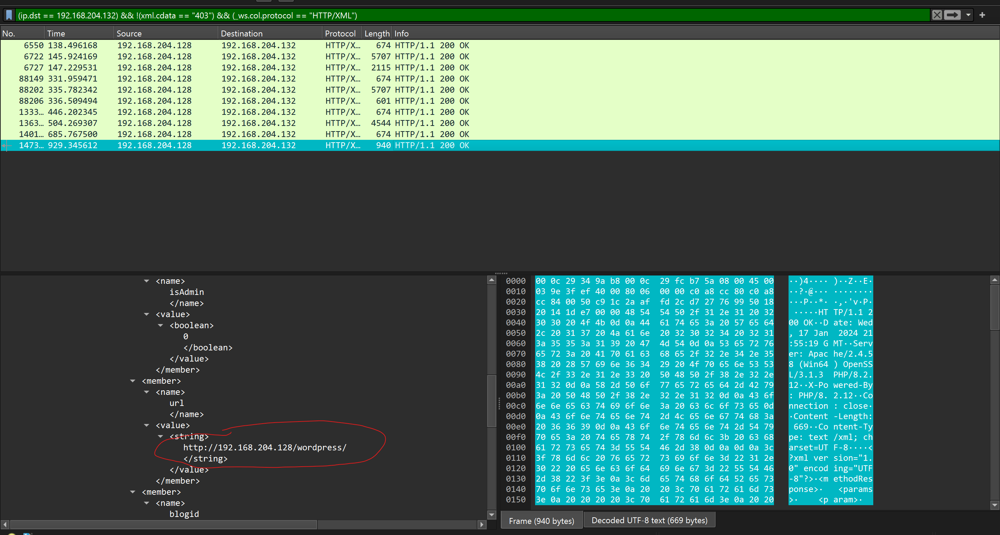
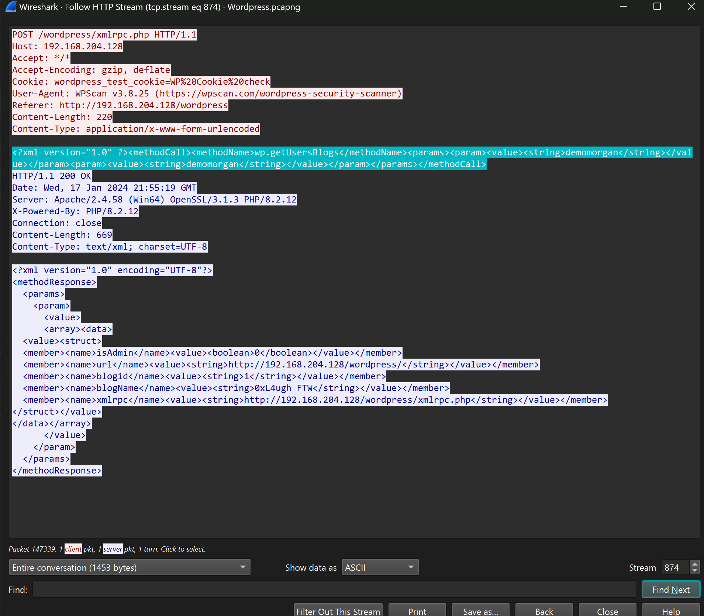

# Networking
### WordPress-1.
```
Our WordPress site has experienced a security breach, and the precise method of compromise remains undetermined at present. We need you help to investigate what actually happened.

+ Q1. There were two attackers attempting to compromise our environment. What is the IP address of the victim, and what is the IP address of the first attacker? 
+ Q2. 2. What are the versions of the Apache and PHP servers deployed in our environment?

Flag Format 0xL4ugh{A1_A2}

Example: 0xL4ugh{IP1_IP2_apache1.2.3_php1.2.3}(no spaces)
```
- Ở bài này chall cho chúng ta 1 file `.pcap` và đề bài bảo rằng `Trang web WordPress của chúng tôi đã gặp phải sự cố vi phạm bảo mật và hiện tại phương pháp xâm phạm chính xác vẫn chưa được xác định. Chúng tôi cần bạn giúp đỡ để điều tra những gì thực sự đã xảy ra.`
- Ở câu hỏi 1 mình vào wireshark để check `https.request` bởi vì nó là 1 trang web mà có thể attacker sẽ request rất nhiều để có thể tấn công được.

- Ta có thể thấy địa chỉ `192.168.204.132` đã gửi rất nhiều request đang ngờ. Có thể đây sẽ là kể tấn công đầu tiên.
- Ở câu hỏi 2 mình cần biết `phiên bản của máy chủ Apache và PHP được triển khai trong môi trường` là gì.

- Thì ở đây có 1 lượt truy cập đến `wordpress` thì có thể là server đang trả về thông tin cho user , và chắc hẳng là nó sẽ có thông tin hữu ích nào đó.
- Mình follow `HTTP` này để xem thông tin thì thấy cái này.

- Vậy là mình đã thu thập đủ flag ròi.
- *`FLAG: 0xL4ugh{192.168.204.128_192.168.204.132_apache2.4.58_php8.2.12}`*.
### WordPress-2.
```
Same As WordPress - 1

Q1. During enumeration, the attacker tried to identify users on the site. List all the users that the attacker enumerated. (seperate them with :)

Q2. After enumeration, a brute force attack was launched against all users. The attacker successfully gained access to one of the accounts. What are the username and password for that account, and what is the name of the page used for the brute force attack?

Flag Format 0xL4ugh{A1_A2}

Example: 0xL4ugh{username1:username2_username:password_pageName}
```
- Ở chall này và các chall sau nữa ta đều sử dụng 1 file `.pcap` duy nhất , chỉ có flag và câu hỏi là khác nhau.
- Ở câu hỏi 1 thì mình sử dụng `filter là (http.request.method == POST) && (ip.src == 192.168.204.132)` với phương thức POST và ip là của attacker , để check xem attack có cố đăng nhập không.
```
+ GIẢI THÍCH:
- Phương thức POST là một trong các phương thức HTTP (Hypertext Transfer Protocol) được sử dụng để gửi dữ liệu từ máy khách (client) lên máy chủ (server). Phương thức này thường được sử dụng khi người dùng muốn truyền một lượng lớn dữ liệu đến server, chẳng hạn như khi gửi một biểu mẫu trên trang web.

- Khi một yêu cầu HTTP được gửi bằng phương thức POST, dữ liệu được gửi kèm theo trong phần thân của yêu cầu, không như phương thức GET mà dữ liệu thường được đưa trong URL. Điều này làm cho phương thức POST thích hợp cho việc truyền những dữ liệu lớn hoặc nhạy cảm mà bạn không muốn xuất hiện trực tiếp trong URL.

- Ví dụ, khi bạn điền một biểu mẫu đăng nhập trên trang web và nhấn nút "Đăng nhập", thông tin như tên đăng nhập và mật khẩu thường sẽ được gửi đến server bằng cách sử dụng phương thức POST để bảo vệ thông tin này khỏi việc xuất hiện trong URL.
```

- Ta có thể thấy là attacker đã đăng nhập 3 lần cùng follow để xem `user name` attacker login là gì.


- Mình click vào kéo xuống check thì ta đc 3 account sau nhưng cũng chưa chắc lắm nên mình đổi `filter` để check lại với `((ip.src == 192.168.204.132) || (ip.dst == 192.168.204.132)) && http`.


- Mình kéo check 1 xíu thì có 3 author là có tên thui còn các author khác k check được, vậy chúng ta sẽ có list all user sẽ là `a1l4m:demomorgan:not7amoksha`.
- Tới câu hỏi 2 mình Kéo xuống 1 tí thì nhận được rất nhiều POST request với 1 page `xmlrpc.php` mình nghĩ đây chính là page mà attacker dùng để brute force user.


- Ta có thể thể thấy với mỗi request thì sever sẽ trả về là đúng hay sai , để có thể biết chính xác user và password của acccount mà attacker đã login thành công, ta cần phải biết account nào mà server trả lại đúng.
- Để kiếm 1 cách nhanh chóng hơn hãy tìm một yêu cầu thành công không trả về 403 , với `filter sau (ip.dst == 192.168.204.132) && !(xml.cdata == "403") && (_ws.col.protocol == "HTTP/XML")`.

- Ở đây ta có thể thấy server đã trả về là trang web `wordpress` có nghĩa là attacker đã đăng nhập thành công , cùng follow `http` để xem user and pass nha.

- user và pass đều là `demomorgan:demomorgan`. vậy là ta đã đủ flag ròi.
- *`FLAG: 0xL4ugh{a1l4m:demomorgan:not7amoksha_demomorgan:demomorgan_xmlrpc.php}`*
### WordPress-3.
```
Hard
Same As WordPress - 1

َQ1. Mention the names of the tools that the attacker used in the attack.

Q2. There was a vulnerable plugin that the attacker exploited. What is the C2 server of the attacker, and what is the name of the plugin?

Q3. What is the version of the vulnerable plugin, and what is the CVE number associated with that plugin?

Flag Format 0xL4ugh{A1_A2_A3}

Example: 0xL4ugh{tool1_tool2_C2_PluginName_1.2.3_CVE--}
```
- Ở câu hỏi 1 , chúng ta sẽ xài `filter (ip.src == 192.168.204.132) && http.request` để check xem attacker sử dụng tool gì để tấn công.

- Đầu tiên thì mình thấy được cái này, đa số các tool đều sử dụng User-Agent để tagging , vậy là ta đã kiếm đc tool đầu tiên mình check tiếp xem liệu có còn tool nào khác không.

- Ở gần cuối thì mình kiếm ra được thêm 1 tool nữa , vậy thì flag sẽ là `sqlmap_WPScan` hoặc ngược lại `WPScan_sqlmap`
- Ở câu hỏi 2 thì để kiếm được plugin thì ta sẽ phải xài `filter sau (http) && !(http.host == "tlu.dl.delivery.mp.microsoft.com" || tcp.dstport == 80) && (ip.src == 192.168.204.128)` ở đây ta sẽ loại bỏ các request của Microsoft ra.

- Sau vài tiếng mòn mỏi check từng dòng thì ở chỗ `Request URI` mình đã thấy được chữ plugin , mình mừng như đc mùa. vậy flag của Q2 là `172.26.211.155:8000_canto`.
- Ở câu hỏi 3 thì mình search gg với từ khóa `canto và wp_abspath` , ban đầu mình chỉ biết được tên CVE là `CVE-2023-3452` thôi nma mà flag cần cả phiên bản cơ nên mình kiếm kỹ hơn tí và mình biết nó chính xác sẽ là `3.0.4_CVE-2023-3452`.
- Vậy là ta đã dủ flag rồi , mình đã thử đảo vị trí ở Q1 nma vẫn sai nên mình nghĩ là ở Q2 chall chỉ cần IP thui không cần port , mình submit thử thì nó đúng.
- *`FLAG: 0xL4ugh{sqlmap_WPScan_172.26.211.155_canto_3.0.4_CVE-2023-3452}`*
### WordPress-4.
```
Same As WordPress - 1

Q1. What is the name of the function that the attacker tested the exploit with, and what is the name/version of the attacker's server?

Q2. What is the username that was logged on during the attack, including the domain?

Q3. The attacker attempted to upload a reverse shell. Mention the IP and port. What command posed an obstacle during the process of the reverse shell?

Flag Format 0xL4ugh{A1_A2_A3}

Example: 0xL4ugh{functionName_serverName/version_username\domain_IP:PORT_command}
```