# AOF CTF 2024.
### I. Blurry.
- Chall này cho mình 1 file ảnh là 1 mã QR code, chỉ cần scan là có flag nhưng khó là nó đã bị blurry đi.
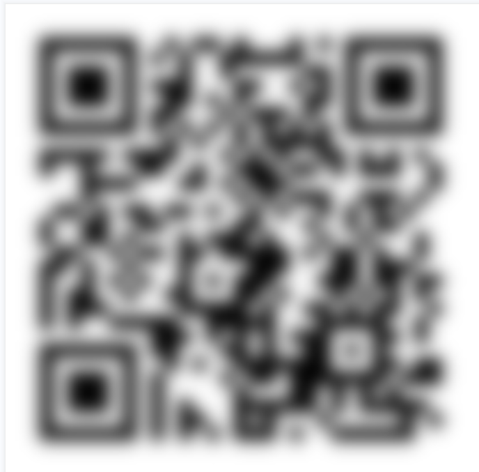
- Giải quyết nó thì khá đơn giản ta chỉ cần xài các công cụ sharpen là được, các tool trên web khá lỏ nên xài `GIMP` là ngon nhất.
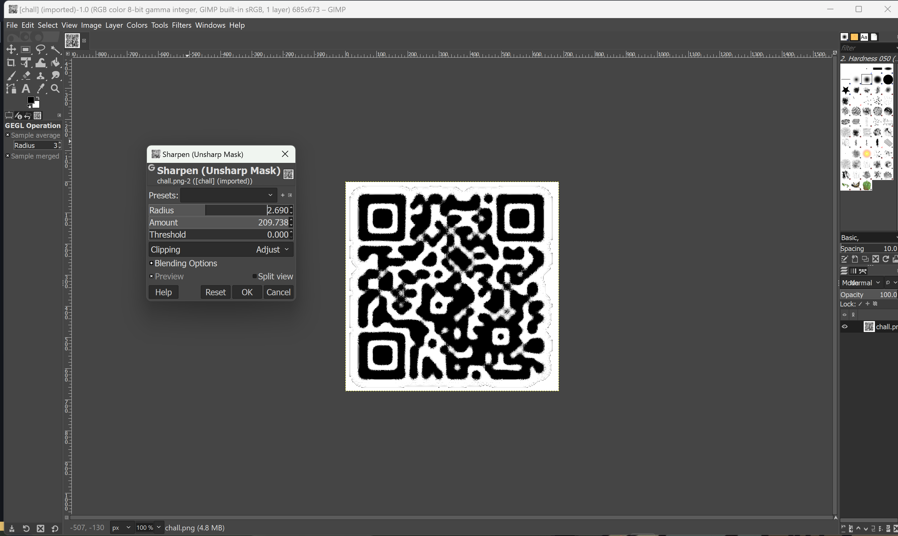
- Chỉnh sharpen với thông số như này thì ta sẽ quét được nó và có được flag.
- *`FLAG: AOFCTF{g00d_j0b_d3cod1ng_tH1s_eXtr3m31y_sTup1d_qR}`*.
### II. camouflaged.
- Chall này cho mình 1 `images` folder và trong đó có 16762 tấm ảnh png, mở xem thử 1 cái thì nó đã bị corrup và ko hiển thị cái gì cả, mình check bằng `HxD` thì metadata chỉ hiển thị 2 byte như này.
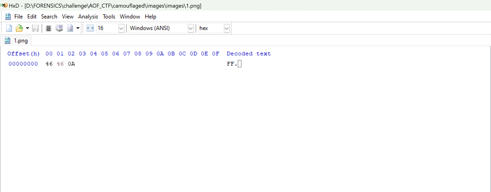
- Khi mình check các byte tiếp theo thì mình nhận ra nó flag data của 1 file `.jpg`
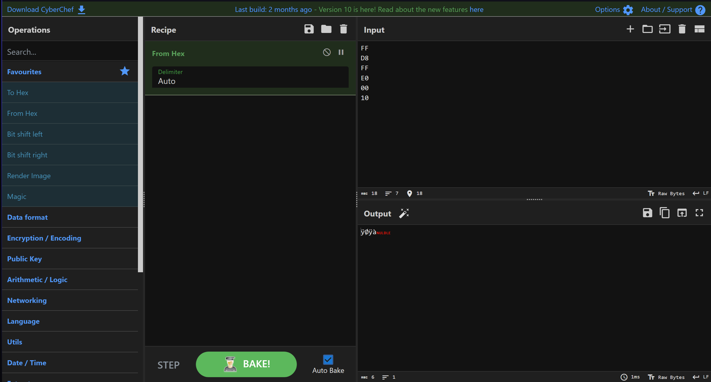
- Bài này có 2 cách để giải:
    + ##### 1. Viết Script.
    ```
    import os

    # Đường dẫn tới thư mục chứa các file ảnh PNG
    folder_path = "/mnt/d/FORENSICS/challenge/AOF_CTF/camouflaged/images/images"

    # Hàm chuyển đổi hex sang char và ghi vào file
    def hex_to_char(hex_string):
        return bytes.fromhex(hex_string).decode('utf-8')

    # Hàm đọc nội dung từ file và ghi vào file flag.txt
    def process_image_files(folder_path):
        with open("flag.txt", "w") as flag_file:
            for i in range(1, 16763):
                filename = str(i) + ".png"
                file_path = os.path.join(folder_path, filename)
                if os.path.exists(file_path):
                    with open(file_path, "rb") as image_file:
                        hex_data = image_file.read().hex()
                        char_data = hex_to_char(hex_data)
                        # Loại bỏ ký tự xuống dòng
                        char_data = char_data.rstrip('\n')
                        flag_file.write(char_data)

    # Thực thi hàm
    process_image_files(folder_path)
    ```
    - script này mình nhờ chat GPT bởi vì việc viết code mình khá dở, vẫn đang trong quá trình cải thiện. Đơn giản là code này sẽ đọc 16762 file theo thứ tự nhờ vòng for, dữ liệu sẽ theo kiểu mỗi dòng là data của 1 ảnh thế nên ta cần loại bỏ ký tự xuống dòng này, sau khi chạy code thì ta sẽ được 1 file `.txt` chứa dữ liệu raw, lý do phải loại bỏ ký tự xuống dòng thì mình sẽ giải thích bên dưới.
    + ##### 2. Sử dụng kali cmd.
    - ta sẽ sử dụng lệnh này để cat cat file theo thứ tự tăng dần đã được sort vào 1 file`.txt` chứa dữ liệu raw.
    ```
    $ ls *.png | sort -n | xargs cat > flag.txt
    ```
- Khi mà đã thực hiện cách 2 ta sẽ được dữ liệu như sau:
```
FF
D8
FF
E0
00
10
4A
46
49
46
00
01
01
00
00
01
00
01
00
00
FF
F
E
00
1F
43
6F
6D
70
72
65

...
```
- Dữ liệu rất lớn nên mình chỉ lấy 1 phần nhỏ để dễ hình dung thui, Ta có thể dễ dàng nhận thấy có các dòng chỉ có 1 byte dữ liệu thui, nếu khi ta decode ra dạng hex mà vẫn dữ nguyên ký tự xuống dòng thì nó sẽ bị hiểu nhầm dẫn đến sai sót, Đó là lý do ta cần loại bỏ nó.
- cách fix bằng kali cmd ta chỉ cần thêm option này là fix được:
```
$ ls *.png | sort -n | xargs cat | awk '{printf "%s", $1}' > flag.txt
```
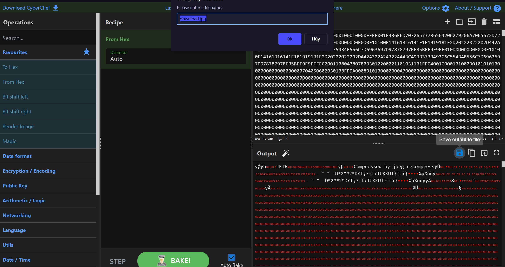
- decode nó ra thì ta được ảnh này kèm flag.
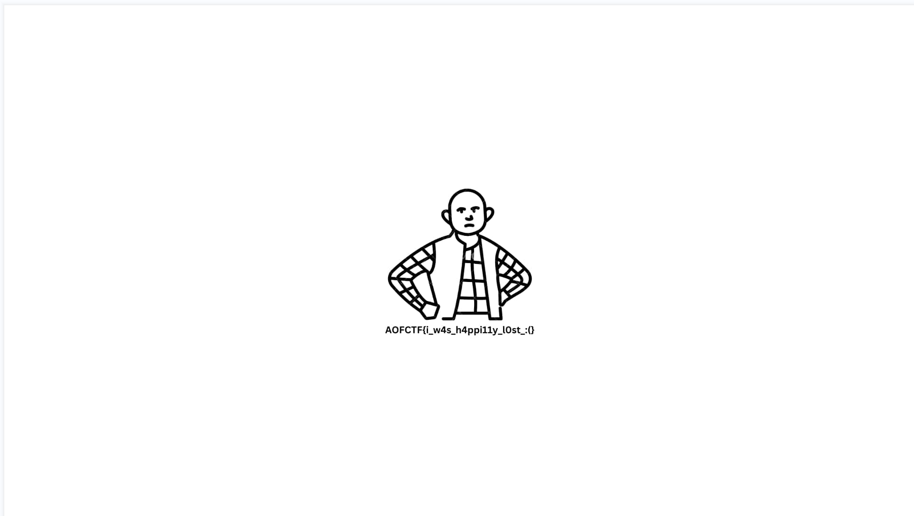
- *`FLAG: AOFCTF{i_w4s_h4ppi11y_l0st_:(}`*.
### III. Broke.
- Chall này cho ta 2 file `.bin` và thực sự khó, rất là khó đoán nếu như không được cho hint.
- Thì đại khái hint đề cập tới việc đôi khi ta cần phải hợp nhất 2 file này lại thành 1 và 1 hint nữa là `sometimes the key to success is everyone’s favorite number`, đôi khi ` chìa khóa ` dẫn đến thành công là con số yêu thích của tất cả mọi người. Đại khái có thể hiểu ta sẽ gộp 2 file lại thành 1 và `XOR` với key là `0x69` :)))) , year ser đúng vậy con số hư hỏng.
- Chall này chúa mình mới hiểu được nên mình đọc write up mới có thể solve được, và đây là script để solve.
```
def xor_file(input_file1, input_file2, output_file, key):
    with open(input_file1, 'rb') as f1, open(input_file2, 'rb') as f2:
        data1 = bytearray(f1.read())
        data2 = bytearray(f2.read())
        
        # Merge the two data chunks
        merged_data = data1 + data2
        
        xor_data = bytearray([byte ^ key for byte in merged_data])
        
        with open(output_file, 'wb') as f_out:
            f_out.write(xor_data)


input_file1 = 'chall1.bin'
input_file2 = 'chall2.bin'
output_file = 'chall_restored.txt'
key = 0x69 #Because everyone's fav number is 69, or at least mine is ;)

xor_file(input_file1, input_file2, output_file, key)

print("File '{}' created successfully.".format(output_file))
```
- Sau khi lưu vào 1 file text thì dựa vào header ta có thể nhận ra nó là 1 file âm thanh `.m4a`.
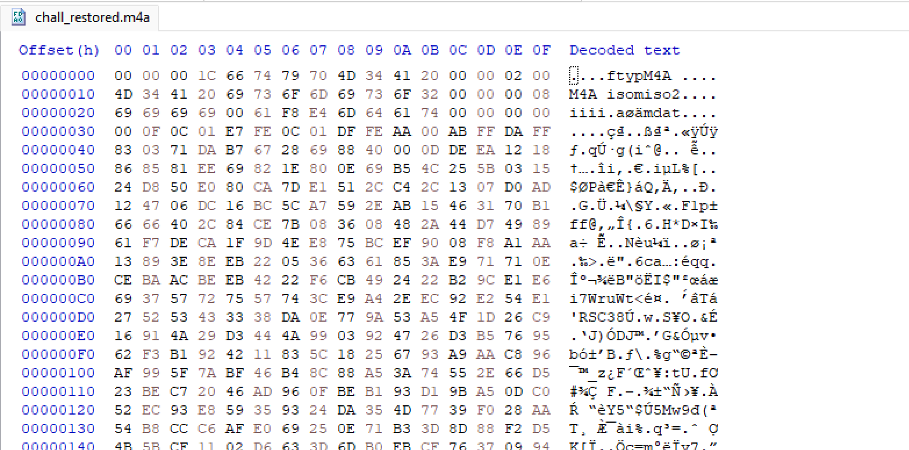
- Nếu nghe kĩ ở phút `2:17` thì ta có thể nghe flag được đọc ra.
- *`FLAG: AOFCTF{this_was_an_easy_challenge_haha_193826}`*
### IV. RECOVERY.

- Chall này cho chúng ta 4 file này và Chall này sẽ là 1 chall kiến thức cực kì hữu ích.
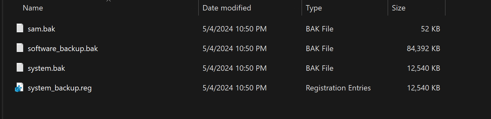
```
SAM (Trình quản lý tài khoản bảo mật) là một tệp cơ sở dữ liệu lưu trữ mật khẩu của người dùng, có thể được sử dụng để xác thực người dùng cục bộ và từ xa. Tệp này có thể được tìm thấy trong %SystemRoot%/system32/config/SAM và cần có đặc quyền HỆ THỐNG để xem nó.
```
```
%SystemRoot%/system32/config
```
- Đây là hình ảnh 2 em nó:
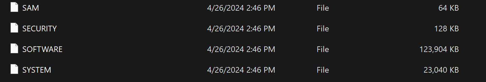
- Ta sẽ sử dụng tool này `impacket-secretdump` để show ra các user và password dưới dạng hash.
```
$ impacket-secretsdump -sam sam.bak -system system.bak LOCAL
Impacket v0.9.24 - Copyright 2021 SecureAuth Corporation

[*] Target system bootKey: 0xfc3c540f7e022b707b6a49da2ea4e0a5
[*] Dumping local SAM hashes (uid:rid:lmhash:nthash)
Administrator:500:aad3b435b51404eeaad3b435b51404ee:31d6cfe0d16ae931b73c59d7e0c089c0:::
Guest:501:aad3b435b51404eeaad3b435b51404ee:31d6cfe0d16ae931b73c59d7e0c089c0:::
DefaultAccount:503:aad3b435b51404eeaad3b435b51404ee:31d6cfe0d16ae931b73c59d7e0c089c0:::
WDAGUtilityAccount:504:aad3b435b51404eeaad3b435b51404ee:69eb6b2739ac818876fef5ef20b469e2:::
student:1001:aad3b435b51404eeaad3b435b51404ee:e19ccf75ee54e06b06a5907af13cef42:::
[*] Cleaning up...
```
- User sẽ là student và ta sẽ sử dụng `crackstation` để crack pass.
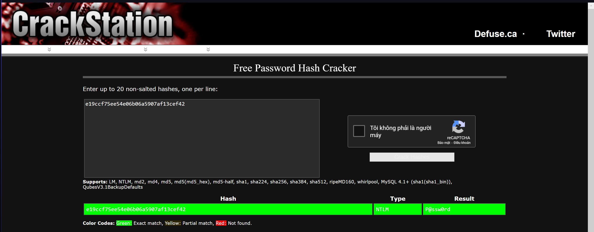
- *`FLAG: AOFCTF{student_P@ssw0rd}`*.
#### V. Whoami.
- Chall này cho ta 1 file `.png` nhưng bị corrup , khi xài `pngcheck` nó bảo size của ảnh chỉ là 0x0.
```
$ pngcheck whoami.png 
zlib warning:  different version (expected 1.2.13, using 1.3)

whoami.png  invalid IHDR image dimensions (0x0)
ERROR: whoami.png
```
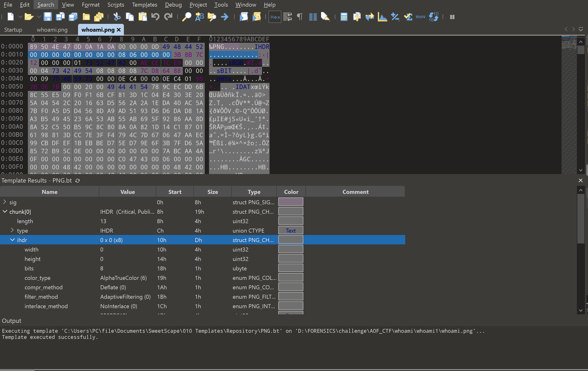
- Mình vào `010 Editor` chỉnh nó về `1920x1080` là fix được ảnh thế là có flag.
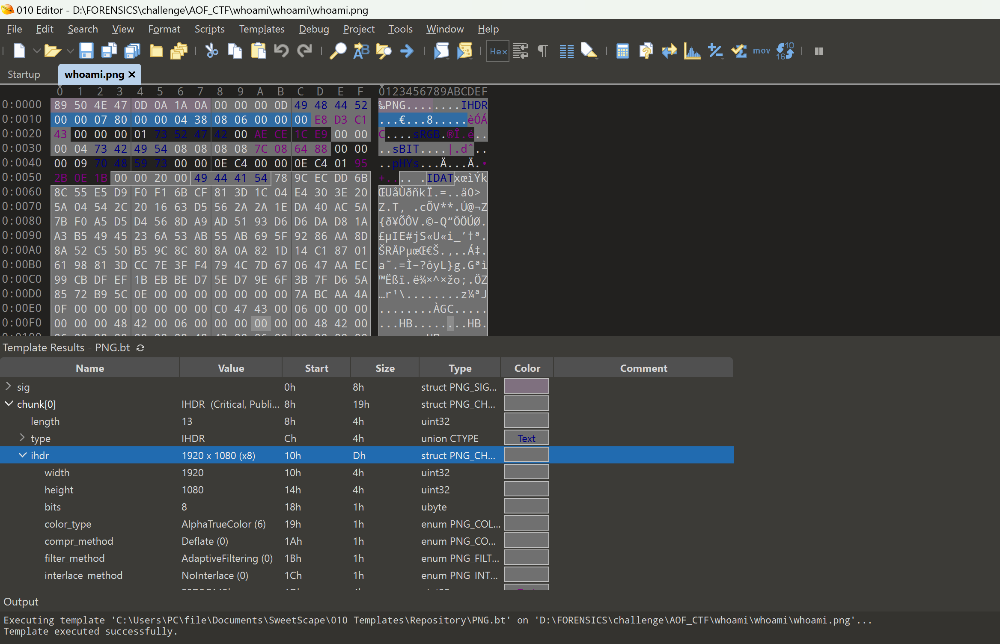

- *`FLAG: AOFCTF{now_i_w4s_h4ppilly_br0k3n_:()`*