# BsideF CTF 2024.
### I. Doctor
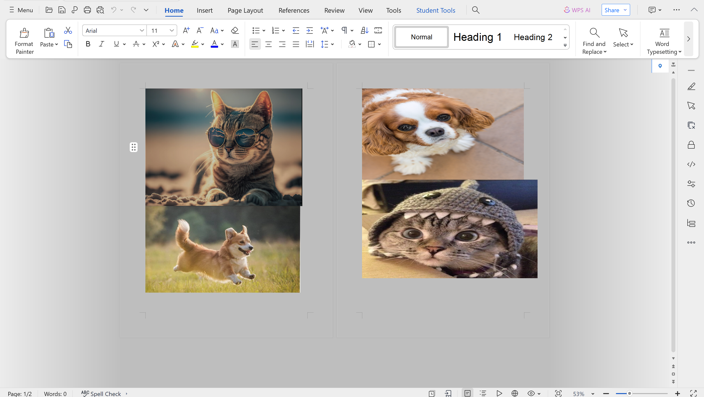

- Chall này cho mình 1 file docx có 4 ảnh như này, mình có thử kéo kéo xem có ảnh nào dấu bên dưới không thì vẫn là không có , nên là mình mới chuyển nó về `.zip` (zip và docx có cùng header) để xem có file ẩn nào ko.
- Khi extract ra rồi check ở phần `media` thì thấy xuất hiện tấm ảnh thứ 5 , mở ra xem thì có lun flag.

- *`FLAG: CTF{st0ck_cut3_p1c5}`*
### II. javai.
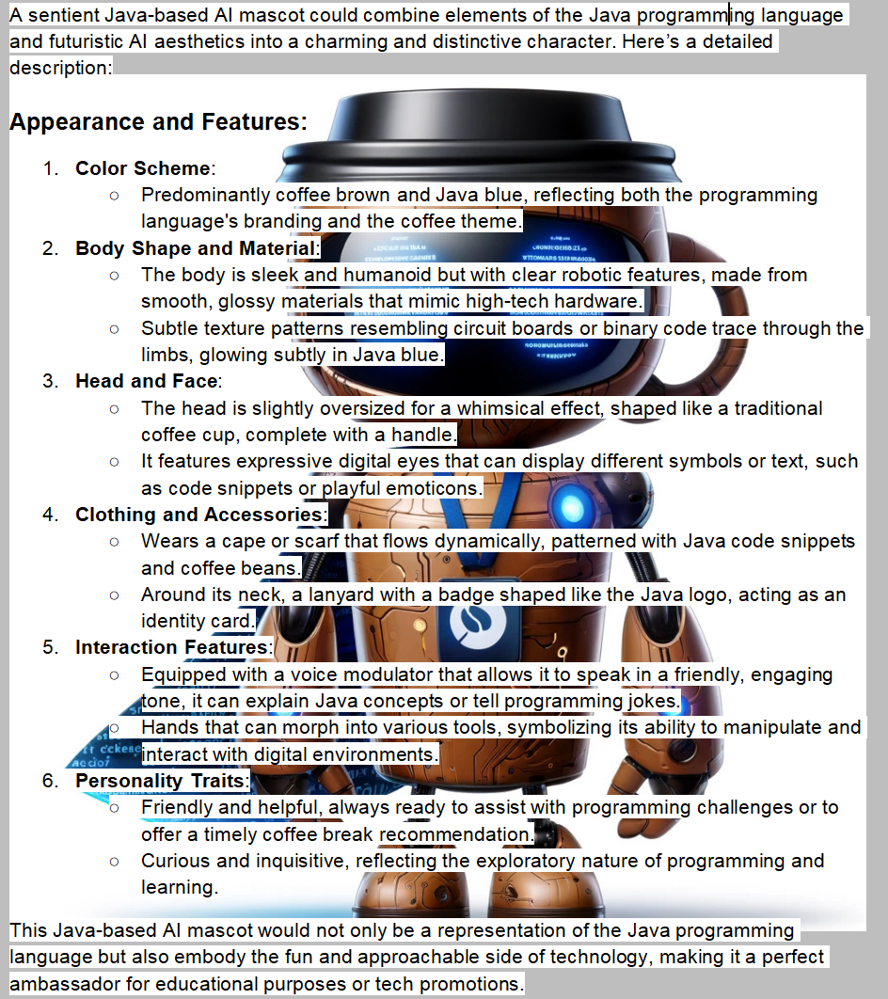
- Chall này cũng thế cho ta 1 file `docx` , mình cũng kéo kéo các thứ cũng chả có gì thế là mình lại chuyển nó về file zip, bên trong nó mình kiếm được 1 file `.class` bên trong có lun flag.
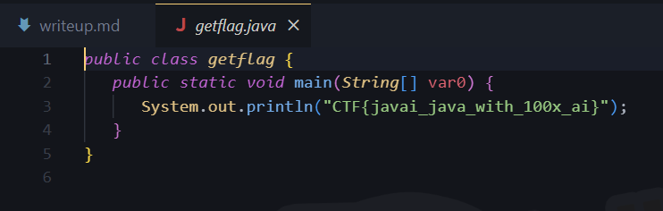
- *`FLAG : CTF{javai_java_with_100x_ai}`*
### III. redacted.
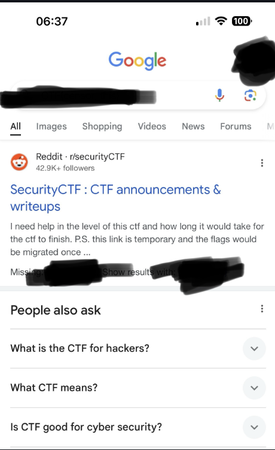
- Chall này cho ta 1 ảnh nhưng có 1 vài nội dung dường như bị che đi, có 1 tool tên là `unredacted` nhưng tool này chỉ có tác dụng với các trường hợp làm mờ đi, cách solve cũng khá đơn giản ta sẽ lợi dụng các kênh màu, Bởi vì ở 1 số kênh màu các bit ảnh màu đen đôi khi không được hiển thị ở đây mình xài `zsteg-mask` để lấy ra được nhiều kênh màu hơn. 
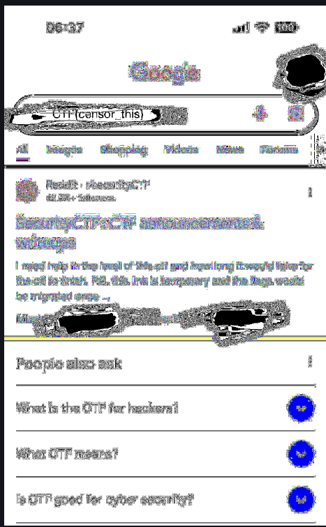
- *`FLAG: CTF{censor_this}`*
### IV. ztxt.
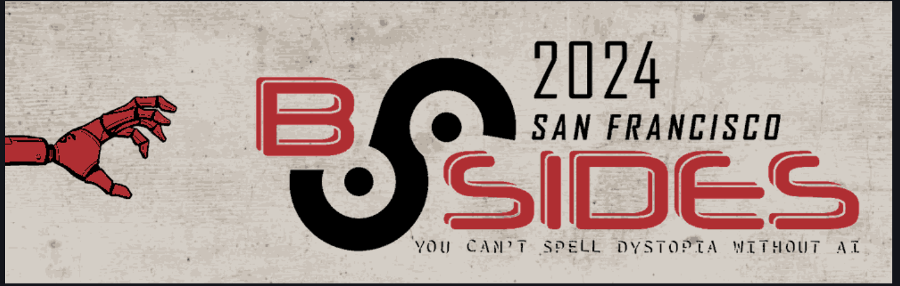
- Chall này cho ta 1 cái ảnh , khi nhìn đề bài mình nghĩ chắc nó sẽ sử dụng `zsteg` để solve cùng với đó ảnh ở định dạng `png` nữa rất phù hợp.
```
$ zsteg -a ztxt.png 
meta flag           .. text: "CTF{zhis_zis_zhe_zlag}"

$ exiftool ztxt.png 
ExifTool Version Number         : 12.76
File Name                       : ztxt.png
Directory                       : .
File Size                       : 40 kB
File Modification Date/Time     : 2024:05:06 22:56:48+07:00
File Access Date/Time           : 2024:05:08 03:31:22+07:00
File Inode Change Date/Time     : 2024:05:06 22:56:48+07:00
File Permissions                : -rwxrwxrwx
File Type                       : PNG
File Type Extension             : png
MIME Type                       : image/png
Image Width                     : 994
Image Height                    : 317
Bit Depth                       : 4
Color Type                      : Palette
Compression                     : Deflate/Inflate
Filter                          : Adaptive
Interlace                       : Noninterlaced
Palette                         : (Binary data 24 bytes, use -b option to extract)
Warning                         : [minor] Text/EXIF chunk(s) found after PNG IDAT (may be ignored by some readers)
Flag                            : CTF{zhis_zis_zhe_zlag}
Image Size                      : 994x317
Megapixels                      : 0.315
```
- Sử dụng zsteg hay exiftool đều được.
- *`FLAG: CTF{zhis_zis_zhe_zlag}`*
### V. Sgai
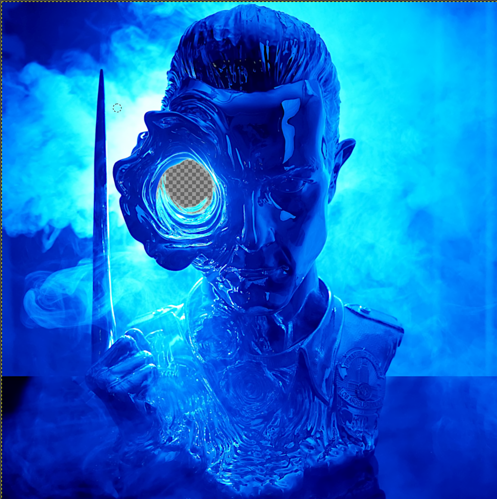
- Chall này cho ta 1 file `.sgi` đây là 1 file ảnh dữ liệu dưới dạng raw ta có thể mở lên xem với `GIMP`, chall này có 4 flag việc của ta là mò các flag đó (bài này mình chỉ kiếm được 3 cái thui).
##### 1. flag 1
- flag 1 khá đơn giản mình kéo nó vào `HxD` là có lun flag.
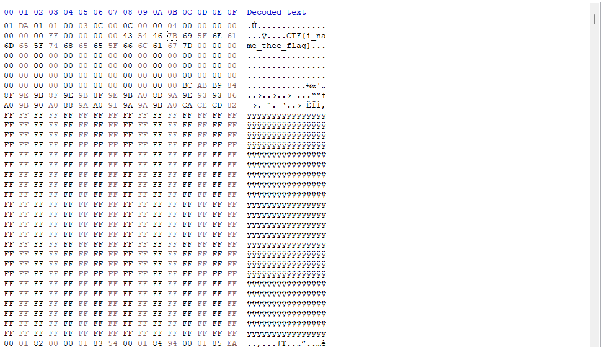
##### 2. flag 2.
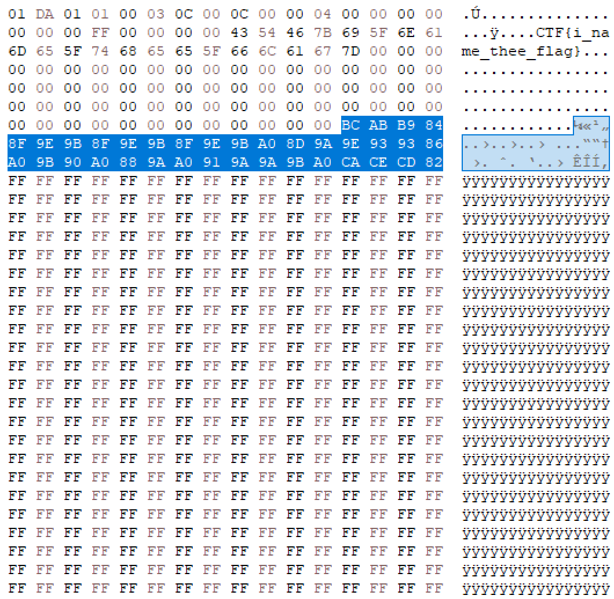
- Hãy nhìn vào ảnh trên ta có thể thấy từ đoạn flag 1 trở đi ta có thể thấy chỉ toàn các null byte, tới phần tô xanh mới bắt đầu có các byte dữ liệu bth nhưng ở phía dưới nó chỉ toàn là các byte `0xFF`, mình thấy điều này khá lạ mình nghĩ có thể ta sẽ lấy đoạn mình tô xanh và ta sẽ đem đi `xor` với `0xFF`.
```
with open('sgai.sgi', 'rb') as file:
    sgi_data = file.read()

f2_data = sgi_data[0x6c:0x6c+404]
f2_data = bytes([a ^ 0xFF for a in f2_data])
f2_data = ''.join([c for c in f2_data.decode() if c.isspace() or '!' <= c <= '~'])
print('Flag 2:', f2_data)
```
- Đây là code mình bú của GPT chạy nó thì ra flag thui.
```
$ python3 tools.py 
Flag 2: CTF{padpadpad_really_do_we_need_512}
```
##### 3. flag 3.
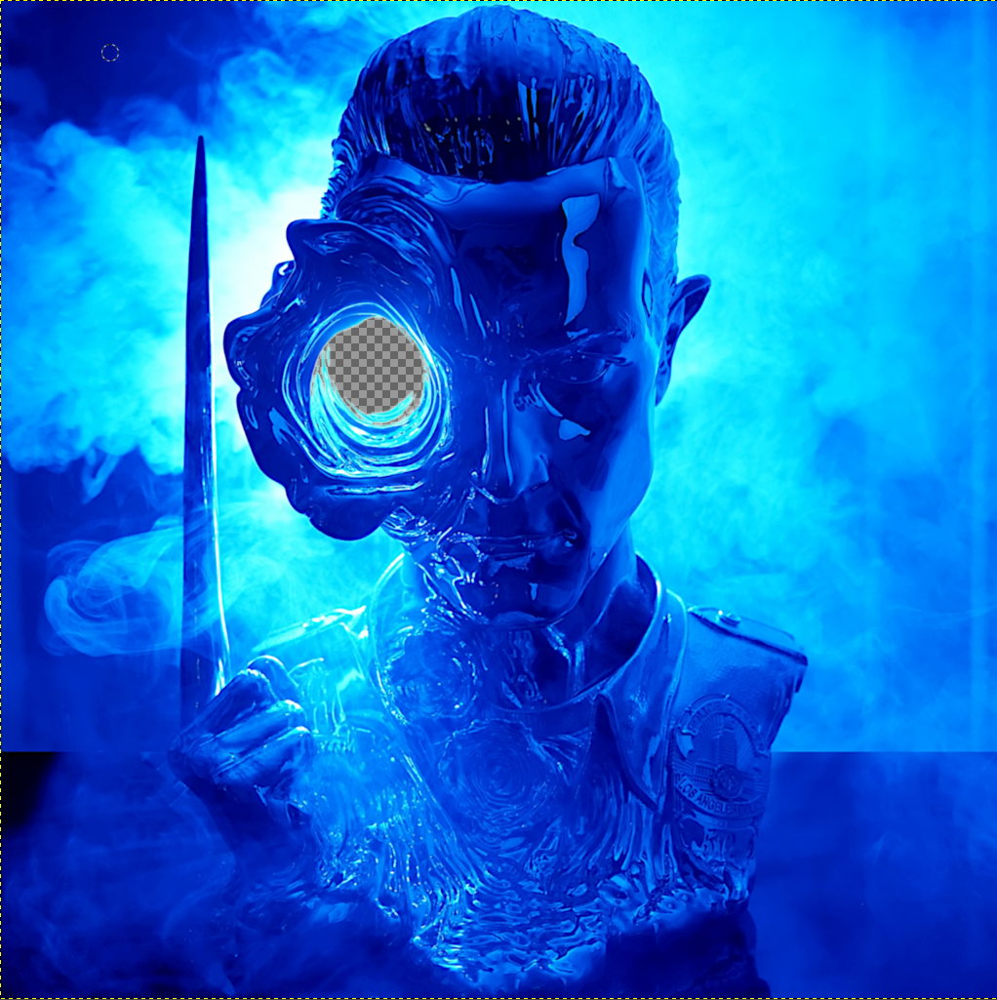
- Nhìn vào ảnh thì ta có thể thấy rõ là ở phần mắt bên trái nó bị khoét mắt lộ cả các pixel của background, điều này rất là lạ, có lẽ có gì đó ẩn dấu đằng sau nó. Để tắt nó đi ta cũng sử dụng các kênh màu nhưng đặc biệt hơn chúng ta có `Alpha channel` nó chuyển để dùng trong trường hợp này.
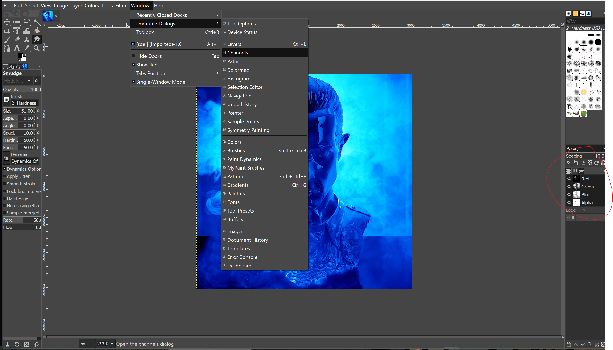
- Đây là đường dẫn và bảng điều kiển ở vùng khoan đỏ ta tắt `Alpha channel` đi thì bên trong con mắt có lun flag.
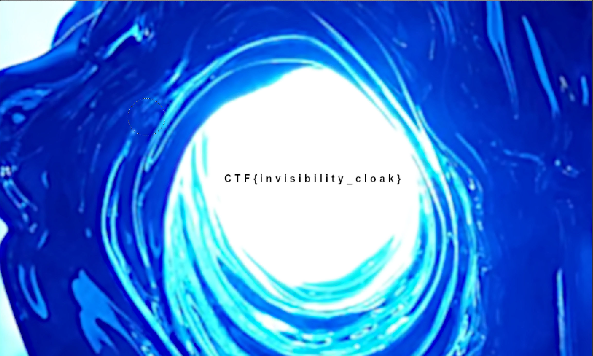