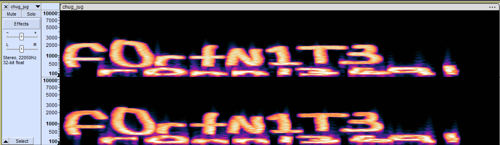
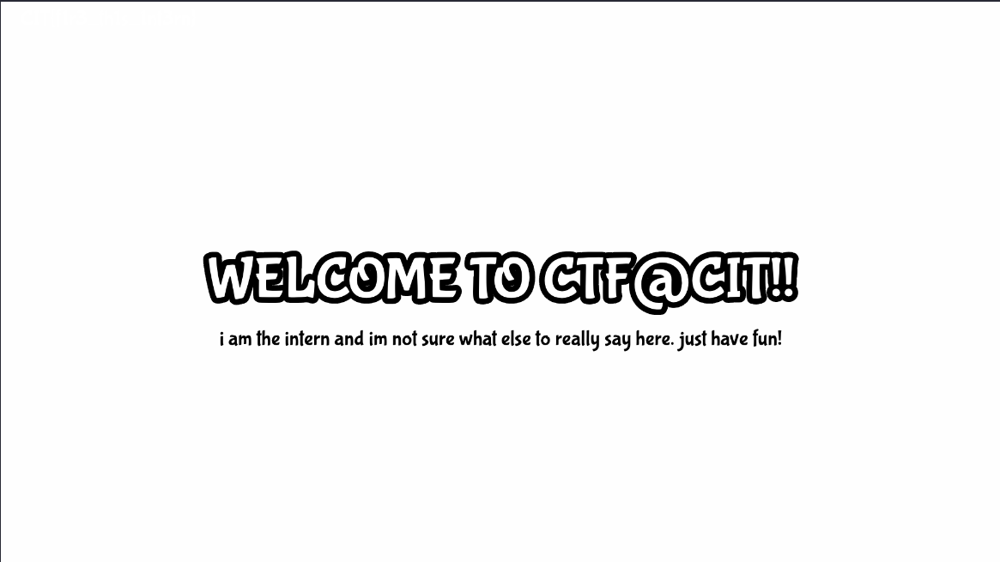
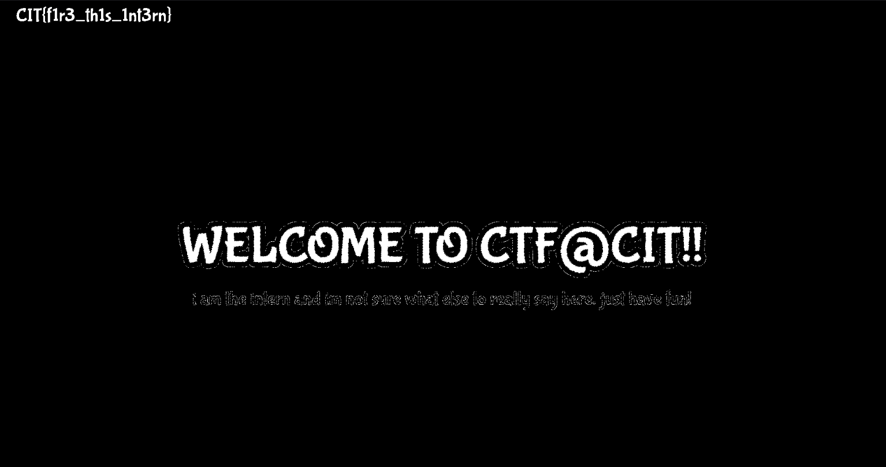
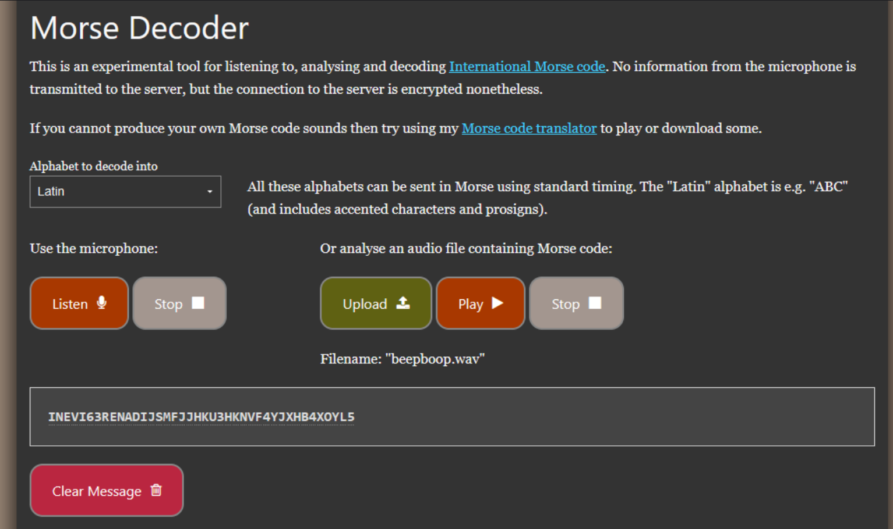
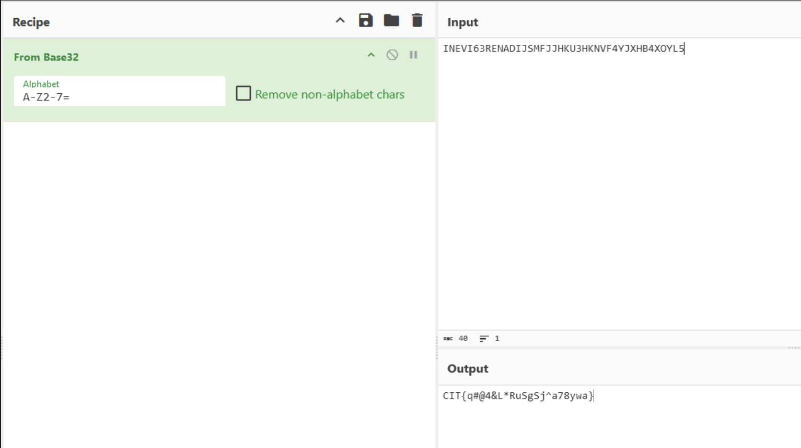
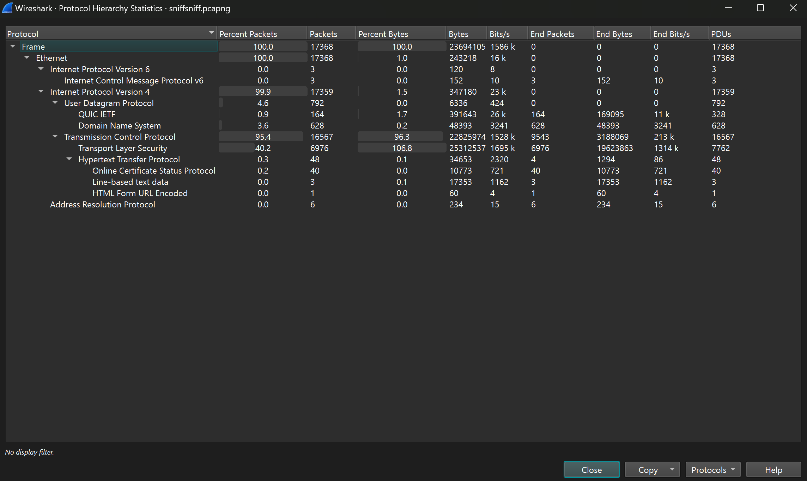
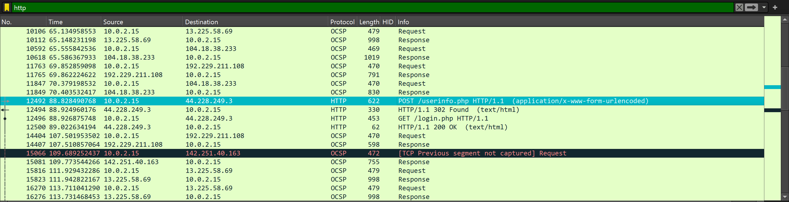
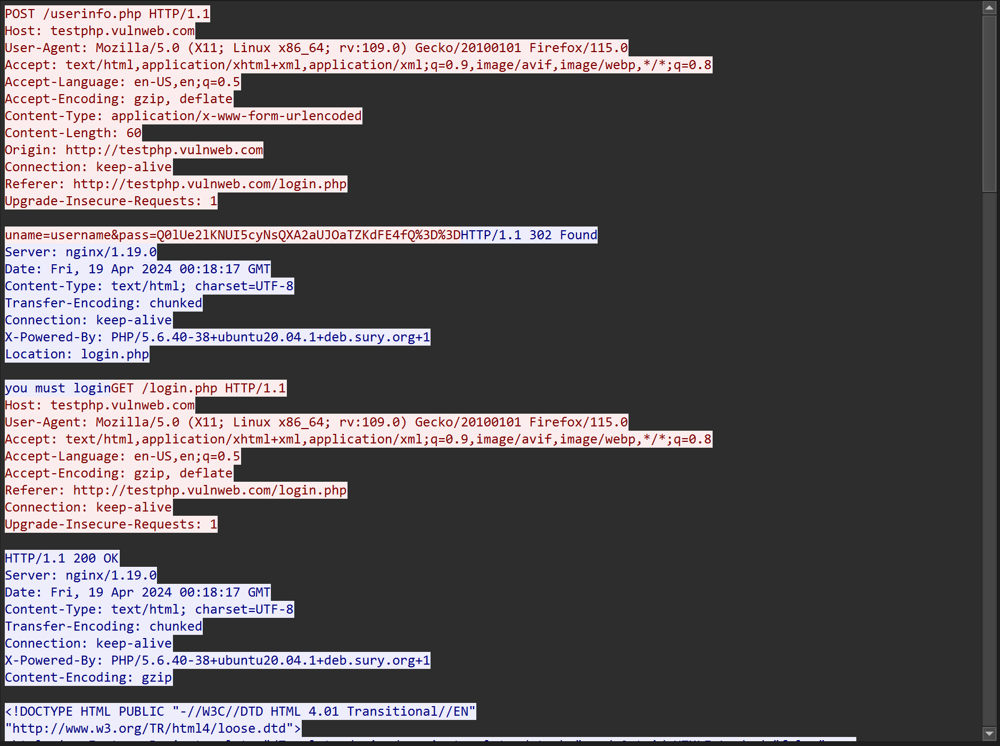
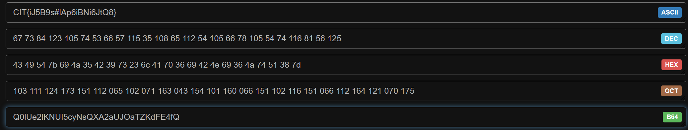
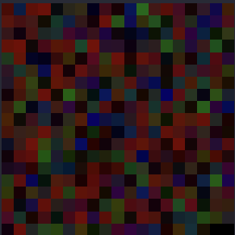

# CIT@CTF 2024.
### I. Not a ZIP Bomb .
```
Question: We told the intern to hide the flag within this ZIP. Did he listen?
```
- Chall này cho mình 1 file `flag.zip` bên trong có rất nhiều folder , trong mỗi folder có 1 file text, và trong file text đó sẽ có 1 flag, Việc của chúng ta là tìm kiếm flag đúng.
- Bài này đơn giản chỉ cần vận dụng cmd của kali là ra flag.
```
$ strings flag.zip | grep -i cit| sort | uniq -u
CIT{you_believed_in_me!}
```
- Giải thích đơn giản thì grep flag sử dụng sort để có thể xài `uniq -u` với option này ta có thể lọc ra những flag giống nhau liên tiếp , chỉ in ra flag ko bị trùng.
- *`FLAG: CIT{you_believed_in_me!}`*.
### II. Drop me a chug jug!.
```
Question: What does Fortnite have to do with wav files? I dunno..
```
- Chall này cho mình 1 file `.wav` mình vứt nó vào lun `Audacity` thì có lun flag ở spectrogram.

- *`FLAG: CIT{f0rtN1T3_ronn13691}`*.
### III. I LOVE PRIME!.
```
Question: I LOVE PRIME SO MUCH META MOON IS SO GOOD ITS SO FULFILLING MMMMM TASTY!
```

- Đề cho 1 ảnh và có nhắc đến từ META , thì chắc chắn là metadata rồi nên mình xài exiftool lun, thế nà có flag.
```
$ exiftool meta-moon.jpg 
ExifTool Version Number         : 12.76
File Name                       : meta-moon.jpg
Directory                       : .
File Size                       : 24 kB
File Modification Date/Time     : 2024:04:20 13:56:39+07:00
File Access Date/Time           : 2024:04:23 22:02:05+07:00
File Inode Change Date/Time     : 2024:04:23 22:00:51+07:00
File Permissions                : -rwxrwxrwx
File Type                       : JPEG
File Type Extension             : jpg
MIME Type                       : image/jpeg
JFIF Version                    : 1.01
Resolution Unit                 : inches
X Resolution                    : 72
Y Resolution                    : 72
XMP Toolkit                     : Image::ExifTool 12.65
Description                     : CIT{meta_moon_prime_yummy}
Image Width                     : 1280
Image Height                    : 720
Encoding Process                : Baseline DCT, Huffman coding
Bits Per Sample                 : 8
Color Components                : 3
Y Cb Cr Sub Sampling            : YCbCr4:2:0 (2 2)
Image Size                      : 1280x720
Megapixels                      : 0.922
```
- *`FLAG: CIT{meta_moon_prime_yummy}`*.
### IV. The Art of the Beast.
```
Question: Embrace the dark, let the beast within rise, A journey of strength, beneath the moon’s wise eyes. In silence and shadow, your true self you’ll find, a beast of steg, untamed and unconfined. - Sensei
```
- Chall này cho mình 1 cái ảnh , và đề có nhắc đến từ `steg` , mình check lun steghide thì quả thật có file ẩn và ko có pass.

- nó cho mình 1 file tên là `misterbeast` , strings nó ra thì có flag.
```
steghide extract -sf the-art-of-the-beast.jpg 
Enter passphrase: 
wrote extracted data to "misterbeast".

└─$ strings misterbeast                            
/lib64/ld-linux-x86-64.so.2
mgUa
fgets
stdin
puts
strcspn
__libc_start_main
__cxa_finalize
printf
strcmp
libc.so.6
GLIBC_2.2.5
GLIBC_2.34
_ITM_deregisterTMCloneTable
__gmon_start__
_ITM_registerTMCloneTable
PTE1
u+UH
i love mister beast so much!
i remember the video he made where he bought the world's largest mystery box.
it still brings butterflies to my stomach. however, i don't remember what was inside of it.
i just remember it being big..
what was it?: 
Tractor
tractor
you must love mister beast too!!! here's your flag: CIT{mist4_b34st}
fake fan!
;*3$"
GCC: (Debian 13.2.0-2) 13.2.0
.shstrtab
.interp
.note.gnu.property
.note.gnu.build-id
.note.ABI-tag
.gnu.hash
.dynsym
.dynstr
.gnu.version
.gnu.version_r
.rela.dyn
.rela.plt
.init
.plt.got
.text
.fini
.rodata
.eh_frame_hdr
.eh_frame
.init_array
.fini_array
.dynamic
.got.plt
.data
.bss
.comment
```
- *`FLAG: CIT{mist4_b34st}`*.
### V. Intern.
```
Question: So we just hired an intern for our CTF. He wanted to make some challenges, but we told him to just make us a flyer to keep him occupied. Surely he didn’t put a flag in here or else he’s getting fired. Let us know..
```
- Chall này cũng cho mình 1 cái ảnh, để cho tiện mình vứt lên lun aperisolve , nhìn vào kênh màu thì có 1 kênh có dòng flag lun.


- *`FLAG: CIT{f1r3_th1s_1nt3rn}`*.
### VI. Beep Boop.
- Chall cho mình 1 file `.wav` và khi nghe và nhìn tên thì chắc chắn nó là morse ròi, vứt lên web thì mình được đoạn sau:

- nó là base64 decode ra thì ta có flag lun.

- *`FLAG: CIT{q#@4&L*RuSgSj^a78ywa}`*.
### VII. Invoice
```
Question: Our intern strikes again! We told him to create an invoice for one of our sponsors, but he redacted all of the sponsors information so we cannot tell who we are sending it to. Can you recover the sponsor’s name for us?
```
- Chall cho mình 1 file pdf , có phần thông tin đã bị cho và đề bảo flag sẽ là tên của nhà tài trợ , mình xài pdftotext cho lẹ đọc cho dễ.

```
pdftotext invoice.pdf 

└─$ cat invoice.txt 
INVOICE

CTF@CIT
300 Boston Post Rd
West Haven, CT 06516
Phone: (111) 439-5930

INVOICE # 218
DATE: 4/12/2024

TO:
Sir Swaggy
1337 Information Security
22 Beehive Drive
Freeport, Maine 04032
Phone: N/A

SHIP TO:
Sir Swaggy
1337 Information Security
22 Beehive Drive
Freeport, Maine 04032
Phone: N/A

COMMENTS OR SPECIAL INSTRUCTIONS:
Please pay at your earliest convenience. We accept Dogecoin, BTC, ETH, cash, or Steam cards. Thank you!
```
- Cả `TO` và `SHIP TO` đều là `Sir Swaggy` nên là sẽ là nó lun.
- *`FLAG: CIT{Sir_Swaggy}`*.
### IIX. Sniff Sniff.
- Chall này cho mình 1 file pcap, và mò flag thui.

- trong file này ta có thể thấy có HTTP , TCP , DNS, TLS , UDP cũng khá nhiều protocol , trước tiên check http thì có cái này khá lạ mắt.

- Ở đây có 1 userinfo và khi follow , ta có thể thấy username và pass, nhưng pass là 1 đoạn base64 khá sus decode ra thì ta có lun flag.


- *`FLAG: CIT{iJ5B9s#lAp6iBNi6JtQ8}`*
### IX. Secret Square.
- Bài này cho mình 1 cái ảnh như này:

- Vừa nhìn thì mình biết ngày sẽ là RGB , mình có thử lấy dữ liệu LSB thử nhưng mà giá trị trả ra chỉ là 1 dãy dữ liệu rác ko có nghĩa.
- Thế nên mình đã biết thêm 1 cách khác đó chính là lấy ra giá trị `(R,G,B)` , cộng tổng nó lại sau đó chuyển nó về dạng char (Giá trị trả ra khi cộng lại là dạng DEC) Và đây là scrip mình hỏi GPT :))).
```
from PIL import Image

# Đọc ảnh
image_path = "secret_square.png"  # Thay đổi đường dẫn tới ảnh của bạn
image = Image.open(image_path)

# Lấy kích thước ảnh
width, height = image.size

# Hàm chuyển đổi giá trị RGB thành ký tự
def rgb_to_char(r, g, b):
    # Tính tổng giá trị của R, G, B
    total = r + g + b
    # Chuyển đổi tổng thành ký tự
    char = chr(total)
    return char

# Duyệt qua từng pixel và chuyển đổi thành ký tự
output_text = ""
for y in range(height):
    for x in range(width):
        r, g, b = image.getpixel((x, y))
        char = rgb_to_char(r, g, b)
        output_text += char
    output_text += "\n"  # Xuống dòng sau khi hoàn thành mỗi hàng

# In kết quả
print(output_text)
```
```
$ python3 tools.py
This is a super sec
ret and super secur
e message! I hope y
ou enjoyed finding 
it. If you're a beg
inner then it proba
bly took some time,
 but if you know wh
at you're doing the
n it probably took
around 30 seconds.
Anyways, here's the
 flag: CIT{SUP3R_S3
CR3T_P1X3LS} I'm go
ing to add some mor
e random text so th
e image does not ha
ve a bunch of black
 pixels after it.
```
- *`FLAG: CIT{SUP3R_S3CR3T_P1X3LS}`*.