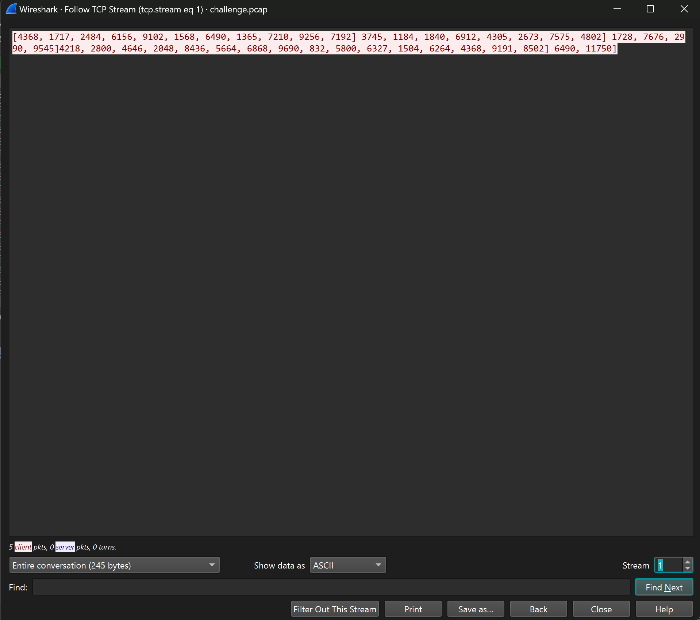

# CorCTF && DeadSecCTF
### I. Forgotten Password.
- Chall này cho mình 1 file python và 1 file zip có mật khẩu, và khi đọc source ta có thể thấy họ đang tạo 1 file `.iso`  gửi vào trong đó file `flag.txt` nén nó vào file zip và pass là chính flag lun.
```
from io import BytesIO
import os
import subprocess
import pycdlib # pip install pycdlib

try:
    FLAG = open("flag.txt","r").read()
except FileNotFoundError:
    FLAG = "fake_flag_for_testing"

iso = pycdlib.PyCdlib()
iso.new(interchange_level=4)

iso.add_fp(BytesIO(FLAG.encode()), len(FLAG), '/flag.txt;1')

iso.write('challenge.iso')
iso.close()

subprocess.check_output(["zip", "challenge.zip", "challenge.iso", "-P", FLAG])
```
- Đến nước này chỉ có crack file mới cứu được thôi, ta sẽ sử dụng `BKcrack`.
- Cùng phân tích , khi ta thử tạo 2 file khác bằng source sử dụng y hệt cách mà challenge làm.
- Vứt nó vào `HxD` và hãy xem điều bắt ngờ.

- Ta có thể thấy 2 file đều có điểm chung là có 1 dãy nullbyte , bởi vì file `.iso` có phần header là dãy rất nhiều nullbyte.

- Điều kiện cần phải biết tối thiểu 12byte của file cần crack đã thỏa ta tiến hành crack thôi.
- Tuy nhiên khi check `comppression` thì nó lại là `Deflate`, chúng ta ko biết các nullbyte bắt đầu từ đâu cả nhưng mà từ 2 file test trên ta đều thấy nó luôn bắt đầu từ byte thứ `68`.
```
$ ./bkcrack -L challenge.zip
bkcrack 1.7.0 - 2024-05-26
Archive: .\challenge.zip
Index Encryption Compression CRC32    Uncompressed  Packed size Name
----- ---------- ----------- -------- ------------ ------------ ----------------
    0 ZipCrypto  Deflate     17ee7183        53248          382 challenge.iso
```
- thử từ offset 68 ta đã thành công có được `key` từ đó mà có thể crack đc file này.
```
$ .\bkcrack.exe -C challenge.zip -c challenge.iso -x 68 0000000000000000000000000000
bkcrack 1.7.0 - 2024-05-26
[19:01:52] Z reduction using 6 bytes of known plaintext
100.0 % (6 / 6)
[19:01:52] Attack on 1062600 Z values at index 75
Keys: 6b13ebc5 cc0be8ac 709e18f9
72.8 % (773877 / 1062600)
Found a solution. Stopping.
You may resume the attack with the option: --continue-attack 773877
[19:10:02] Keys
6b13ebc5 cc0be8ac 709e18f9
```

```
$ .\bkcrack.exe -C challenge.zip -k 6b13ebc5 cc0be8ac 709e18f9 -D unlock.zip
bkcrack 1.7.0 - 2024-05-26
[19:17:34] Writing decrypted archive unlock.zip
100.0 % (1 / 1)
```
- mở file iso là có flag hoi.
*`FLAG: DEAD{weird_how_this_encryption_is_the_default_in_2024}`*

### II. the-conspiracy
- Chall này cho ta 2 file `.pcap` và 1 file python , đọc đề thì họ gọi đây là cách giao tiếp bí mật khi mà đọc source thì thấy họ mở file `.csv` đem đi nhânvới 1 giá trị được random ngẫu nhiên và được gửi thông qua `TCP` protocol.
```
import random
from scapy.all import *
import csv

sources, destinations, messages = [], [], []

with open('chatlogs.csv', mode='r') as file:
    csv_reader = csv.reader(file)
    for row in csv_reader:
        sources.append(row[0])
        destinations.append(row[1])
        messages.append(row[2])

def encrypt(message):
    messagenums = []
    for character in message:
        messagenums.append(ord(character))
    keys = []
    for i in range(len(messagenums)):
        keys.append(random.randint(10, 100))

    finalmessage = []
    for i in range(len(messagenums)):
        finalmessage.append(messagenums[i] * keys[i])

    return keys, finalmessage

for i in range(len(messages)):
    finalmessage, keys = encrypt(messages[i])
    print(finalmessage, keys)
    packet1 = IP(src=sources[i], dst=destinations[i])/TCP(dport=80)/Raw(load=str(finalmessage))
    send(packet1)
    packet2 = IP(src=sources[i], dst=destinations[i])/TCP(dport=80)/Raw(load=str(keys))
    send(packet2)

```
- Cùng xem file `.pcap` khi follow `TCP` thì thấy dữ liệu khá lộn xộn và khó hiểu.

- Tuy nhiên khi xem từng packet một thì ta thấy văn bản đã bị mã hóa và key random tương ứng được lồng xen kẻ với nhau.


- Với source này ta có thể lấy dữ liệu của final message và key để chia lại với nhau decode nó từ đó có được văn bản gốc:
```
from scapy.all import *
import ast

packets = rdpcap('challenge.pcap')
encrypted_messages = []
keys = []

for packet in packets:
    if Raw in packet:
        data = packet[Raw].load
        try:
            data_list = ast.literal_eval(data.decode(errors='ignore'))
            if all(isinstance(x, int) for x in data_list):
                if len(encrypted_messages) == len(keys):
                    encrypted_messages.append(data_list)
                else:
                    keys.append(data_list)
        except (ValueError, SyntaxError):
            continue

decrypted_messages = []
for enc_msg, key in zip(encrypted_messages, keys):
    decrypted_msg = ''.join(chr(enc_msg[i] // key[i]) for i in range(len(enc_msg)))
    decrypted_messages.append(decrypted_msg)
     
for msg in decrypted_messages:
     print(msg)
```
- chạy file ta được văn bản như sau bên trong có lun flag.
```
hello blinkoid
hello night
how do we eliminate the msfroggers
idk i'll ask slice1
how do we eliminate the msfroggers
we can send them to the skibidi toilet
or we can deprive them of their fanum tax
slice1 is being useless
what's new
blinkoid? message back :(
oh errr... this sounds great! any more ideas
we could co-conspire with the afs
and get them to infiltrate the msfroggers
that way team lemonthink reins supreme
your a genius!
alright night
i have my own idea
let's hear it
so yk about the afs
if we send our secret code over to them
they can use it to infiltrate the afs
what's our code again?
i think it's corctf{b@53d_af_f0r_th3_w1n}
hey night did you hear my idea
you had an idea? blinkoid just told me you were being useless
what the sigma
```
*`FLAG: corctf{b@53d_af_f0r_th3_w1n}`*

### III. infiltration
- Chall này cho ta 1 file `Security.evtx` và phải phân tích để trả lời những câu hỏi sau:
```
Q1: We'd like to confirm what the username of the main user on the target's computer is. Can you provide this information? 

Q2: Now, we'd like the name of the computer, after it was renamed. Ensure that it is entered in exactly how it is in the logs. 

Q3: Great work! In order to prevent their lemons from moulding, the lemonthinkers changed the maximum password age. What is this value? Please enter it as an integer number in days. 

Q4: It seems that our targets are incredibly smart, and turned off the antivirus. At what time did this happen? Give your answer as a UNIX timestamp. 

Q5: The main lemonthinker, slice1, hasn't learnt from the-conspiracy and has (again) downloaded some malware on the system. What is the name of the user created by this malware? 

Q6: Finally, we'd like to know the name of the group that the user created by the malware is part of, which has the greatest security risk. What is this? 
```
- Câu 1 và 2 thì mò mò 1 tí ở `Event ID = 5379` ta có thể thấy username là `slice1` và computer name là `lemon-squeezer`.

- Câu 3 khá là dễ khi mà ta search password age là nó tự động tìm kiếm lun.

- Câu 4 cũng khá dễ antivirus mà mặc định máy nào cũng có chính là `Window Defender` , ở `Event ID = 4689` ở đây ta có thể xem tất cả những tiến trình đã được tắt, ta có thể dễ dàng thấy 1 tiến trình con đã bị tắt ở thời gian này.

- Hoặc ở các `Event ID = 4698` ta cũng có thể xem các thao tác mà ta đã truy cập vào như bật tắt `Window Defender`
lấy thời gian này cũng đúng.
- Ở câu 5 khá là dễ khi mà mò ở `Event ID = 4720` thì mình thấy có 1 username khá là sus là `notabackdoor` và quả nhiên nó là đáp án đúng.

- Câu 6 cũng khá dễ khi mà ta truy cập `Event ID = 4627` thì khi thay đổi từ user `slice1` sang `notabackdoor` thì thấy có rất nhiều group membership ở đây thì tất nhiên nhóm có rủi ro nhất chính là `Administrators` bởi vì đây là nhóm có mọi quyền hạn điều kiển máy của bạn.
- trả lời các câu hỏi trên ở netcat `be.ax 3222` ta sẽ có flag.
```
from pwn import *
p = remote('be.ax', 32222)
p.sendlineafter(b"information? ", b'slice1')
p.sendlineafter(b"logs. ", b"lemon-squeezer")
p.sendlineafter(b"days. ", b"83")
p.sendlineafter(b"timestamp. ", b"1721946080")
p.sendlineafter(b"malware? ", b"notabackdoor")
p.sendlineafter(b"this? ", b"Administrators")
# print(p.recvuntil(b"\n"))
p.sendlineafter(b"this? ", b"Administrators")
```


*`FLAG: corctf{alw4y5_l3m0n_7h1nk_b3f0r3_y0u_c0mm1t_cr1m3}`*