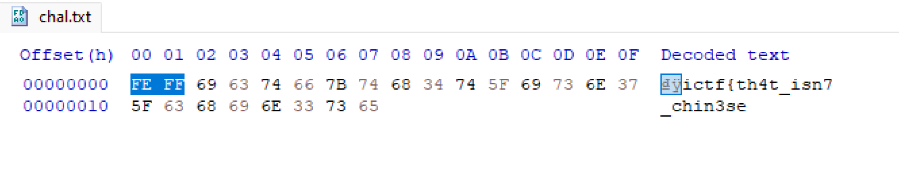

# ImaginaryCTF 2024
### I. Bom.
```
楣瑦筴栴瑟楳渷彣桩渳獥
```
- Chall này cho ta 1 file text nhìn khá giống tiếng trung nhưng thật ra nó cũng là 1 loại mã hóa, thoạt đầu nhìn có vẻ giống baseffff+1 nhưng mà mình thử thì nó chả có nghĩa gì cả.

- Cho đến khi mình thử cat file đó ra hoặc là sử dụng `HxD` thì có lun flag :D.
```
$ cat chal.txt 
��ictf{th4t_isn7_chin3se
```
- Đơn giản thì là họ thêm 2 byte `FEFF` vào đầu để các ứng dụng hoặc phần mềm nhận biết rằng tệp đang sử dụng định dạng UTF-16. nhằm đánh lừa （￣_￣）.


*`FLAG: ictf{th4t_isn7_chin3se}`*

### II. Packet.
- Chall này cho mình 1 file `.pkz` , chall này khá dễ khi mà header của file này là `PK` rất giống với file zip nên ta có thể chuyển thành file zip extract nó ra thì thấy có flag bên trong.


*`FLAG: ictf{ab4697882634d4aeb6f21141ea2724d0}`*

### III. Routed.
- Chall này cùng file với chall trên nhưng ta cần tìm sâu hơn , dựa vào file nó đề cập tới có lẽ là router. Mở file bằng cisco ta cùng check nhaa.

- Chỉ có 1 con router duy nhất nên ta vào `CLI` (command line) sử dụng lệnh `enable` và `show running-config`, lệnh này để xem cấu hình hay thông tin đã được ghi vào con router, thì thấy nó có `password 7` tuy nhiên nó bị mã hóa nhưng mà ta có thể decrypt bằng [web này](https://packetlife.net/toolbox/type7/).

- Sử dụng web trên dycrypt là ra flag lun.


*`FLAG: ictf{hidden_not_hashed}`*
### IV. playful-puppy.
- Chall này cho ta 1 folder chứa dữ liệu của 1 thế giới minecraft. Và ta cần phải kiếm con chó y hệt trong ảnh.

```
$ tree world/
world/
├── advancements
│   └── c3a756fa-07ab-4fb2-9c28-dd69162440e1.json
├── data
│   ├── raids.dat
│   └── random_sequences.dat
├── datapacks
│   └── Dog data
│       ├── data
│       │   └── test
│       │       └── function
│       │           └── dog.mcfunction
│       └── pack.mcmeta
├── DIM-1
│   └── data
│       └── raids.dat
├── DIM1
│   └── data
│       └── raids_end.dat
├── entities
│   ├── r.0.0.mca
│   ├── r.0.-1.mca
│   ├── r.-1.0.mca
│   ├── r.1.0.mca
│   ├── r.-1.-1.mca
│   └── r.1.-1.mca
├── icon.png
├── level.dat
├── level.dat_old
├── playerdata
│   ├── c3a756fa-07ab-4fb2-9c28-dd69162440e1.dat
│   └── c3a756fa-07ab-4fb2-9c28-dd69162440e1.dat_old
├── poi
│   ├── r.0.0.mca
│   ├── r.0.-1.mca
│   ├── r.-1.0.mca
│   ├── r.1.0.mca
│   ├── r.-1.-1.mca
│   ├── r.1.-1.mca
│   └── r.-1.-2.mca
├── region
│   ├── r.0.0.mca
│   ├── r.0.-1.mca
│   ├── r.0.-2.mca
│   ├── r.-1.0.mca
│   ├── r.1.0.mca
│   ├── r.-1.-1.mca
│   ├── r.1.-1.mca
│   └── r.-1.-2.mca
├── session.lock
└── stats
    └── c3a756fa-07ab-4fb2-9c28-dd69162440e1.json
```
- Ta có thể thấy bên trong nó có 1 folder `Dog data` vào xem thì nó cho ta thấy dữ liệu của những con chó được spam ra.
```
summon minecraft:wolf ~ ~ ~ {CustomName:bf25e944bee0fa99,Owner:cleverbear57,CustomNameVisible:0,variant:pale,CollarColor:1}
summon minecraft:wolf ~ ~ ~ {CustomName:817bf6d52f2c358c,Owner:cleverbear57,CustomNameVisible:0,variant:woods,CollarColor:2}
summon minecraft:wolf ~ ~ ~ {CustomName:ae4dd4b26ad34509,Owner:cleverbear57,CustomNameVisible:0,variant:ashen,CollarColor:3}
summon minecraft:wolf ~ ~ ~ {CustomName:cf649e363506b141,Owner:cleverbear57,CustomNameVisible:0,variant:black,CollarColor:4}
summon minecraft:wolf ~ ~ ~ {CustomName:54b0473e5bcfb4f2,Owner:cleverbear57,CustomNameVisible:0,variant:chestnut,CollarColor:5}
summon minecraft:wolf ~ ~ ~ {CustomName:a9bcfd8decaac44e,Owner:cleverbear57,CustomNameVisible:0,variant:rusty,CollarColor:6}
summon minecraft:wolf ~ ~ ~ {CustomName:9dd38f926e6dc01e,Owner:cleverbear57,CustomNameVisible:0,variant:spotted,CollarColor:7}
summon minecraft:wolf ~ ~ ~ {CustomName:bb7ac89fb73a9313,Owner:cleverbear57,CustomNameVisible:0,variant:striped,CollarColor:8}
summon minecraft:wolf ~ ~ ~ {CustomName:6e0cf26f062c58d1,Owner:cleverbear57,CustomNameVisible:0,variant:snowy,CollarColor:9}
summon minecraft:wolf ~ ~ ~ {CustomName:c40db81a13cc7e71,Owner:cleverbear57,CustomNameVisible:0,variant:pale,CollarColor:10}
summon minecraft:wolf ~ ~ ~ {CustomName:24829ef1bdc86e6f,Owner:cleverbear57,CustomNameVisible:0,variant:woods,CollarColor:12}
summon minecraft:wolf ~ ~ ~ {CustomName:46d98a0b5963e6fc,Owner:cleverbear57,CustomNameVisible:0,variant:ashen,CollarColor:13}
summon minecraft:wolf ~ ~ ~ {CustomName:d690dbc8d9c6f76c,Owner:cleverbear57,CustomNameVisible:0,variant:black,CollarColor:14}
summon minecraft:wolf ~ ~ ~ {CustomName:ef33dac812712221,Owner:cleverbear57,CustomNameVisible:0,variant:chestnut,CollarColor:15}
~~ SNIP ~~
```
- Ta có thể biết được tên người sỡ hữu, con chó đó màu gì và màu vòng cổ.
- Ta chỉ cần kiếm 1 con có màu đen và vòng cổ màu xanh biển là được , tuy nhiên trong file này không có con nào như thế cả và ta cần sử dụng [NBT Explorer](https://www.minecraftforum.net/forums/mapping-and-modding-java-edition/minecraft-tools/1262665-nbtexplorer-nbt-editor-for-windows-and-mac) để đọc được các file trong folder này.
- Để tìm kiếm đúng con chó đã bị thất lạc , ta vào folder `entities` , ta phải open các file con đó ra thì nó mới có thể search sâu vào các file đó được và ta sẽ filter như này vì theo như research 1 chút thì màu xanh sẽ có giá trị là `11`.

- Ta tìm kiếm những con có `CollarColor = 11` và có màu đen , bọc tên nó vào `ictf{}` là ra flag.


*`FLAG: ictf{6ed247d7539bb3bf}`*
### V. Crash.
- Chall này cho mình 1 file mem, khi đọc đề thì nó có bảo là `I didn't save my work...` và khi check pslist ta có thể thấy `notepad`.
```
$ python3 vol.py -f /mnt/d/FORENSICS/challenge/ImaginaryCTF/Crash/dump.vmem windows.pslist
Volatility 3 Framework 2.7.1
WARNING  volatility3.framework.layers.vmware: No metadata file found alongside VMEM file. A VMSS or VMSN file may be required to correctly process a VMEM file. These should be placed in the same directory with the same file name, e.g. dump.vmem and dump.vmss.
Progress:  100.00               PDB scanning finished
PID     PPID    ImageFileName   Offset(V)       Threads Handles SessionId       Wow64   CreateTime      ExitTime        File output

2216    4736    notepad.exe     0xc60c81b87080  12      -       2       False   2024-07-19 01:58:24.000000      N/A     Disabled
6676    4736    msedge.exe      0xc60c808a2080  0       -       2       False   2024-07-19 02:01:09.000000      2024-07-19 02:01:48.000000      Disabled
5368    6676    msedge.exe      0xc60c80832080  0       -       2       False   2024-07-19 02:01:10.000000      2024-07-19 02:01:48.000000      Disabled
6468    6676    msedge.exe      0xc60c83a04080  0       -       2       False   2024-07-19 02:01:26.000000      2024-07-19 02:01:48.000000      Disabled
3740    6676    msedge.exe      0xc60c831b1080  0       -       2       False   2024-07-19 02:01:29.000000      2024-07-19 02:01:48.000000      Disabled
5632    2680    SearchProtocol  0xc60c8080a080  9       -       0       False   2024-07-19 02:02:14.000000      N/A     Disabled
3176    2680    SearchFilterHo  0xc60c831cd080  7       -       0       False   2024-07-19 02:02:14.000000      N/A     Disabled
```
- Bằng các tìm kiếm các file có cụm từ phổ thông như `Documents, Desktop, Downloads` ta có thể dễ dàng thấy file `flag.txt`.
```
$ python3 vol.py -f /mnt/d/FORENSICS/challenge/ImaginaryCTF/Crash/dump.vmem windows.filescan | egrep 'Documents|Desktop|Downloads'
WARNING  volatility3.framework.layers.vmware: No metadata file found alongside VMEM file. A VMSS or VMSN file may be required to correctly process a VMEM file. These should be placed in the same directory with the same file name, e.g. dump.vmem and dump.vmss.

0xc60c810947a0.0\Windows\System32\DispBroker.Desktop.dll        216
0xc60c813ecdf0  \Windows\System32\DesktopShellExt.dll   216
0xc60c8196bc40  \Users\imaginarypc\Desktop      216
0xc60c8196dea0  \Users\imaginarypc\Desktop      216
0xc60c81c70ce0  \Users\imaginarypc\Documents\flag.txt   216
0xc60c81c79e30  \Users\imaginarypc\AppData\Roaming\Microsoft\Windows\Libraries\Documents.library-ms     216
0xc60c822c3ef0  \Users\Public\Desktop   216
0xc60c822c4210  \Users\Public\Desktop   216
0xc60c82768970  \Windows\System32\SettingsEnvironment.Desktop.dll       216
0xc60c8277dc80  \Users\Public\Desktop\desktop.ini       216
0xc60c82cb3a30  \Users\Public\Desktop\Microsoft Edge.lnk        216
0xc60c82cbfd80  \Users\imaginarypc\Desktop\desktop.ini  216
0xc60c82cc3d90  \Users\imaginarypc\Downloads\desktop.ini        216
0xc60c82cc6950  \Users\imaginarypc\AppData\Local\Packages\Microsoft.Windows.Search_cw5n1h2txyewy\LocalState\AppIconCache\100\Microsoft_SkyDrive_Desktop 216
0xc60c82cc6e00  \Users\imaginarypc\Documents\desktop.ini        216    
```
- Tải nó về và decrypt là có flag.
```
└─$ cat file.0xc60c81c70ce0.0xc60c83b5e650.DataSectionObject.flag.txt.dat 
aWN0ZnthYTBlYjcwN2E0MWIyY2E2fQ==

└─$ echo "aWN0ZnthYTBlYjcwN2E0MWIyY2E2fQ==" | base64 -d
ictf{aa0eb707a41b2ca6}
```

- Hoặc là 1 cách khác mà mình kiếm ra được đó là dump file `History` của Edge bởi vì mình thấy có rất nhiều process Edge khi check pslist.
```
─$ python3 vol.py -f /mnt/d/FORENSICS/challenge/ImaginaryCTF/Crash/dump.vmem windows.filescan | grep -i history
WARNING  volatility3.framework.layers.vmware: No metadata file found alongside VMEM file. A VMSS or VMSN file may be required to correctly process a VMEM file. These should be placed in the same directory with the same file name, e.g. dump.vmem and dump.vmss.

0xc60c83177120  \Users\imaginarypc\AppData\Local\Microsoft\Edge\User Data\Default\History     
```
- Mở nó bằng `Autospy` ta sẽ thấy có bất ngờ rằng là có 1 URL của `Cyberchef` có sử dụng để decode 1 dòng base nào đó, copy và vào URL đó ta có lun flag :Đ.


*`FLAG: ictf{aa0eb707a41b2ca6}`*