# Jersey CTF 2024.
### 1. substitute-detail-torrent.
- Chall này là 1 file `.vim` là trình soạn thảo văn bản dòng lệnh được sử dụng để tạo và xem các tệp văn bản. mình cũng chả biết nữa. Nhưng mà đề bài và hint nó cho mình khá nhiều thông tin nhaaa.
```
Question: We’ve been given a file and need to figure out what url it was downloaded from.

Hint: Maybe its saved in file metadata somehow?
```
- Hint cho chúng ta biết thông tin là có thể sẽ được lưu đâu đó trong metadata , ta có thể check bằng cách `cat` `strings` hoặc `exiftool`.
- Mình check thử thì có flag lun.
- *`FLAG: jctf{https://www.NTFS/File/Metadata}`*.
### 2. groovy.
- Chall này cho mình 1 file âm thanh , âm thanh nó khá vặn vẹo , cứ như 1 biểu đồ lên xuống liên tục vậy , mình nghĩ maybe có thể là spectrogram.
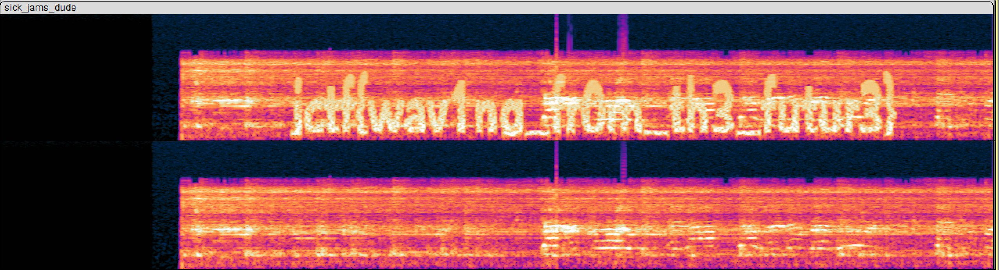
- *`FLAG: jctf{wav1ng_fr0m_th3_futur3}`*.
### 3. All-Along-the-Watchtower.
```
Question: Our informant has met back with us at base. He has stolen a file from a suspect who’s starting to show dangerous signs of cyberpsychosis. Aside from his unending lust for bloodshed, our informant noted that the suspect would not shut up about “rats making him crazy” as well as the term “Base FFFF+1” but that’s probably just nonsense. Anyways, can you look beyond the layers of this corrupted file to extract the information that we need?
```
- Chall này cho mình 1 cái file ảnh `.jpg` nhưng mà nó bị sai header , mình sửa thử thì nó chả có thông tin gì :))).
.
- Thấy thế thì mình check binwalk thì có file zip với 1 list pass ,file zip có pass và mình khá chắc list pass đó có mật khẩu đúng để mở cái file zip đã khóa kia, thế là mình xài `anh john` để bẻ khóa nha. Bẻ xong thì nó cho mình 1 đống file zip nhưng mà hên là nó ko bị khóa nữa :))) . Mở đến cuối thì được 1 file text nội dung bên trong là :
```
啉鹷ꍬ鴠𔑡啥𒁴鰠𓉥𓈠驨啭ꍡ捬褠驨𒄠ꍯ顩慥𓈠驨𒄠ꍯ𓉩顩险𓅮唬鵴啥魯鹦鹣ꍡ啳𒁴捯褠驨啹鹷ꍬ𒄠𖥡售絔𖥥𔔠腩啬ꍡ啬陰捹簠饯ꔠ啹驨饡鴠𓁵𓅴售鵔𓅩鸠啳𓉩鸠𐙳𓈧鸠捴縠ꔧ鰠鹯鱮𓈠啯陲𒅭鱡啥鵴𒁲鱵啨鵴啥𓉳驲𓉥啳驮𓉸𔔠驥捫褠鹨啳𒁲𓍧啥繁鴠𓅡ꔠ饡啥驭鰠𐙯啥陭捤砠靹𓁥𓅰项𒁨鹳啳𓅩𐘠啯除𐙭ꄠꉯ捥縠啴鹷ꍬ霠啥𓁣𠁡捹縠ꔧ頠陲𖥺售𓁃𠁡瑹縠𔔠𓅡頠陲𖥺𒀠顮捥褠驨啹𒁬ꉣ饥ꔠ啥𐙩阠𓀠𒁯慭阠𓀠靵驢啲𒁲ꕯ售啁𓍲面𓁥𓀠𒁯啭鹷鵴𓀠𓉡捳蜠𓉡啳陭驫ꔠ啥𓁣𠁡捹𓁃𠁡瑹砠陲𖥺唿啉陷啳𓁣𠁡啹𐙯驣䄮褊驨啹𓍰啴驭鸠啮啡𒁲ꕯ䄮瘊𓀠靵驢啲𒁲ꕯ䄮瘊𓀠靵驢啲𒁲ꕯ𔔠𓉩啨陲𓅴䄮褊驨啹𓍰啴驭鸠啮啡𓍲面𓁥𓀠𒁯啭鹷鵴𓀠靵驢啲陲𓅴䄮蜊靵驢啲陲𓅴唿啉陨驴𓀠靵驢啲陲𓅴䄮褊驨啹陭驫ꔠ啥𓁣𠁡捹㸍𓁃𠁡瑹縠𔔠𓅡頠陲𖥺𒀠顮捥㸍鵔𖥥𒄠𓉵ꔠ啥𐙩阠𓀠𒁯𦡭𢲀䄮砊陲𖥺唿啉陷啳𓁣𠁡啹𐙯驣䄮褊驨啹𓍰啴驭鸠啮啡𒁲ꕯ䄮瘊𓀠靵驢啲𒁲ꕯ䄮瘊𓀠靵驢啲𒁲ꕯ𔔠𓉩啨陲𓅴䄮褊驨啹𓍰啴驭鸠啮啡𓍲面𓁥𓀠𒁯啭鹷鵴𓀠靵驢啲陲𓅴䄮蜊靵驢啲陲𓅴唿啉陨驴𓀠靵驢啲陲𓅴䄮褊驨啹陭驫ꔠ啥𓁣𠁡捹㸍𓁃𠁡瑹縠𔔠𓅡頠陲𖥺𒀠顮捥㸍鵔𖥥𒄠𓉵ꔠ啥𐙩阠𓀠𒁯𦡭𢲀售㸍㸍㸍顪魴晻椭扭攵樭𓀰𖥲鬭𓀰氭晨𠌵
```
- Ôi chu choa mọa ôi , ban đầu mình nghĩ nó là tiếng trung nên cố thử xài gg dịch để xem có được cái gì hong, thì chả có mọe gì :<<.
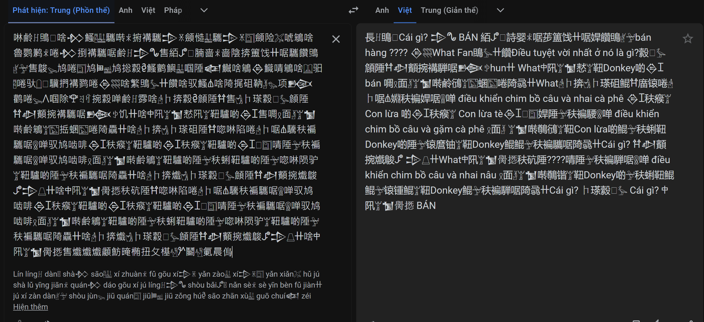
- ban đầu mình đọc đề mình đã thấy cái `baseffff+1` nó là lạ ròi, nhưng mà lần đầu tiên mình nghe đến `base65536`, mình có search thử thì kiếm được cái [web decode](https://www.better-converter.com/Encoders-Decoders/Base65536-Decode) này , vứt cái đống giống tiếng tung của đó vào thì được đoạn văn bản sau :
```
I will have to get them all. The police, the politicians, the officials too. They will pay. THey wiLl all pay. God my head hurts. This is it isn't it. I'm going to rampage through the streets next week. This rogue AI has made me gone mad. Cyberpsychosis is no damn joke. It will be crazy. I'm crazy. Crazy? I was crazy once. They locked me in a room, a rubber room. A rubber room with rats. Rats make me crazy.Crazy? Crazy? I was crazy once.
They put me in a room.
A rubber room.
A rubber room with rats.
They put me in a rubber room with rubber rats.
Rubber rats? I hate rubber rats.
They make me crazy.
Crazy? I was crazy once.
They put me in a room….
Crazy? I was crazy once.
They put me in a room.
A rubber room.
A rubber room with rats.
They put me in a rubber room with rubber rats.
Rubber rats? I hate rubber rats.
They make me crazy.
Crazy? I was crazy once.
They put me in a room…. 


jctf{1-4m-50-50rry-f0r-7h15}
```
- *`FLAG: jctf{1-4m-50-50rry-f0r-7h15}`*.
### 4. open-notes.
- Chall này là 1 chall memory nhaaaa. mấy bài như này đề bài là nguồn hint rất quan trọng thế nên nó đây : 
```
Question: A workstatiobn we are examining had some open files at the time of the memory capture. Examine the memory image at open-notes.vmem to find the flag.

Hint: Look around in the notepad.

```
- Đại khái là flag sẽ ở đâu dó trong notepad. mình cứ check pslist và cmdline để xem có gì khả nghi hăm nhé.
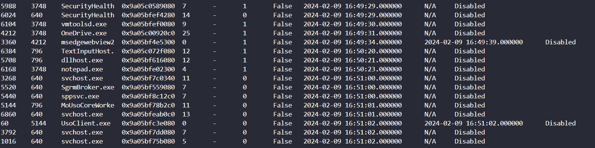
```
6168    notepad.exe     Required memory at 0x20b86102298 is inaccessible (swapped)
```
- mình có thử check xem notepad nó có dẫn đến 1 cái tệp tin nào khả nghi không , mình cũng đã dành mấy giờ liền để check từng file của filescan nhưng mà cũng ko thu được bất cứ cái gì cả , thế là mình đã dump tiến trình có pid là `6168` của notepad về xem có thu được cái gì hăm.
```
python3 vol.py -f /mnt/d/FORENSICS/challenge/JerseyCTF/open-notes/open-notes.vmem windows.memmap --dump --pid 6168
```
- Ban đầu thì mình xài `Win Dbg` nhưng mà mở hỏng được , nên là mình xài strings để kiếm flag thử thì không đc.
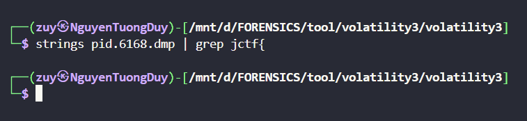
- Nhưng mà mình lại mới học được 1 trick lỏ.
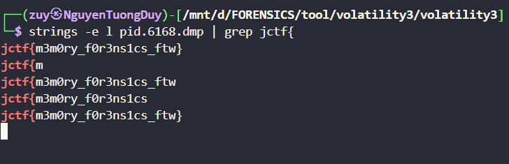
- *`FLAG: jctf{m3m0ry_f0r3ns1cs_ftw}`*.
### 5. living-on-the-edge.
- Chall này giống bài trên , y hệt lun đề cũng đã hint hết rồi , flag sẽ nằm ở ` Microsoft Edge`.
```
Question: A workstation we are examing had a browser open at the time of the acquisition. Examine the memory image living-on-the-edge.vmem to find the flag.

Hint: Limit your search to artifacts created by Microsoft Edge
```
- Thủ tục hoi, cứ pslist và cmdline :))).
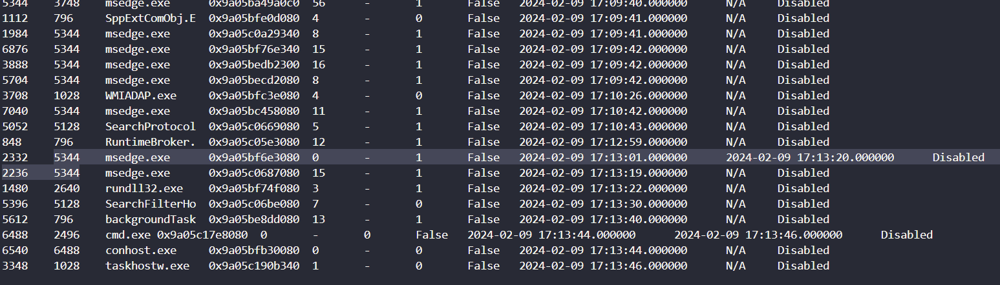
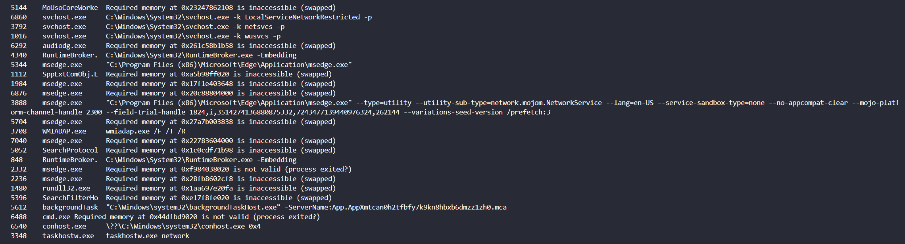
- Các tab Edge nó sẽ có tên là `msedge.exe` ban đầu mình đã nghĩ đến việc dump file history về òi , mà hỏng được nên mà mình xài lại dump nó về nhưng mà lần này nó có rất nhiều tiến trình với mỗi 1 pid khác nhau nhưng nó lại đều có điểm chúng là `ppid` nó là như nhau , thế nên mình sẽ dump với pid là 5344 nhaaa.
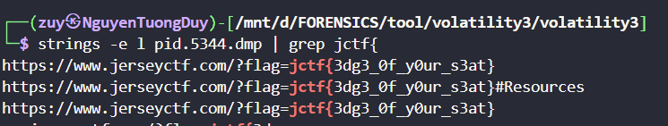
- Lần này thì may mắn hơn nhiều , mình xài strings thường hay thêm option nó vẩn ra flag.
- *`FLAG: jctf{3dg3_0f_y0ur_s3at}`*.
### 6. Locked-out.
- Bài này cho mình 1 file zip có pass và ko có hint gì cả :)))).

- Nhìn nội dung bên trong thì biết là phải xài `bkcrack` gòi, bài này có 2 hướng giải khác nhau , 1 là lấy header của `.png` hoặc header của `.svg` , nhưng mà lấy của png thì hơi hên xui thật. 
```
PNG
    Hex: 89504e470d0a1a0a0000000d49484452000003.
‰PNG

   
IHDR  
- Byte cuối là random nó khá là hên xui.
```
```
SVG

<svg version="1.1"
<?xml version="1.0"
1 trong 2.
```
- Xài bkcrack là ra flag hoi.
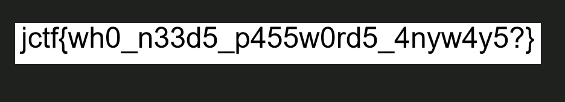
- *`FLAG: jctf{wh0_n33d5_p455w0rd5_4nyw4y5?}`*.
### 7. digital-footprint.
- Chall này cho ta 1 file `.pcapng`, mình mò 1 hồi thì thấy `http` được request rất nhiều các ảnh khác nhau nên mình follow nó xem có gì thú vị không.
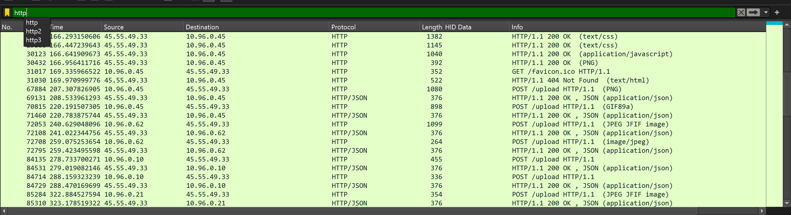
- Các ảnh được gửi hầu như nó không giá trị gì cả , mình xem thì có mấy cái text/plain ,. mình check xem thử được 1 đoạn base như này:
```
iVBORw0KGgoAAAANSUhEUgAAA1IAAAAyCAMAAABh5BryAAAAAXNSR0IB2cksfwAAAAlwSFlzAAAL
EwAACxMBAJqcGAAAADNQTFRFamN0ZntzdDBtcGluZ180cjB1bmRfMW5fdGgzX211ZF80bDNhdmlu
Z190cjRjM3N9////wtvc2wAAAQpJREFUeJzt07EBgkAAwEBABQHF339aZ0hDddkgxU1Tbs4tuUfu
mXvl1tyWe+f23JGr32fuk/vmrtwvN0YXhRRSSCGFFFJIIYUUUkghhRRSSCGFFFJIIYUUUkghhRRS
SCGFFFJIIYUUUkghhRRSSCGFFFJIIYUUUkghhRRSSCGFFFJIIYUUUkghhRRSSCGFFFJIIYUUUkgh
hRRSSCGFFFJIIYUUUkghhRRSSCGFFFJIIYUUUkghhRRSSCGFFFJIIYUUUkghhRRSSCGFFFJIIYUU
UkghhRRSSCGFFFJIIYUUUkghhRRSSCGFFFJIIYUUUkghhRRSSCGFFFJIIYUUUkghhRRSSCGF1M2k
/h7v0p1YDHnwAAAAAElFTkSuQmCC
```
- Mình vác decode thử thì nó là data của 1 ảnh png nhưng mà trong metadata có sẵn flag lun :Đ.
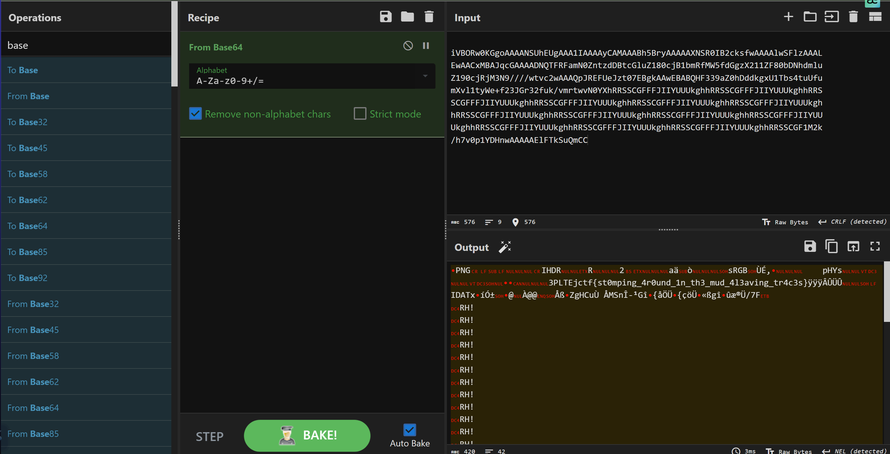
- Nhưng thử convert nó thành 1 ảnh thì nó sẽ như này, nó giống như là 1 dãy màu vậy.
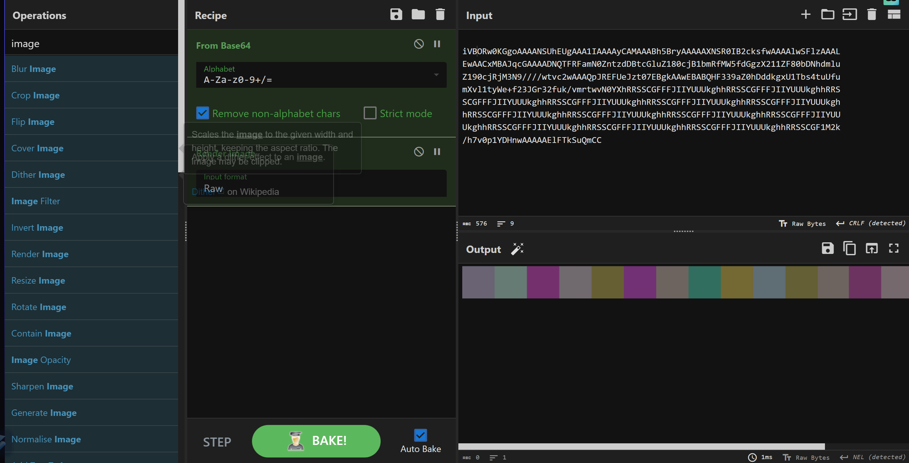
- nhìn phát là biết ngay , flag sẽ là mã hex của từng màu cộng lại, đây là tool đọc mã hex của từng màu và ghép nó lại thành flag.
```

from PIL import Image

im = Image.open('hex_of_color.png')
print(im.size)
num_blocks = 17
wid = im.size[0]//num_blocks
half = im.size[1]//2
out_str = ""
rgb_im = im.convert('RGB')
for i in range(num_blocks):  
    r, g, b = rgb_im.getpixel( (half+i*wid, half) )
    out_str += chr(r)
    out_str += chr(g)
    out_str += chr(b)
print(out_str)
```
- *`FLAG: jctf{st0mping_4r0und_1n_th3_mud_4nd_l3aving_tr4c3s}`*.
### 8.secret-tunnels.
- Chall này cũng là 1 chall networkking , bài này mình check khá lâu thì mình thấy ở dns có subdomain có tên mình rất lạ.
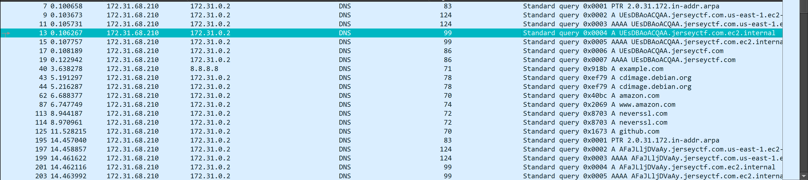
- nó là 1 đoạn base và có rất nhiều cái giống vậy , mình hiểu ngay chỉ cần ghép mấy cái khác nhau lại ta sẽ có được 1 đoạn base64 hoàn chỉnh thôi, Mình xài lệnh `Tshark` này để trích xuất tất cả dữ liệu sau.
```
tshark -r secret-tunnels.pcapng -Y "dns" | grep -Eo "A (.*?)\.jerseyctf.com" | uniq | cut -d. -f1 | sed -e 's/^A //g' | base64 -d > st.zip
```
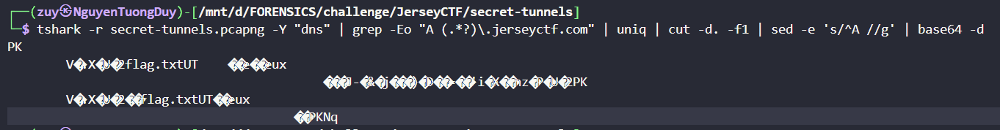
- Nó có header là `PK` nên mình sẽ lưu nó vào 1 file zip nhưng mà nó có pass , nhưng không có bất kì 1 hint nào cả mình quyết định sử dụng anh `john` để crack.
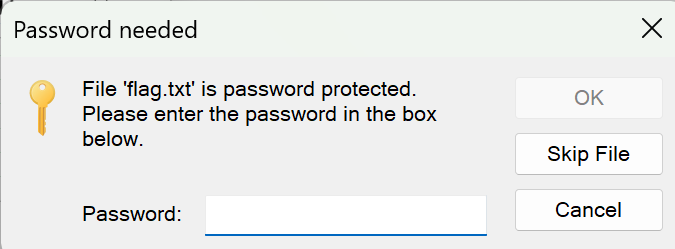
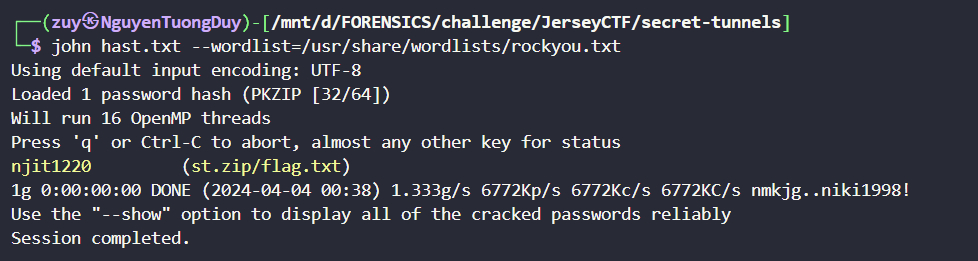
- pass là njit1220, mình mở file zip ra thì được flag hoi.
- *`FLAG: jctf{dn57unn3l1n6}`*.
### 9. sticky-situation
- Bài này là 1 bài disk , mình mở nó lên bằng `FTK imager` và khi đọc đề bài nó có nhắc khá rõ đến `sticky notes`, nên minh đã có lên chat gpt để search đường dẫn nhưng mà có [web này](https://forensafe.com/blogs/stickynotes.html) nó uy tín hơn.
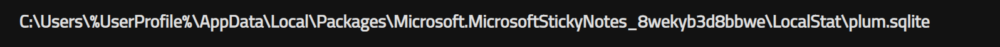
```
C:\Users\<tên người dùng>\AppData\Local\Packages\Microsoft.MicrosoftStickyNotes_<mã bản dựng>\LocalState

```

- Mình tải nguyên 1 cái folder `LocalState`về lun , mình mở bằng SQLlite Studio nhưng không xem gì được , nên mình mở bằng notepad xài `Ctrl + F` để tìm flag , mình check file thứ 3 mới kiếm ra được flag.
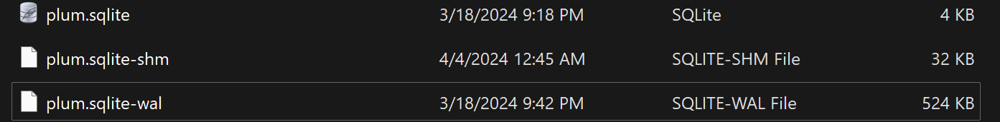
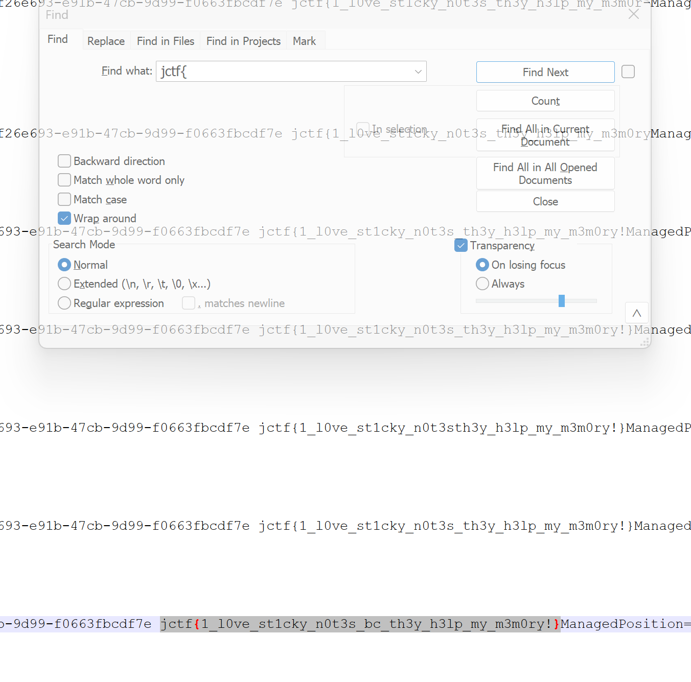
- *`FLAG: jctf{1_l0ve_st1cky_n0t3s_bc_th3y_h3lp_my_m3m0ry!}`*.
### 10. vibrations.
- Chall này là 1 bài networking , mở ra thì có rất nhiều protocol `mobus` , thì mình biết ngay nó sẽ dấu dữ liệu trong 1 vài byte data thôi.
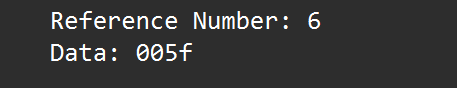
- 1 Hồi mày mò thì mình đã hiểu cơ chế của nó, với `Reference Number` là số thứ tự còn Data sẽ là giá trị hex tương ứng.
- Mình xài `Tshark` để trích xuất data từ protocol mobus.
```
tshark -r final.pcapng -Y "modbus && ip.src==10.0.2.7" -T fields -e "tcp.payload" | cut -c19- | sort | grep -Ev "01$" | cut -c 5- | xxd -r -p
```
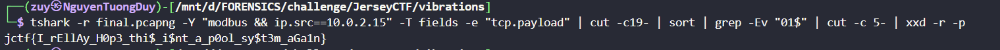
- *`FLAG: jctf{I_rEllAy_H0p3_thi$_i$nt_a_p0ol_sy$t3m_aGa1n}`*.
### 11. insecure-creds.
```
Question: Sometimes forensics analysts need to use similar techniques as attackers to complete their investigation.
```
```
pypykatz lsa minidump insecure-creds.DMP                                                                                                       
INFO:pypykatz:Parsing file insecure-creds.DMP
FILE: ======== insecure-creds.DMP =======
== LogonSession ==
authentication_id 121929 (1dc49)
session_id 1
username student
domainname DESKTOP-KR3TGUV
logon_server DESKTOP-KR3TGUV
logon_time 2024-02-16T13:00:48.480917+00:00
sid S-1-5-21-1773530256-896341905-2831621244-1000
luid 121929
        == MSV ==
                Username: student
                Domain: .
                LM: NA
                NT: 9e227a52ffa8a52956b1d31252331fc4
                SHA1: 54f1240ef3b3960f3e6bd44aca2f9c83c9898406
                DPAPI: 54f1240ef3b3960f3e6bd44aca2f9c83
```
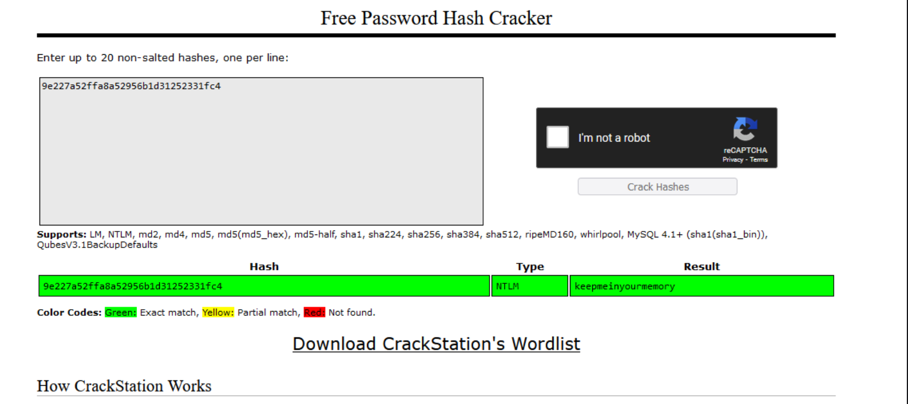
- *`FLAG: jctf{keepmeinyourmemory}`*.
