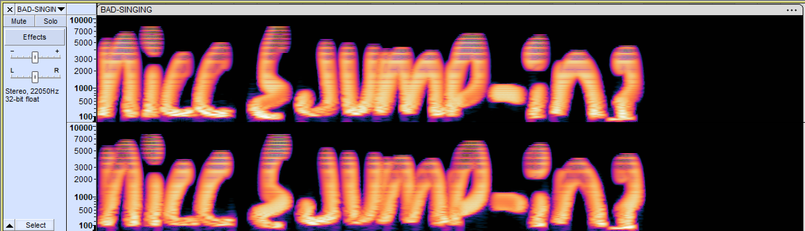
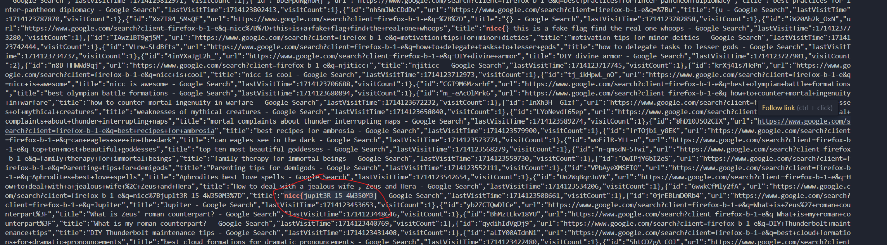
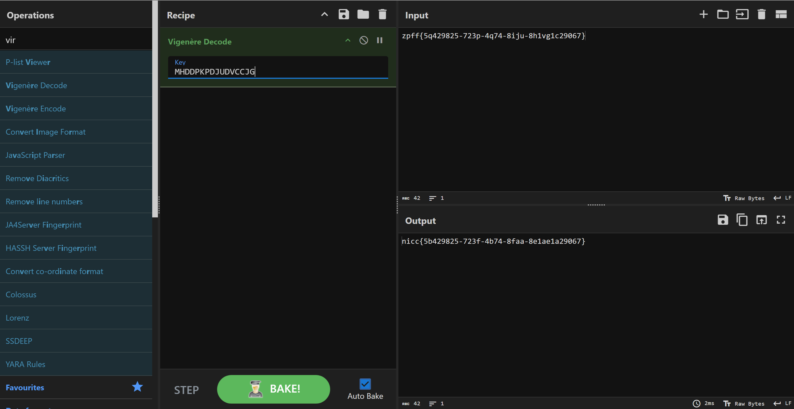
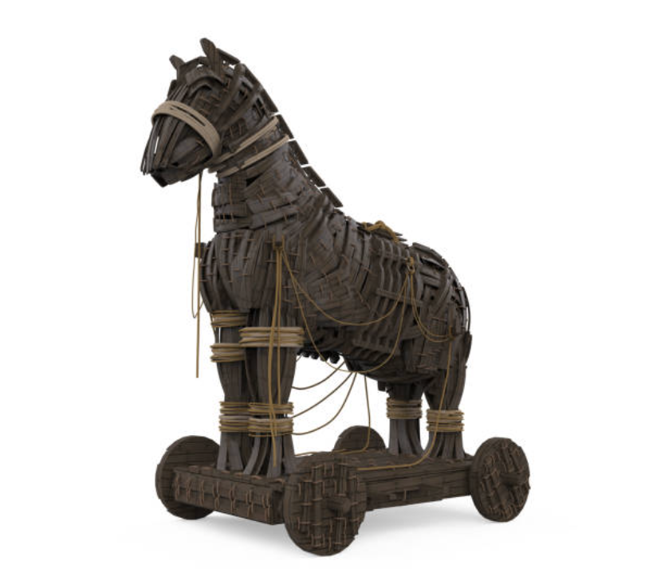
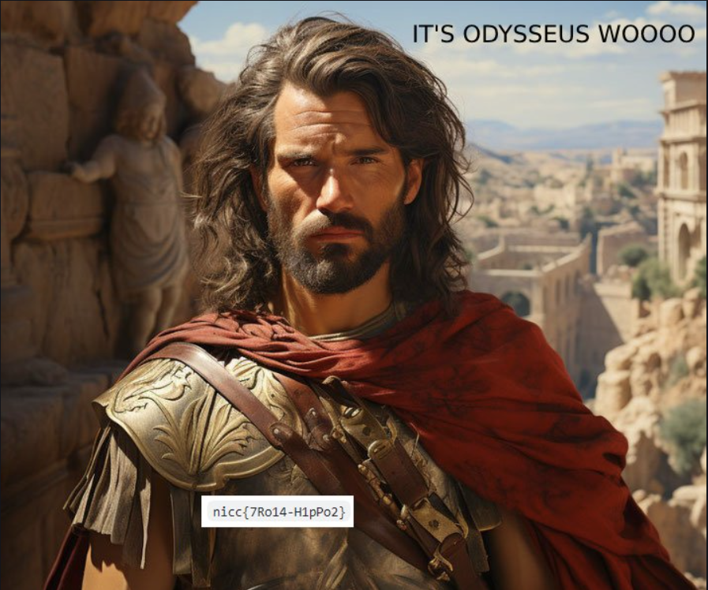
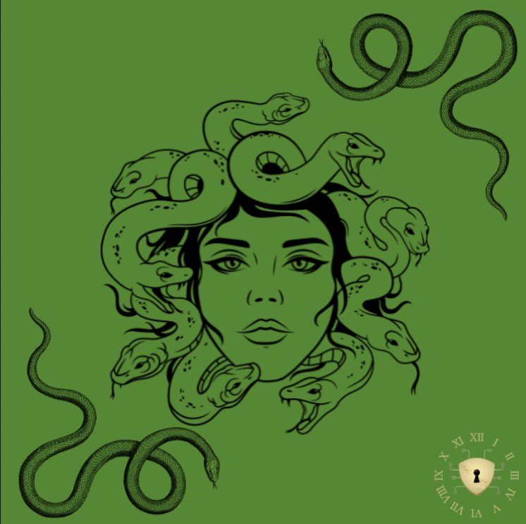
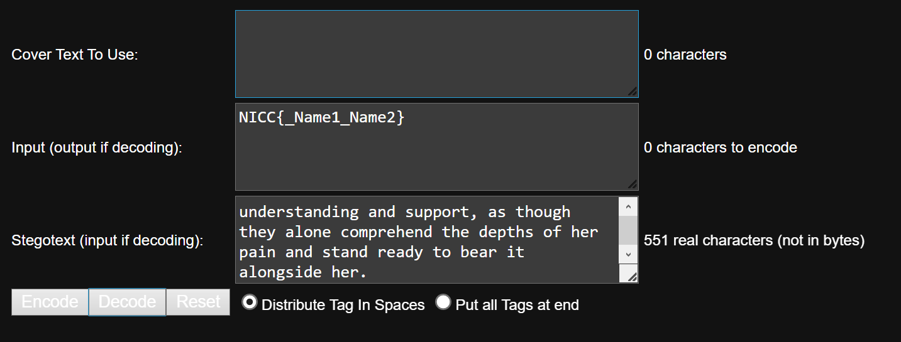

# Springforward CTF 2024.
### I. Bad-Singing.
- Chall này cho mình 1 file wav , mình nghe thử thì nó lên xuống khá thất thường , nên mình cho vào `Audacity` thì ra lun flag.

- *`FLAG: nicc{jump_in}`*.
### II. Browsing-History.
- Chall này cho mình 1 file `.json` bên trong là các url , mình xài string là ra lun flag.

- *`FLAG: nicc{jup1t3R-15-4W350M3}`*.
### III. cool-songs.
- Bài này mình nhận được 2 file `.mid` , mình có research thử thì nó là :
```
File MIDI (Musical Instrument Digital Interface) là một loại tập tin âm nhạc định dạng sử dụng cho việc lưu trữ và chuyển giao dữ liệu âm nhạc giữa các thiết bị âm nhạc sử dụng chuẩn MIDI. File MIDI không chứa âm thanh thực sự, mà chứa các dữ liệu về việc chơi nhạc như gõ nhạc, độ cao
```
- Mình kiếm được cái [tool này](https://github.com/maxcruz/stegano_midi) , nó cho phép mình extract được data trong mấy file midi này.
```
$ python stegano-midi.py --reveal --file=/mnt/d/FORENSICS/challenge/NICC_CTF/cool-songs/coolsong1.mid
Reveal message in /mnt/d/FORENSICS/challenge/NICC_CTF/cool-songs/coolsong1.mid

zpff{5q429825-723p-4q74-8iju-8h1vg1c29067}

$ python stegano-midi.py --reveal --file=/mnt/d/FORENSICS/challenge/NICC_CTF/cool-songs/coolsong2.mid
Reveal message in /mnt/d/FORENSICS/challenge/NICC_CTF/cool-songs/coolsong2.mid

MHDDPKPDJUDVCCJG
```
- Xài tool trên thì mình được 2 đoạn này `zpff{5q429825-723p-4q74-8iju-8h1vg1c29067}` và `MHDDPKPDJUDVCCJG`. Đoạn đầu chắc chắn là flag bởi vì nó có `{}` nhưng đã bị encode còn đoạn 2 mình nghĩ nó sẽ là key, mình đã đoán ngay nó là mã `Vigenère`.

- *`FLAG: nicc{5b429825-723f-4b74-8faa-8e1ae1a29067}`*.
### IV. Horsing-Around-at-Troy.

- Chall này cho mình 1 file ảnh `.jpg` nên là mình có thử qua binwalk thì nó có rất nhiều ảnh png khác.
```
$ binwalk totally-innocent-horse.jpg 

DECIMAL       HEXADECIMAL     DESCRIPTION
--------------------------------------------------------------------------------
0             0x0             JPEG image data, JFIF standard 1.01
30            0x1E            TIFF image data, little-endian offset of first image directory: 8
5511          0x1587          LZMA compressed data, properties: 0xC0, dictionary size: 0 bytes, uncompressed size: 200 bytes
29536         0x7360          Zip archive data, at least v2.0 to extract, compressed size: 515586, uncompressed size: 515438, name: surprise/greek - Copy (10).png
545182        0x8519E         Zip archive data, at least v2.0 to extract, compressed size: 515586, uncompressed size: 515438, name: surprise/greek - Copy (11).png
1060828       0x102FDC        Zip archive data, at least v2.0 to extract, compressed size: 515586, uncompressed size: 515438, name: surprise/greek - Copy (12).png
1576474       0x180E1A        Zip archive data, at least v2.0 to extract, compressed size: 515586, uncompressed size: 515438, name: surprise/greek - Copy (13).png
2092120       0x1FEC58        Zip archive data, at least v2.0 to extract, compressed size: 515586, uncompressed size: 515438, name: surprise/greek - Copy (14).png
2607766       0x27CA96        Zip archive data, at least v2.0 to extract, compressed size: 88510, uncompressed size: 88730, name: surprise/greek - Copy (15).png
2696336       0x292490        Zip archive data, at least v2.0 to extract, compressed size: 515586, uncompressed size: 515438, name: surprise/greek - Copy (17).png
3211982       0x3102CE        Zip archive data, at least v2.0 to extract, compressed size: 515586, uncompressed size: 515438, name: surprise/greek - Copy (18).png
3727628       0x38E10C        Zip archive data, at least v2.0 to extract, compressed size: 515586, uncompressed size: 515438, name: surprise/greek - Copy (2).png
4243273       0x40BF49        Zip archive data, at least v2.0 to extract, compressed size: 515586, uncompressed size: 515438, name: surprise/greek - Copy (3).png
4758918       0x489D86        Zip archive data, at least v2.0 to extract, compressed size: 515586, uncompressed size: 515438, name: surprise/greek - Copy (4).png
5274563       0x507BC3        Zip archive data, at least v2.0 to extract, compressed size: 515586, uncompressed size: 515438, name: surprise/greek - Copy (5).png
5790208       0x585A00        Zip archive data, at least v2.0 to extract, compressed size: 515586, uncompressed size: 515438, name: surprise/greek - Copy (6).png
6305853       0x60383D        Zip archive data, at least v2.0 to extract, compressed size: 515586, uncompressed size: 515438, name: surprise/greek - Copy (7).png
6821498       0x68167A        Zip archive data, at least v2.0 to extract, compressed size: 515586, uncompressed size: 515438, name: surprise/greek - Copy (8).png
7337143       0x6FF4B7        Zip archive data, at least v2.0 to extract, compressed size: 515586, uncompressed size: 515438, name: surprise/greek - Copy (9).png
7852788       0x77D2F4        Zip archive data, at least v2.0 to extract, compressed size: 515586, uncompressed size: 515438, name: surprise/greek - Copy.png
8368429       0x7FB12D        Zip archive data, at least v2.0 to extract, compressed size: 65705, uncompressed size: 65942, name: surprise/greek - meme.jpg
8434189       0x80B20D        Zip archive data, at least v2.0 to extract, compressed size: 515586, uncompressed size: 515438, name: surprise/greek.png
8951237       0x8895C5        End of Zip archive, footer length: 22
```
- Mình extract nó ra check từng ảnh thì ảnh copy (15) nó có lun flag.

- *`FLAG: nicc{7Ro14_H1pPo2}`*.
### V. Her-Eyes.

- Chall này cho mình 1 ảnh `.png` , sau khi check các tool cơ bản ko thấy gì thì bản thân thấy 1 hiện tượng lạ ở đây :
```
$ zsteg -a Her-Eyes-Her-Family.png 
b2,r,lsb,xy         .. text: ["U" repeated 255 times]
b2,g,lsb,xy         .. text: ["U" repeated 159 times]
b2,b,lsb,xy         .. file: OpenPGP Secret Key
b2,rgb,lsb,xy       .. text: "9UUUUUUUUUUUUUUUUUUUUUUUUUUUUUUUUUUUUUUUUUUUUUUUUUUUUUUUUUUUUUUUUUUUUUUUUUUUUUUUUUUUUUUUUUUUUUUUUUUUUUUUUUUUUUUUUUUUUUUUUUUUUUUUUUUUUUUUUUUUUUUUUUUUUUUUUUUUUUUUUUUUUUUUUUUUUUUUUUUUUUUUUUUUUUUUUUUUUUUUUUUUUUUUUUUUUUUUUUUUUUUUUUUUUUUUUUUUUUUUUUUUUUUUUUUUUUUU"
b2,bgr,lsb,xy       .. text: ["U" repeated 255 times]
b3,r,lsb,xy         .. file: OpenPGP Secret Key
b4,r,lsb,xy         .. text: "EUUUUUUUUUUUUUUUUUUUUUUUUUUUUUUUUUUUUUUUUUUUUUUUUUUUUUUUUUUUUUUUUUUUUUUUUUUUUUUUUUUUUUUUUUUUUUUUUUUUUUUUUUUUUUUUUUUUUUUUUUUUUUUUUUUUUUUUUUUUUUUUUUUUUUUUUUUUUUUUUUUUUUUUUUUUUUUUUUUUUUUUUUUUUUUUUUUUUUUUUUUUUUUUUUUUUUUUUUUUUUUUUUUUUUUUUUUUUUUUUUUUUUUUUUUUUUUU"
b4,b,lsb,xy         .. text: "eUUUUUUUUUUUUUUUUUUUUUUUUUUUUUUUUUUUUUUUUUUUUUUUUUUUUUUUUUUUUUUUUUUUUUUUUUUUUUUUUUUUUUUUUUUUUUUUUUUUUUUUUUUUUUUUUUUUUUUUUUUUUUUUUUUUUUUUUUUUUUUUUUUUUUUUUUUUUUUUUUUUUUUUUUUUUUUUUUUUUUUUUUUUUUUUUUUUUUUUUUUUUUUUUUUUUUUUUUUUUUUUUUUUUUUUUUUUUUUUUUUUUUUUUUUUUUUU"
b6,b,lsb,xy         .. file: OpenPGP Public Key
b6,bgr,lsb,xy       .. file: OpenPGP Public Key
b7,g,msb,xy         .. file: zlib compressed data
b8,r,lsb,xy         .. text: "DEEEEEEEEEEEEEEEEEEEEEEEEEEEEEEEEEEEEEEEEEEEEEEEEEEEEEEEEEEEEEEEEEEEEEEEEEEEEEEEEEEEEEEEEEEEEEEEEEEEEEEEEEEEEEEEEEEEEEEEEEEEEEEEEEEEEEEEEEEEEEEEEEEEEEEEEEEEEEEEEEEEEEEEEEEEEEEEEEEEEEEEEEEEEEEEEEEEEEEEEEEEEEEEEEEEEEEEEEEEEEEEEEEEEEEEEEEEEEEEEEEEEEEEEEEEEEEE"
b8,b,lsb,xy         .. text: "&%%%%%%%%%%%%%%%%%%%%%%%%%%%%%%%%%%%%%%%%%%%%%%%%%%%%%%%%%%%%%%%%%%%%%%%%%%%%%%%%%%%%%%%%%%%%%%%%%%%%%%%%%%%%%%%%%%%%%%%%%%%%%%%%%%%%%%%%%%%%%%%%%%%%%%%%%%%%%%%%%%%%%%%%%%%%%%%%%%%%%%%%%%%%%%%%%%%%%%%%%%%%%%%%%%%%%%%%%%%%%%%%%%%%%%%%%%%%%%%%%%%%%%%%%%%%%%%"
b4,rgb,msb,xy,prime .. file: OpenPGP Public Key
b5,r,msb,xy,prime   .. file: OpenPGP Secret Key
b6,b,lsb,xy,prime   .. file: OpenPGP Secret Key
b6,bgr,lsb,xy,prime .. file: OpenPGP Secret Key
b1,b,lsb,yx         .. text: "8t?SJjMbK"
b1,rgb,lsb,yx       .. text: "d'rUBT4DcF4nEETF"
b2,r,lsb,yx         .. file: ARC archive data, crunched
b2,g,lsb,yx         .. text: ["U" repeated 111 times]
b2,b,lsb,yx         .. text: "11422321"
b2,rgb,lsb,yx       .. zlib: data="Her \xF3\xA0\x81\x8Eeyes \xF3\xA0\x81\x89stare \xF3\xA0\x81\x83at \xF3\xA0\x81\x83you \xF3\xA0\x81\xBBwatching \xF3\xA0\x81\x9Fyou \xF3\xA0\x81\x8Eclosely, \xF3\xA0\x81\xA1she \xF3\xA0\x81\xADstarts \xF3\xA0\x81\xA5cryin...", offset=61, size=279
b3,r,lsb,yx         .. file: PGP Secret Sub-key -
b4,r,lsb,yx         .. text: "EfDVTfTGDfGVEGFGEGFVDVFUDGGGDVDGDGDWVGUVWeUGVWDVFtFTDDVDVegWFdfEGDfUFtEgFDvuWGEFgVUVuVFfEeFvvwFuTfwEUugvVfvTtWEdfgeTggTuWffweGfwVFUeUUFDgGDEggGUVWUTUDTTEWdtFVEuWTwvUFETddwgdEufvuvduwfvdTdTfDVfGdTEwDfwGUVtFvfDTWWTEtvFTTFtGFDWvfTwDduvgTDWVgFtfvEVdFdGdTGGWEwt"
b4,r,msb,yx         .. text: "\"jb.b*\"\"j\"j"
b4,b,lsb,yx         .. text: "gFVGVEVEWFWFGDwDwDGEGEGTGFGFGGGFGEfDVTfTGvUEtDDgEudTtefTFEwVTGFuduUtDuUuvUwwgeDwTGuTEFevFgUTueevUwfuVDUUtWGWTGevGweUwFwUwfuegUtTgvwUdEgweuwTFVUwVeTVEeGDtTDDtUFFEVWdFwVWFUTTTEVdUTTVDVVFvuUFwFewUGDfGVVuwTwUEdDWUedtueffWGtTUWvTFwTfguEffuWwEedUGDvVGttVEDuGGVdV"
b4,b,msb,yx         .. text: "**j\"jjbn"
b4,rgb,msb,yx       .. text: "fmR*-Zbi"
b4,bgr,msb,yx       .. text: "jmZ\"-Rji"
b6,g,msb,yx         .. text: "4AS4AS4AP4AP4AP4A"
b6,b,lsb,yx         .. file: OpenPGP Public Key
b6,bgr,lsb,yx       .. file: OpenPGP Public Key
b8,r,lsb,yx         .. text: "DEFFDDEFEDFFEDDGDDFFDGEFDEDGDFDGDEDGDFEFDDEFDFEEDDDGDGDGDDEFDDDGDDDGDDEGEFDGEEEFEGFEEEDGEFEGDDEFDFGDDFEDDDDDEFDDEFFEFGEGDFFDFFDEDGDDFFEEDFGDDEFGDFDDGFGEEGDGDEDFFGEFEEEFGEEFDFFFDEFEDFGFGFGGDFGEEDFFGGDEEEGEFGGFEFFFGFEDGDEGDEFDFFFGFEEDFGFGEDGEEGFFFFGGFEDGFFGG"
b8,b,lsb,yx         .. text: "&'$&%&$'%&$%%&$%%'$&%'$&$'$$''$$''$$$'$%$'$%$'%$$'$&$'$&$'$'$'$&$'$%&&$$%&%$&&%$$''&%%$%'$$$$$&'$%'%&$%$'$&%&&%$$&$%''%&%$$'$&'%&$'%%%'$$$'%%%'%'&%%''''&'&%$$''%$$''%%$$%$&&%'&$&&'%%%$'%&%&%'&%%''&&'%%&$$%%%%'$%'$'%'%$$'&%'&$'''&%%%''$&''%%''&&'%&%&'%%'$%$"
b2,r,lsb,yx,prime   .. text: ["U" repeated 229 times]
b2,g,lsb,yx,prime   .. text: "(UUUUUUUUUUUUUUUUUUUUUUUUUUUUUUUUUUUUUUUUUUUUUUUUUUUUUUUUUUUUUUUUUUUUUUUUUUUUUUUUUUUUUUUUUUUUUUUUUUUUUUUUUUUUUUUUUUUUUUUUUUUUUUUUUUUUUUUUUUUUUUUUUUUUUUUUUUUUUUUUUUUUUUUUUUUUUUUUUUUUUUUUUUUUUUUUUUUUUUUUUUUUUUUUUUUUUUUUUUUUUUUUUUUUUU"
b2,b,lsb,yx,prime   .. text: ["U" repeated 229 times]
b2,rgb,lsb,yx,prime .. text: ["U" repeated 177 times]
b2,bgr,lsb,yx,prime .. text: ["U" repeated 177 times]
b3,b,lsb,yx,prime   .. file: OpenPGP Public Key
b4,r,lsb,yx,prime   .. text: "fFdFfvFWdwfVfDfTdeVfVTuduuwedGutedUddFFvwdFdVDfGvTevuUUUUUUUUUUUUUUUUUUUUUUUUUUUUUUUUUUUUUUUUUUUUUUUUUUUUUUUUUUUUUUUUUUUUUUUUUUUUUUUUUUUUUUUUUUUUUUUUUUUUUUUUUUUUUUUUUUUUUUUUUUUUUUUUUUUUUUUUUUUUUUUUUUUUUUUUUUUUUUUUUUUUUUUUUUUUUUUUUUUUUUUUUUUUUUUUUUUUUUUUUUU"
b4,b,lsb,yx,prime   .. text: "FgVvgGuGwTddTEfUEwGEueevuuuuwvdDFvVVegFuTgGgVUdGGETVEUUUUUUUUUUUUUUUUUUUUUUUUUUUUUUUUUUUUUUUUUUUUUUUUUUUUUUUUUUUUUUUUUUUUUUUUUUUUUUUUUUUUUUUUUUUUUUUUUUUUUUUUUUUUUUUUUUUUUUUUUUUUUUUUUUUUUUUUUUUUUUUUUUUUUUUUUUUUUUUUUUUUUUUUUUUUUUUUUUUUUUUUUUUUUUUUUUUUUUUUUUU"
b7,bgr,msb,yx,prime .. text: "IPq9\"&GD"
b8,r,lsb,yx,prime   .. text: "FFDFFDDFFFGFDFEGFDGGFFEFFFDDFFEDFDFEEFFFEFEDGEFDGEGEGGFEFDDGGEGDFEFDEEFDFDDFDFGFGGFDDFFDEFDDFFDGGFEDFEGFGEEEEEEEEEEEEEEEEEEEEEEEEEEEEEEEEEEEEEEEEEEEEEEEEEEEEEEEEEEEEEEEEEEEEEEEEEEEEEEEEEEEEEEEEEEEEEEEEEEEEEEEEEEEEEEEEEEEEEEEEEEEEEEEEEEEEEEEEEEEEEEEEEEEEEEE"
b8,r,msb,yx,prime   .. text: "bb\"bb\"\"bbb"
b8,b,lsb,yx,prime   .. text: "$&&'%&'&&'$''%$'''%$&$&$%$$%&&%%$%''$'$%'%&%&%'&'%'%'%'%'''&&$$$$&'&%&%&&%&'$&'%%$&'$'&'%&%%&$$'$'$%%$%&$%%%%%%%%%%%%%%%%%%%%%%%%%%%%%%%%%%%%%%%%%%%%%%%%%%%%%%%%%%%%%%%%%%%%%%%%%%%%%%%%%%%%%%%%%%%%%%%%%%%%%%%%%%%%%%%%%%%%%%%%%%%%%%%%%%%%%%%%%%%%%%%%%%%%%%%"
b8,bgr,msb,yx,prime .. text: "Qb$Q\"dQb"
b2,r,lsb,Xy         .. text: "UUUUUUUUUUUUUUUUUUUUUUUUUUUUUUUUUUUUUUUUUUUUUUUUUUUUUUUUUUUUUUUUUUUUUUUUUUUUUUUUUUUUUUUUUUUUUUUUUUUUUUUUUUUUUUUUUUUUUUUUUUUUUUUUUUUUUUUUUUUUUUUUUUUUUUUUUUUUUUUTUUUUUUUUUUUUUUUUUUUUUUUUUUUUUUUUUUUUUUUUUUUUUUUUUUUUUUUUUUUUUUUUUUUUUUUUUUUUUUUUUUUUUUUUUUUUUUUU"
b2,g,lsb,Xy         .. text: "UUUUUUUUUUUUUUUUUUUUUUUUUUUUUUUUUUUUUUUUUUUUUUUUUUUUUUUUUUUUUUUUUUUUUUUUUUUUUUUUUUUUUUUUUUUUUUUUUUUUUUUUUUUUUUUUUUUUUUUUUUUUUUUUUUUUUUUUUUUUUUUUUUUUUUUUUUUUUUUWUUUUUUUUUUUUUUUUUUUUUUUUUUUUUUUUUUUUUUUUUUUUUUUUUUUUUUUUUUUUUUUUUUUUUUUUUUUUUUUUUUUUUUUUUUUUUUUU"
b2,b,lsb,Xy         .. text: "UUUUUUUUUUUUUUUUUUUUUUUUUUUUUUUUUUUUUUUUUUUUUUUUUUUUUUUUUUUUUUUUUUUUUUUUUUUUUUUUUUUUUUUUUUUUUUUUUUUUUUUUUUUUUUUUUUUUUUUUUUUUUUUUUUUUUUUUUUUUUUUUUUUUUUUUUUUUUUUVUUUUUUUUUUUUUUUUUUUUUUUUUUUUUUUUUUUUUUUUUUUUUUUUUUUUUUUUUUUUUUUUUUUUUUUUUUUUUUUUUUUUUUUUUUUUUUUU"
b2,r,lsb,Xy,prime   .. file: VISX image file
b2,g,lsb,Xy,prime   .. file: VISX image file
b2,b,lsb,Xy,prime   .. file: VISX image file
b2,rgb,lsb,Xy,prime .. file: VISX image file
b2,bgr,lsb,Xy,prime .. text: "UUUUUUUUUUUUUUUUUUUUUUUUUUUUUUUUUUUUUUUUUUUUUUUUUUUUUUUUUUUUUUUUUUUUUUUUUUUUUUUUUUUUUUUUUUUUUUUUUUUUUUUUUUUUUUUUUUUUUUUUUUUUUUUUUUUUUUUUUUUUUUUUUUUUUUUUUU\\UUUUUUUUUUUUUUUUUUUUUUUUUUUUUUUUUUUUUUUUUUUUUUUUUUUUUUUUUUUUUUUUUUUUUUUUUUUUUUUUUUUUUUUUUUUUUUUUUUUUU"
b4,g,lsb,Xy,prime   .. file: OpenPGP Public Key
b4,g,msb,Xy,prime   .. file: OpenPGP Public Key
b4,b,lsb,Xy,prime   .. text: "UUUUUUUUUUUUUUUUUUUUUUUUUUUUUUUUUUUUUUUUUUUUUUUUUUUUUUUUUUUUUUUUUUUUUUUUUUUUUUUUUUUUUUUUUUUUUUUUUUUUUUUuUUUUUUUUUUUUUUUUUUUUUUUUUUUUUUUUUUUUUUUUUUUUUUUUUUUUUUUUUUUUUUUUUUUUUUUUUUUUUUUUUUUUUUUUUUUUUUUUUUUUUUUUUUUUUUUUUUUUUUUUUUUUUUUUUUUUUUUUUUUUUUUUUUUUUUUU"
b5,b,msb,Xy,prime   .. file: OpenPGP Secret Key
b6,b,lsb,Xy,prime   .. file: OpenPGP Secret Key
b8,b,lsb,Xy,prime   .. text: "%%%%%%%%%%%%%%%%%%%%%%%%%%%%%%%%%%%%%%%%%%%%%%%%%%%%%%%%%%%%%%%%%%%%%%%%%%%%%%%%%%%%%%%%%%%%%%%%%%%%%%%%%%%%%%%%%%%%%%%%%%%%%%%%%%%%%%%%%%%%%%%%%%%%%%%%%%%%%%%%%%%%%%%%%%%%%%%%%%%%%%%%%%%%%%%%%%%%%%%%%%%%%%'%%%%%%%%%%%%%%%%%%%%%%%%%%%%%%%%%%%%%%%%%%%%%%%%%"
b2,r,lsb,xY,prime   .. text: "UUUUUUUUUUUUUUUUUUUUUUUUUUUUUUUUUUUUUUUUUUUUUUUUUUUUUUUUUUUUUUUUUUUUUUUUUUUUUUUUUUUUUUUUUUUUUUUUUUUUUUUUUUUUUUUUUUUUUUUUUUUUUUUUUUUUUUUUUUUUUUUUUUUUUUUUUUUUUUUUUUUUUUUUUUUUUUUUUUUUUUUUUUUUUUUUUUUUUUUUUUUUUUUUUUUUUUUUUUUUUUUUUUUUUUUUUUUUUUUUUUUUUeUUUUUUUUUU"
b2,g,lsb,xY,prime   .. text: "UUUUUUUUUUUUUUUUUUUUUUUUUUUUUUUUUUUUUUUUUUUUUUUUUUUUUUUUUUUUUUUUUUUUUUUUUUUUUUUUUUUUUUUUUUUUUUUUUUUUUUUUUUUUUUUUUUUUUUUUUUUUUUUUUUUUUUUUUUUUUUUUUUUUUUUUUUUUUUUUUUUUUUUUUUUUUUUUUUUUUUUUUUUUUUUUUUUUUUUUUUUUUUUUUUUUUUUUUUUUUUUUUUUUUUUUUUUUUUUUUUUUUEUUUUUUUUUU"
b1,g,lsb,Yx         .. file: AIX core file fulldump 64-bit
b1,b,lsb,Yx         .. file: AIX core file fulldump 64-bit
b1,b,msb,Yx         .. text: "KbMjJS?t8"
b1,bgr,msb,Yx       .. text: "FTEEn4FcD4TBUr'd"
b2,r,lsb,Yx         .. file: VISX image file
b2,g,lsb,Yx         .. file: VISX image file
b2,g,msb,Yx         .. text: "_'jV&^\tz"
b2,b,lsb,Yx         .. file: VISX image file
b2,b,msb,Yx         .. text: "P21311822"
b2,rgb,lsb,Yx       .. file: VISX image file
b2,bgr,lsb,Yx       .. file: VISX image file
b4,r,lsb,Yx         .. text: "UUUUUUUUUUUUUUUUUUUUUUUUUUUUUUUUeUteuDwgWTufDfegfEeDedWtVGWfUEtGGwTuttEFtFdFeTgfGdveuDEvgWFDwEfguDdtGdEEdgGTEuuEDfgdGeUtwfDwTEFtfeDfEFEFgfwWFgWgfWTFvwFFETdUgwEuWTedGFuTEEDUEUueUtvvTDtvDdUUVUdewftVwffuWEvvEVvfFTuGEgfegvWUTwfEWdwggdVTfdeWeUevdTtuWgDdvTGdUfDt"
b4,r,msb,Yx         .. text: ".nn*\".n\"&"
b4,g,lsb,Yx         .. file: OpenPGP Public Key
b4,g,msb,Yx         .. file: OpenPGP Public Key
b4,b,lsb,Yx         .. text: "UUUUUUUUUUUUUUUUUUUUUUUUUUUUUUUTEfEeDfTDeDwefUTufVtwTETVTfDwugdVeFettWDTeGGtegDtUFVTwuWffTWvfEwdEguUEGtuffVWGFVUuDFTUwEwWeetfDtUwVdwdUWgdeeDeEEUFeTEEEUduewdFueTddUGDDEGDtVTeEVewUedEwWVwvTFUwgvEGUvVWfwUwdwUVwtgVtEutuGUUDeWfwUgVVWEUvdgVdTEWtEwDVvwwUgWUWDGUWF"
b4,rgb,msb,Yx       .. file: OpenPGP Public Key
b4,bgr,msb,Yx       .. file: OpenPGP Public Key
b5,r,msb,Yx         .. file: OpenPGP Secret Key
b5,b,msb,Yx         .. file: OpenPGP Secret Key
b6,g,msb,Yx         .. text: "$IR$IP$MP$E"
b6,b,lsb,Yx         .. file: OpenPGP Secret Key
b6,bgr,lsb,Yx       .. file: OpenPGP Secret Key
b7,bgr,lsb,Yx       .. text: "EEH&:AQS"
b8,r,lsb,Yx         .. text: "EEEEEEEEEEEEEEEEEEEEEEEEEEEEEEEEEEEEEEEEEEEEEEEEEEEEEEEEEEEEEEEEFEEEGDFEGEDDGGFGEGEDGEFFDDFFFEFGFFDEFEDDFEFDEGGDEFDGEGFFEEDEGDDGDGGGEDGEGDGDDEDFGDDFFDDFFEEDFGFFDGFDGFFEGEDDDEGFFGEGDFDDGGDEFFFGGEDDFDGDDGFDDEDEFDFGDGEDDEGEGEDEDDFFFGFDDGFEEEGDGGFFDDGGEDDEDFGD"
b8,r,msb,Yx         .. text: "\"\"bb\"\"bb"
b8,b,lsb,Yx         .. text: "%%%%%%%%%%%%%%%%%%%%%%%%%%%%%%%%%%%%%%%%%%%%%%%%%%%%%%%%%%%%%%%$$%&&$%&%$$&&%$$$&%$$''&%&&%%%$'%&&%&'$''%$$%%$%&%$&&$$'''%&'&$%&&%$&&%'$'$%'$$%$&%$'$''$&%&'$$'$%%$&%&%$'''%%'&&&&%$%''&&&$%''&$$%&''%%%$%$''$'%&&&&%&%'$'$&%&%%'%$$$&%$%%''$%''%'&%&%'$&&$$'$%%"
b2,r,lsb,Yx,prime   .. file: VISX image file
b2,g,lsb,Yx,prime   .. file: VISX image file
b2,b,lsb,Yx,prime   .. file: VISX image file
b2,rgb,lsb,Yx,prime .. file: VISX image file
b2,bgr,lsb,Yx,prime .. file: VISX image file
b3,g,msb,Yx,prime   .. text: "\tX&hC HH"
b4,r,lsb,Yx,prime   .. text: "UUUUUUUUUUWDeDvwDFtUvuDugtufVvtEueUVeUFuEWWwdFWDEgFUDEEDTUUUUUUUUUUUUUUUUUUUUUUUUUUUUUUUUUUUUUUUUUUUUUUUUUUUUUUUUUUUUUUUUUUUUUUUUUUUUUUUUUUUUUUUUUUUUUUUUUUUUUUUUUUUUUUUUUUUUUUUUUUUUUUUUUUUUUUUUUUUUUUUUUUUUUUUUUUUUUUUUUUUUUUUUUUUUUUUUUUUUUUUUUUUUUUUUUUUUUUU"
b4,g,lsb,Yx,prime   .. file: OpenPGP Public Key
b4,g,msb,Yx,prime   .. file: OpenPGP Public Key
b4,b,lsb,Yx,prime   .. text: "UUUUUUUUUeDFduDfGtFGGEUeFWtwwUTTeDVtdvVUduVudegTuwGddEDtEUUUUUUUUUUUUUUUUUUUUUUUUUUUUUUUUUUUUUUUUUUUUUUUUUUUUUUUUUUUUUUUUUUUUUUUUUUUUUUUUUUUUUUUUUUUUUUUUUUUUUUUUUUUUUUUUUUUUUUUUUUUUUUUUUUUUUUUUUUUUUUUUUUUUUUUUUUUUUUUUUUUUUUUUUUUUUUUUUUUUUUUUUUUUUUUUUUUUUUU"
b4,rgb,msb,Yx,prime .. file: OpenPGP Public Key
b4,bgr,msb,Yx,prime .. file: OpenPGP Public Key
b5,r,msb,Yx,prime   .. file: OpenPGP Secret Key
b5,b,msb,Yx,prime   .. file: OpenPGP Secret Key
b6,g,msb,Yx,prime   .. text: "$AQ4AS4A"
b6,b,lsb,Yx,prime   .. file: OpenPGP Secret Key
b6,bgr,lsb,Yx,prime .. file: OpenPGP Secret Key
b7,bgr,lsb,Yx,prime .. text: "EL.:QQR\n"
b7,bgr,msb,Yx,prime .. text: "PQ)**AE%"
b8,r,lsb,Yx,prime   .. text: "EEEEEEEEEEEEEEEEEEEEEGDDFEDDGFGGDDDFGDEEGFGEDDGEFGGDGEFFEFGFGDDEGEFEEEEFFEEEDFGEDEEGEGGGFDDFEGDDDEFGDFEEDDDEDEDDEDEEEEEEEEEEEEEEEEEEEEEEEEEEEEEEEEEEEEEEEEEEEEEEEEEEEEEEEEEEEEEEEEEEEEEEEEEEEEEEEEEEEEEEEEEEEEEEEEEEEEEEEEEEEEEEEEEEEEEEEEEEEEEEEEEEEEEEEEEEEEEE"
b8,b,lsb,Yx,prime   .. text: "%%%%%%%%%%%%%%%%%%&%$$$&&$'%$$&&$''$$&$'$'$%%%&%$&%''$''''%%%$%$&%$$%&'$&$'&%&%%&$'%%&'%&$&%&'%$'%''$'&$&$$%$$'$$%%%%%%%%%%%%%%%%%%%%%%%%%%%%%%%%%%%%%%%%%%%%%%%%%%%%%%%%%%%%%%%%%%%%%%%%%%%%%%%%%%%%%%%%%%%%%%%%%%%%%%%%%%%%%%%%%%%%%%%%%%%%%%%%%%%%%%%%%%%%%%%"
```
- Cụ thể là ở các bit này, ta có thể thấy mang mán 1 vài chữ ở đây mặc dù chưa đầy đủ nhưng ta có thể extract nó ra đủ đầy hơn.
```
b2,rgb,lsb,yx       .. zlib: data="Her \xF3\xA0\x81\x8Eeyes \xF3\xA0\x81\x89stare \xF3\xA0\x81\x83at \xF3\xA0\x81\x83you \xF3\xA0\x81\xBBwatching \xF3\xA0\x81\x9Fyou \xF3\xA0\x81\x8Eclosely, \xF3\xA0\x81\xA1she \xF3\xA0\x81\xADstarts \xF3\xA0\x81\xA5cryin...", offset=61, size=279
```
- Ta sẽ lưu dữ liệu vào 1 file sau đó sử dụng binwalk extract nó 1 lần nữa thì ta sẽ được 1 file với nội dung đầy đủ như sau.
```
$ zsteg -e b2,rgb,lsb,yx  Her-Eyes-Her-Family.png > data.txt

$ binwalk -e data.txt 

DECIMAL       HEXADECIMAL     DESCRIPTION
--------------------------------------------------------------------------------
61            0x3D            Zlib compressed data, best compression
```

- Mở bằng notepad thì ta có thể thấy nó có dữ liệu được dấu đằng sau nữa khá là giống whitespace tuy nhiên ta lại ko thể decode bằng các web whitespace phổ biến khác mà dùng các biến thể của nó bằng [web này](https://www.irongeek.com/i.php?page=security/unicode-steganography-homoglyph-encoder)


- decode nó ra thì flag sẽ là Name1 và Name2 khi mà đọc kỹ đoạn văn bản kia thì sẽ là 2 người liên quan đến medusa , mình xài gpt thì biết đó là 2 chị gái của ả với tên lần lượt là `Euryale` và `Stheno`.
- *`FLAG: NICC{_Euryale_Stheno}`*