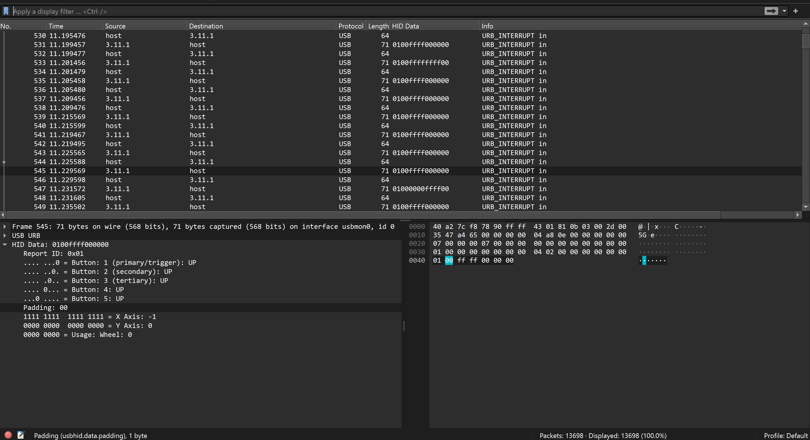

# NOPSCTF 2024
### I. HID.
- Chall này cho ta 1 file `.pcap` mình vào wireshark thì biết nó là USB forensics.

- Chỉ có những packet có length = 71 mới có usb data thôi , mình có research xem nó là dữ liệ của thiết bị gì thì mình biết được nó chính là của con chuột (mouse), mình có tìm cách để vẽ lại nó dựa vào tọa độ `X và Y`.
- Thì mình có kiếm được 2 blog nói về cách làm:
    + [CrewCTF 2022](https://github.com/xXLeoXxOne/writeups/blob/main/CrewCTF%202022/Paint.md)
    + [7h4nd5RG0d](https://github.com/7h4nd5RG0d/Forensics/blob/main/Networking/HID(USB-Mouse%20Drawing)/code.py)

- Tuy nhiên cách trên khá khó hiểu nên có 1 cách khác dễ hơn đó là sử dụng pixel ảnh.
```
from PIL import Image
import json

image = Image.new('RGB', (1350, 300))

j = json.load(open("data.json"))
x,y= 280,180
for p in j:
    t = p["_source"]["layers"]["usbhid.data_tree"]
    if t["usbhid.data.report_id"] == "0x01":
        x += int(t["usbhid.data.axis.x"])
        y += int(t["usbhid.data.axis.y"])
        if p["_source"]["layers"]["usbhid.data"][3:5] == "01":
            image.putpixel((x,y),255)
image.save("flag.png","PNG")
```
- Ta sẽ sử dụng code trên , trước tiên ta cần extract dữ liệu của các packet ra đã , mình sẽ sử dụng `tshark` với mode là `json` bởi vì mode `json` này sẽ hiển thị đầy đủ dữ liệu hơn so với mode `fields`.

```
$ tshark -r capture.pcapng -Y "frame.len == 71" -T json > data.json
```
- Giải thích đơn giản code trên thì ta sẽ khởi tạo 1 ảnh , set cho tọa độ `X và Y` của tấm ảnh đó là 1 giá trị bất kì , sau đó ta chỉ cần đọc giá trị X và Y của các packet trong file `.pcap` cộng vào là được , Với giá trị của `Paddding == 01` thì ta sẽ chỉnh màu ngay tại vị trí đó thành màu khác.

- Chạy script thì ta được 1 ảnh có flag bên trong.


*`FLAG: N0PS{m0Us3_dR4w1Ng}`*
### II. ZipZip.
- Bài này cho mình 1 file zip , extract nó ra thì mình được 1 file tên là `4ad9edde81b5526dcd95747a96a90583` , đọc bên trong là 1 văn bản đề cập tới file zip.
- Như đề bài đề cập mình ném file zip chưa extract vào `HxD` thì thấy 1 điều lạ.


- Ta có thể thấy tên các file sẽ được hiển thị trong metadata của nó tuy nhiên có 1 file khác nữa nhưng mà nó không hợp lệ nên không thể extract nó ra được.
- Có thể tìm hiểu thêm về file zip ở [đây](https://en.wikipedia.org/wiki/ZIP_(file_format)#Extra_field).
- Ta có thể biết được dữ liệu mà nó nén bên trong là `F3 33 08 08 AE AE 32 2C 88 47 C2 B5 00` và file name của nó là `33 36 64 66 38 66 33 61 39 39 30 33 35 36 66 38 62 39 37 38 31 35 61 61 39 30 38 33 62 38 34 39`

- Và ta có thể xài code này để extract được dữ liệu đó ra.
```
import zlib

# Hex string of the compressed data
compressed_hex_str = "F3330808AEAE322C8847C2B500"

# Convert the hex string to bytes
compressed_bytes = bytes.fromhex(compressed_hex_str)

# Decompress the data using raw DEFLATE compression
try:
    uncompressed_bytes = zlib.decompress(compressed_bytes, -zlib.MAX_WBITS)
    print(uncompressed_bytes.decode())
except zlib.error as e:
    print(f"Decompression error: {e}")
```
```
$ python3 tools.py 
N0PS{z1p_z1p_z1p_z1p}
```

*`FLAG: N0PS{z1p_z1p_z1p_z1p}`*