# NexusCTF 2024.
### I. You Can’t See Me.
- Chall này cho ta 1 file ảnh, mình vứt lên aperisolve cho tiện thì nó có dòng này `ohmygodyoucanactuallyseeme`.

- Mình nghĩ đây có thể là pass của 1 cái gì đó nên mình check thử steghide thì bên trong có 1 file flag.txt bị ẩn, extract nó ra là ta có flag thui.
```
$ steghide extract -sf chall.jpg -p ohmygodyoucanactuallyseeme
the file "flag.txt" does already exist. overwrite ? (y/n) y
wrote extracted data to "flag.txt".

$ cat flag.txt 
NexusCTF{H0w_Th3_H3ck_c4n_Ev3ry0ne_SEE_mee!!!}
```
- *`FLAG: NexusCTF{H0w_Th3_H3ck_c4n_Ev3ry0ne_SEE_mee!!!}`*.
### II. Zero Hidden Knight in Space.
- CHall này cho ta 1 file text, nhìn vào nội dung thì ko có gì bất thường nhưng mở bằng notepad, hoặc mở bằng vscode nó sẽ như này
```
‌‌‌‌‍‬‬‌‌‌‌‌‍‍‌We‌‌‌‌‍‍‌ are‌‌‌‌‍‌‌‌‌‌‌‍‌‌‌‌‌‌‬‬‌‌‌‌‌‬‌‌‌‌‌‬ ‌‌‌‌‍‬‍‌‌‌‌‌‍‌‬the‌‌‌‌‍‬‬‍‌‌‌‌‍‍‬‌‌‌‌‍‬‍‍‌‌‌‌‌‬‬‌‌‌‌‍‬‍‌‌‌‌‍‬ ‌‌‌‌‍‬Knight‌‌‌‌‍‬‍ Squad.‌‌‌‌‍‬‌‌‌‌‌‍‬‍‍ We‌‌‌‌‌‬‬‌‌‌‌‍‬‌ ‌‌‌‌‍‬hack‌‌‌‌‍‬‍‌‌‌‌‌‬‌‌‌‌‍‬‍‬ ‌‌‌‌‍‬‬‍for‌‌‌‌‍‬‌‌‌‌‌‍‬‍‍‌‌‌‌‌‬‌‌‌‌‍‬‍‌‌‌‌‌‌‬‌‌‌‌‌‌‍‌‌‌‌‍‍‍‌‌‌‌‍‌‌‌‌‌‌‍‍‍‍‌‌‌‌‌‍‌‌‌‌‌‍‍‌ ‌‌‌‌‌‌‬a‌‌‌‌‍‬‍‍‌‌‌‌‍‍‬‌‌‌‌‍‌‍‌‌‌‌‌‍‍‌‌‌‌‌‍‍ ‌‌‌‌‌‌‌better‌‌‌‌‍‬‍‬‌‌‌‌‌‬‍‌‌‌‌‍‬‬‌‌‌‌‍‬‬ Tomorrow‌‌‌‌‌‍‬‌‌‌‌‍‍‍‌‌‌‌‌‍‬‬‍.‌‌‌‌‍‌‍We‌‌‌‌‍‌‍‌ believe ‌‌‌‌‍‬‍‌‌‌‌‍‬‬‬‌‌‌‌‍‌‬‌‌‌‌‍‬‍‬‌‌‌‌‌‬‍‌‌‌‌‌‬‌‌‌‌‌‍‬‬‍‌‌‌‌‍‌‍‌‌‌‌‌‍‬‬‌‌‌‌‍‌‌‌‌‌‌‍‬‍‍in the power of security

```
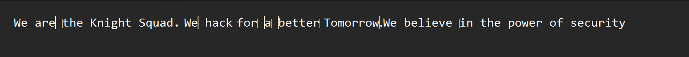

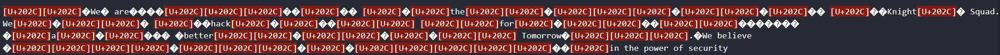
- Từ cái tên cũng có thể hình dung data được ẩn dấu trong những khoản trắng (white-space). Mình xài [web này](https://330k.github.io/misc_tools/unicode_steganography.html) thì nhận được 1 link google drive sau.
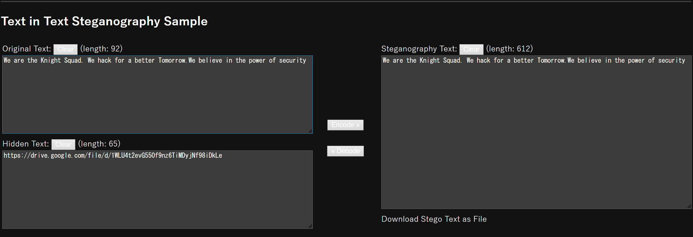
- Nó cho phép tải về 1 anh và flag nằm ở góc trên bên trái tấm ảnh.
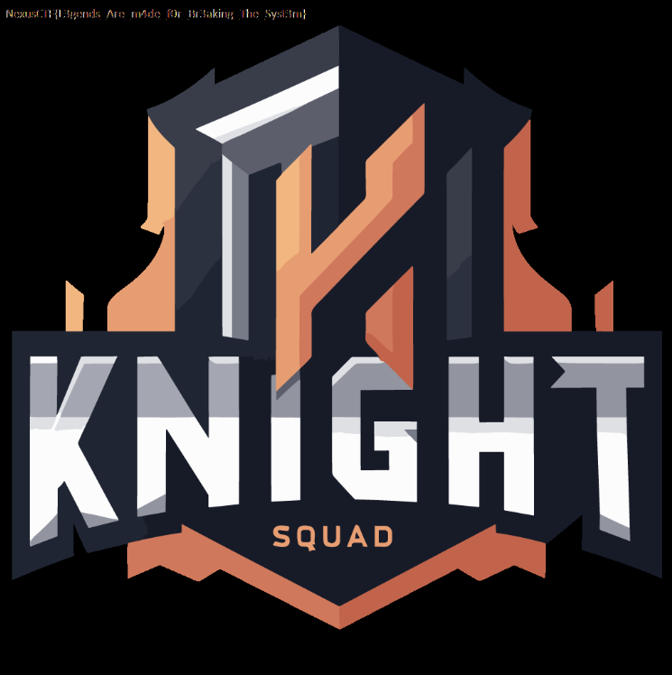
- Zoom to ra thì lấy được flag thui.
- *`FLAG: NexusCTF{L3gends_Are_m4de_f0r_Br3aking_The_Syst3m}`*
### III. Blind.
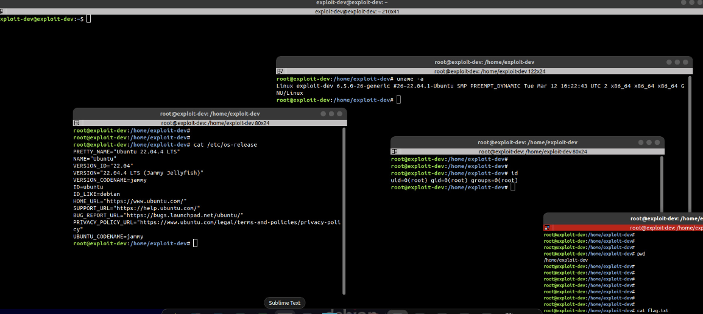
- Chall này cho ta 1 file ảnh `.jpeg` nhưng dễ dàng nhận thấy góc dưới bên phải author đã cat file flag.txt nhưng flag đã bị cắt mất , nghe rất quen vì nó là `CVE-Acropalypse` nhưng CVE này chỉ hoạt động trên `.png` thui ko hoạt động với các định dạng khác chỉ có thể chỉnh sửa từng byte ảnh thui, khi biết được [web này](https://cyberhacktics.com/hiding-information-by-changing-an-images-height/), web này cho ta thông tin cách để có thể ẩn dấu thông tin vào 1 ảnh `jpg` và nó có đề cập tới việc ta có thể điều chỉnh được kích thước ảnh nhỏ hơn so với ảnh gốc.
- Tóm tắt nó sẽ như thế này, ảnh bên dưới mà ta thấy nó là các byte quy định size của 1 `jpg` file , ở trường hợp này ta cần chỉnh cho ảnh dài ra thêm 1 đoạn để thấy phần flag bên dưới, vậy nên ta sẽ chỉnh sửa ở 2 byte height.
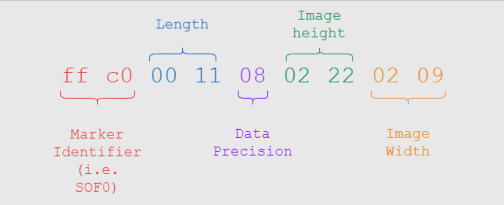
- Làm sao để biết các giá trị này ở đâu , khá đơn giản ta chỉ cần kiếm 2 byte `FF C0` là được.
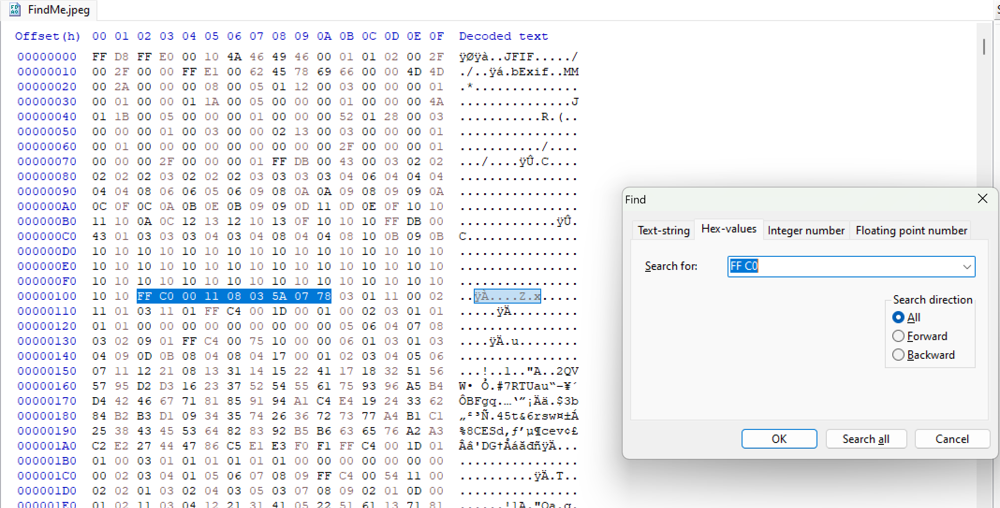
- Ta chỉ cần thay đổi như sau `FF C0 00 11 08 03 5A 07 78` -> `FF C0 00 11 08 04 5A 07 78`, sau khi sửa đổi ta có thể thấy tấm ảnh đã dài thêm được 1 đoạn cho phép ta thấy phần flag bên dưới.
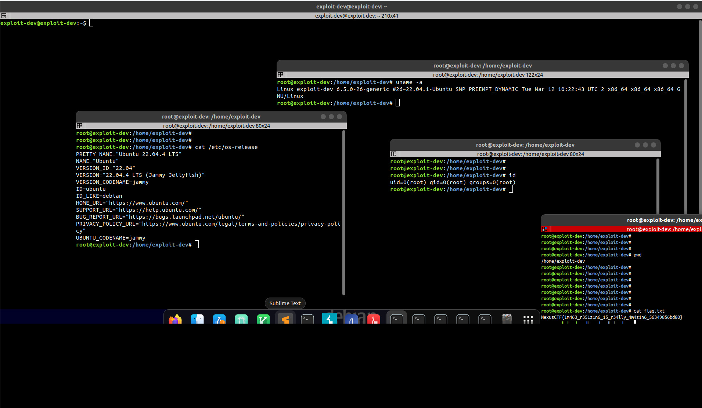
- *`FLAG: NexusCTF{1m463_r351z1n6_15_r34lly_4m4z1n6_5634985bd80}`*
### IV. The C.S Dictionary.
- Bài này cho ta 1 file text và bên trong nó có rất nhiều khoản trắng , rất quen thuộc.
```
	 		   		  		 	 	    				   	 	 	   		  	 				  	 	 	 			 			  		    	  	 	 		  
	   	 	 		 DSA 	 	 	   						  			 	  			  		 				 OS	  	    	   	 	 	   		  	 	DBMS     
		  	 	 	   						  	Embedded-Systems 			  			  	Cryptography	  		  	   		  	 	     		  	 		COA	  	   		  		 		
	 	Computer-Networking     	 	 	 		Robotic		  	 			  			 		   		  	 	     		  			IoT 	  	   		 	     	   	 		
	  	 	Software-Engg				  		Cloud	 		  	 Computer-Graphics	 	 	     	 				  	 	 		  	 	     	 			 				  			 	  			  
		  	   		  	AI		 		  					  	 HCI  			  	 			   		 		 	  		 	 	     		  			 	  		 	 
		   				  		  			   Web-Dev		 	  				 	  			  		  						  		  	  			 			  	 			     	 
```
- Nhưng khi decode bằng tool thông thường có lẽ là ko được.
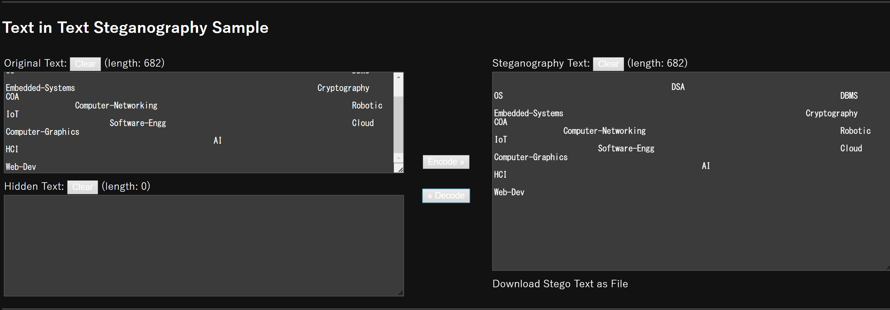
- Nhưng white-space ko chỉ có mỗi 1 dạng nó còn có 1 dạng khác nữa là `Whitespace programming/SNOW (Steganographic Nature Of Whitespace)`, nó là 1 dạng lưu dữ liệu bên trong những dấu `tab` và nhưng khoản trắng ở cuối dòng nhằm ko để người đọc phát hiện ra bởi vì rất khó để biết so với cách thông thường và chúng ta có [web này](https://naokikp.github.io/wsi/whitespace.html).
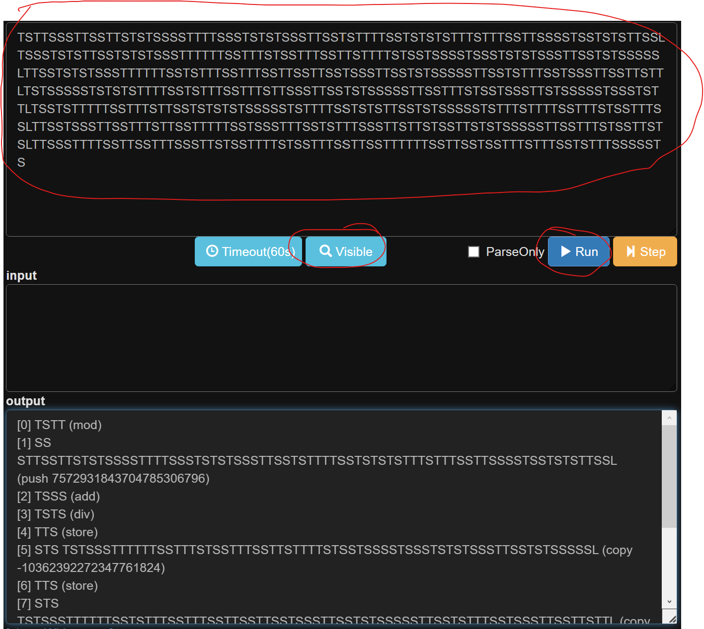
- Ném dữ liệu file text vào xong run , tiếp đó vấn `Visible` để web tự lọc ra cho ta.
- khi decode ra nhìn vào dữ liệu trên nó khá giống `binary` với `T là Tab = 0` và `S là space = 1` cuối dòng có chữ `L là line feed` mình khá chắc nó vô nghĩ vì nếu là space thì ko chỉ nằm ở cuối dòng nên mình sẽ loại bỏ nó.
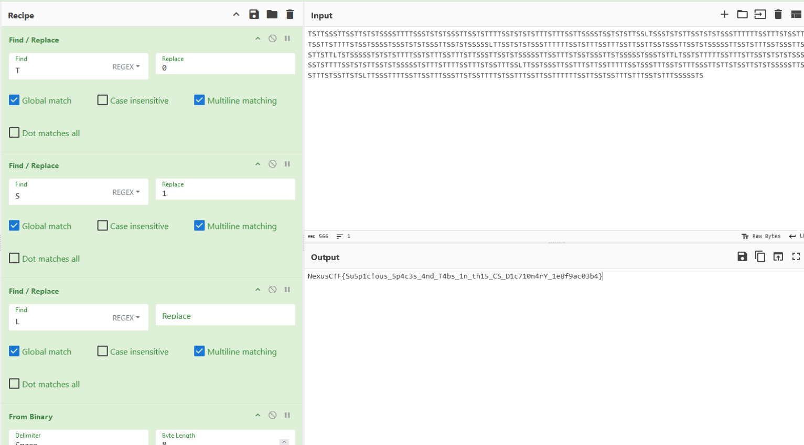
- *`FLAG: NexusCTF{Su5p1c!ous_5p4c3s_4nd_T4bs_1n_th15_CS_D1c710n4rY_1e8f9ac03b4}`*
### V. Insignificant.
```
Question: Can you tell me how significant this bit of music really is??
```
- Chall này cho ta 1 file `.wav`, mình vứt nó vào Audacity xem nó có gì lạ ko.
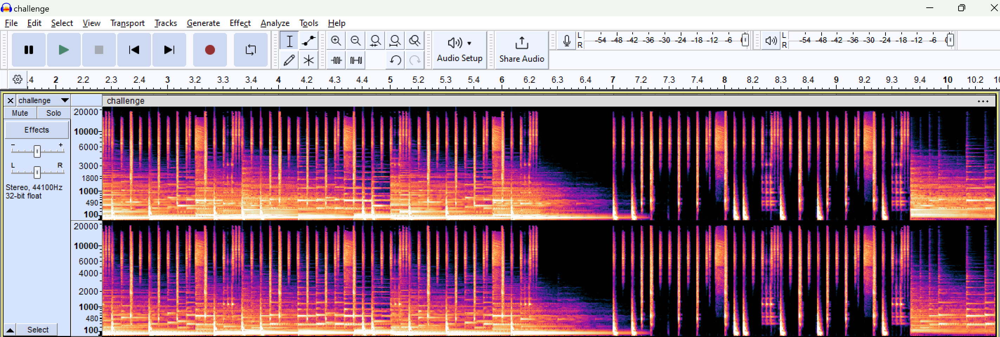
- Nhìn nó khá là lạ so với bth cùng với đó đề cũng đề cập tới từ `bit` , cái gì mà bit nhĩ mình chĩ nghĩ được đến `LSB` thôi bởi vì nó lấy bit cuối cùng của dữ liệu nơi ít bị ảnh hưởng nhất, Khi tìm hiểu mình vớ được [web này](https://github.com/ragibson/Steganography?tab=readme-ov-file#recovering-data) ta có thể lấy dữ liệu ra với `stegolsb`.
```
$ stegolsb wavsteg -r -i challenge.wav -o output.txt -n 2 -b 100
Files read                     in 0.07s
Recovered 100 bytes            in 0.00s
Written output file            in 0.00s

$ cat output.txt 
NexusCTF{Th3_Le4st_S1Gn1f!c4n7_B1t55_1n_A_W4v_f1L3_6fe20da1bc9}
                                                               �
```
- *`FLAG: NexusCTF{Th3_Le4st_S1Gn1f!c4n7_B1t55_1n_A_W4v_f1L3_6fe20da1bc9}`*
### VI. Arecibo message.
- Chall này cũng cho ta 1 file `.wav`, nhưng khi nghe nó rất giống với 1 chall trong pico tên là `m00nwalk`, với chall này ta sẽ sử dụng `sstv` để extract 1 ảnh từ file âm thanh trên.

```
sstv -d Arecibo.wav  
[sstv] Searching for calibration header... Found!    
[sstv] Detected SSTV mode Martin 2
[sstv] Decoding image...                                                                                                      [####################################################################################################] 100%
[sstv] Drawing image data...
[sstv] ...Done!
```
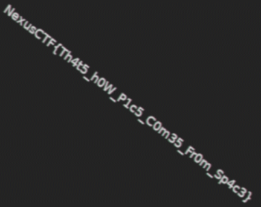
- *`FLAG: NexusCTF{I_HAV3_G0nE_D3EpeR}`*
### VII. Echos Parody.
```
Question: “In the land of echoes, where whispers roam, A tale of clues, finds its home. Laughter and tears, merge in the air, In echoes’ parody, stories flare. Footsteps of past, meet those of now, In the echo’s chamber, they take a bow. Love’s sweet whispers, pain’s bitter cry, All in the echoes, they do lie. Listen close, and you will find, Clues and whispers, intertwined. In the echo’s game, secrets unfurl, A world of mysteries, for all to swirl.”
```
- Chall này cho ta 1 file `.pcap`, khi mở lên thì có rất nhiều ICMP , TCP, TLS protocol nhưng mà khi đọc đề, có 2 lần đề cập tới echo và cả tên chall cũng thế và chắc chắn nó có liên quan đến `ICMP` rồi, Nhìn vào ảnh thì ICMP có 2 luồng data `ID=0x0001` và `ID=0x0000`
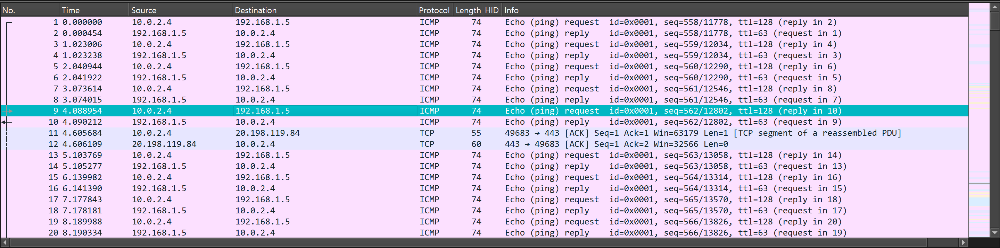
- Với các gói ICMP sẽ có dữ liệu ẩn trong mỗi gói và khi xem các gói icmp thì các packets có `id=0x0000` với độ dài là 43 hoặc `icmp.type == 8` nó có 1 byte dữ liệu ở cuối thay đổi liên tục.
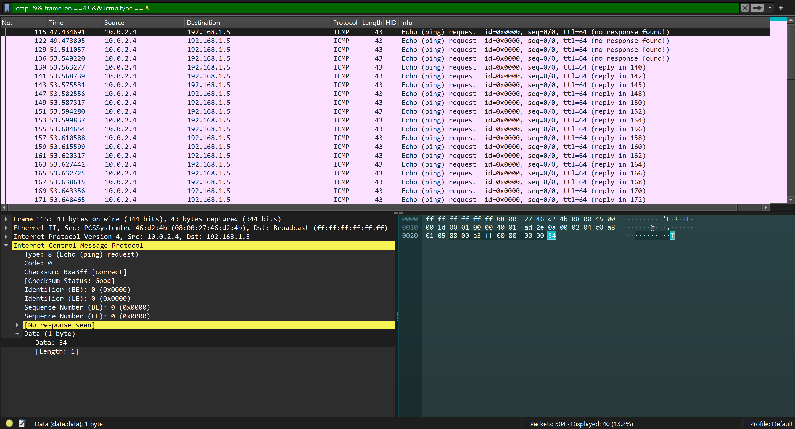
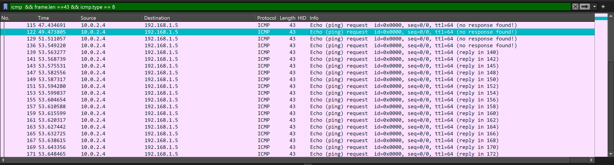
- Mình xài `tshark` để lấy ra dữ liệu :
```
$ tshark -r Echos\ Parody.pcap -Y "icmp && frame.len == 43" -T fields -e "data" | awk '{ printf "%s", $1 }'
546d563464584e4456455a37517a427362444e6a6446395561444e74587a52736243456866513d3d
```
- Dữ liệu nhận được là hex mình lên `kt.gy` để decode thì nó ra ngược lại base64 , decode 1 lần nữa thì có flag.
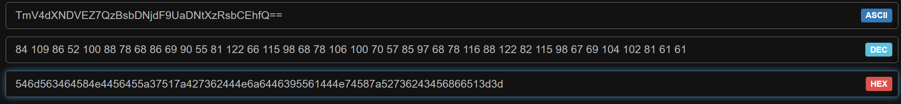
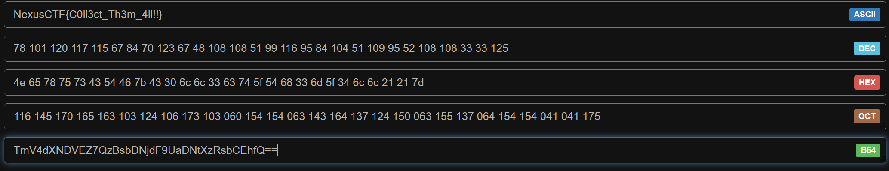
- Nhưng mình vừa lại phát hiện thêm là cùng với `id=0x0000` icmp.type ko bằng 8 nhưng có độ dài là 60, mình cũng thấy 1 sự biến động dữ liệu liên tục nên mình lấy nó ra thử
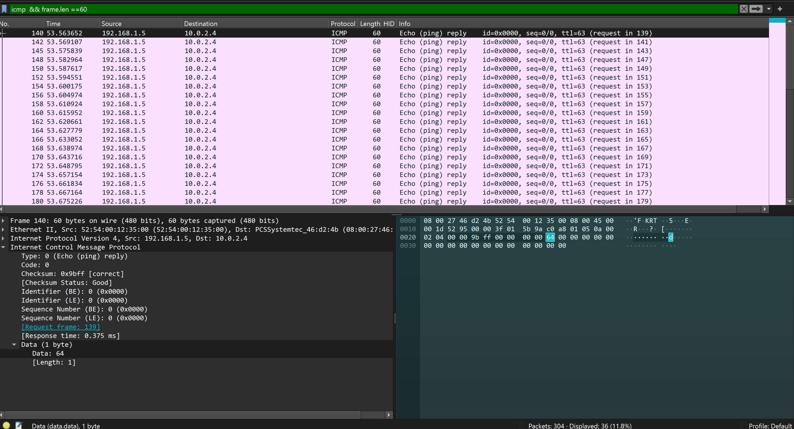
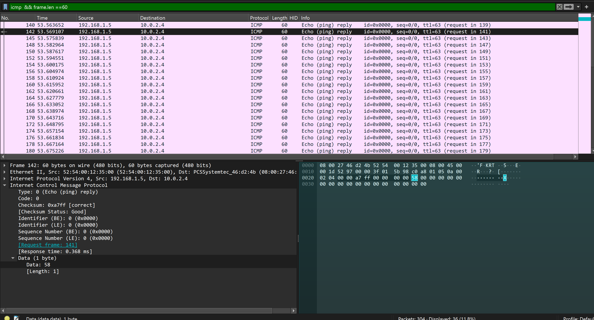
```
$ tshark -r Echos\ Parody.pcap -Y "icmp && frame.len == 60" -T fields -e "data" | awk '{ printf "%s", $1 }'
64584e4456455a37517a427362444e6a6446395561444e74587a52736243456866513d3d
```
- Mình dcode nó vẫn ra được flag chỉ là nó mất đoạn đầu 1 tí thui.
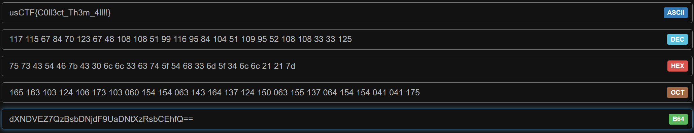
- *`FLAG: NexusCTF{C0ll3ct_Th3m_4ll!!}`*.
### VIII. Deep... Deep... Deeper.
- Chall này cho mình 1 file âm thanh , và Ngay khi nhìn tên của chall này mình nghĩ ngay đến `DeepSound` 1 phần mềm giúp chúng ta có thể extract được file ẩn bên trong 1 file âm thanh.
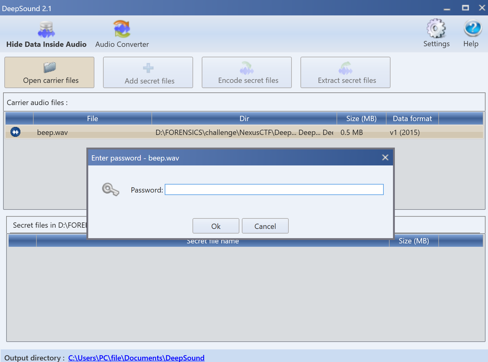
- Nhưng mà nó yêu cầu pass , nhưng Chall chưa đề cập tới pass 1 lần nào cả, mình nghĩ chỉ có thể là brute force thui, thế là mình xài 1 plugin của anh john đó là `deepsound2john` để có thể biến file wav thành 1 file hash để a john crack.
```
$ deepsound2john beep.wav > hash.txt
```
```
$ john hash.txt -w=/usr/share/wordlists/rockyou.txt
Using default input encoding: UTF-8
Loaded 1 password hash (dynamic_1529 [sha1($p null_padded_to_len_32) (DeepSound) 256/256 AVX2 8x1])
Warning: no OpenMP support for this hash type, consider --fork=16
Press 'q' or Ctrl-C to abort, almost any other key for status
letmein          (beep.wav)
1g 0:00:00:00 DONE (2024-04-24 20:56) 33.33g/s 112000p/s 112000c/s 112000C/s 123456..hottie101
Use the "--show --format=dynamic_1529" options to display all of the cracked passwords reliably
Session completed.
```

```
$ cat secret.txt.txt 
N e x u s C T F {I _ H A V 3_ G 0 n E_ D 3 E p e R}
```
- *`FLAG: NexusCTF{I_HAV3_G0nE_D3EpeR}`*