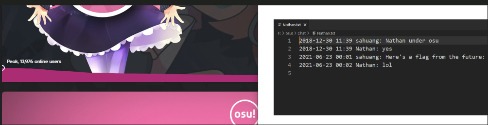
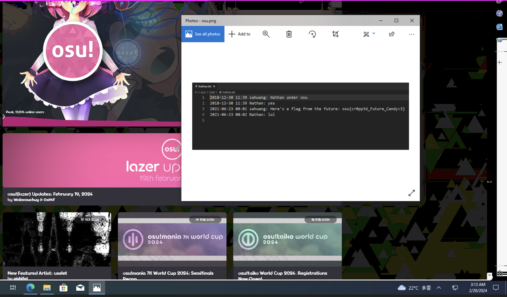
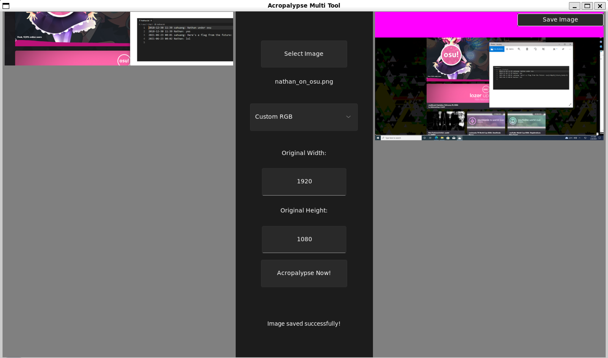
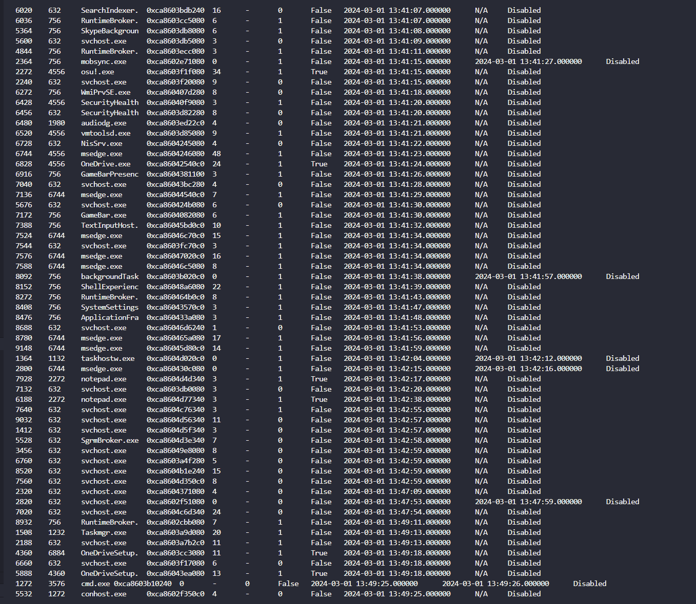
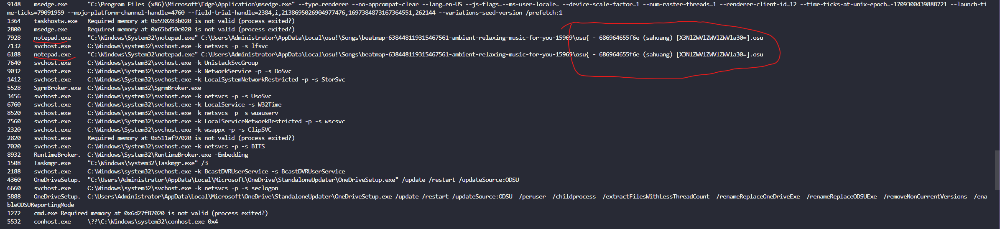
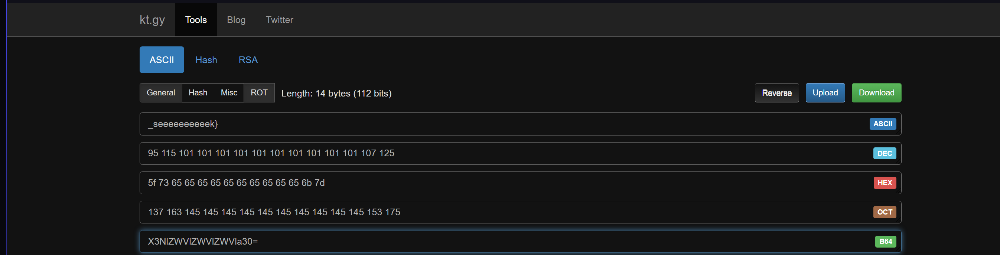
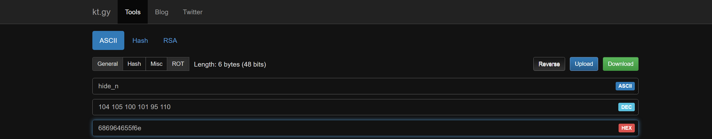

# Osu!CTF.
- Giải này nó liên quan khá nhiều đến game `OSU` nên khá khó với mình , nên chỉ solve được 2 bài.
### 1. nathan_on_osu.

- Nó cho mình 1 cái ảnh `png` như này , và đề bảo nó đã bị `CROPPED` , có nghĩa là ảnh gốc đã bị cắt thành như này , bài này khá dễ nhưng sẽ khá khó nếu ko biết trước. Ta sẽ sử dụng [tool này](https://github.com/frankthetank-music/Acropalypse-Multi-Tool) để chỉnh sửa kích thước của nó, ảnh này có size là `1047x246` mình sẽ chỉnh size to hơn để có thể xem được flag. Mình sẽ chỉnh lên với size là 1 màn hình fullhd với size là `1920x1080`.

- Thế nà mình đã có dược 1 flag ròi.
```
Mọi người git clone link kia về xong r chạy lệnh này là đc: 
    $ pip3 install -r requirements.txt              

    $ python3 gui.py
```

- *`Flag : osu{cr0pp3d_Future_Candy<3}`*
### 2. volatility-map.
- Ở bài này là 1 bài memory thế nên mình sẽ xài `volatility` để cook bài này nha.
- Tùy bài xài đc vol2 hoặc vol3 , nhưng mà bài này ko xài cho xài vol2 nên mình xài vol3, vừa vào thì cứ check `pslist` trước để xem cso process nào đáng ngờ ko nha.

- Có quá nhiều các process đáng ngờ đang được chạy , nên là mình sẽ check tiếp `cmdline` để xem các process đó có đường dẫn nào có file đáng ngờ ko nha.

- Bạn nhìn vào khúc này nó có `osu{` như thể đây là flag và có 1 đoạn base64 nữa mình decode thử thì ra được 1 phần của flag.

- mình có được nữa sau rồi , ở trước nó có 2 đoạn khá là giống `hex` nên là mình decode 2 dãy giá trị đó thử lun xem có được thêm gì ko.

- Thì mình có được đoạn đầu flag rồi , bài này nó hint cho nên khá dễ
- *`Flag : osu{hide_n_seeeeeeeeeek}`*