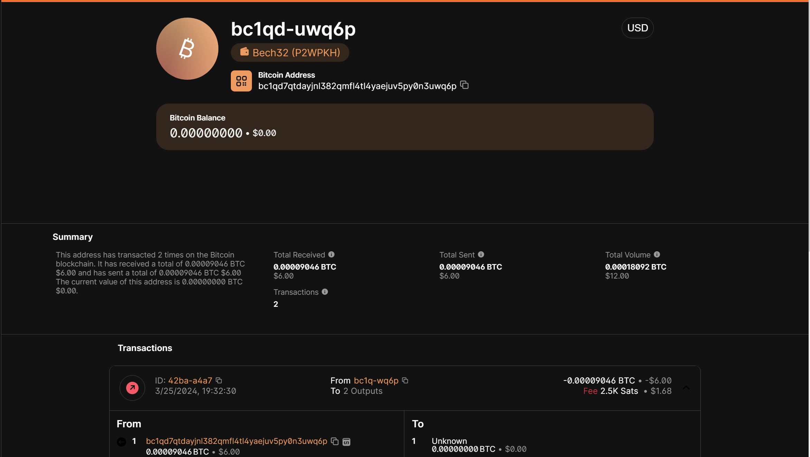
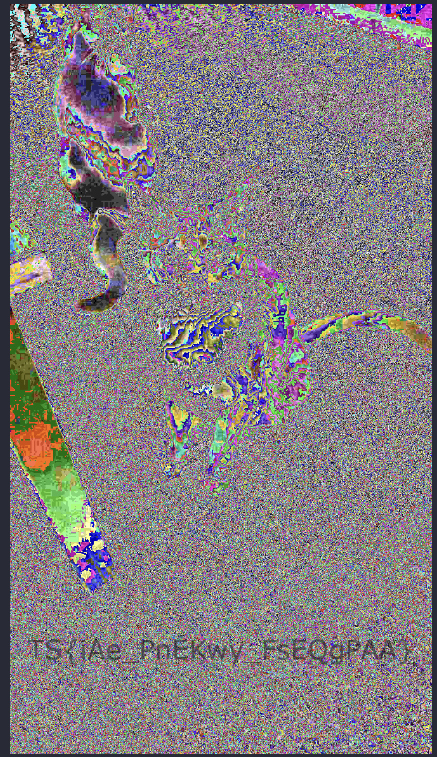

# RitSecCTF 2024.
### 1. Ransome Note.
```
Question: After the break-in to his lab Anthony found a suspicious new file on his desktop named README.txt. Anthony opened the file and found that it was a ransom demand from whomever stole his invention. Perhaps the contents of the ransom note contain a clue to the attacker’s identity.
```
- Bài này khá lạ chall cho mình 1 file text với nội dung sau:
```
-----BEGIN BITCOIN SIGNED MESSAGE-----
Your invention has been taken.
If you ever want to see it again send 10 BTC to this address:

bc1qd7qtdayjnl382qmfl4tl4yaejuv5py0n3uwq6p

You have 3 days.
-----BEGIN BITCOIN SIGNATURE-----
H3zAMJyVW2j1+Y7A+w8wflZRUmggR+Sn532ZuAGtGLcxEERvymcPrtnXVkB+0mBqCUAb0AQwyPFJfGxvIeQDPpE=
-----END BITCOIN SIGNATURE-----
```
- Mình có tìm hiểu thì file này cung cấp cho chúng ta địa chỉ của 1 ví `bitcoin` và 1 dãy signature . từ địa chỉ trên mình Sử dung [web này](https://www.blockchain.com/explorer), để tìm kiếm.

- Click vào id của lần giao dịch đầu tiên ta được flag lun.

- *`FLAG: RS{26f9c2fcdfe8e86804eb}`*.
### 2. Decrypt the Flood.
```
Question: Dive into the digital currents of Decrypt the Flood! Navigate through encrypted waters, uncovering clues hidden within the network flow. Will you decrypt the mystery behind Anthony’s vanished invention, or will it remain lost in the flood?
```
- Chall này cho ta 1 file `.pcap`, vào wireshark thì mình thấy được rất nhiều `tcp` protocol , và data của nó là mã base64 nhưng khi mình lấy thử 1 cái ra thì ko có ý nghĩa gì cả.

- Mình search strings phát ra flag lun Hoặc có thể xài filter trong wireshark :)))) .


- *`FLAG: RS{pc@p$_@r3_0ur_fr!3nd$}`*.
### 3. Curiosity Helped the Cat.
```
Question: In the relentless pursuit to reclaim Anthony’s stolen invention, we’ve meticulously sifted through the digital ether, finding a PNG file adorned with whimsical felines. Suspicions now converge upon Alex, a shadowy figure lurking within the depths of cyberspace, his motives shrouded in secrecy.
```

- Bài này cho mình 1 ảnh con mèo `cats.png` , mình đã vứt nó lên `aperisolve` để check cho lẹ nhưng thứ mình nhận được chỉ là đoạn này `CAPTAINCASHMONEY`.

- Có lẽ nó sẽ là pass cho 1 thứ gì đó , nhưng mà để kiếm được flag ta chẳng thể ngờ được đâu , flag được dấu ở 1 trong các kênh màu của cái ảnh, thứ mà `aperisolve` có cho ta thấy nhưng chưa đủ, Ta cần sử dụng `zsteg-mask` để có thể thấy đầy đủ các kênh màu của nó.
```
$ zsteg-mask cats.png -d RGB_cat    (-d là đường dẫn đến 1 folder)
```
- Tool sẽ cho ta rất nhiều ảnh và xem từng ảnh ta sẽ thấy được flag như này.

- Tuy nhiên flag đã bị mã hóa rồi , vậy là `CAPTAINCASHMONEY` sẽ là key để chúng có thể decode chuỗi này `TS{iAe_PnEKwy_FsEQgPAA}` để có được flag.

- *`FLAG: RS{tHe_HaCKer_TeRMiNAL}`*.
### 4.Wacky Flags
```
Question: We were reviewing network traffic around the time that the invention was stolen. We think there’s a thing or two off. Can you help us?
```

```
Hint: Before we “reserve” our seats. We need to append a “01” to our tickets.
Hint 2: We have some reservations about Tony’s Contraption but Please don’t share them with anyone.
```
- Bài này cho ta 1 file `.pcapng` , có rất nhiều protocol khác nhau và rất nhiều cho nên việc kiếm flag rất khó chỉ có thể dựa vào hint mới có thể làm được.
- Nhìn vào hint bạn thấy gì ko từ `reserve` được nhắc tận 2 lần và author có bảo chi nên tập trung vào `tcp` , thế nên vào wireshark check xem nhé.

- ở bit `reserved` này nó có 3 bit vậy có nghĩa là flag sẽ là 1 dạng binary ta cần phải ghép lại , ở dòng này ko có dữ liệu vậy ta chỉ cần filter với tham số `tcp.flags.res == True` là được cái nào có dữ liệu thì sẽ bị lọc ra.

- Đây gòi những dòng này ta có thể sẽ ghép được ra flag , nhưng trước tiên ta cần lấy nó ra đã, author có bảo hãy thêm `01` vào đầu mỗi tickets , mình nghĩ nó sẽ là đầu mỗi từ Và hãy để ý thời gian , với những dòng có time giống nhau sẽ là 1 từ mà ta chỉ có thể leak dữ liệu ra bằng tay thui nhé :(((.

- Ghép lại thì có flag hoiiii. 
-*`FLAG: RS{rsvbits}`*.