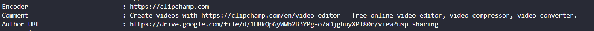
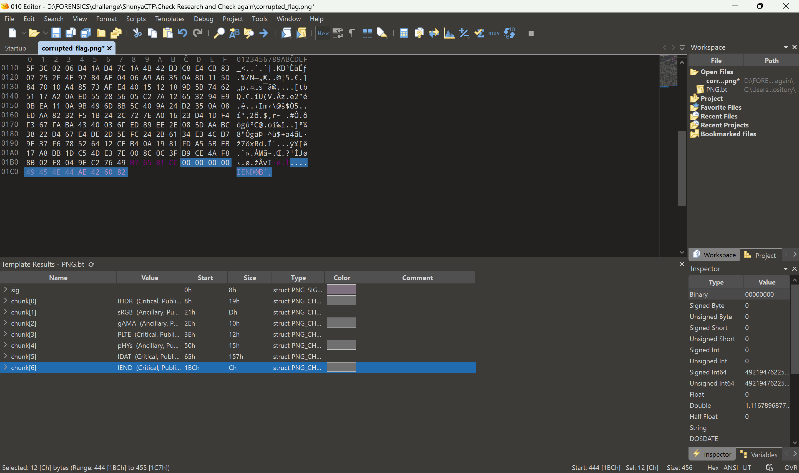

# ShunYaCTF 2024.
### I. BIBBA 1.
```
Question: my grandfather sent me this one photo describing it as his one of the most cherised and sacred memories during his time. help me find out some details about it. part 1: png header error, after solving flag would be printed on the photo.
```
- Chal này cho mình 1 file ảnh `.png` nhưng nó bị corrup rồi, Mình chỉ chỉnh sửa header 1 tí thôi là có thể xem được ảnh.


- Nhưng flag thật ra nằm ở metadata , strings là ra :Đ.

- *`FLAG: 0CTF{pNg_h34d3rs_4r3_A_P4!n_P4!n_!n_7h3_455`*.
### II. The Vanishing of Dr. Kumar.
```
Question: Dr. Kumar disappeared right before his big cybersecurity speech, leaving everyone baffled. Despite tight security, no one saw where he went. The mystery of his disappearance has everyone on edge, with ACP Pradyuman and his team joining the investigation.
```
- Chall này cho mình 1 file `.mp4` khi xem nội dung thì mình thấy có pass `cidacp123`.

- Mình check tất cả mọi thứ và khi xai `exiftool` nó có 1 đường link dẫn tới google drive như sau.

- Nó dẫn ta tới 1 file `.pdf` có yêu cầu pass , nhập pass ở trên vào là xem được nhưng dường như flag ko có ở trong file này, vì mình cũng đã thử mọi cách rồi.


- Chỉ còn 1 bước là mình chưa thử đó chính là xài `Audacity`, Nhưng vì chall cho ta 1 file `.mp4` nên ko thể mở trong Audacity được, nên mình thử convert sang mp3 để mở thử thì flag hiện rõ ở `Spectrogram` lun.
.
- *`FLAG:  0CTF{Kr1t1_S1nh4_is_k1dnapp3r}`*.
### III. The Hunt of Dr. Kumar.
```
Question: Dr. Kumar’s hiding spot remains a mystery in the crowded city. With time ticking away, finding him becomes more urgent. Will ACP Pradyuman and his team outsmart the villain and rescue Dr. Kumar before it’s too late?
```
- Từ đề bài thì flag là nơi mà Dr. Kumar đang ẩn nấu và chall cũng cho ta 1 file `.mp4` tiếp, tiếp tục là ta nhận được 1 dãy hex khi check file bằng exiftool.

- Khi chuyển đổi dãy hex trên thì ta lại được 1 link google drive, cho phép ta tải 2 file này.


- Mình xem thử file text trước thì khi chọn tất cả nó hiện như thế này , nó có thể là kỹ thuật giấu dữ liệu trong những khoản trắng nên mình lên [web này](https://330k.github.io/misc_tools/unicode_steganography.html) để decode thử thì yup nothing.

- Tuy nhiên với white-space hay khoản trắng trong forensics nó ko dừng lại ở đó, Hãy đọc [writeup](https://github.com/W3rni0/NahamCon_CTF_2020?tab=readme-ov-file#snowflake) này, với tool `stegsnow` ta có thể extract được dữ liệu ẩn dấu bên trong nhưng Nó yêu cầu pass, và trong writeup họ có thể brute bằng `rockyou.txt`, hên là Chall cho ta 1 file pdf nữa chắc chắn là sẽ có pass trong đó.

- Vừa nhìn thì ta có thể thấy có 1 tấm ảnh đã bị che mất , mình sử dụng trình mở pdf lựa chọn edit text nên có thể dễ dàng kéo ảnh che ra chỗ khác và xem được nội dung của tấm ảnh đằng sau, tuy nhiên ta có thể sử dụng tool `pdftoimage` hoặc `pdftohtml` để xem ảnh bị che nhé.


- Có lẽ pass sẽ là `Agartala`,cùng sử dụng `stegsnow` để xem có thông tin gì bị ẩn nhé.
```
$ stegsnow -C -p "Agartala" LocationFinal.txt    
23.837753721660444, 91.28260964079868
```
- Dữ liệu cho ta có vẻ khá giống tọa độ của 1 nơi nào đó, mình lên gg map xem như nào thì nó chỉ đến 1 nơi là `Ujjayanta Place`, Vừa khít nó là flag lun.

- *`FLAG: 0CTF{Ujjayanta_Palace}`*.
### IV. Check Research and Check again.
```
Question: Sometimes in life, everything goes wrong, nothing works and you crash every time you try to look within yourself. In such moments, calculate where you came from, and see what you can correct, generally the last thing you did wrong is what needs to be corrected first. Flag Format: 0ctf{words_with_underscore}
```
- Bài này cho mình 1 ảnh bị corrupted và để dễ dàng chỉnh sửa ta có thể sử dụng `010 Editor`.

- Sau khi chỉnh sửa hết tất cả chunk nhưng vẫn ko xem được ảnh, mình sử dụng pngcheck xem có bị lỗi chỗ nào nữa ko.
```
$ pngcheck -v corrupted_flag.png
zlib warning:  different version (expected 1.2.13, using 1.3)

File: corrupted_flag.png (456 bytes)
  chunk IHDR at offset 0x0000c, length 13:  invalid interlace method (82)
ERRORS DETECTED in corrupted_flag.png
```
- Tool bảo là lỗi ở `chunk IHDR at offset 0x0000c, length 13:  invalid interlace method (82)` , mình lần là theo chỗ báo lỗi thì mình thấy chỗ này.

- Nó cho mình chỉnh sửa thành 2 thông số , mình sử nó thành `0` thì đã có thể mở được ảnh và có luun flag.


- *`FLAG: 0ctf{crc_1s_a_us5ful_m5chan1sm}`*.
### V. Infant Mem.
```
Question: Here is that one last minute chall….because of-course I can’t skip Memory Analysis!! Find the Device Name of my OS followed by name of Local User!! Remember to enclose it around flag format!!
```
- Chall này đúng như tên nó là 1 bài memory, Flag sẽ gồm Tên thiết bị và Tên user, phần này thì khá dễ nếu như biết cách làm, Khi research mình thấy được [page này](https://www.aldeid.com/wiki/Volatility/Retrieve-hostname) chia sẻ cách để có thể kiếm được device name, Vol2 hay Vol3 đều xài được.
- Bước đầu ta cần sử dụng `hivelist` để biết được offset hay địa chỉ ảo hoăc vật lý nếu là Vol2.

```
$ python3 vol.py -f /mnt/d/FORENSICS/challenge/ShunyaCTF/'Infant Mem'/mr1tyu.raw windows.registry.hivelist
Volatility 3 Framework 2.5.2
Progress:  100.00               PDB scanning finished
Offset  FileFullPath    File output

0x8860a6d8              Disabled
0x8861a008      \REGISTRY\MACHINE\SYSTEM        Disabled
0x8863b008      \REGISTRY\MACHINE\HARDWARE      Disabled
0x88c51508      \??\C:\Windows\ServiceProfiles\LocalService\NTUSER.DAT  Disabled
0x89ffe338      \SystemRoot\System32\Config\SOFTWARE    Disabled
0x8d88a5d8      \Device\HarddiskVolume1\Boot\BCD        Disabled
0x8ff4d550      \SystemRoot\System32\Config\SECURITY    Disabled
0x8ff71580      \??\C:\Windows\ServiceProfiles\NetworkService\NTUSER.DAT        Disabled
0x8ffae008      \SystemRoot\System32\Config\SAM Disabled
0x90857408      \SystemRoot\System32\Config\DEFAULT     Disabled
0x968999c8      \??\C:\Users\lord-mr1tyu\ntuser.dat     Disabled
0x9938f008      \??\C:\Users\lord-mr1tyu\AppData\Local\Microsoft\Windows\UsrClass.dat   Disabled
0x9ba24008      \??\C:\System Volume Information\Syscache.hve   Disabled
```

```
$ ./vol2 -f /mnt/d/FORENSICS/challenge/ShunyaCTF/'Infant Mem'/mr1tyu.raw --profile Win7SP1x86_23418 hivelist 
Volatility Foundation Volatility Framework 2.6
Virtual    Physical   Name
---------- ---------- ----
0x8d88a5d8 0x0f3f05d8 \Device\HarddiskVolume1\Boot\BCD
0x8ff4d550 0x0b884550 \SystemRoot\System32\Config\SECURITY
0x8ff71580 0x0b7e3580 \??\C:\Windows\ServiceProfiles\NetworkService\NTUSER.DAT
0x8ffae008 0x0b13c008 \SystemRoot\System32\Config\SAM
0x90857408 0x11d3e408 \SystemRoot\System32\Config\DEFAULT
0x968999c8 0x501c99c8 \??\C:\Users\lord-mr1tyu\ntuser.dat
0x9938f008 0x1eef8008 \??\C:\Users\lord-mr1tyu\AppData\Local\Microsoft\Windows\UsrClass.dat
0x9ba24008 0x30d6a008 \??\C:\System Volume Information\Syscache.hve
0x8860a6d8 0x137806d8 [no name]
0x8861a008 0x13943008 \REGISTRY\MACHINE\SYSTEM
0x8863b008 0x13964008 \REGISTRY\MACHINE\HARDWARE
0x88c51508 0x0a378508 \??\C:\Windows\ServiceProfiles\LocalService\NTUSER.DAT
0x89ffe338 0x122ea338 \SystemRoot\System32\Config\SOFTWARE
```
- Từ offset và virtual adddresss ta có thể kiếm được device name với key là `ControlSet001\Control\ComputerName\ComputerName`.
```
$ python3 vol.py -f /mnt/d/FORENSICS/challenge/ShunyaCTF/'Infant Mem'/mr1tyu.raw windows.registry.printkey --offset 0x8861a008 --key "ControlSet001\Control\ComputerName\ComputerName"
Volatility 3 Framework 2.5.2
Progress:  100.00               PDB scanning finished
Last Write Time Hive Offset     Type    Key     Name    Data    Volatile

2024-04-12 04:22:44.000000      0x8861a008      REG_SZ  \REGISTRY\MACHINE\SYSTEM\ControlSet001\Control\ComputerName\ComputerName        (Default)       "mnmsrvc"       False
2024-04-12 04:22:44.000000      0x8861a008      REG_SZ  \REGISTRY\MACHINE\SYSTEM\ControlSet001\Control\ComputerName\ComputerName        ComputerName    "MR1TYU-PC"     False
```

```
$ ./vol2 -f /mnt/d/FORENSICS/challenge/ShunyaCTF/'Infant Mem'/mr1tyu.raw --profile Win7SP1x86_23418 printkey -o 0x8861a008 -K 'ControlSet001\Control\ComputerName\ComputerName'
Volatility Foundation Volatility Framework 2.6
Legend: (S) = Stable   (V) = Volatile

----------------------------
Registry: \REGISTRY\MACHINE\SYSTEM
Key name: ComputerName (S)
Last updated: 2024-04-12 04:22:44 UTC+0000

Subkeys:

Values:
REG_SZ                        : (S) mnmsrvc
REG_SZ        ComputerName    : (S) MR1TYU-PC
```
- Device name sẽ là `MR1TYU-PC`, Với user name sẽ dễ hơn 1 tẹo ta chỉ cần sử dụng `hashdump` là ra, hoặc khi sử dụng `hivelist` cũng đã show ra được user name là `lord-mr1tyu`.
```
$ python3 vol.py -f /mnt/d/FORENSICS/challenge/ShunyaCTF/'Infant Mem'/mr1tyu.raw windows.hashdump
Volatility 3 Framework 2.5.2
Progress:  100.00               PDB scanning finished
User    rid     lmhash  nthash

Administrator   500     aad3b435b51404eeaad3b435b51404ee        31d6cfe0d16ae931b73c59d7e0c089c0
Guest   501     aad3b435b51404eeaad3b435b51404ee        31d6cfe0d16ae931b73c59d7e0c089c0
lord-mr1tyu     1000    aad3b435b51404eeaad3b435b51404ee        259745cb123a52aa2e693aaacca2db52
HomeGroupUser$  1002    aad3b435b51404eeaad3b435b51404ee        3e1b070771e65a9f57b6cced3bfb2931
```

```
$ ./vol2 -f /mnt/d/FORENSICS/challenge/ShunyaCTF/'Infant Mem'/mr1tyu.raw --profile Win7SP1x86_23418 hashdump
Volatility Foundation Volatility Framework 2.6
Administrator:500:aad3b435b51404eeaad3b435b51404ee:31d6cfe0d16ae931b73c59d7e0c089c0:::
Guest:501:aad3b435b51404eeaad3b435b51404ee:31d6cfe0d16ae931b73c59d7e0c089c0:::
lord-mr1tyu:1000:aad3b435b51404eeaad3b435b51404ee:259745cb123a52aa2e693aaacca2db52:::
HomeGroupUser$:1002:aad3b435b51404eeaad3b435b51404ee:3e1b070771e65a9f57b6cced3bfb2931:::
```
- *`FLAG: 0CTF{mr1tyu-PC_lord-mr1tyu}`*.
### VI. Baby Mem.
```
Question: Sorry, I made more. Help me find the name and physical address of file potentially containing the Virus!!!
```
- Chall này nối tiếp với bài trên , Flag ở bài này sẽ là Tên của con virus và physical address của nó.
- Phần này sẽ khá khó, Ta cần check `pslist` để xem có những process nào khả nghi không tiếp đến là sử dụng `cmdline` để xem có đường dẫn nào đáng ngờ ko, cùng bắt tay vào làm nhé.
```
$ python3 vol.py -f /mnt/d/FORENSICS/challenge/ShunyaCTF/'Infant Mem'/mr1tyu.raw windows.pslist
Volatility 3 Framework 2.5.2
Progress:  100.00               PDB scanning finished
PID     PPID    ImageFileName   Offset(V)       Threads Handles SessionId       Wow64   CreateTime      ExitTime        File output

4       0       System  0x84554bb8      100     565     N/A     False   2024-04-13 06:19:29.000000      N/A     Disabled
284     4       smss.exe        0x8560cd20      2       32      N/A     False   2024-04-13 06:19:29.000000      N/A     Disabled
364     356     csrss.exe       0x855e3d20      9       336     0       False   2024-04-13 06:19:33.000000      N/A     Disabled
412     404     csrss.exe       0x85d20a80      10      788     1       False   2024-04-13 06:19:34.000000      N/A     Disabled
420     356     wininit.exe     0x845ce1e0      3       82      0       False   2024-04-13 06:19:34.000000      N/A     Disabled
460     404     winlogon.exe    0x85ce7d20      3       118     1       False   2024-04-13 06:19:34.000000      N/A     Disabled
508     420     services.exe    0x85d35b90      6       196     0       False   2024-04-13 06:19:34.000000      N/A     Disabled
516     420     lsass.exe       0x85d635e0      5       662     0       False   2024-04-13 06:19:34.000000      N/A     Disabled
524     420     lsm.exe 0x85d60948      9       144     0       False   2024-04-13 06:19:34.000000      N/A     Disabled
624     508     svchost.exe     0x85dc6170      9       377     0       False   2024-04-13 06:19:35.000000      N/A     Disabled
704     508     svchost.exe     0x859f1570      8       284     0       False   2024-04-13 06:19:36.000000      N/A     Disabled
796     508     svchost.exe     0x859f89e8      21      511     0       False   2024-04-13 06:19:36.000000      N/A     Disabled
864     508     svchost.exe     0x85e155f0      18      460     0       False   2024-04-13 06:19:37.000000      N/A     Disabled
888     508     svchost.exe     0x85e16768      13      339     0       False   2024-04-13 06:19:37.000000      N/A     Disabled
912     508     svchost.exe     0x85e1c030      29      1106    0       False   2024-04-13 06:19:37.000000      N/A     Disabled
1032    508     svchost.exe     0x85e7faf8      5       143     0       False   2024-04-13 06:19:41.000000      N/A     Disabled
1176    508     svchost.exe     0x85eb4030      17      533     0       False   2024-04-13 06:19:42.000000      N/A     Disabled
1360    508     spoolsv.exe     0x85f394c8      13      302     0       False   2024-04-13 06:19:44.000000      N/A     Disabled
1400    508     svchost.exe     0x85f4a258      16      313     0       False   2024-04-13 06:19:44.000000      N/A     Disabled
1512    508     svchost.exe     0x85f915a8      21      317     0       False   2024-04-13 06:19:45.000000      N/A     Disabled
1308    508     wmpnetwk.exe    0x84702670      13      415     0       False   2024-04-13 06:21:49.000000      N/A     Disabled
2012    508     SearchIndexer.  0x8474d030      14      874     0       False   2024-04-13 06:21:51.000000      N/A     Disabled
2068    864     dwm.exe 0x84710188      3       87      1       False   2024-04-13 06:23:48.000000      N/A     Disabled
2116    2056    explorer.exe    0x84912d20      24      953     1       False   2024-04-13 06:23:48.000000      N/A     Disabled
2264    508     taskhost.exe    0x8470cd20      10      283     1       False   2024-04-13 06:23:49.000000      N/A     Disabled
3716    912     wuauclt.exe     0x849188c8      3       95      1       False   2024-04-13 06:32:08.000000      N/A     Disabled
3896    508     taskhost.exe    0x8544c880      5       96      1       False   2024-04-13 06:34:48.000000      N/A     Disabled
3872    2116    msedge.exe      0x8472d568      45      1860    1       False   2024-04-13 07:31:11.000000      N/A     Disabled
3952    3872    msedge.exe      0x85e8d1e8      8       129     1       False   2024-04-13 07:31:11.000000      N/A     Disabled
3104    3872    msedge.exe      0x84e1e430      12      212     1       False   2024-04-13 07:31:15.000000      N/A     Disabled
2100    3872    msedge.exe      0x8615bbd8      7       149     1       False   2024-04-13 07:31:16.000000      N/A     Disabled
588     3872    msedge.exe      0x85fb59d0      18      509     1       False   2024-04-13 07:31:18.000000      N/A     Disabled
2284    3872    msedge.exe      0x855a1110      14      238     1       False   2024-04-13 07:31:20.000000      N/A     Disabled
2304    3872    msedge.exe      0x84bf6c68      16      345     1       False   2024-04-13 07:31:36.000000      N/A     Disabled
1112    3872    msedge.exe      0x84e9cb68      11      186     1       False   2024-04-13 07:31:36.000000      N/A     Disabled
2784    3872    msedge.exe      0x852371d0      17      266     1       False   2024-04-13 07:34:46.000000      N/A     Disabled
3192    3872    msedge.exe      0x85fd50e8      16      582     1       False   2024-04-13 09:22:08.000000      N/A     Disabled
3088    3872    msedge.exe      0x850f3118      15      349     1       False   2024-04-13 09:34:56.000000      N/A     Disabled
3300    3872    msedge.exe      0x850c3030      15      261     1       False   2024-04-13 09:35:06.000000      N/A     Disabled
2824    3872    msedge.exe      0x84892750      15      317     1       False   2024-04-13 09:35:10.000000      N/A     Disabled
696     3872    msedge.exe      0x860a7120      18      430     1       False   2024-04-13 10:06:44.000000      N/A     Disabled
2528    3872    msedge.exe      0x85f07518      15      242     1       False   2024-04-13 10:11:25.000000      N/A     Disabled
2840    3872    msedge.exe      0x84e79410      16      404     1       False   2024-04-13 10:29:38.000000      N/A     Disabled
1636    3872    msedge.exe      0x85149d20      16      241     1       False   2024-04-13 10:31:10.000000      N/A     Disabled
2136    2852    taskmgr.exe     0x8529d670      7       126     1       False   2024-04-13 11:40:55.000000      N/A     Disabled
2356    3872    WinRAR.exe      0x860a9b58      8       474     1       False   2024-04-13 11:46:45.000000      N/A     Disabled
3848    3872    msedge.exe      0x85072d20      15      235     1       False   2024-04-13 11:54:03.000000      N/A     Disabled
1264    796     audiodg.exe     0x84e9ea68      4       131     0       False   2024-04-13 11:57:37.000000      N/A     Disabled
2380    2116    MRCv120.exe     0x848cc910      5       325     1       False   2024-04-13 11:58:02.000000      N/A     Disabled
2636    3108    iexplore.exe    0x85d99d20      9       481     1       False   2024-04-13 12:04:28.000000      N/A     Disabled
2756    2636    iexplore.exe    0x84ba0588      23      677     1       False   2024-04-13 12:04:30.000000      N/A     Disabled
1000    2756    ie_to_edge_stu  0x8543fd20      0       -       1       False   2024-04-13 12:04:34.000000      2024-04-13 12:04:34.000000      Disabled
3616    2756    ie_to_edge_stu  0x8504eb68      0       -       1       False   2024-04-13 12:04:34.000000      2024-04-13 12:04:34.000000      Disabled
4848    3872    msedge.exe      0x84f94030      15      248     1       False   2024-04-13 12:06:13.000000      N/A     Disabled
4936    3872    msedge.exe      0x84fc2640      17      233     1       False   2024-04-13 12:06:22.000000      N/A     Disabled
5716    2116    cmd.exe 0x84fc4900      1       21      1       False   2024-04-13 12:08:30.000000      N/A     Disabled
5724    412     conhost.exe     0x85f53d20      2       52      1       False   2024-04-13 12:08:30.000000      N/A     Disabled
```
- Có rất nhiều tab `Edge`, khá là sus khúc này, nhưng mình vẫn sẽ check `cmdline`.
```
$ python3 vol.py -f /mnt/d/FORENSICS/challenge/ShunyaCTF/'Infant Mem'/mr1tyu.raw windows.cmdline
Volatility 3 Framework 2.5.2
Progress:  100.00               PDB scanning finished
PID     Process Args

2356    WinRAR.exe      "C:\Program Files\WinRAR\WinRAR.exe" "C:\Users\lord-mr1tyu\Downloads\Trojans.rar"
5716    cmd.exe C:\Windows\system32\cmd.exe /c ""E:\AUTOEXEC.BAT" "
```
- Đây gòi, Đây mới chính là thứ mình cần, 1 con `Trojans` được user tải về và 1 con `AUTOEXEC.BAT`.
- Mình xài filescan để kiếm được offset của 2 con này, để có thể dump về.
```
$ python3 vol.py -f /mnt/d/FORENSICS/challenge/ShunyaCTF/'Infant Mem'/mr1tyu.raw windows.filescan | grep -i .bat
0x63afa2f8 100.0\Windows\System32\batmeter.dll  128
0x63c8bd10      \Windows\System32\drivers\battc.sys     128
0x6486f938      \DudleyTrojan.bat       128
0x64a24a70      \DudleyTrojan.bat       128
0x64a33cc8      \Users\lord-mr1tyu\Downloads\DudleyTrojan.bat   128
0x64a53878      \Users\lord-mr1tyu\AppData\Local\Microsoft\Windows\Temporary Internet Files\Low\Content.IE5\6XC3BBC7\bat[1].js  128
0x64ac7a18      \DudleyTrojan.bat       128
0x64b9ae20      \Users\lord-mr1tyu\Downloads\DudleyTrojan.bat   128
0x64d62950      \Users\lord-mr1tyu\Downloads\DudleyTrojan.bat98.crdownload      128
0x65247b00      \Windows\System32\en-US\batmeter.dll.mui        128
0x652b2588      \autoexec.bat   128
0x655352e8      \Windows\Fonts\batang.ttc       128
0x65536a58      \Windows\System32\batt.dll      128
0x655c9b28      \AUTOEXEC.BAT   128
```
- đối với vol3 thì có thể là `virrtaddr` hoặc là `physaddr` tùy ko được cái nào thử cái còn lại , ở đây offset cả `Trojans là 0x64ac7a18` và `AUTOEXEC là 0x655c9b28`, con Trojans có 3 offset, tuy nhiên khi submit flag thì cái thứ 3 là đúng, tiến hành duump nó về thui.
```
$ python3 vol.py -f /mnt/d/FORENSICS/challenge/ShunyaCTF/'Infant Mem'/mr1tyu.raw -o /mnt/d/FORENSICS/challenge/ShunyaCTF/'Infant Mem' windows.dumpfiles --physaddr 0x64ac7a18
Volatility 3 Framework 2.5.2
Progress:  100.00               PDB scanning finished
Cache   FileObject      FileName        Result

DataSectionObject       0x64ac7a18      DudleyTrojan.bat        file.0x64ac7a18.0x84e0cce8.DataSectionObject.DudleyTrojan.bat.dat
```

```
$ python3 vol.py -f /mnt/d/FORENSICS/challenge/ShunyaCTF/'Infant Mem'/mr1tyu.raw -o /mnt/d/FORENSICS/challenge/ShunyaCTF/'Infant Mem' windows.dumpfiles --physaddr 0x655c9b28
Volatility 3 Framework 2.5.2
Progress:  100.00               PDB scanning finished
Cache   FileObject      FileName        Result

DataSectionObject       0x655c9b28      AUTOEXEC.BAT    file.0x655c9b28.0x849465d8.DataSectionObject.AUTOEXEC.BAT.dat
```
- Mình vứt cả 2 lên web [VirutTotal](https://www.virustotal.com/gui/home/upload), Thì bạn có thể thấy ảnh đầu tiên là con Trojan nó đỏ lòm, còn con AUTOEXEC xanh lắm, thế nên con virut chính là con Trojan này, Vậy virut name là `DudleyTrojan.bat ` và physical address là `0x64ac7a18`.


- *`FLAG: 0CTF{DudleyTrojan.bat_0x64ac7a18}`*.
### VII. Teenage Mem.
```
Question: Sorry but lastly, please give me the md5 hash of the virus… See you all next time:)
```
- Chall này cũng thế, flag sẽ là mã hash MD5 của con virut thui, Bởi vì bài trên mình đã dump nó về sẵn rồi chỉ cẩn chuyển nó về dạng hash là xong.
```
$ md5sum file.0x64ac7a18.0x84e0cce8.DataSectionObject.DudleyTrojan.bat.dat 
0bf9e9f7e629cde113b50513d6ea6f34  file.0x64ac7a18.0x84e0cce8.DataSectionObject.DudleyTrojan.bat.dat
```
- *`FLAG: 0CTF{0bf9e9f7e629cde113b50513d6ea6f34}`*.
### VIII. Bluetooth For The Win.
```
Mr. Jaap Haartsen once told me that he used to have his secret mode of transmission through a technology he invented. There is a saying that he still have one message that no one could ever decrypt. I still have that file and I challenge you to retrieve that message.
PS: Mind that this guy used to FIDGET a lottt!

@Mr1tYu
Wrap your findings under OCTF{} All CAPS
```

```
HINT:  
My man Jaap loved beeps and boops from his Earbuds, Was it the music he loved or was he just messing around???
```
- Chall này là 1 chall networking rất khó nhưng cũng có phần dễ.
- Dựa vào tên chall thì đây sẽ là 1 thiết bị bluetooth, nên mình vào `Bluetooth Device` trong wireshark để check xem có thiết bị gì ko.


- Dựa vào cả hint author cho thì nó là 1 cái Earbuds, Và khi nhắc đến thiết bị này ta hãy **LUÔN LUÔN NHỚ ĐẾN `AVRCP(Audio/Video Remote Control Profile)`* là 1 dạng giao thức gửi các lệnh dừng/phát , chuyển tiếp/lùi về hoặc tăng giảm âm lượng vv..., thế nên khi hãy follow `AVRCP` protocol với filter này `_ws.col.protocol == "AVRCP"` xem như nào nhé.

- Ta có thể dễ dàng nhận ra có rất nhiều sự thay đổi về âm lượng , `Tăng - Giảm - Giảm - Giảm`, và Dựa vào hint 1 lần nữa , `beeps and boops` tựa như mà mã morse vậy với `Tăng = '-'` và `Giảm = '.'`.

- Có cả Khoản nghĩ (Release) giữa mỗi ký tự nữa, Tuy nhiên có 1 lưu ý, với mỗi 1 Khoản nghĩ Mốc Để So sánh tăng hay giảm *LUÔN LUÔN LÀ 50%*.
- Khi tổng hợp lại ta có mâ Morse như sau:

- *`FLAG: 0CTF{BLE_FTW}`*.