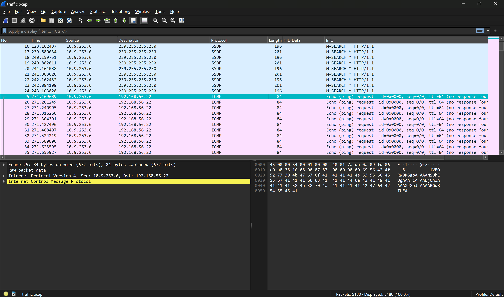
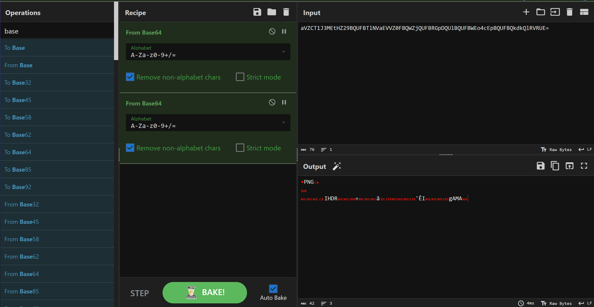

# SwampCTF.
### 1. Ping Pong.
```
Question: What happened to my traffic??? The pings?!?? They’re taking over!!!! They’re… ping… pong pingpong ping find my pong flag.
```
- Chall này là 1 chall networking nó cho ta 1 file `.pcap`, mình mở file bằng `wiershark` thì thấy rất nhiều request của protocol `ICMP`.

- Có thể dễ dàng nhận ra data của nó là 1 đoạn base64 , mình có thử copy đoạn base64 này ở cái request đầu tiên ( No. 25) xem nó là gì.

- Đoạn base này mình decode thì ta có thể thấy nó có header của 1 file `png`, mình hiểu ra ngay là ta cần sẽ lọc ra hết các dữ liệu ghép nó lại thành 1 ảnh hoàn chỉnh, ở đây mình xài `Tshark` để lấy dữ liệu cho nó dễ :
```
tshark -r traffic.pcap -Y "icmp" -T fields -e "data" > data.txt
```
- Dữ liệu nhận về sẽ là hex , nên cần phải decode sang string 1 lần nữa, và xài `CyberChef` để nó tự động lưu thành 1 file ảnh.


- *`FLAG: swampCTF{d474_15_3v3rywh3r3}`*.
### New C2 Channel.
```
Question: Sometimes you can exfiltrate data with more than just plain text. Can you figure out how the attacker smuggled out the flag on our network?
```
- Bài này cũng thế chall cho ta 1 file `.pcap` vào wireshark check tiếp hoiii, chuyện là chẳng có gì mình cứ lướt lướt xem thì thấy cái này nó sú lém.

- Nó có chữ trên đó, nên mình cũng check thêm thử những cái khác xem như nào, điểm chúng của những dòng có flag như này đều có protocol là `http` và có length = 369 , mình filter bằng `frame.len == 369`.

- quả thật flag được giấu ở đây :)) , mình chỉ việc xài phím mũi tên xuống ghi chú lại flag thuuiii.
- *`FLAG: swampCTF{w3lc0m3_70_7h3_l4nd_0f_7h3_pc4p}`*.
### Notoriously Tricky Login Mess (Part 1).
```
Question: We found out a user account has been compromised on our network. We took a packet capture of the time that we believe the remote login happened. Can you find out what the username of the compromised account is? Flag format: swampCTF{username}
```
- Bài này cho ta 1 file `pcap` và flag sẽ là username của victim, mình cùng vào wireshark check thử xem có gì ko nhé.

- Thì mình thấy cái này , mình liền xài filter là `http` để check xem có user nào khác ko thì quả thật có 1 user khác là `adamkadaban`.

- *`FLAG : swampCTF{adamkadaban}`*.
### Notoriously Tricky Login Mess (Part 2).
```
Question: Great job finding the username! We want to find out the password of the account now to see how it was so easily breached. Can you help? Flag format: swampCTF{password}
```
- Bài này có cùng 1 file pcap của bài trước bài này yêu cầu ta tìm pass của user vừa rồi, cũng với filter trên mình thấy có dòng `NTLMSSP_CHALLENGE` và `NTLMSSP_AUTH`.

- Hãy xem [video này](https://www.youtube.com/watch?v=lhhlgoMjM7o) , nó sẽ chỉ các bạn trích xuất giá trị hash tổng hợp lại , sử dụng `hashcat` là sẽ thu được pass.
```
User: adamkadaban
Domain: NULL
Challenge: 9860ff77ebae7c49
HMAC-MD5: 427e62eb532e7cf982af3a23fb5aa4b2
NTLMv22Response: 427e62eb532e7cf982af3a23fb5aa4b2010100000000000000a205e9c266da01e7973bcb0507f9230000000002001e0045004300320041004d0041005a002d00450033003300530047004c00380001001e0045004300320041004d0041005a002d00450033003300530047004c00380004001e0045004300320041004d0041005a002d00450033003300530047004c00380003001e0045004300320041004d0041005a002d00450033003300530047004c003800070008001998a3e4c266da010000000000000000
```
- Mình thu được dữ liệu như sau , và để vào 1 file để `hashcat` nó cook thì sẽ trông như này:
```
adamkadaban:::9860ff77ebae7c49:427e62eb532e7cf982af3a23fb5aa4b2:010100000000000000a205e9c266da01e7973bcb0507f9230000000002001e0045004300320041004d0041005a002d00450033003300530047004c00380001001e0045004300320041004d0041005a002d00450033003300530047004c00380004001e0045004300320041004d0041005a002d00450033003300530047004c00380003001e0045004300320041004d0041005a002d00450033003300530047004c003800070008001998a3e4c266da010000000000000000
```
- Kết quả sẽ như này:
```
$ hashcat -a 0 -m 5600 pass.txt /usr/share/wordlists/rockyou.txt
hashcat (v6.2.6) starting

OpenCL API (OpenCL 3.0 PoCL 5.0+debian  Linux, None+Asserts, RELOC, SPIR, LLVM 16.0.6, SLEEF, DISTRO, POCL_DEBUG) - Platform #1 [The pocl project]
==================================================================================================================================================
* Device #1: cpu-haswell-12th Gen Intel(R) Core(TM) i5-12500H, 2840/5744 MB (1024 MB allocatable), 16MCU

Minimum password length supported by kernel: 0
Maximum password length supported by kernel: 256

Hashes: 1 digests; 1 unique digests, 1 unique salts
Bitmaps: 16 bits, 65536 entries, 0x0000ffff mask, 262144 bytes, 5/13 rotates
Rules: 1

Optimizers applied:
* Zero-Byte
* Not-Iterated
* Single-Hash
* Single-Salt

ATTENTION! Pure (unoptimized) backend kernels selected.
Pure kernels can crack longer passwords, but drastically reduce performance.
If you want to switch to optimized kernels, append -O to your commandline.
See the above message to find out about the exact limits.

Watchdog: Hardware monitoring interface not found on your system.
Watchdog: Temperature abort trigger disabled.

Host memory required for this attack: 4 MB

Dictionary cache hit:
* Filename..: /usr/share/wordlists/rockyou.txt
* Passwords.: 14344385
* Bytes.....: 139921507
* Keyspace..: 14344385

ADAMKADABAN:::9860ff77ebae7c49:427e62eb532e7cf982af3a23fb5aa4b2:010100000000000000a205e9c266da01e7973bcb0507f9230000000002001e0045004300320041004d0041005a002d00450033003300530047004c00380001001e0045004300320041004d0041005a002d00450033003300530047004c00380004001e0045004300320041004d0041005a002d00450033003300530047004c00380003001e0045004300320041004d0041005a002d00450033003300530047004c003800070008001998a3e4c266da010000000000000000:emilyyoudontknowmypassword     

Session..........: hashcat
Status...........: Cracked
Hash.Mode........: 5600 (NetNTLMv2)
Hash.Target......: ADAMKADABAN:::9860ff77ebae7c49:427e62eb532e7cf982af...000000
Time.Started.....: Mon Apr 15 16:34:55 2024 (3 secs)
Time.Estimated...: Mon Apr 15 16:34:58 2024 (0 secs)
Kernel.Feature...: Pure Kernel
Guess.Base.......: File (/usr/share/wordlists/rockyou.txt)
Guess.Queue......: 1/1 (100.00%)
Speed.#1.........:  2590.5 kH/s (1.30ms) @ Accel:512 Loops:1 Thr:1 Vec:8
Recovered........: 1/1 (100.00%) Digests (total), 1/1 (100.00%) Digests (new)
Progress.........: 8331264/14344385 (58.08%)
Rejected.........: 0/8331264 (0.00%)
Restore.Point....: 8323072/14344385 (58.02%)
Restore.Sub.#1...: Salt:0 Amplifier:0-1 Iteration:0-1
Candidate.Engine.: Device Generator
Candidates.#1....: emmalovesjulie -> emiliap

Started: Mon Apr 15 16:34:41 2024
Stopped: Mon Apr 15 16:35:00 2024
```
- *`FLAG: swampCTF{emilyyoudontknowmypassword}`*.
