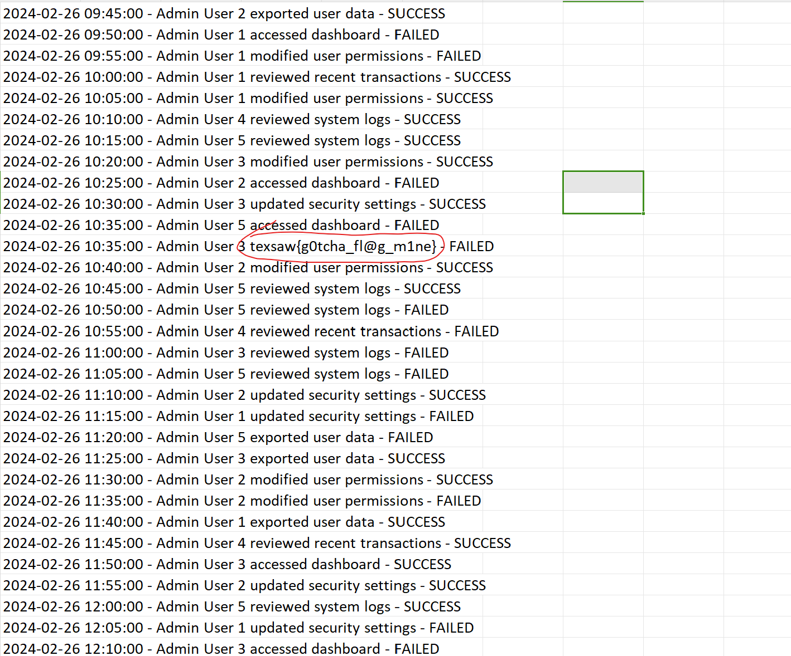
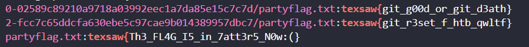

# TexSawCTF 2024.
### 1. Malicious Threat.
- Chall này cho ta 1 file `log.txt`, nó khá là bth cho đến khi mình kiếm được dòng này, nó tựa như là 1 link dẫn đến 1 trang web nào đó.

- Link trên dẫn mình đến 1 trang web cho phép mình tải 1 file `Admin.zip`.

- Unzip ra thì mình kiếm được những file này, mình mò thử xem có flag ko thì ở `users.csv` có lun flag.




### 2. The Forked Cave.
- Chall này cho mình 3 file text, nhưng mà mình luôn bật chế độ auto hiển thị file ẩn nên mình biết là có 1 file `.git` ẩn trong folder này.
 
- Mấy bài `.git` thì cứ xài `GitTool` thuiii.
```
sudo bash extractor.sh /mnt/d/FORENSICS/challenge/TexSAWCTF/the-forked-cave /mnt/d/FORENSICS/challenge/TexSAWCTF/the-forked-cave
###########
# Extractor is part of https://github.com/internetwache/GitTools
#
# Developed and maintained by @gehaxelt from @internetwache
#
# Use at your own risk. Usage might be illegal in certain circumstances.
# Only for educational purposes!
###########
[+] Found commit: 02589c89210a9718a03992eec1a7da85e15c7c7d
[+] Found file: /mnt/d/FORENSICS/challenge/TexSAWCTF/the-forked-cave/0-02589c89210a9718a03992eec1a7da85e15c7c7d/brawler.txt
[+] Found file: /mnt/d/FORENSICS/challenge/TexSAWCTF/the-forked-cave/0-02589c89210a9718a03992eec1a7da85e15c7c7d/partyflag.txt
[+] Found file: /mnt/d/FORENSICS/challenge/TexSAWCTF/the-forked-cave/0-02589c89210a9718a03992eec1a7da85e15c7c7d/priestess.txt
[+] Found file: /mnt/d/FORENSICS/challenge/TexSAWCTF/the-forked-cave/0-02589c89210a9718a03992eec1a7da85e15c7c7d/soldier.txt
[+] Found file: /mnt/d/FORENSICS/challenge/TexSAWCTF/the-forked-cave/0-02589c89210a9718a03992eec1a7da85e15c7c7d/wizard.txt
[+] Found commit: 9c6d7b5d77ba2f73fca83d026de1fe7904ce6e0b
[+] Found file: /mnt/d/FORENSICS/challenge/TexSAWCTF/the-forked-cave/1-9c6d7b5d77ba2f73fca83d026de1fe7904ce6e0b/brawler.txt
[+] Found file: /mnt/d/FORENSICS/challenge/TexSAWCTF/the-forked-cave/1-9c6d7b5d77ba2f73fca83d026de1fe7904ce6e0b/creeper.txt
[+] Found file: /mnt/d/FORENSICS/challenge/TexSAWCTF/the-forked-cave/1-9c6d7b5d77ba2f73fca83d026de1fe7904ce6e0b/demon.txt
[+] Found file: /mnt/d/FORENSICS/challenge/TexSAWCTF/the-forked-cave/1-9c6d7b5d77ba2f73fca83d026de1fe7904ce6e0b/goblin.txt
[+] Found file: /mnt/d/FORENSICS/challenge/TexSAWCTF/the-forked-cave/1-9c6d7b5d77ba2f73fca83d026de1fe7904ce6e0b/priestess.txt
[+] Found file: /mnt/d/FORENSICS/challenge/TexSAWCTF/the-forked-cave/1-9c6d7b5d77ba2f73fca83d026de1fe7904ce6e0b/skeleton.txt
[+] Found file: /mnt/d/FORENSICS/challenge/TexSAWCTF/the-forked-cave/1-9c6d7b5d77ba2f73fca83d026de1fe7904ce6e0b/soldier.txt
[+] Found file: /mnt/d/FORENSICS/challenge/TexSAWCTF/the-forked-cave/1-9c6d7b5d77ba2f73fca83d026de1fe7904ce6e0b/wizard.txt
[+] Found commit: fcc7c65ddcfa630ebe5c97cae9b014389957dbc7
[+] Found file: /mnt/d/FORENSICS/challenge/TexSAWCTF/the-forked-cave/2-fcc7c65ddcfa630ebe5c97cae9b014389957dbc7/knight.txt
[+] Found file: /mnt/d/FORENSICS/challenge/TexSAWCTF/the-forked-cave/2-fcc7c65ddcfa630ebe5c97cae9b014389957dbc7/partyflag.txt
[+] Found file: /mnt/d/FORENSICS/challenge/TexSAWCTF/the-forked-cave/2-fcc7c65ddcfa630ebe5c97cae9b014389957dbc7/priestess.txt
```
- Nếu bạn đọc các file text mà chall cho thì flag sẽ nằm ở file `party.txt`, nma mình sử dụng lệnh này để kiếm cho lẹ, Với lệnh này nó cho phép ta đọc được trong 1 folder lun mà ko cần trỏ tới folder đó tiện hơn rất nhiều so với `strings`.
```
$  grep -r "texsaw{" *
```

- Nhập 1 trong 2 cái đầu thì cái đầu là flag đúng.
- *`FLAG: texsaw{git_g00d_or_git_d3ath}`*.