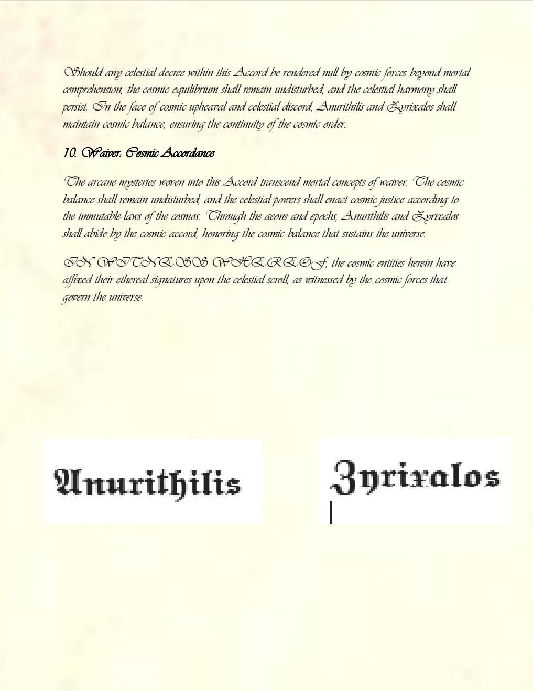
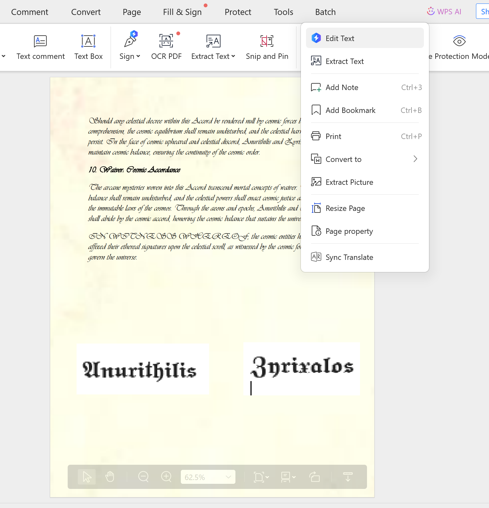
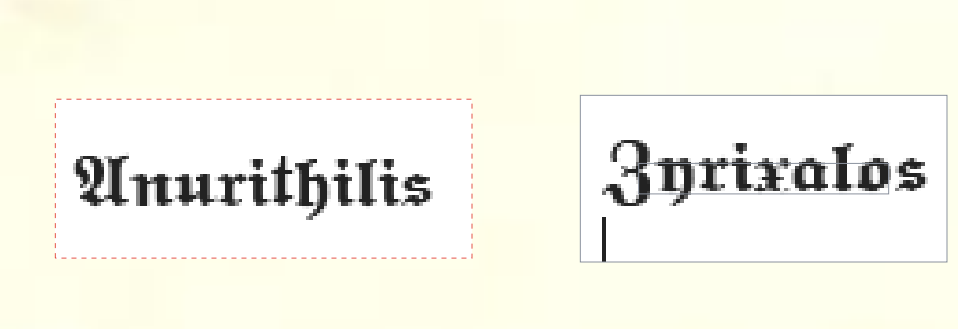
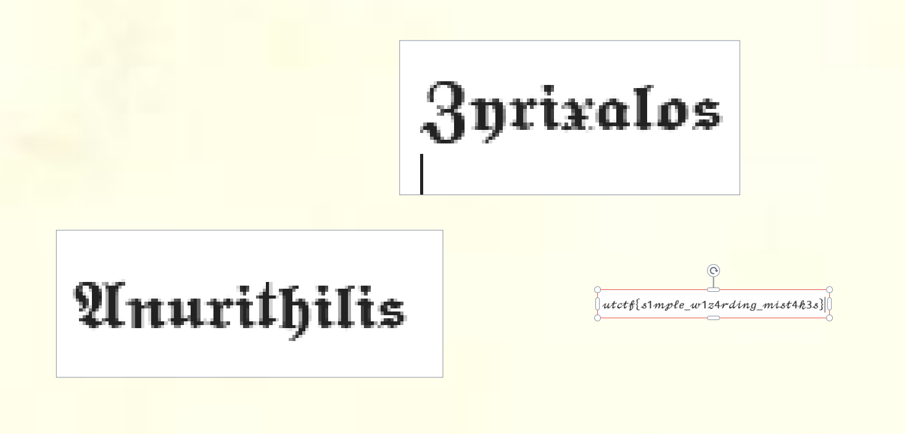
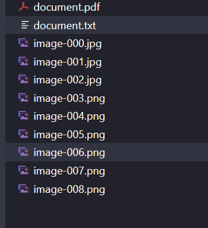
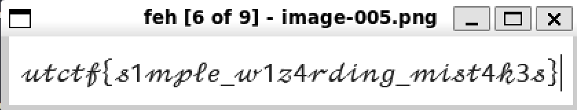
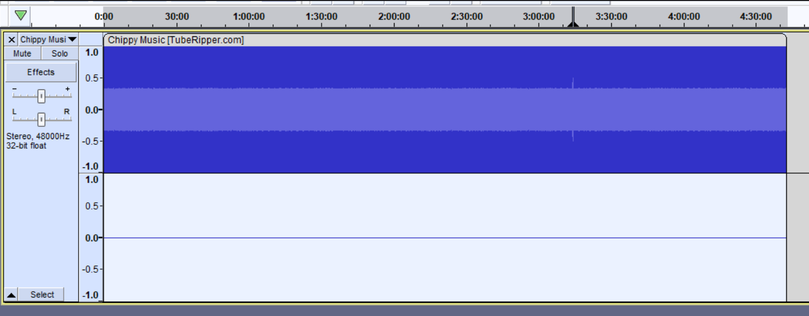
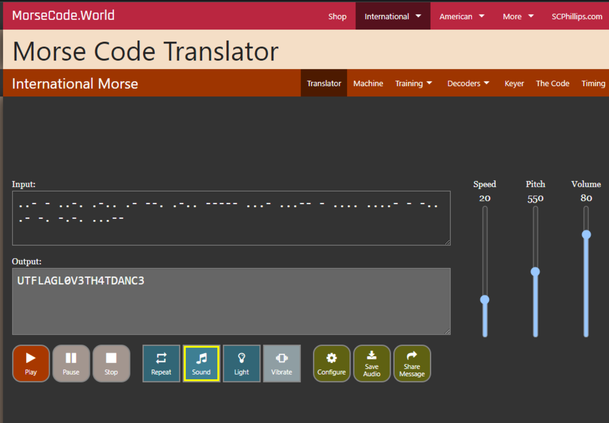

# Write up.
### Contracts.
```
Question: Magical contracts are hard. Occasionally, you sign with the flag instead of your name. It happens.
```
- Chall cho ta 1 file pdf , và đề có bảo là flag sẽ nằm đâu đó ở phần ký tên.

- Phần ký tên là 1 dạng image , mình có thử xài `pdftotext` nhưng không có cái gì cả.
- Bài này có 2 cách giải 1 là thủ công còn 2 là xài tool.
- Cách đầu tiên mình xài thì , ban đầu mình nghĩ là flag được dấu ở phần ký tên mà chỗ ký tên trong file pdf là 1 ảnh , mình nghĩ nó sẽ giấu hoặc che flag bằng image đó .

- Mình vào phần `Edit text` để chỉnh sửa file pdf này thì thấy 1 cái hitbox ẩn đằng sau image chữ ký.

- Mình kéo nó ra thì thu được flag hoiii.

- Cách thứ 2 ta sẽ xài `pdfimage` để trích xuất toàn bộ image của 1 file pdf ra thôi.
```
$ pdfimages -all document.pdf image
```

- nó sẽ cho ta 1 list ảnh , mình xài feh để xem hết các ảnh là có flag.
```
$ feh *
```

-*`FLAG: utflag{s1mple_w1z4rding_mist4k3s}`*.
### Study Music.
```
Question: I listen to this while studying for my exams. https://youtu.be/1Cbaa6dO2Yk Note: the audio is the focus of this challenge. The video can be safely ignored.
```
- Chal này cho mình 1 đường [link youtube](https://youtu.be/1Cbaa6dO2Yk), với mấy bài video dài thế này thì chỉ yêu cầu mình mò ra thôi :))) , nhưng mà khá hên đề đã hint cho chúng ta rằng là hãy chỉ quan tâm đến âm thanh thôi ko cần phải chú ý đến video làm gì. 
- Mình xài `https://www.yt1s.com/vi14sq` để tải nó về , mất 5p và mất 20p để convert nó sang `mp3` và hơn 20p để có thể mở trong `audacity`.

- Và đây sự khác biệt ở `3:14:00` nó có 1 đoạn sóng nhô lên, mình vào nghe thử thì nó là mã `morse`, nhưng mà nó được chèn vào giữa đoạn nhạc luôn cho nên khi mà ta đưa đoạn morse này lên web thì nó sẽ bị loạn và flag sẽ bị sai , nên mình đã nghe chay :((( , điếc vã òn thì được như này.

- *`FLAG: utflag{L0V3TH4TDANC3}`*
### A Very Professional Website.
```
Question: Web dev skills go brrr http://puffer.utctf.live:8549
```
- Này là 1 chall về web , nó khá lạ.
- Mình xài `gobuster` để check xem trên web này có thư mục ẩn nào không.
```
└─$ gobuster dir -u http://puffer.utctf.live:8549 -w /usr/share/wordlists/common.txt
===============================================================
Gobuster v3.6
by OJ Reeves (@TheColonial) & Christian Mehlmauer (@firefart)
===============================================================
[+] Url:                     http://puffer.utctf.live:8549
[+] Method:                  GET
[+] Threads:                 10
[+] Wordlist:                /usr/share/wordlists/common.txt
[+] Negative Status codes:   404
[+] User Agent:              gobuster/3.6
[+] Timeout:                 10s
===============================================================
Starting gobuster in directory enumeration mode
===============================================================
/.git/HEAD            (Status: 200) [Size: 21]
/index.html           (Status: 200) [Size: 590]
Progress: 4614 / 4615 (99.98%)
===============================================================
Finished
===============================================================

```
- Và ta search ra được 1 file `.git` ẩn , và các file git đừng nghĩ nhiều ta sẽ xài `GitTools` để giải nó.
```
└─$ bash gitdumper.sh http://puffer.utctf.live:8549/.git/ ~/Desktop/bin 
###########
# GitDumper is part of https://github.com/internetwache/GitTools
#
# Developed and maintained by @gehaxelt from @internetwache
#
# Use at your own risk. Usage might be illegal in certain circumstances.
# Only for educational purposes!
###########


[*] Destination folder does not exist
[+] Creating /home/zuy/Desktop/bin/.git/
[+] Downloaded: HEAD
[-] Downloaded: objects/info/packs
[+] Downloaded: description
[+] Downloaded: config
[+] Downloaded: COMMIT_EDITMSG
[+] Downloaded: index
[-] Downloaded: packed-refs
[-] Downloaded: refs/heads/master
[-] Downloaded: refs/remotes/origin/HEAD
[-] Downloaded: refs/stash
[+] Downloaded: logs/HEAD
[-] Downloaded: logs/refs/heads/master
[-] Downloaded: logs/refs/remotes/origin/HEAD
[-] Downloaded: info/refs
[+] Downloaded: info/exclude
[-] Downloaded: /refs/wip/index/refs/heads/master
[-] Downloaded: /refs/wip/wtree/refs/heads/master
[-] Downloaded: objects/00/00000000000000000000000000000000000000
[+] Downloaded: objects/e2/a975aa4dc20fd279591267b64617f73ede199e
[+] Downloaded: objects/bb/a639202cd2e6228b65a4d20bf0e9c38dd4e479
[+] Downloaded: objects/9d/525e298e3b9fc70c9e8110b593c65c8b897361
[+] Downloaded: objects/d6/cebe17a2ef4c5eec1f7ee1ed1b77d9a66be79c
[+] Downloaded: objects/73/f3e2181302f0aef5da05ae4f4948aba58ebded
[+] Downloaded: objects/45/0b6bb9e3944e09e345348840a0311e7b70e2e0
[+] Downloaded: objects/9c/8220f43c7c86d4b7d284c42c9cd515f15e79c8
[+] Downloaded: objects/1d/2961fb02140ea819212ac081b0291c323fd056
```
- Mình tải về các objects sau , vẫn chă có 1 cái gì nó quá là sus và ta vẫn có thể extract thêm từ các objects nữa.
```
└─$ bash extractor.sh ~/Desktop/bin/ ~/Desktop/bin
###########
# Extractor is part of https://github.com/internetwache/GitTools
#
# Developed and maintained by @gehaxelt from @internetwache
#
# Use at your own risk. Usage might be illegal in certain circumstances.
# Only for educational purposes!
###########
[+] Found commit: e2a975aa4dc20fd279591267b64617f73ede199e
[+] Found file: /home/zuy/Desktop/bin/0-e2a975aa4dc20fd279591267b64617f73ede199e/documentation.html
[+] Found file: /home/zuy/Desktop/bin/0-e2a975aa4dc20fd279591267b64617f73ede199e/index.html
[+] Found file: /home/zuy/Desktop/bin/0-e2a975aa4dc20fd279591267b64617f73ede199e/links.html
[+] Found commit: bba639202cd2e6228b65a4d20bf0e9c38dd4e479
[+] Found file: /home/zuy/Desktop/bin/1-bba639202cd2e6228b65a4d20bf0e9c38dd4e479/documentation.html
[+] Found file: /home/zuy/Desktop/bin/1-bba639202cd2e6228b65a4d20bf0e9c38dd4e479/index.html
[+] Found file: /home/zuy/Desktop/bin/1-bba639202cd2e6228b65a4d20bf0e9c38dd4e479/links.html
[+] Found file: /home/zuy/Desktop/bin/1-bba639202cd2e6228b65a4d20bf0e9c38dd4e479/secrets.html
```
- Ta có thể thấy ta đã extract được thêm các file ẩn từ 2 objects trên, và you see you see , `secrets.html` , mình string hoặc cat nó ra thì được 1 đoạn như sau.
```
<!DOCTYPE html>
<html lang="en">
<head>
    <meta charset="UTF-8">
    <meta name="viewport" content="width=device-width, initial-scale=1.0">
    <title>Secrets</title>
</head>
<body>
    <p>It's no big deal if I store secrets here, right? I mean I'll never merge it in to the main branch, so no one but me should ever be able to get here!</p>
    <ul>
        <li>The moon landings were faked on the moon.</li>
        <li>Area 51 does not perform extraterrestrial research. Rather, it is an exclusive resort that only the elites can access.</li>
        <li>The government convinced us rocks can think to cover up the fact that computers are actually powered by tiny hamsters on wheels.</li>
        <li>The real reason your shoes come untied is to keep you distracted. From what? ... I don't remember, I just got distracted tying my shoe.</li>
        <li>Stoplights don't actually help with traffic flow - they are there to test the population's patience and obedience.</li>
        <li>Elevators don't actually go up and down. Rather, they transport you to a parallel dimension which contains your desired floor.</li>
        <li>The Earth does not exist. #NoEarthSociety</li>
        <li>If you squint your eyes, every country's flag contains very tiny text which reads: utflag{gitR3fl0g}</li>
    </ul>
</body>
</html>
```
- YEAR serrr và đây là flag.
- *`FLAG: utflag{gitR3fl0g}`*
