# I. Write up.
### 1. Eternally Pwned Infiltration.
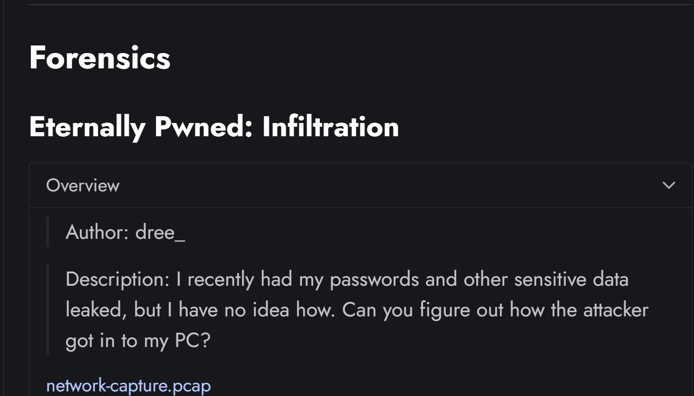
- chall cho 1 file `pcap` , ta mở thử xem như nào nhé.
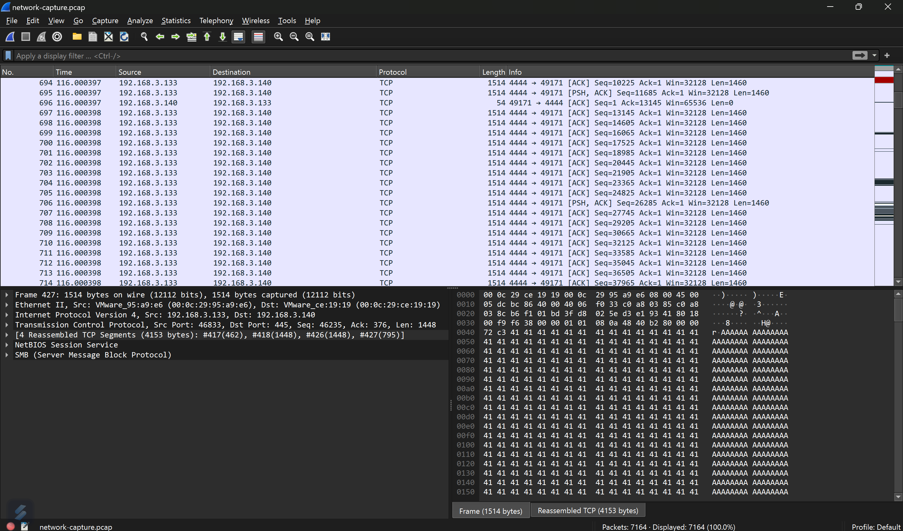
- Tổng quan mà nói thì bài này vừa dễ mà cũng khá là khó, cơ bản là phải mò khá nhiều á, nhìn vào ảnh thì ta thấy 1 đống TCP lun nhưng mà khi follow thì rất là nhiều dữ liệu rác , chẳng có 1 tí manh mối hay 1 hướng nào cụ thể.
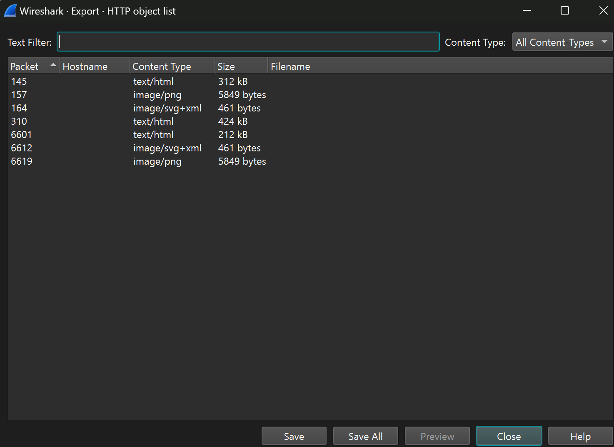
- Mình cũng đã có thử tải các object về nhưng chả có thông tin hay flag gì cả.
- Thế thì cách solve là gì, đó là check hết tất cả các protocol , thì ở `SMB` protocol we got this shit.
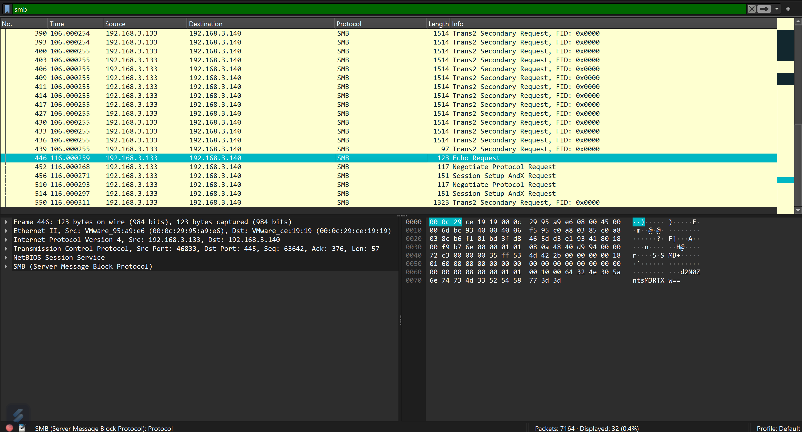
- Ta cũng có thể kiếm được full flag khi mà follow `SMB` lun nhưng mà ko ngờ được đâu :))) .
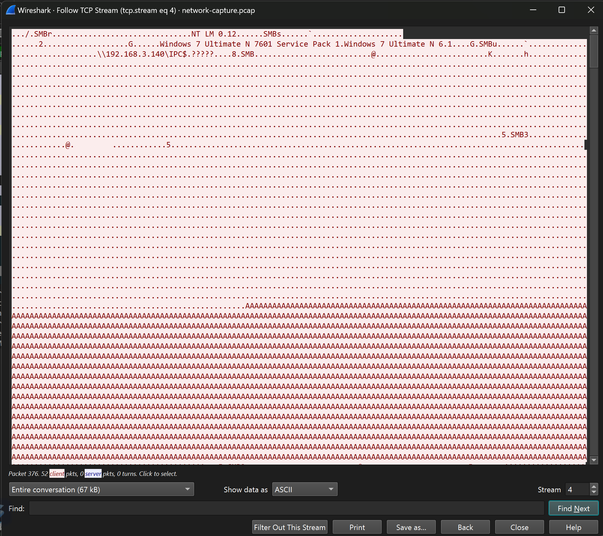
- full flag này ở trang này nè , nhưng mà có 1 ai lại đi check hết cái đống dữ liệu toàn chữ A này đâu đúng hong :)) .
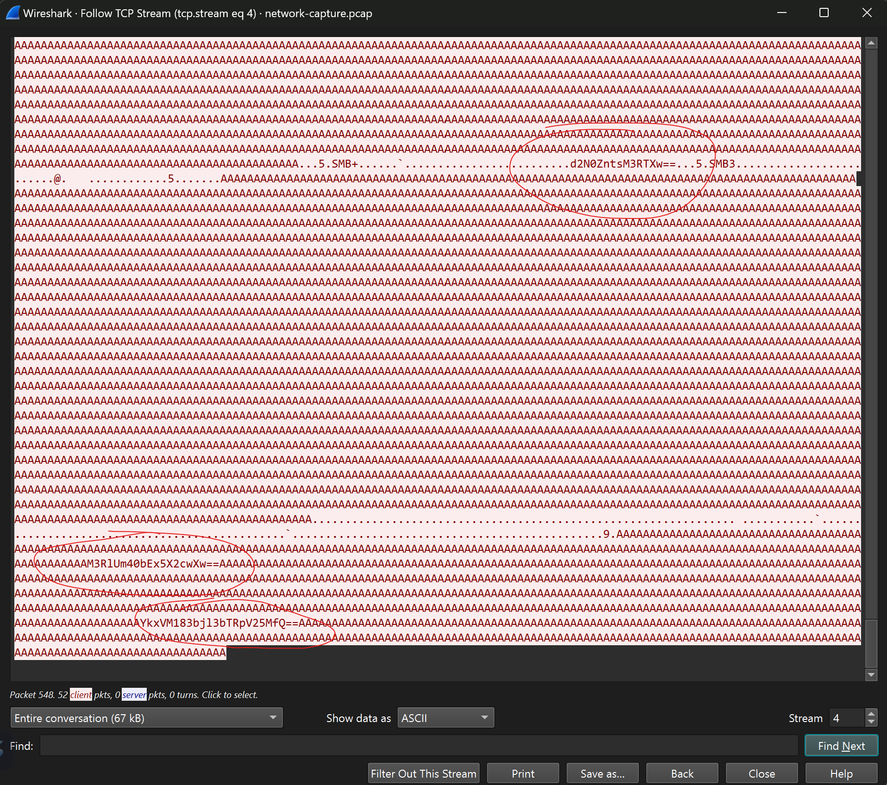
- Đây 3 cái mã base64 này là toàn bộ flag ý, nó vừa dễ mà cũng khá là khó để tìm kiếm đấy.
```
d2N0ZntsM3RTXw== equal wctf{l3tS_
M3RlUm40bEx5X2cwXw== equal 3teRn4lLy_g0_
YkxVM183bjl3bTRpV25MfQ== equal bLU3_7n9wm4iWnL}
```
- ghép lại là có flag thui , bài này mình mò vài tiếng có ra âu đọc Wu á :( .
- *`FLAG: wctf{l3tS_3teRn4lLy_g0_bLU3_7n9wm4iWnL}`*
### 2. Eternally Pwned Persistence.
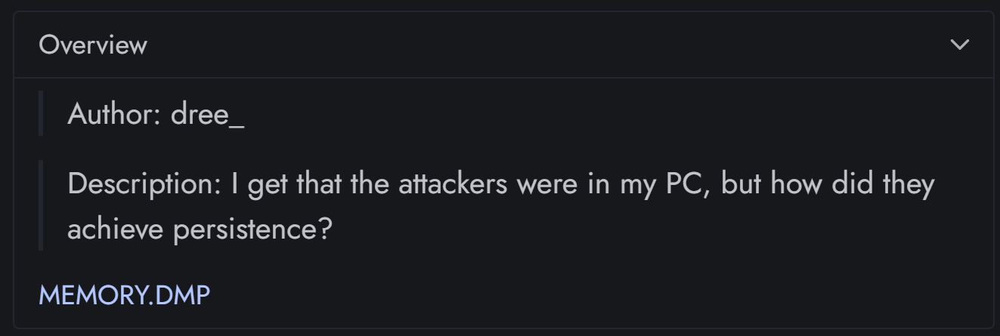
- Chal này là 1 bài memory, bài này dễ và dễ thật nha :)).
- mình xài vol3 để cook nó thoai bởi vì 1 vài bài ko cho xài vol2.
- cở bản của 1 bài memory là check `pslist` thui, để xem có cái gì đáng nghi hong.

- Đập vào con mắt mình là 1 process có tên là 1 đoạn base64 mình decode thử xem là gì.
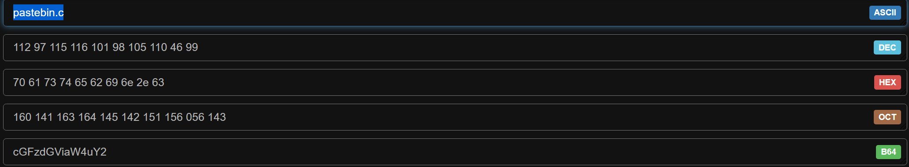
- nó là 1 `pastebin` , nhưng có vẻ nó vẫn chưa đủ , mình cần kiếm 1 link `pastebin` đầy đủ. 
- Mình check thử `cmdline` xem có file nào bí ẩn hong nha.
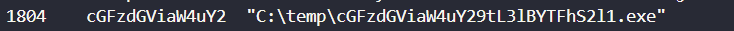
- Lại đập vào con mắt mình là 1 process chạy với tên là `cGFzdGViaW4uY29tL3lBYTFhS2l1.exe` cùng tên mà đầy đủ hơn của process trên. Decode nó ra thì được link đầy đủ của `pastebin`
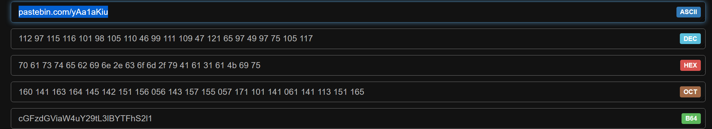
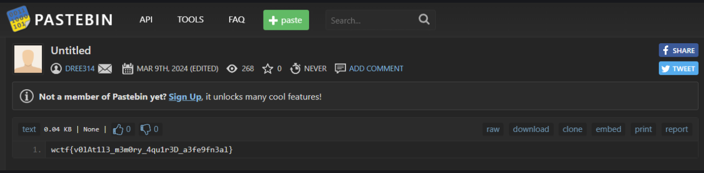
- Vào link đó thì có flag hoi.
- *`FLAG: wctf{v0lAt1l3_m3m0ry_4qu1r3D_a3fe9fn3al}`*
### 3. Log Analysis.
- Chall này cho ta 1 file log , rất là dài , và khá là khó đấy những lúc như thế này ta ko có 1 manh mối nào , chính đề bài sẽ là nguồn hint hữu ích chỉ cần cẩn thận quan sát đừng bỏ sót bất cứ 1 từ nào.
```
Challenge Description: Hi there incident responder. So we have this company that was breached sometime last week, but their SOC team only keeps HTTP request logs :( We took down all of our `wolvsecsolutions` websites as a precaution.
```
- Đề bài có đề cập tới 1 trang web tên là `wolvsecsolutions` , ta sẽ cat file log.txt ra với filter là `wolvsecsolutions` nha.
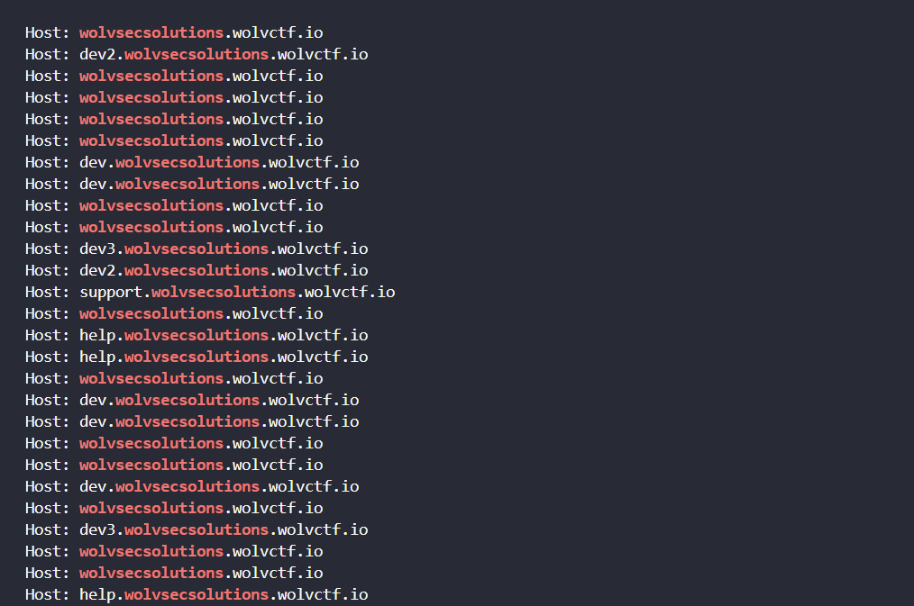
- 1 đống các đường link (URL) , vì file log rất khá nhiều nên mình lưu tất cả những link đó vào 1 file khác tên là `url.txt` nha.
```
$ cat logs.txt | grep wolvsecsolutions > url.txt
```
- Mình xóa đi chữ `Host: ` vì nó khá vô dụng , mình xài `ctrl + f` replace nó bằng ko gì cả là được :))) .
- Mình check thử vài link thì thấy nó trùng khá nhiều, mình xài lệnh này để sort lại và in ra những link khác nhau thui.
```
$ sort url.txt | uniq
```
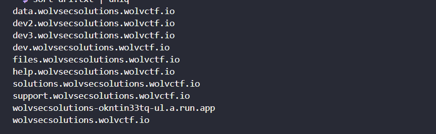
- Dây là tổng các url có trong file log.
- Check thử từng link một bằng cách nhập từng cái url vào web thui :)) .
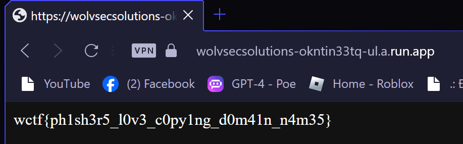
- Nhập vào link này `wolvsecsolutions-okntin33tq-ul.a.run.app` thì ra 1 trang web có flag nhaa.
- *`FLAG: wctf{ph1sh3r5_l0v3_c0py1ng_d0m41n_n4m35}`*