# Write_up KnightCTF 2024.
### 1. Flag hunt!.
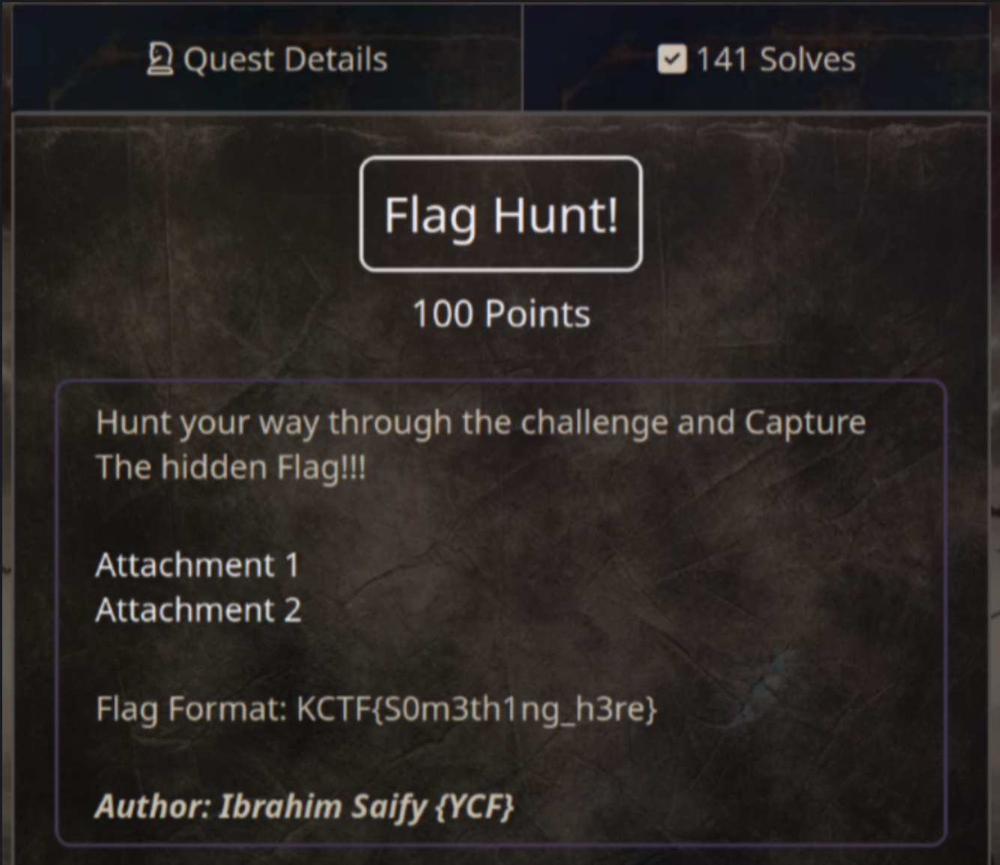
- Bài này cho mình 1 file zip có pass, nhưng lại ko cho ta mật khẩu. thế nên mình xài `john` để crack pass nha.
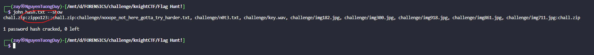
- Pass là `zippo123` nha , mình nhập pass thì nó cho mình 1001 file ảnh rick asley (rick roll vã òn) 1 file `key.wav` 1 file `n0t3.txt` và 1 file fake flag.
- file `key.wav` là mã morse , mình lên web thì được dòng chữ này `MORSECODETOTHERESCUE!!` còn file `n0t3.txt` thì nó bảo.
```
The flag is here somewhere. Keep Searching..

Tip: Use lowercase only
```
- Có nghĩa là flag nằm đâu đó trong 1001 cái ảnh kia.
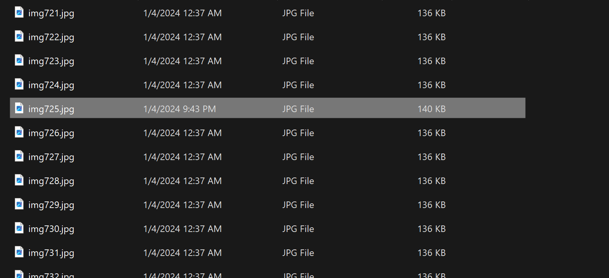
- Lúc đầu mình xem ở dạng ảnh thì thật sự chả biết nên làm gì , khi mà chuyển qua dạng list thì mình thấy có sự khác biệt ở ảnh 725 đó là dung lượng của nó , mình sử dụng `steghide` để check lun bởi vì nó cho mình cái pass ở trên , mình nhập pass ở dạng lowcase thì được file flag.txt.
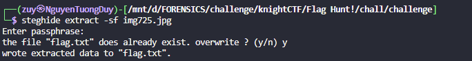
- Mở ra thỉ có flag thui.
- *`FLAG: KCTF{3mb3d_53cr37_4nd_z1pp17_4ll_up_ba6df32ce}`*
### 2. Oceanic.
- Bài này cho mình 1 file `clue.jpg` và `peaceful.wav`.


- File ảnh mình vứt lên web [Aperi](https://www.aperisolve.com) thì thu được đoạn base này `8qQd3iMYmtsyto7aXUuw1KVRpQFCRxqRtJiRgP85e36y8qQd3iMYmtsyto7aXUuw1KVRpQFCRxqRtJiRgP85e36y`.
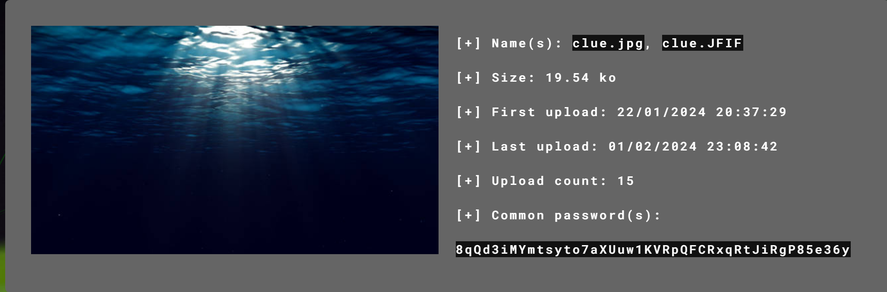
- Mình decode bằng `basse58` thì thu được đoạn sau `theoceanisactuallyreallydeeeepp`, mình nghĩ chắc cái này là pass của 1 cái gì đó nên mình mò tiếp file tiếp theo.
- File tiếp theo là 1 file âm thanh, nó chỉ có tiếng ở trong lòng nước ý , mà chắc chắn nó ko bình thường thế rồi nó sẽ có file ẩn nào đó NHƯNG quan trọng là tool gì thui, sau 1 hồi tiềm hiểu thì mình sẽ xài `DEEPSOUND 2.1` mới giải được bài này nha. 
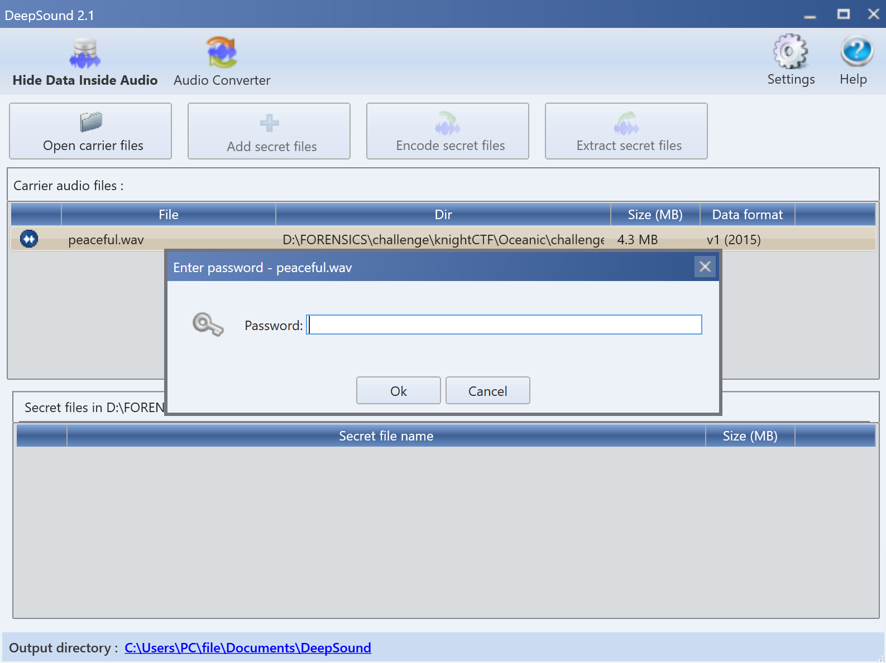
- Nó yêu cầu pass , mình nhập cái pass ở trên vào thui , nó sẽ ra 1 file là `flag.png` mình extract nó về máy thui, và nó chả có gì cả nên mình vứt lên `Aperi` tiếp.

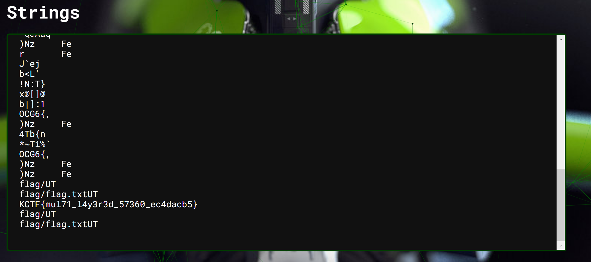
- Hoặc là các bạn cũng có thể xài `binwalk` nha.
- *`FLAG: KCTF{mul71_l4y3r3d_57360_ec4dacb5}`*
### 3. OS.
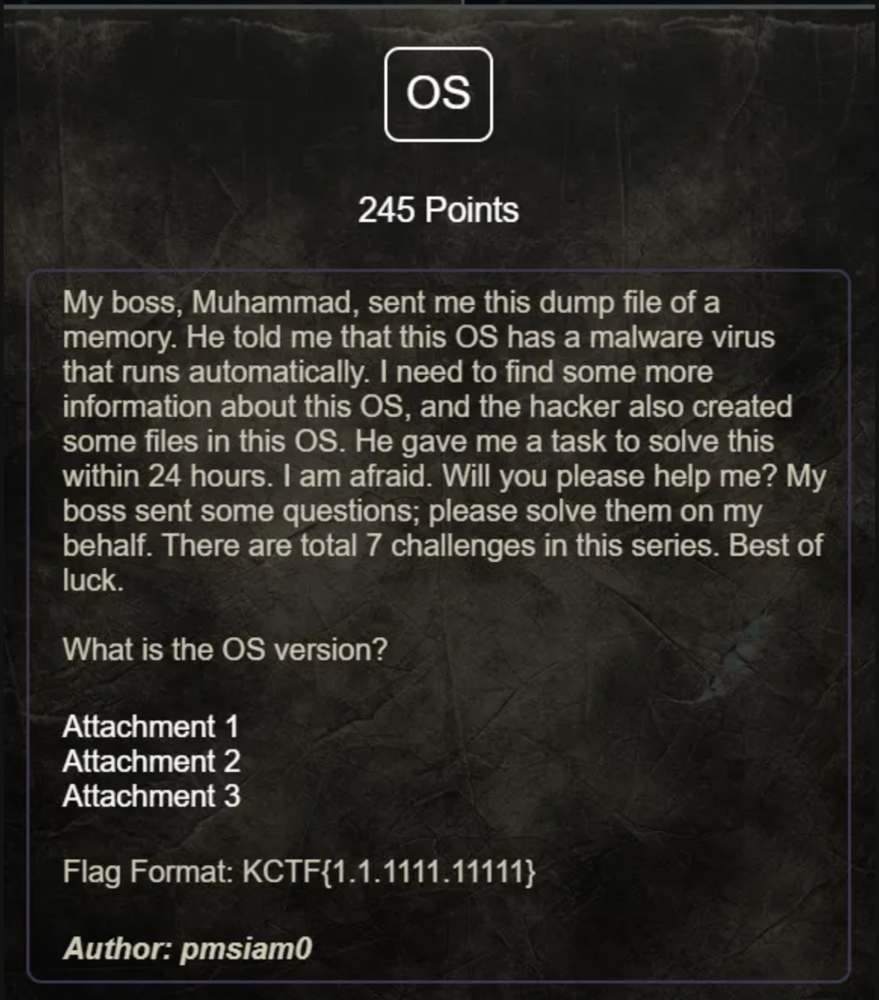
- Bài này cho mình 1 file dump , và chall hỏi là `OS version ?`. Này là thông tin cơ bản nên mình ko cần phải check bằng volatility chi cho cực mình xài `WinDBG` để check cho lẹ nhé.
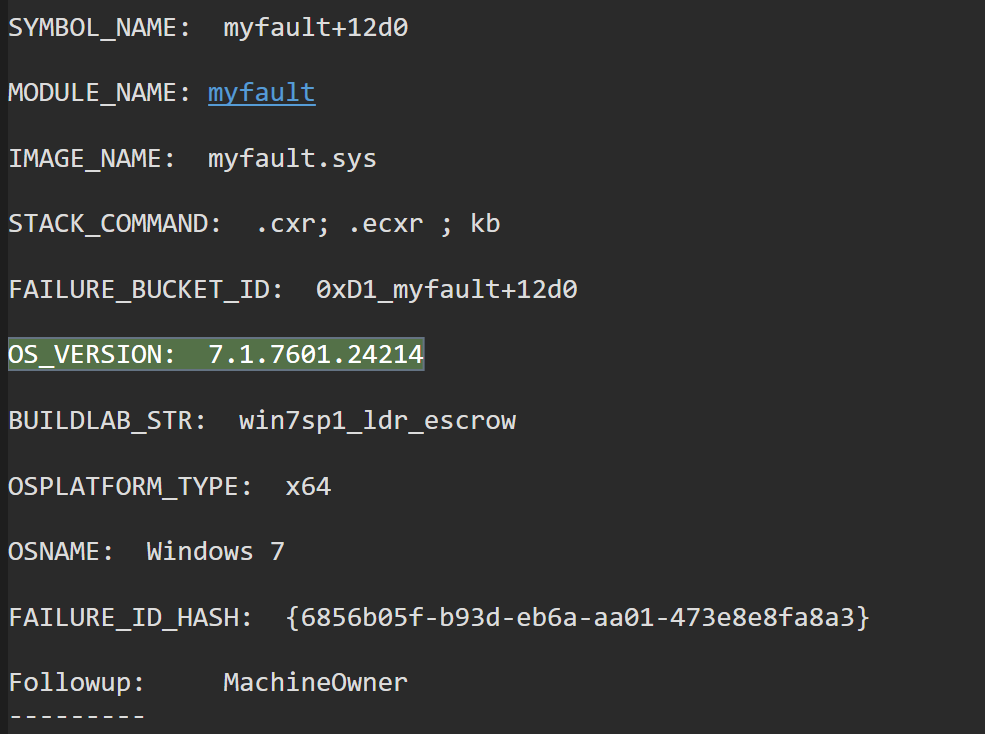
- *`FLAG: KCTF{7.1.7601.24214}`*
### 4. IP Adrr.
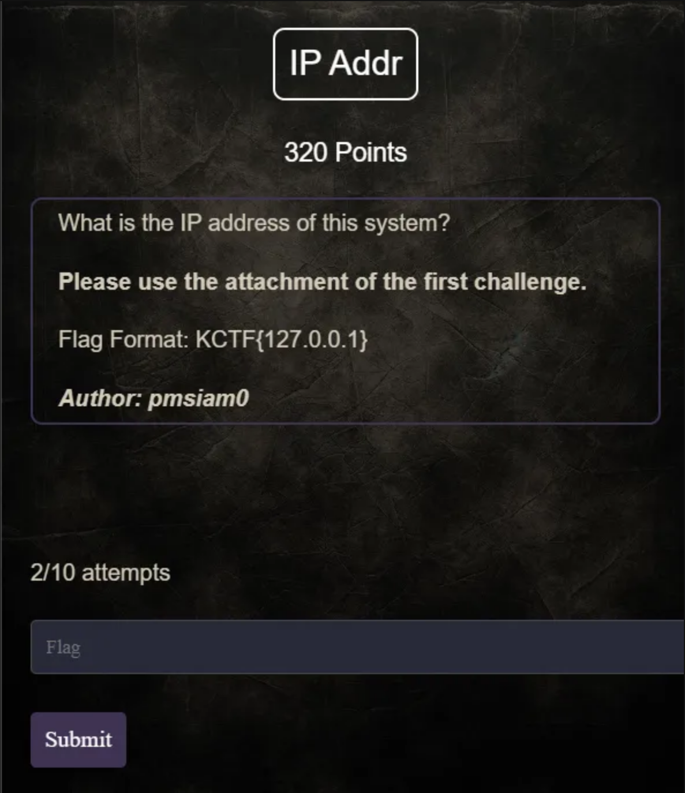
- Như tên chall nó hỏi mình `IP address` ta vẫn xài `WinDBG` nhưng ta sẽ xài lệnh như sau để có thể check đc ip nha.
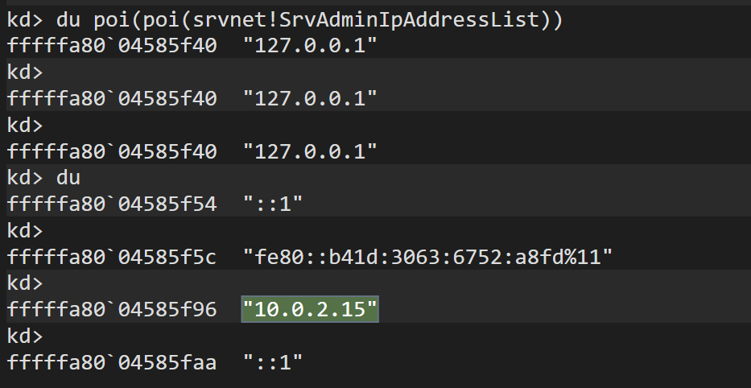
```
    kd> du poi(poi(srvnet!SrvAdminIpAddressList))
    kd> du
```
- *`FLAG: KCTF{10.0.2.15}`*.
### 5. Password.
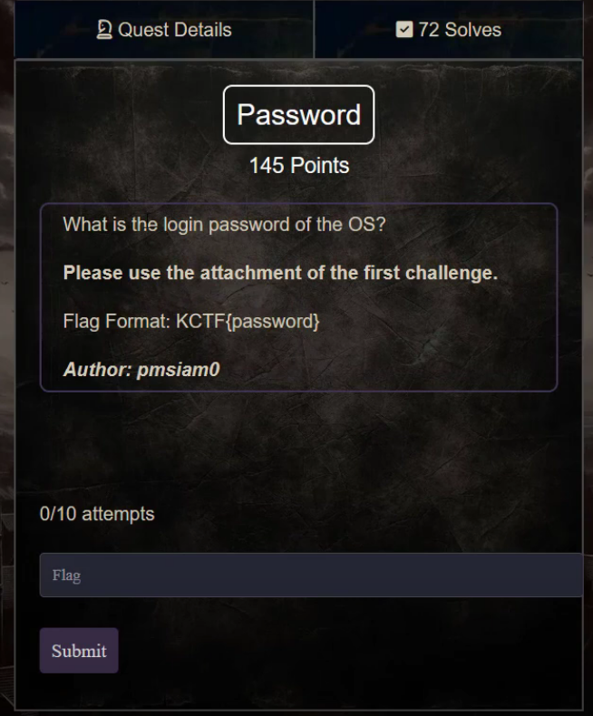
- chall này hỏi `What is the login password of the OS` , lần này thì mình sẽ phải xài volatility nha.
- Dầu tiên thì mình sẽ check profile nha , vì ta cần kiếm pass của OS nên ta sẽ check `hivelist` lun nha.
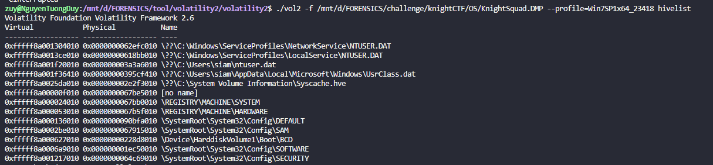
- Ở đây mình cần biết pass của OS nhưng mà chắc chắn nó sẽ ở dạng `hash` thế nên ta sẽ lấy `virtual` của `SYSTEM` và `SAM` lần lượt là `0xfffff8a000024010 và 0xfffff8a0002be010` lưu nó vào 1 file `hash.txt` và ta sử dụng `john` để crack pass nha.
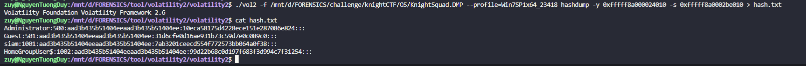
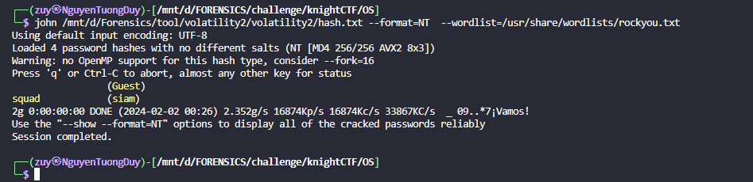
- Mình sử dụng lệnh này mới có thể crack pass nha:
```
$ john <filename> --format=NT --wordlist=/usr/share/wordlists/rockyou.txt.
```
- Pass sẽ là `squad` nha.
- *`FLAG: KCTF{squad}`*
### 6. NOTE.
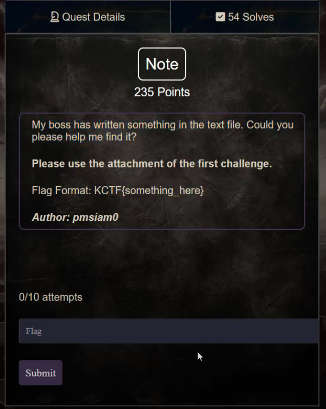
- các bài đều chung 1 file nên là mình đỡ phải check profile nhiều , Chall bào là hãy kiếm file `.txt` vậy thì mình xài `filescan` với cụm `.txt` để kiếm nha.
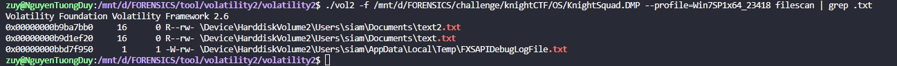
- Mình kiếm được 2 file text , còn file cuối chỉ là file hệ thống thui , mình tải về cả 2 để xem thử có gì ko nha.
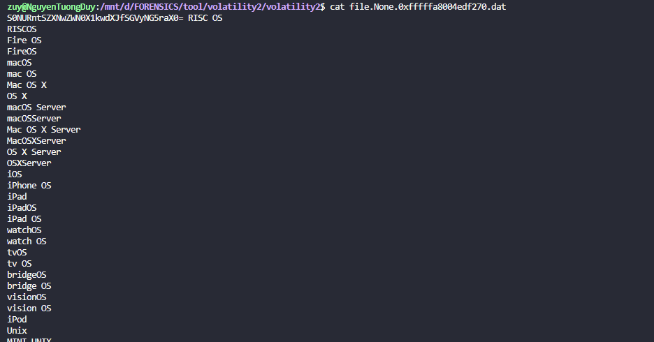
- Nó chỉ cho mình tải về 1 file `text2.txt` thui thế nên mình cat nó ra thì được 1 đoạn base khá đáng nghi này, mình decode ra thì đc flag lun.
- *`FLAG: KCTF{Respect_Y0ur_Her4nki}`*.
### 7. Excution.
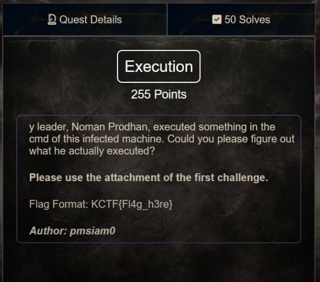
- Chall này bảo là đã thực thi 1 cái gì đó ở cmd thì mình nghĩ ngay đến check `consoles` thui , check phát có flag lun.
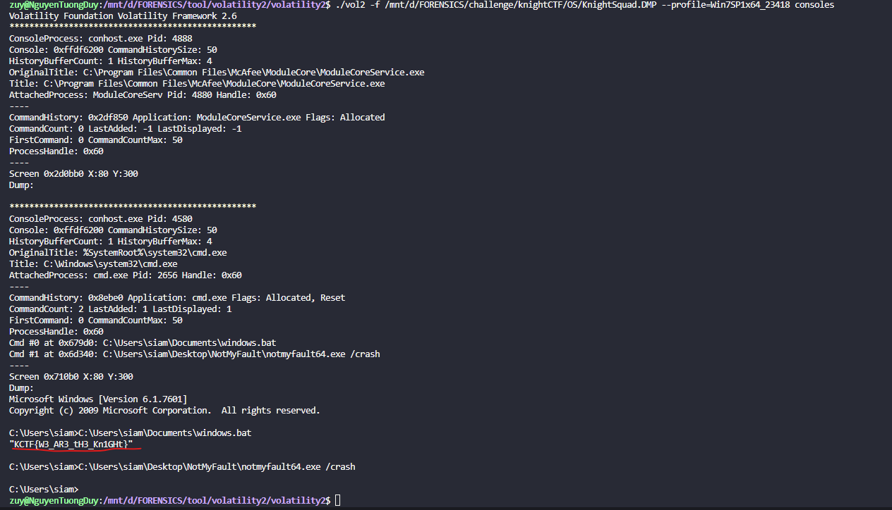
- *`FLAG: KCTF{W3_AR3_tH3_Kn1GHt}`*.
### 8. Path of the Executable.
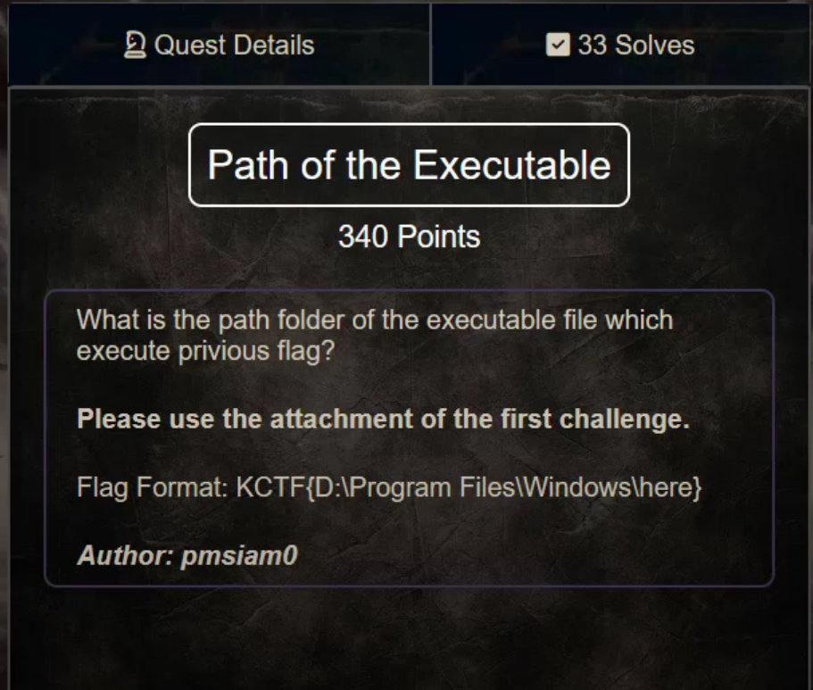
- Chall này bảo là cái dduongwd dẫn mà đã thực thi in ra flag là gì. thì mình nghĩ ngay đến chall vừa rồi.
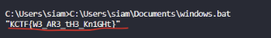
- Đây ở đây nó đã thực thi 1 cái gì đó để in ra flag , thì đường đẫn là nó lun.
- *`FLAG: KCTF{C:\Users\siam\Documents}`*
### 9. Malicious.
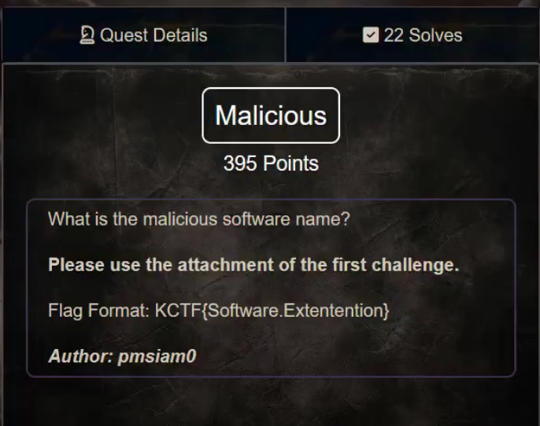
- Chall này bảo tên của phần mềm đôc hại là gì , thì mình searh thử các file `.exe`.
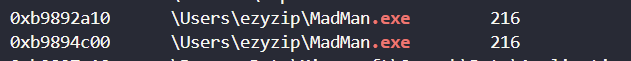
- Mình thấy cái này lạ quãi với đáng nghi quá , mình submit thì đúng lun nha.
- *`FLAG: KCTF{MadMan.exe}`*.
### 10. Vicker IP.
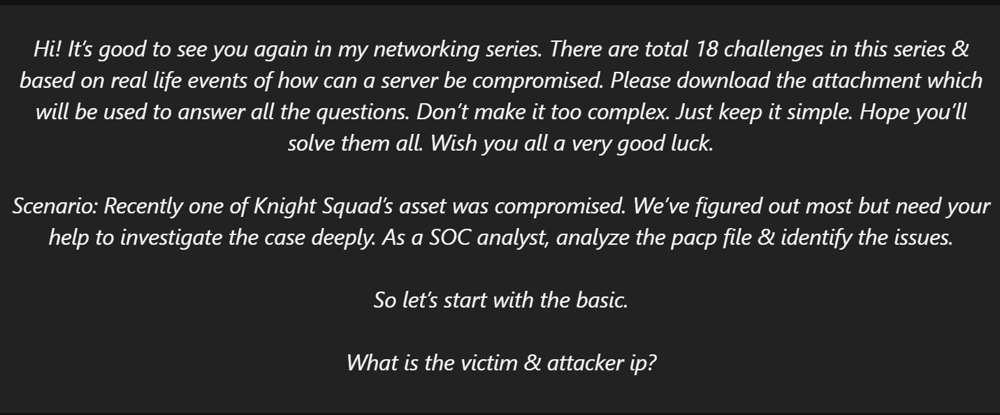
- Chall này cho ta 1 file `.pcapng` và hỏi rằng là ip của nạn nhân và attacker là gì.
- Mình mở file lên follow `TCP` thì mình thấy cái này:
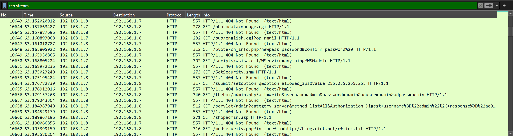
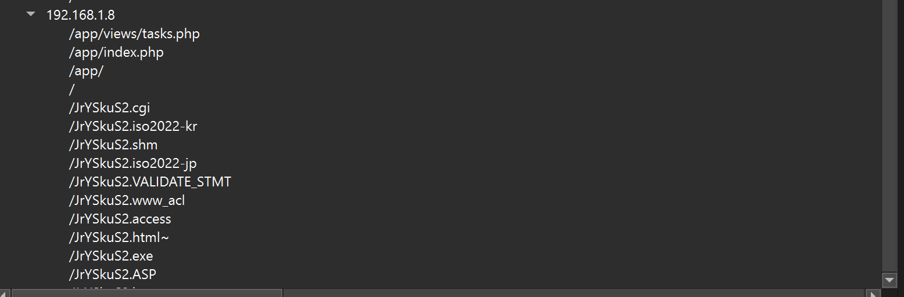
- ở địa chỉ ip `192.168.1.8` gửi rất nhiều request tới 1 địa chỉ ip là `192.168.1.7` thế nên mình nghĩ ip attacker là `192.168.1.8` và ip victim là `192.168.1.7`.
- *`FLAG: KCTF{192.168.1.8_192.168.1.7}`*.
### 11. Basic Enum.
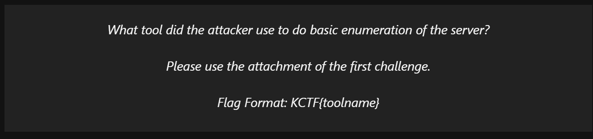
- Bài này hỏi tool mà attacker xài là gì, mình follow theo ip của victim để xem có phản hồi nào về chính xác tool mà attacker xài là gì ko.
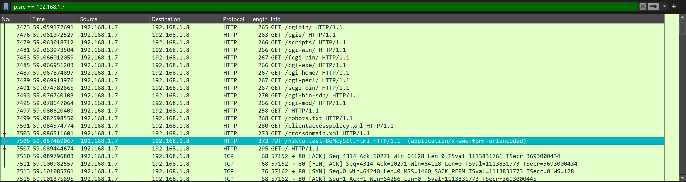
- Mình ngồi mò thì thấy đc cái này, thì tên tool sẽ là `nikto.
- *`FLAG: KCTF{nikto}`*.
