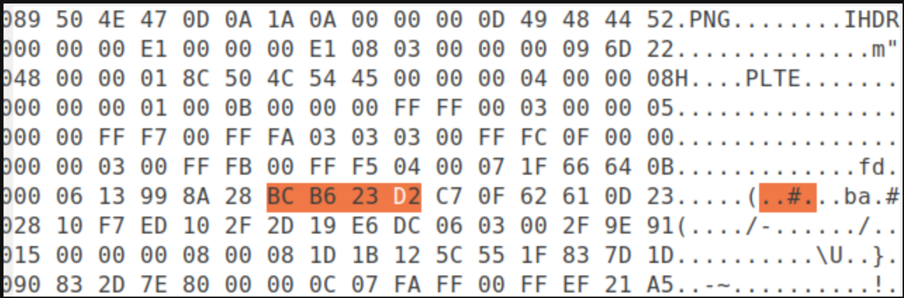
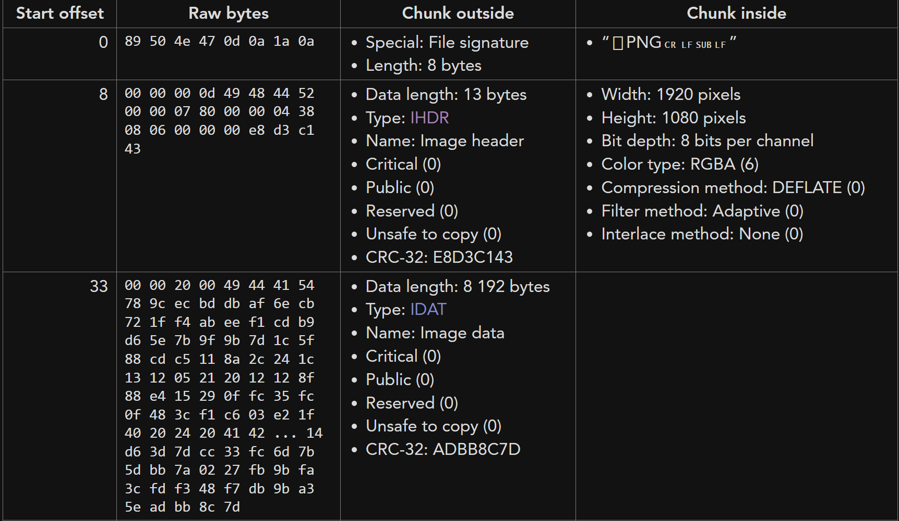
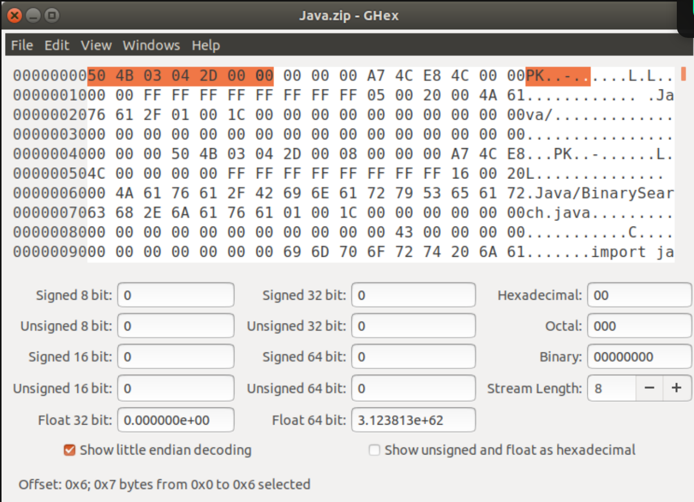
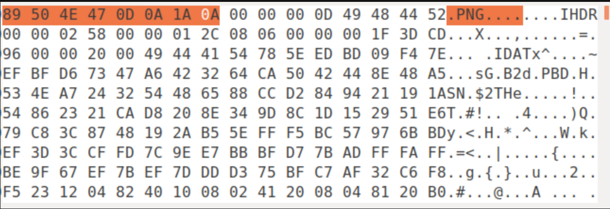

# Tổng Quan về Forensics.

## A. Forensics là gì ?

- Forensics là 1 dạng khoa học liên quan đến việc tìm hiểu , điều tra và theo dõi dấu chân được để lại sau 1 cuộc tấn công(công việc của 1 pháp y). Ở trong ngành IT thì còn được gọi là Forensics Digital (Điều tra kỹ thuật số ) hay Computer forensics, là một nhánh của ngành khoa học điều tra đề cập đến việc sử dụng các phương pháp, công cụ kỹ thuật khoa học đã được chứng minh để thu thập, bảo quản, phân tích, lập báo cáo và trình bày lại những thông tin thực tế từ các nguồn dữ liệu số với mục đích tạo điều kiện hoặc thúc đẩy việc tái hiện lại các sự kiện nhằm tìm ra hành vi phạm tội hay hỗ trợ cho việc dự đoán các hoạt động trái phép như cố ý xâm nhập, tấn công hoặc gây gián đoạn quá trình làm việc của một hệ thống.### A/1. Forensics gồm mấy loại ?.


  - Forensics là 1 mảng rất rộng, nó tập hợp và tồn tại ở nhiều thể loại nhưng trong CTF nó được tập hợp ở 1 số các dạng sau:
    ```
    - Network Forensics (Điều tra mạng).
    - Image Forensics (Điều tra ảnh hay Steganography)
    - Memory Forensics (Điều tra vùng nhớ).
    - Digital Video/Audio Forensics (Điều tra âm thanh)
    - File Forensics (Điều tra tài liệu)
    - Disk Forensics (Điều tra về ổ cứng , phần cứng vật lí).
    ```
  - Và cũng có rất nhiều dạng khác được mở rộng hơn nữa như :
    ```
    - Mobile Device Forensics (Điều tra về thiết bị di động).
    - system Forensics (Điều tra về Windown , linux...v.v).
    - Application Forensics (Điều tra về các ứng dụng chạy trên hệ điều hành).
    .... --> Vẫn Còn!!!   
    ```

  ### A/2. Tại sao lại cần tới Forensics.

  - Khi mà hệ thống thông tin phát triển vượt bậc, mạng lưới internet phủ sóng toàn cầu, những thông tin bí mật của các công ty, doanh nghiệp trên các máy tính nội bộ là một lượng rất lớn.
  - Bởi vì sự rộng lớn đó thì đều sẽ có những cuộc tấn công nhắm đánh cắp, giải mã và điều tra về các kẻ tấn công là rất cần thiết để bảo vệ dữ liệu.
  - Thế nên ta mới phải cần đến `Computer Forensics` để làm hầu hết các công việc đó.

## 1. Image & Video/Audio Forensics.

- Chuyên ngành phụ này tập trung vào việc trích xuất và phân tích hình ảnh kỹ thuật số để xác minh tính xác thực và siêu dữ liệu, đồng thời xác định lịch sử và thông tin xung quanh chúng.
- Vì vậy, chúng ta hãy xem xét một số định nghĩa rất cơ bản của các thuật ngữ kỹ thuật được sử dụng trong lĩnh vực này để hiểu rõ hơn về các chủ đề sắp tới.

  ### 1.1 File Signature (chữ ký tệp).


  - Chữ ký tệp là thứ xác định đinh dạng của 1 file.
  - Khi chúng ta phân tích 1 ảnh sang dạng hex thì chữ ký số của ảnh đó được hiện ở đầu mỗi 1 định dạng sẽ có 1 dãy số hex tượng trưng còn được gọi là `magic numbers`.

  ```
  Ví Dụ: 1. PNG -> 89 50 4E 47 0D 0A 1A 0A.
         2. TỆP ZIP -> 50 4B 03 04 hoặc 50 4B 05 06
  ```

  ### 1.2 Chunks

  - Hiểu đơn giản là nơi chứa những mảnh thông tin được lưu trữ ở từng đoạn của của 1 bảng hex như sau :
  - 
  - Ví dụ như Chunks đầu sẽ lưu trữ định dạng file và ở chunks tiếp theo nó sẽ cho biết loại tệp và kích thước của file đó, bạn có thể sẽ dể hiểu hơn nếu sử dụng [Web Sau](https://www.nayuki.io/page/png-file-chunk-inspector) :
    

  ### 1.3 How important are chunks?.

  - Thử nghĩ khi bạn sử dụng 1 máy nghe nhạc để mở 1 file ảnh `MP3` khi đó nó sẽ thông báo 1 lỗi  `"định dạng tệp không được hỗ trợ"` để nhắc nhở bạn.

  ### 1.4 Checksum.

  - Checksum là 1 giá trị đại diện cho tổng chuẩn kí tự số trong 1 phần dữ liệu. Hiểu đơn giản thì Checksum nó sẽ kiểm tra tính toàn vện của dữ liệu của 1 file được truyền qua mạng.Các thuật toán Checksum được sử dụng trong các khái niệm an ninh mạng khác nhau như fingerprinting, cryptographic hash functions.

  ### 1.5 Lossless Compression (nén ko mất dữ liệu).

  - Bản thân cái tên cho biết rằng sẽ không mất thông tin khi một tập hợp dữ liệu được nén. Kỹ thuật nén không mất dữ liệu được sử dụng để giảm kích thước dữ liệu để lưu trữ. Ví dụ: png là nén không mất dữ liệu và ưu điểm của định dạng tệp nén không mất dữ liệu là không làm giảm chất lượng mỗi khi mở hoặc lưu.

  ### 1.6 Lossy Compression (nén mất dữ liệu).

  - Trong nén mất dữ liệu, nó liên quan đến việc mất thông tin từ tệp gốc khi dữ liệu được nén. Nén mất dữ liệu có thể dẫn đến kích thước nhỏ hơn của tệp nhưng nó cũng loại bỏ một số pixel gốc, khung video, sóng âm thanh mãi mãi. Ví dụ, JPEG là nén mất dữ liệu và nhược điểm là mỗi khi hình ảnh được lưu, nó sẽ mất một lượng dữ liệu và đồng thời làm giảm chất lượng hình ảnh.

  ### 1.7 Metadata of an image.

  - Metadata là 1 loại thông tin cung cấp thông tin về các chi tiết liên quan đến hình ảnh. Một số chi tiết này là: + Kích thước và độ phân giải + Tác giả của hình ảnh + Dữ liệu GPS của hình ảnh này + Thời gian chụp ảnh, sửa đổi lần cuối, v.v.

  ### 1.8 File ELF.

  - Định dạng tệp ELF là định dạng tệp tiêu chuẩn cho các tệp thực thi, mã đối tượng, kết xuất lõi, v.v. cho bất kỳ hệ thống dựa trên UNIX nào.

  ```
  Magic Number -> 7F 45 4c 46
  ```

  - Tiêu đề tệp của tệp ELF xác định sử dụng địa chỉ 32 bit hay 64 bit. Các tệp ELF thường được phân tích bằng một công cụ gọi là `readelf`.

  ### 1.9 ZIP.

  - Zip thực sự là một định dạng tệp hỗ trợ nén dữ liệu không mất dữ liệu. Định dạng tệp này đạt được sự nén của các tệp bằng cách sử dụng một số thuật toán nén. `DEFLATE` là thuật toán nén được sử dụng nhiều nhất. Các tệp zip có phần mở rộng tệp `.zip` hoặc `.ZIP`.

  ```
  Magic Number -> 50 4B 03 04 and 50 4B 05 06(đối với tệp trống).
  ```

  

  - Các tệp `zip` có thể giải nén bằng lệnh trong `terminal`.

  ```
  $ unzip file_name.zip
  ```

  ### 1.10 Ví dụ thực tế phân tích 1 tấm ảnh PNG.

  - 

  ```
  Magic Number -> 89 50 4E 47 0D 0A 1A 0A
  ```

  ```
  Phần quan trọng nhất của ảnh PNG trên:
      + IHDR -> Mô tả kích thước hình ảnh, loại màu, độ sâu bit, v.v. Cần lưu ý rằng đây phải là đoạn đầu tiên (luôn luôn).
      + PLTE -> Chứa danh sách các màu.
      + IDAT -> Chứa dữ liệu hình ảnh.
      + IEND -> Đánh dấu sự kết thúc của hình ảnh. 
  ```

  ### 1.11 Các tool để khai thác.

  - giấu tin bằng Least Significant Bit (LSB) : các LSB khi bị thay đổi giá trị sẽ không gây ra thay đổi đáng kể, từ đó 1 file ảnh khi nhìn bằng mắt thường không thể thấy được sự thay đổi sau khi đã giấu tin mật vào ảnh đó.
  - giấu tin vào 1 kênh màu khác của ảnh: tức tin mật vô hình trên 1 kênh màu này nhưng lại hiện ra trên 1 kênh màu khác:

  ```
    	Tool:
  	- Stegsolve.
  	- Tự viết code dùng thư viện PIL, OpenCV trên python.
  ```

  - giấu trong data của file ảnh:

  ```
    	Tool:
  	- Strings, thường dùng cùng Grep.
  	- Binwalk.
  	- Exiftool. 
  	- Zsteg. (PNG, BMP).
  	- Steghide. (JPEG, BMP).
  	- Stegcracker.
  ```

  - Tìm file này ẩn trong file kia.

  ```
    Tool:
  	- binwalk.
  ```

  - Sai extension:
    + Check bằng command (file) rồi sửa lại.
    + Dùng 1 trình hex editor để xem signature rồi sửa lại.

  ```
      Tool:
  	- HxD (hex editor).
      - Bless.
  ```

  - Sai header.

  ```
    	- Dùng trình HxD (hex editor) như trên.
      - PNGcheck. (check PNG có bị corrupt hay không.)
  ```

  1. File cần pass để mở. Ví dụ các file nén.

  ```
    	Tool:
  	- Fcrackzip.
  	- JohntheRipper.
  ```

  - cũng cùng category Stegano, ngoài Image còn có cả giấu tin trong các file âm thanh:

  ```
       Tool:
  	- Sonic Visualizer.
  	- Wavesteg.
  ```

## 2. Network forensics.

- Network forensics  về cơ bản liên quan đến việc giám sát và phân tích mạng máy tính. Điều này chủ yếu nhằm mục đích thu thập thông tin, bằng chứng pháp lý hoặc phát hiện xâm nhập. Pháp y mạng thường có hai cách sử dụng. Đầu tiên, liên quan đến bảo mật, liên quan đến việc giám sát một mạng cho lưu lượng truy cập bất thường và xác định sự xâm nhập. Mục đích chính của pháp y mạng là từ đó trở đi:

  + Phát hiện xâm nhập
  + Ghi lại các bước di chuyển trên mạng.

  ### 2.1 Why we need Network Forensics?

  - Kẻ tấn công có thể xóa tất cả các tệp nhật ký trên máy chủ bị xâm nhập, do đó bằng chứng dựa trên mạng có thể là bằng chứng duy nhất có sẵn để phân tích pháp y. Trong trường hợp này, phân tích lưu lượng mạng bị bắt có thể bao gồm các tác vụ như lắp ráp lại các tệp đã chuyển, tìm kiếm từ khóa và phân tích cú pháp giao tiếp của con người như email hoặc phiên trò chuyện. Lưu lượng mạng có thể cung cấp cho chúng ta rất nhiều manh mối như + Các trang web mà kẻ tấn công liên lạc + Các tệp được chuyển (bao gồm chi tiết ngân hàng, trò chuyện, hình ảnh, v.v.) + Nó cũng có thể bao gồm bằng chứng về hoạt động của một số loại phần mềm độc hại. Trong mạng máy tính, dữ liệu được truyền qua dưới dạng gói.

  ### 2.2 PCAP là gì ?.

  - Tệp PCAP là các tệp dữ liệu có dữ liệu của một phiên mạng. Các tệp này chứa dữ liệu liên quan đến loại kết nối nào được thiết lập giữa các máy chủ, kẻ tấn công đã xâm nhập vào hệ thống như thế nào (trong trường hợp xâm nhập), tất cả dữ liệu được truyền qua mạng, như các tệp được chuyển, v.v. đều được ghi lại và lưu giữ. Do đó, chúng được phân tích kỹ lưỡng để tìm manh mối liên quan đến một cuộc tấn công. Công cụ thường được sử dụng để phân tích tệp PCAP là `Wireshark`.
  - Wireshark là một công cụ mã nguồn mở được sử dụng bởi các người dùng chuyên và cả người mới .

  ### 2.3 Các tool để khai thác.

  - Thu thập và phân tích các gói tin được truyền qua các thiết bị đầu cuối, từ đó phát hiện, cảnh báo các dấu hiệu bất thường trong hệ thống mạng.

  ```
    		Tool:
  		- Wireshark : bắt và phân tích gói tin với giao diện đồ họa.
  		- tcpdump : bắt và phân tích gói tin với giao diện console.
  		- Tshark: command line tool của Wireshark.
  		- netcat : debug kết nối, đóng vai trò cả client và server, console trên windows và linux.
  		- nmap : quét cổng.
  		- Snort : phát hiện xâm nhập mạng.
  		- nslookup.
  ```

  - Các bài dạng này sẽ làm việc với file PCAP - là dump file ghi lại traffic thời điểm nạn nhân bị tấn công hoặc có dấu hiệu đáng ngờ.

## 3. Memory Forensics.

- Memory Forensics Nói một cách đơn giản, Memory Forensics là phân tích dữ liệu dễ bay hơi của một comupter bị xâm nhập. Nó liên quan đến việc thu thập và phân tích bộ nhớ dễ bay hơi của hệ thống. Do đó nó còn được gọi là Pháp y bộ nhớ dễ bay hơi. Bộ nhớ dễ bay hơi là bộ nhớ được hệ thống hoặc hệ điều hành sử dụng trong thời gian thiết bị được bật nguồn. Nói một cách đơn giản, dữ liệu được lưu trữ trong RAM (Bộ nhớ truy cập ngẫu nhiên) có thể được gọi là bộ nhớ dễ bay hơi.
- Bộ nhớ không bay hơi là dữ liệu được lưu trữ trong ổ cứng của máy tính.### 3.1 Why is Memory Forensics.


  - Bộ nhớ dễ bay hơi rất quan trọng vì nó giúp chúng ta hiểu trạng thái của hệ thống bị xâm nhập và cung cấp cho chúng ta những hiểu biết sâu sắc về cách hệ thống đã tấn công và bộ nhớ dễ bay hơi cũng bao gồm hoạt động duyệt web, kết nối mạng hoặc các đoạn mã được tiêm, ứng dụng đã mở, v.v.
  - Trước năm 2008, các nhà phân tích pháp y thường dựa chủ yếu vào dữ liệu không bay hơi để khôi phục dữ liệu và phát hiện hoạt động của phần mềm độc hại.
  - Ngày nay, tầm quan trọng của phân tích bộ nhớ dễ bay hơi đã trở nên thực sự quan trọng. Quan trọng đến mức nhiều phần mềm độc hại như stuxnet đã được phát hiện trong các kho bộ nhớ dễ bay hơi của các hệ thống bị xâm nhập và chúng vẫn không hoạt động trong hệ thống của nạn nhân cho đến khi tìm thấy mục tiêu.

  ### 3.2 Các tool khai thác.

  - Điều tra bộ nhớ RAM được ghi lại tại thời điểm có dấu hiệu nghi ngờ hoặc bị tấn công.
  - Để ghi lại bộ nhớ RAM tại thời điểm đó, có các tool như:

  ```
    	- DumpIt.
      - FTK Imager.
  ```

  - Với các bài memory forensics, phải xác định được các thông tin cơ bản của memory image đó. Quan trọng là xác định được OS của nó.

  ```
    	Tool:
  	- Volatility.
  ```

  - PID: ID của tiến trình, mỗi tiến trình có 1 PID riêng biệt.
  - PPID: ID của tiến trình cha của 1 tiến trình con.
  - Các plugins cơ bản của Volatility:

  ```
    	- imageinfo: xác định thông tin cơ bản của memory image.
  	- pslist : lấy thông tin các tiến trình. Tuy nhiên nó không liệt kê được các tiến trình ẩn hoặc bị kết thúc.
  	- psscan : giải quyết được vấn đề trên.
  	- pstree : hiển thị thông tin các tiến trình dưới dạng cây -> dễ nhìn, cha nào con đó.
  ```

## 4. Disk Forensics.

- Thu thập, phân tích dữ liệu được lưu trữ trên phương tiện lưu trữ vật lý, nhằm trích xuất dữ liệu ẩn, khôi phục các tập tin bị xóa, qua đó xác định người đã tạo ra những thay đổi dữ liệu trên thiết bị được phân tích.
- 1 số challenge của Disk Forensics như:
  + Khôi phục File.
  + Phân tích File đáng ngờ thu được.

```
     Tool:
  	- Encase: Thu thập dữ liệu từ nhiều nguồn thiết bị, phân tích ổ đĩa 1 cách toàn diện.
  	- Sleuthkit: phân tích ảnh ổ đĩa và khôi phục file từ nó.
  	- FTK: quét ổ đĩa để mình vào tìm thông tin.
    - access data registry view.
    - access data FTK imager.
```
