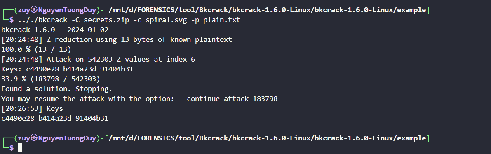

# Task 3.

- Hôm này mình sẽ lói về các tool dùng để crack file có mật khẩu hoặc tìm pass của file đó.

## 1. hashcat.

- Hashcat là phần mềm crack hash/khôi phục mật khẩu từ `hash` nhanh nhất và tiên tiến nhất hiện nay trên giao diện dòng lệnh.
- Ta có 1 tool dùng để xác định loại `hash` mà nó đc mà mã hóa là `hash-identifier`, Ta có thể sử dụng lệnh `$ hash-identifier` để xài, bạn chỉ cần nhập 1 đoạn hash nó sẽ phân tích cho đó là loại gì tuy nhiên đôi khi vẫn sẽ có sai xót.
- Cách để sử dụng `hashcat` cơ bản như sau:
  ```
  hashcat -a <tấn-công> -m <thuật-toán-hash> <file-chứa-hash-đầu-vào> <danh-sách hoặc chuỗi-ký-tự>

  Ví dụ: 
  hashcat -a 0 -m 0 file-chứa-hash rockyou.txt / password.lst 
  ```
- File `rockyou.txt và password.lst` là 2 danh sách 1 là của window 2 là của `john` nó chứa các mã `hash` password được sử dụng phổ biến nhất thế giới để từ đó tìm kiếm và hỗ trợ ta crack đc pass của 1 file có pass.
- File `rockyou.txt` có địa chỉ như sau `/usr/share/wordlists/rockyou.txt`
- Hash cat hỗ trợ 4 hình thức crack hash:
  + `Dictionary` (-a 0): Bạn sẽ cung cấp cho Hashcat một danh sách (có thể là tập hợp những passwords hay được dùng nhất). Hashcat sẽ sử dụng lần lượt từng giá trị trong danh sách này để hash nó với thuật toán đã chỉ định và so sánh với hash đầu vào, nếu kết quả sai, Hashcat sẽ thử giá trị tiếp theo trong danh sách được cung cấp, nếu đúng thì Hashcat trả lại kết quả đã tạo nên giá trị hash trùng khớp với giá trị hash đầu vào.
  + `Combination` (-a 1): Tương tự như Dictionary attack ở trên, tuy nhiên khi dùng Combination các bạn sẽ phải cung cấp 2 danh sách chứ không phải chỉ 1 danh sách như Dictionary attack. Hình thức tấn công này được sử dụng khi bạn muốn tìm username và password của người dùng. Lúc này bạn sẽ cần 1 danh sách những usernames hay được dùng nhất và 1 danh sách những passwords hay được dùng nhất. Hashcat sẽ lần lượt tạo ra các cặp kết hợp giữa danh sách username và danh sách password và lần lượt thử đăng nhập bằng các cặp kết hợp này cho đến khi tìm ra được username và password chính xác hoặc cho đến khi tất cả các cặp kết hợp đều đã được thử và không có cặp nào chính xác.
  + `Mask` (-a 3): Mask attack tương tự như Bruteforce attack, bạn sẽ cung cấp một loạt các ký tự ví dụ a, b, c, d, e, f, 1, 2, 3, v.v. và từ các ký tự được cung cấp này, Hashcat sẽ tự kết hợp các ký tự lại với nhau và tạo ra các chuỗi ký tự ngẫu nhiên ví dụ như abc123, và các chuỗi này sẽ được dùng để tấn công giống như Dictionary attack. Cách tấn công này sẽ phù hợp để tìm những username và password không nằm trong danh sách được cung cấp khi tấn công Dictionary attack, tuy nhiên sẽ rất mất thời gian.
  + `Hybrid` (-a 6 và -a 7): Kết hợp cả Dictionary attack và Mask attack.
- Mình sẽ ví dụ vài bài thử nhé.
- Ví dụ mình có 1 file `hash.txt` bên trong có 1 đoạn `hash` như sau `9b71d224bd62f3785d96d46ad3ea3d73319bfbc2890caadae2dff72519673ca72323c3d99ba5c11d7c7acc6e14b8c5da0c4663475c2e5c3adef46f73bcdec043` mới loại hash là `SHA-512`.
  
- `-m 1700` là modun của `SHA-512` nhé mình cho `hashcat` biết trước loại mã để crack nhanh hơn ạ :( .
  
- Lần này mình sẽ thử với 1 file `.zip` nhé , bởi vì `hashcat` cần 1 file `hash` cho nên mình sẽ xài `tool` của `john` để convert từ zip -> hash.
  
- Mình xóa bớt dữ liệu của file `hash.txt` sao cho có dạng như sau `$zip2$xxxxxxxx$/zip2$`.
  
- `-m 13600` chính là modun cả file `.zip` được nén từ `winrar`, với các loại file khác các bạn có thể tra trong `hashcat --help`.
  

## 2. Johntheripper.

1. John The Ripper được thiết kế rất dễ sử dụng và có tích hợp cả tính năng tự động nhận diện thuật toán hash, thế nên chúng ta không cần phải xác định thuật toán rồi mới crack giống như Hashcat.
1. Cách sử dụng `john` thì đơn giản hơn rất nhiều nố chỉ đơn giản như sau:
   ```
   $ john <file-name>
   ```
1. Và mình khá thích `john` ở chổ nó rất nhiều utility :
   
1. À cũng có 1 lưu ý như sau , nếu như mà bạn crack 1 file xong rồi bạn đã biết đc pass nhưng mà quên mất hoặc sau khi crack `john` ko hiện pass thì bạn có thể xài `--show` để xem pass nhé.
   ```
   $ john <file-name> --show
   ```
1. Mình sẽ thử làm 1 vài bài nhé.
1. Mình sẽ thử crack pass file `hehe.zip` này thử.
   
1. Mình xài `zip2john` để chuyển nó về dạng `hash`.
   
1. Mình sẻ thử với 1 file `hihi.rar` thử.
   
1. Mình xài `rar2john` để chuyển nó về dạng `hash`.
   
1. Ở đây bạn có thể thay phiên giữa xài `rockyou.txt` và `password.lst` nhé tùy cái ra cái không :( .
1. Các bạn có thể xài `--format=<type>` để chọn định dạng giúp `john` dễ thở hơn nha :Đ .

## 3. bkcrack.

- Ở kỹ thuật này chúng ta sẽ có rất nhiều lựa chọn và khá là tiện ích, nhưng bạn cần phải biết ít nhất 12byte dữ liệu bên trong 1 file có mật khẩu thì công cụ này mới hoạt động được, nếu bạn có càng nhiều thì càng tốt và tool này chỉ hoạt động với `comppression = Store` thôi nha còn `Deflate` sẽ có 1 kỹ thuật khác.
  
- Ở đây mình xài lệnh `".././bkcrack -L secrets.zip"` để xem trong 1 file có mật khẩu có gì từ đó đưa ra được phán đoán của bản thân.
- Ở file `secrets.zip` này có 2 file, để crack đc file này ta cần phải biết dữ liệu của 2 file kia , và may thay có 1 file `Store` và nó là loại file `.svg` thì hầu như nó đều sẽ bắt đầu bằng `<?xml version="1.0" `, nó tợi tận 20 byte vậy là quá đủ để crack rồi. mình nhét chuỗi này vào 1 file `.txt` để tiện xài tool nhé.
  
- Mình xài lệnh `".././bkcrack -C secrets.zip -c spiral.svg -p plain.txt"` để crack file, các bạn có thể hiểu như sauu:
  ```
  ./bkcrack -C <file_crack> -c <file_biết_dữ_liệu> -p <dữ_liệu_đã_biết>
  ```
- Mình được nhận 3 key như sau:
  ```
  [20:26:53] Keys
  c4490e28 b414a23d 91404b31
  ```
- Bạn có thể hiểu đơn giản là `key` này giuups chúng ta có thể thực hiện tiếp được các lựa chọn crack như sau:
  + 1. Tạo 1 file mới với 1 mật khẩu mới:
       + mình xài lệnh này `".././bkcrack -C secrets.zip -k c4490e28 b414a23d 91404b31 -U new_secret.zip easy"` với cách xài là:

         ``$ ./bkcrack -C <file_crack> -k <key> -U <tên_file_mới> <pass>.``
       + 
       + xong rồi nó sẽ trả cho mình 1 file `new_secret.zip` mình xài unzip với `pass = easy` là xong òi.
  + 2. Leak 1 file `deflate` trong file có mật khẩu.
       + ở cách này mình có thể leak đc file `.deflate` ra bằng cách mã hóa nó xong rồi xài tool `inflate` có sẵn để convert file mã hóa đó thành file gốc.
       + mình xài lệnh này `"../bkcrack -C secrets.zip -c advice.jpg -k c4490e28 b414a23d 91404b31 -d advice_deciphered.deflate"` với cách xài là:

         ``$ ./bkcrack -C <file_crack> -c <file_leak> -k <key> -d <tên_file_mã_hóa>``
         
       + xong rồi mình chỉ cần chạy lệnh này `"python3 ../tools/inflate.py < advice_deciphered.deflate > very_good_advice.jpg"` , là có được file mong mún òi.
       + ảnh mình nhận đc :)))) .
         
  + 3. Khôi phục mật khẩu ban đầu.

       + cách này các bạn buộc phải `brute force` ròi , các bạn hãy đọc các options sau nhé.
         
         
       + ở đây câu lệnh cụ thể sẽ như sau:

       ```
       $ ./bkcrack -k <key> -r 0..12 ?p
       ```

       + mình sẽ giải thích sơ là `-r` là mặc định để lấy lại pass nha còn `0..12` là gì? đó chính là min và max của số ký tự mà pass có còn `?p` thì bạn nhìn ảnh ở trên là hiểu , ở đây mình phải chỉ rõ pass gồm những ký tự gì, viết hoa hay thường có số hay ký tự đặc biệt không. Hiện tại mình không biết là pass có bao nhiêu ký tự là gồm loại ký tự gì nên mình thử từ 0 -> 12 và bắt đầu từ `?p` trước.
         

       - Ồ wow 1 lần ra lun , mình thử `?p` là gồm , ký tự hoa, thường, số và ký tự đặc biệt mà pass lại là `W4sF0rgotten` nó không có ký tự đặc biệt nhưng vẫn ra , có thể khi ta xài `?a` tốc độ sễ nhanh hơn là ta xài `?p` nhé.

## 4. PKcrack.

- Tool này , chúng ta muốn sử dụng thì ta cần biết trước 1 file bên trong 1 file 1 nén có pass. Bên trong file đó ta biết cần nhiều dữ liệu thì tốc độ crack càng nhanh.

```
VÍ DỤ:
-Secret.zip(have pass)
|-+text.txt
|-+secret.txt

-plain.zip(no pass)
|-+plain.txt (cùng nội dung với file text.txt)
```

- Cách sử dụng tool như sau:

```
 $ pkcrack -C encrypted-ZIP -c ciphertextname -P plaintext-ZIP -p plaintextname -d decrypted_file -a
```

- Mình sẽ thử crack file `Secret.zip` ở ví dụ nhaa.
  
- Mình crack thành công rồi, tools sẽ cho mình 1 file `crack.zip` mình chỉ cần unzip là lấy được các file nằm bên trong ròi nhưng cũng đồng thời tool cho chúng ta cả `key`, với key chúng ta có thể xài `bkcrack` để thực hiên `3 options` mà mình đã đề cập ở trên nha.
  

## 5. So Sánh giữa BKcrack và PKcrack.

| BKcrack                                        | PKcrack                                                             |
| ---------------------------------------------- | ------------------------------------------------------------------- |
| - Nhiều công cụ và nhiều tiện ích hơn  | - Ít công cụ và option hơn                                     |
| - Cần biết tối thiểu 12 byte               | - Cần biết 1 file bên trong                                      |
| - chỉ có thể crack pass nếu ở dạng store | - Chỉ có thể crack file, và cho key                             |
| - Có thể tìm lại được pass              | - Không thể                                                       |
| - Cần có phần cứng mạnh                   | - Cần có phần cứng mạnh                                        |
| - Phụ thuộc vào số byte đã biết         | - Phụ thuộc vào số lượng nội dung bên trong file đã biết |

## 6. Example Chall.

- Ở bài này ta nhận đc 1 file `Keep_out.zip`, mình xài `bkcrack` để xem bên trong có gì nha.
  
- Ồ file zip này có pass, mà mình lại ko có file này trùng cũng như biết trước dữ liệu , nên mình xài `john` nha.
- Đầu tiên là mình xài `zip2john` để chuyển file zip sang dạng `hash` tiếp đó là mình bắt đầu crack pass nhaa.
  
  \
- pass là `MANCHESTERUNITED` , mình nhập pass giải nén ra nhaa.
  
- Mình kệ file `README.txt` mình bắt đầu check 2 file còn lại.
- file `bookmarks.txt` chỉ là những đường link nên mình ko cần phải check , mình chỉ check file `.zip` kia thui, mình sẽ check bằng `bkcrack` luun nha.
  
  
- Ú xem này trong này cũng có 1 file `bookmarks.txt` thế là phải xài `pkcrack` rồi, mình tiến hành crack file này nha.
- mình crack xong ùi mình đc tần này file.
  
- Mình thấy cái file `.pdf` này khá nghi mình thử `ctrl + a` xong mình copy , mình dán ra thử thì có flag lun.
  
- *`FLAG: HCMUS-CTF{H0w_D1d_y0U_Kn0W_Th3_P@ssW0rd????}`*
