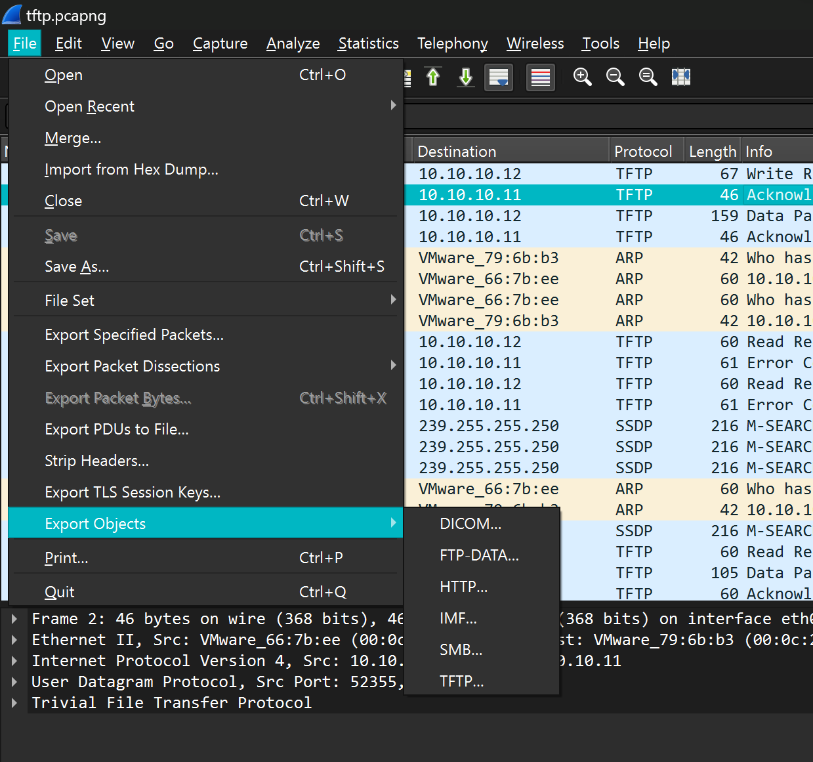
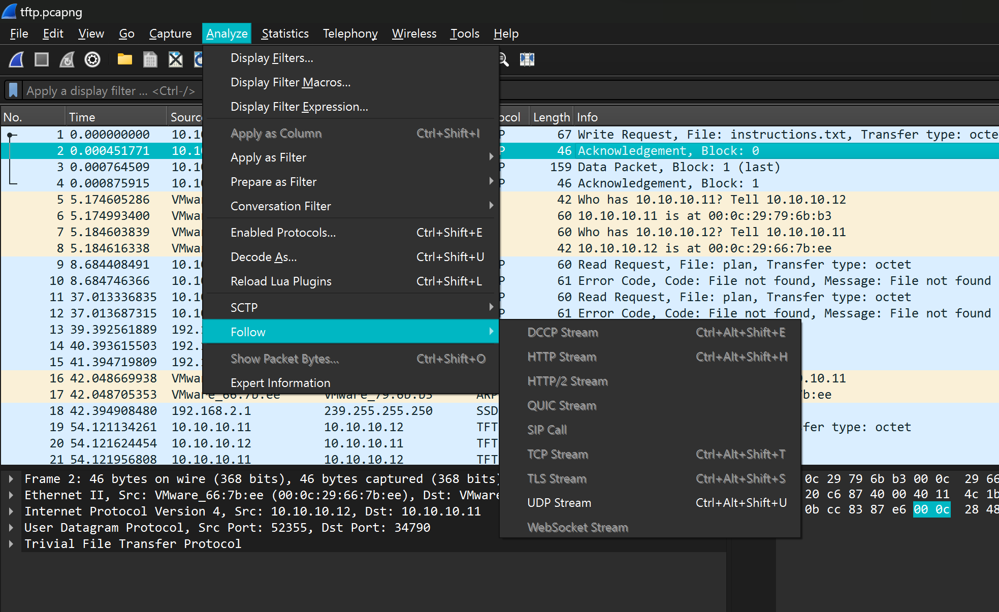
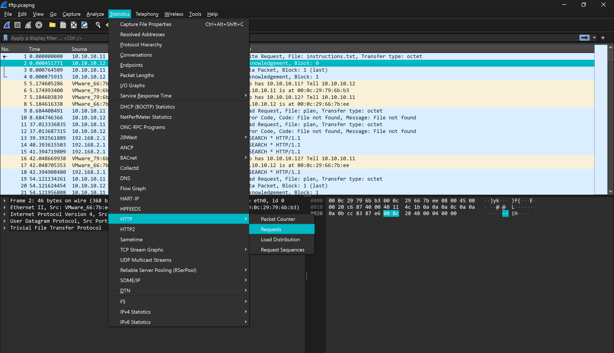

# Wireshark.
### 1. Wireshark là gì?.
- Muốn biết Wireshark dùng để làm gì, cách sử dụng Wireshark như thế nào thì trước hết, điều mà chúng ta cần làm đó chính là tìm hiểu xem Wireshark là gì. Wireshark là ứng dụng phân tích mạng (network packet analyzer). Công dụng của ứng dụng này là dùng để bắt, phân tích và xác định các vấn đề có liên quan đến network bao gồm: kết nối chậm, rớt gói tin hoặc các truy cập bất thường. 

- Thông qua Wireshark, quản trị viên có thể hiểu hơn về các Network Packets đang chạy trên hệ thống. Như vậy, việc xác định nguyên nhân gây ra lỗi cũng sẽ dễ dàng hơn.


### 2. Phần mềm Wireshark dùng để làm gì?.
- Vậy Wireshark dùng để làm gì hay nói cách khác mục đích sử dụng của phần mềm là gì? Sau đây sẽ là câu trả lời dành cho bạn.

- Trước hết, Wireshark được Network administrators sử dụng trong việc khắc phục sự cố về mạng.
- Bên cạnh đó, Wireshark còn được các kỹ sư Network security dùng để kiểm tra các vấn đề liên quan đến bảo mật.
- Trong khi đó thì Wireshark lại được các kỹ sư QA sử dụng để xác minh các network applications.
- Và các developers dùng Wireshark trong việc gỡ lỗi triển khai giao thức.
- Còn đối với người dùng mạng máy tính bình thường thì Wireshark giúp chúng ta học internals giao thức mạng.
- Ngoài ra, Wireshark còn được sử dụng trong rất nhiều tình huống thực tế khác nữa mà chỉ những người trong giới chuyên môn mới biết câu trả lời.

### 3. Tính năng nổi bật của Wireshark.
- Có thể thấy rằng Wireshark có rất nhiều công dụng khác nhau. Vậy còn về tính năng của chúng thì như thế nào? Sau đây hãy cùng khám phá xem những tính năng nổi bật của Wireshark là gì nhé.

- Wireshark có sẵn cho hệ điều hành UNIX và Windows.
- Ứng dụng này giúp người dùng có thể chụp dữ liệu gói trực tiếp từ giao diện mạng.
- Thực hiện mở các tệp có chứa dữ liệu gói bằng tcpdump/ WinDump, Wireshark cũng như một số chương trình packet capture khác.
- Nhập các gói từ các tệp văn bản có chứa các hex dumps của packet data.
- Hiển thị các gói thông tin một cách vô cùng chi tiết.
- Tiến hành việc lưu trữ tất cả các dữ liệu gói đã bị bắt.
- Xuất một số hoặc tất cả các gói thông qua định dạng capture file.
- Dựa vào các tiêu chí khác nhau để lọc các gói tin.
- Dựa trên nhiều tiêu chí để tìm kiếm các gói.
- Colorize là gói hiển thị dựa trên bộ lọc.
- Wireshark còn giúp tạo các số liệu thống kê khác nhau.
### 4. 1 số cách dùng Wireshark cơ bản.
- *`A :`*  Phân tich những `object` và có thể tải những tập tin đó, bạn có thể làm như sau.
- Tùy vào đề mà những file đó có thể nào ở những `protocol` khác nhau

- *`B :`* Theo dõi dữ liệu của từng loại giao thức riêng biệt tùy theo người chọn, với cách này ta có thể kiểm soát dữ liệu dễ hơn.

- *`C :`* Mở rộng nguồn tin giúp ta có thể xem đc số lượng `request` mà 1 `HTTP` đã truy cập.

- *`D :`* ta có thể xài `strings <file_pcap> | grep <text> ` để kiếm flag hoặc 1 cái gì đấy trong file `.pcap`.
- Vẫn còn rất nhiều cách sử dụng khác nữa !!!.
# Tshark.
### 1. Tshark là gì?.
- TShark là công cụ phân tích giao thức mạng, một phiên bản terminal của Wireshark được sử dụng khi giao diện đồ họa không có sẵn hoặc không cần thiết. Với TShark bạn có thể bắt gói tin, đọc/phân tích gói tin từ file đã lưu... Bài này sẽ giới thiệu một số hướng dẫn cơ bản để bạn có thể sử dụng công cụ này.
### 2. Một số lệnh cơ bản của Tshark.
    ```
    - Hiển thị danh sách network interfaces:
        + Để xem danh sách network interfaces trên máy tính hiện tại ta sử dụng lệnh:
        -----------------
        |  $ tshark -D  |
        |_______________|
    - Bắt và lưu gói tin:
        + Sau khi xem danh sách network interfaces ở bước trên chúng ta sẽ tiến hành bắt và lưu gói tin với tham số -i và -w. File sẽ được lưu dưới dạng .pcap.
        -----------------------------------
        |  $ tshark -i eth0 -w vidu.pcap  |
        |_________________________________|
        + Với lệnh trên sẽ bắt tất cả gói tin từ network interface eth0 và ghi ra file vidu.pcap cho đến khi nhấn Ctrl-C để dừng. Để bắt một số lượng gói tin nhất định ta có thể dùng tham số -c
        ---------------------------------------
        |  $ tshark -i eth0 -c 69 -w vidu.pcap  |
        |_____________________________________|
    - Đọc file pcap:
        + Với tham số -r ta có thể xem nội dung file .pcap đã lưu.
        ---------------------------------
        |  $ tshark -r vidu.pcap        |
        |_______________________________|
    - Phân tích HTTP request :
        + Trong ví dụ sau chúng ta sẽ bắt gói tin từ network interface eth0 và lọc ra HTTP requests bằng tham số -Y http.request kết hợp tham số -T và -e để lọc dữ liệu là các trường http.host và http.user_agent.
         -------------------------------------------------------------------------------
        |  $ tshark -i eth0 -Y http.request -T fields -e http.host -e http.user_agent  |
        |______________________________________________________________________________|
    - Kết hợp Tshark với lệnh shell để thống kê, phân tích dữ liệu :
        + Trong ví dụ sau ta sử dụng tham số -Y bên trên để lọc dữ liệu từ một file .pcap đã kết xuất trước đó kết hợp với các lệnh shell cơ bản để nhanh chóng đếm tần suất xuất hiện của các user agent.
        + Từ kết quả có được chúng ta có thể dùng để phân tích lưu lượng mạng để phát hiện những truy cập bất thường, mã độc...
         ---------------------------------------------------------------------------------------------------------------
        |  $ tshark -r vidu.pcap -Y http.request -T fields -e http.host -e http.user_agent | sort | uniq -c | sort -n  |
        |______________________________________________________________________________________________________________|
    - Phân tích truy vấn DNS :
        + Để bắt gói tin và lọc ra các truy vấn DNS và địa chỉ phản hồi ta dùng lệnh sau.
        -------------------------------------------------------------------------------------
        |  $ tshark -i eth0 -f "src port 53" -n -T fields -e dns.qry.name -e dns.resp.addr  |
        |___________________________________________________________________________________|
    - Dùng Tshark để... lấy mật khẩu :
        + Bằng cách sử dụng Tshark để bắt gói tin, kết hợp tùy chọn lọc tcp contains "password" và lệnh grep trong Linux ta sẽ có một vài thứ hay ho như mật khẩu...
         --------------------------------------------------------------------------------------------------
        |  $ tshark -i eth0 -Y 'http.request.method == POST and tcp contains "password"' | grep password  |
        |_________________________________________________________________________________________________|
    - Trích xuất dữ liệu (files) :
        + Với tùy chọn --export-objects ta có thể dể dàng trích xuất dữ liệu dạng file vào một thư mục được chỉ định.
        -----------------------------------------------------------
        |  $ tshark -nr vidu.pcap --export-objects http,thumucluu |
        |_________________________________________________________|
    - Các tùy chọn khác của Tshark hỗ trợ phân tích gói tin :
        + Trong quá trình phân tích ta có thể sử dụng tùy chọn -V để hiển thị chi tiết thông tin từng gói tin như số frame, giao thức...
        -------------------------
        |  $ tshark -i eth0 -V  |
        |_______________________|
        + Tùy chọn -O tương tự -V nhưng chỉ hiện thị chi tiết gói tin sử dụng giao thức mà chúng ta chỉ định.
        -----------------------------
        |  $ tshark -i eth0 -O ftp  |
        |___________________________|
    ```
