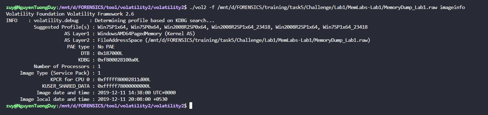
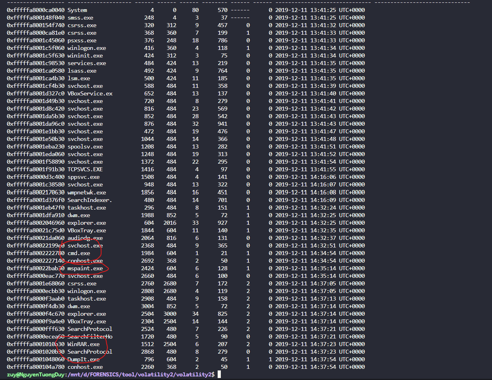
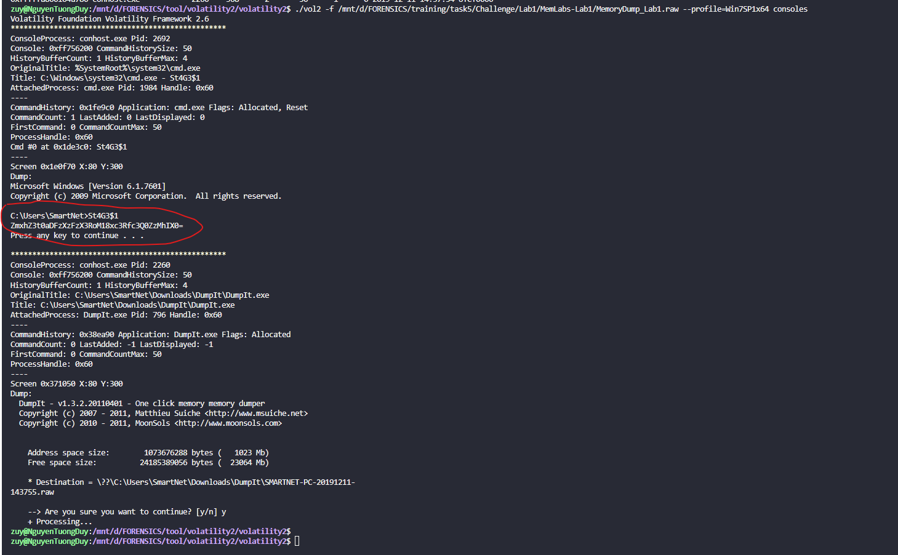
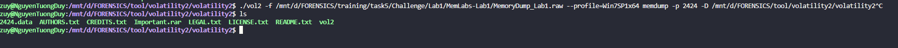
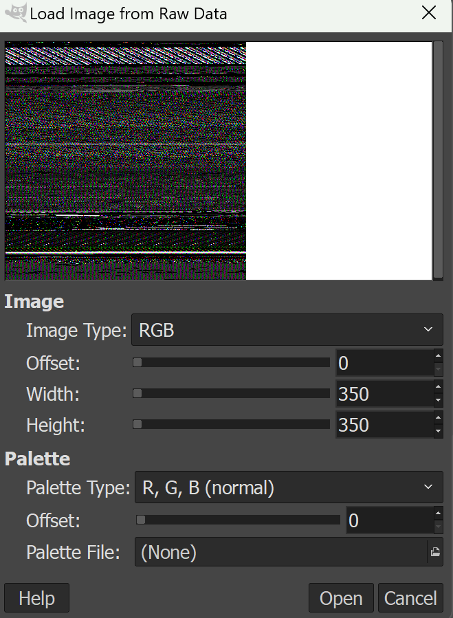
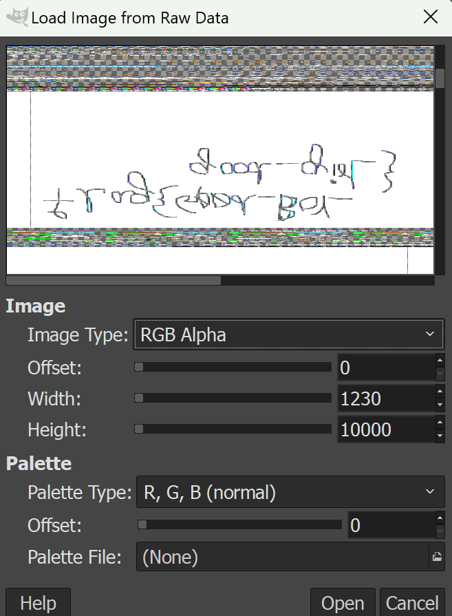
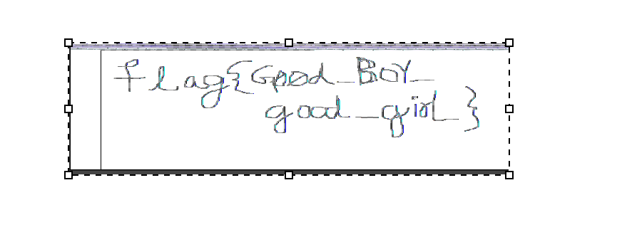
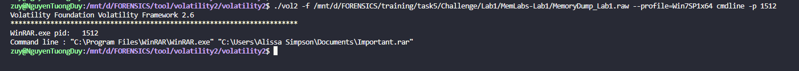
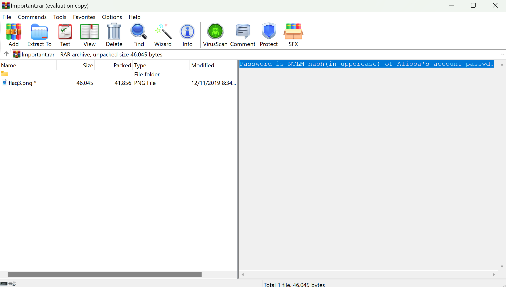
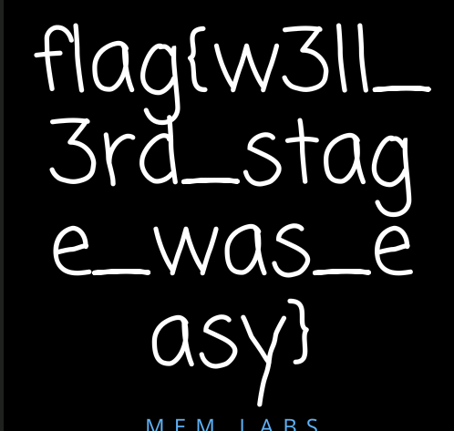

## MemLab-1.
```
# **MemLabs Lab 1 - Beginner's Luck**

## **Challenge description**

My sister's computer crashed. We were very fortunate to recover this memory dump. Your job is get all her important files from the system. From what we remember, we suddenly saw a black window pop up with some thing being executed. When the crash happened, she was trying to draw something. Thats all we remember from the time of crash.

**Note**: This challenge is composed of 3 flags.

**Challenge file**: [MemLabs_Lab1](https://mega.nz/#!6l4BhKIb!l8ATZoliB_ULlvlkESwkPiXAETJEF7p91Gf9CWuQI70)

## **Challenge file hash**

The commpressed archive

+ MD5 hash: 919a0ded944c427b7f4e5c26a6790e8d

The memory dump

+ MD5 hash: b9fec1a443907d870cb32b048bda9380

Please follow the [flag submission rules](https://github.com/stuxnet999/MemLabs#flag-submission) when sending the email for solution verification.
```
- Đây là đề bài , và bài này có 3 flag và mình sẽ xài Vol2 để làm bài này nha, cứ đầu vào check profile đã mới có thể xài các lệnh khác đc.

- Tiếp theo thì mình check `pslist` để xem trong file này `user` chạy những gì nha.

- Đa số chỉ là những ứng dụng mà hệ thống mặc định chạy và có 3 tiến trình khác là nghi vấn là `cmd.exe , mspaint và WinRAR.exe`. Mình sẽ cùng phân tích từng thứ 1 nha.
#### 1. cmd.exe
- tiến trình này là 1 cửa sổ lệnh của windows, có lẻ là `user` thực hiện 1 cái lệnh gì đó, mình sẽ mình check `consoles` để xem `user` đã nhập những gì nha.

- Ở đây `user` nhập 1 đoạn base , mình decode ra thì đc flag đầu tiên.
- *`FLAG 1: flag{th1s_1s_th3_1st_st4g3!!}`*
#### 2. mspaint.exe
- mình ko biết cái này là cái gì nhưng mà mình hình dung cơ bản là vẽ 1 cái gì đó :Đ hoặc là 1 cái ảnh gì đó. `PID là 2424` mình sẽ xài `memdump` để kết xuất bộ nhớ xử lý của mspaint để trích xuất hình ảnh trở lại và đổi đuôi file này về từ `.dmp -> .data` và sử dụng `GIMP` tool này có khả năng mở 1 ảnh từ 1 file `raw data`.


- Và nó cho mình 1 cái ảnh như này.





- Và thực sự mà nói ý mình mò dữ lắm lun á , cũng có thể là may rủi mới có thể kiếm ra đc cái flag nhưng mà bị lật ngược mình vào pain lật nó lại thì có được flag thứ 2.

- *`FLAG 2: flag{G00d_BoY_good_girL}`*
#### 3. WinRAR.exe
- `user` mở `WinRAR` lên có thể là để nén 1 file nào đó , mình check bằng `cmdline` để xem rõ thư mục mà `user` nén là cái gì với `PID là 1512`.

- Cái file tên là `Important.rar` mình xài tiếp `filescan` để kiếm `offset` của file đó và sử dụng `dumpfiles` để lấy data của các file trong file rar này về 1 file `.dat` mình sẽ chuyển nó về `.rar`, mình sẽ xài `WinRAR` để giải nén nó ra nha.

- File này có pass và ta có hint là `Password is NTLM hash(in uppercase) of Alissa's account passwd.` , nó bảo như sau:
```
Mật khẩu là hàm băm NTLM (viết hoa) của mật khẩu tài khoản của Alissa.

```
- Mình xài lệnh này `./vol2 -f /mnt/d/FORENSICS/training/task5/Challenge/Lab1/MemLabs-Lab1/MemoryDump_Lab1.raw --profile=Win7SP1x64 hashdump` để lấy NTLM hash của Alissa's account , mình upper nó lên lấy nói làm pass là đc. `F4FF64C8BAAC57D22F22EDC681055BA6`
- Nó cho ta ảnh có flag.

- *`FLAG 3: flag{w3lL_3rd_stage_was_easy}`*