# MemLab 2.
```
# **MemLabs Lab 2 - A New World**

## **Challenge description**

One of the clients of our company, lost the access to his system due to an unknown error. He is supposedly a very popular "environmental" activist. As a part of the investigation, he told us that his go to applications are browsers, his password managers etc. We hope that you can dig into this memory dump and find his important stuff and give it back to us.

**Note**: This challenge is composed of 3 flags.

**Challenge file**: [MemLabs_Lab2](https://mega.nz/#!ChoDHaja!1XvuQd49c7-7kgJvPXIEAst-NXi8L3ggwienE1uoZTk)

## **Challenge file hash**

The commpressed archive

+ MD5 hash: 75d2ee1fcf2bc8a25329723e6ce2be93

The memory dump

+ MD5 hash: ddb337936a75153822baed718851716b

Please follow the [flag submission rules](https://github.com/stuxnet999/MemLabs#flag-submission) when sending the email for solution verification.
```
- Bài này mình vẫn sẽ làm như bài trước xài Vol2 và check imageinfo trước.
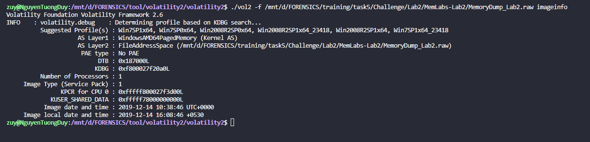
- Ồ vẫn như cữ , mình check tiếp `pslist` nha.
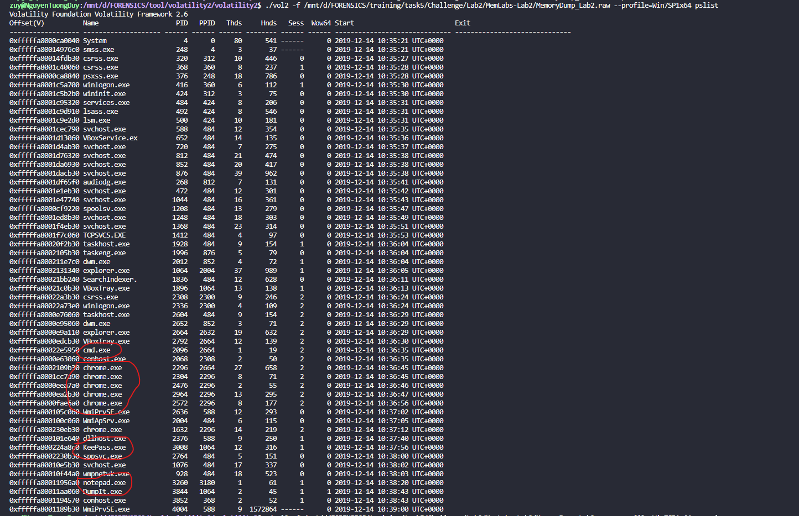
- Ở đây ta có `cmd , chrome , Keepass và notepad`, mình check `consoles` thì nó bảo như lày có cay ko chứ :))) .
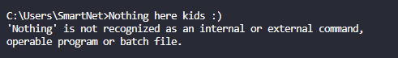
### FLAG 1:
- Oke vậy chỉ còn ` chrome , Keepass và notepad` là sẽ có gì đó thui , và đọc đề thì nó có nhấn mạnh `environmental` là kiểu môi trường thì ta có thể xài `envars` để check các biến môi trường nha.
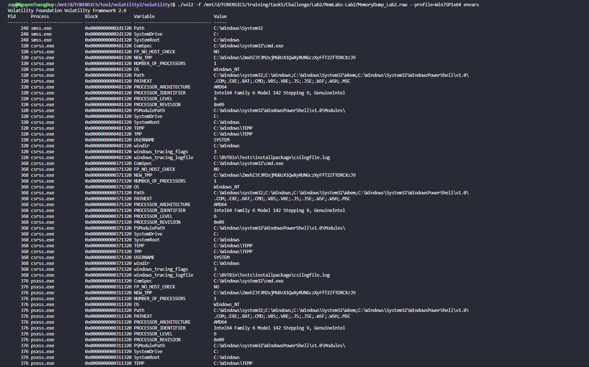
- Ở biến `NEW_TMP` có 1 đoạn base mình decode thì có đc flag đầu tiên nha.
- *`FLAG 1: flag{w3lc0m3_T0_$T4g3_!_Of_L4B_2}`*.
### FLAG 2:
- Tiếp theo mình sẽ check `cmdline` xem `Keepass và notepad` trên nó có dẫn đến 1 cái file nào ko nha , `PID lần lượt là 3008 , 3260`.
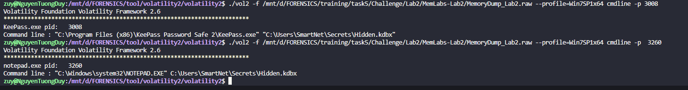
- Cả 2 đều dẫn đến 1 file là hidden.kdbx , đầu tiên là ta cần phải kiếm `offset` sau đó là mới có thể dump file này về được.
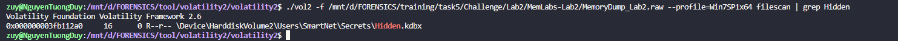
- `offset là 0x000000003fb112a0` , mình sẽ dump cái file này về nha.
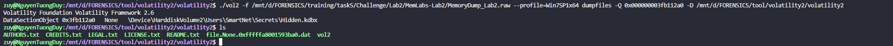
- Đá số file `.kdbx` đều là những file có password để tránh rò rỉ thông tin , và trong đề bài cũng có nhác đến cụm từ `password managers` là 1 trình quản lý mật khẩu thế nên mình search thử cụm `password`thử xem `user` có lưu mật khẩu vào file nào ko :))) .
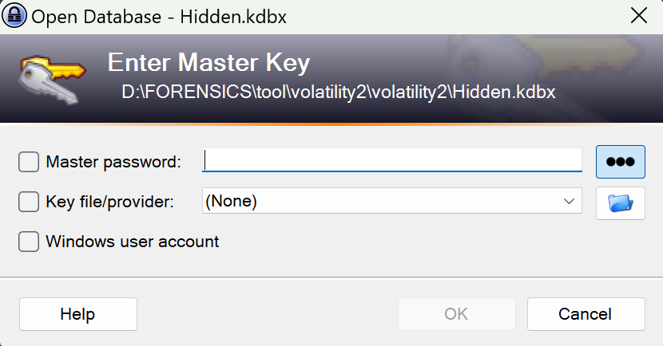
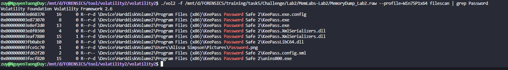
- Hay này Trình quản lý mật khẩu lun mà , hóa ra chỉ là 1 cái ảnh có mật khẩu thui sao. Mình dump nó về thì đc pass như sau:
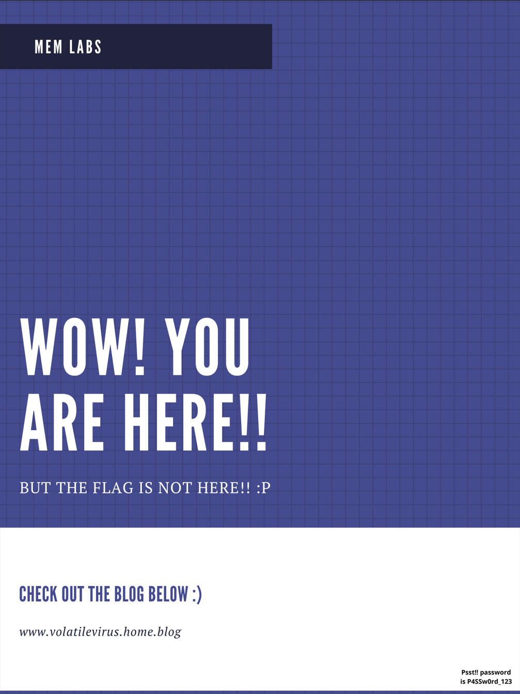
- pass là `P4SSw0rd_123`, Mình mở file ra check ở `Recycle bin` thì có mục flag mình mở ra thì flag ở chỗ password nha.
- *`FLAG 2: flag{w0w_th1s_1s_Th3_SeC0nD_ST4g3_!!}`*
### FLAG 3:
- tiếp theo chỉ còn `chrome` thui , sau 1 hồi tìm hiểu thì khi ta xài chrome và sau khi sử dụng `chrome` sẽ lưu lại `History` là 1 log lưu lại lịch sử tìm kiếm của chúng ta, và chúng ta có thể check bằng Vol lun hoặc filescan cụm `history` dump file đó về , mở nó bằng `Autospy`.
- Mọi người có thể tải [Plugin](https://github.com/superponible/volatility-plugins) ở đây nha.
- AutoSpy:
    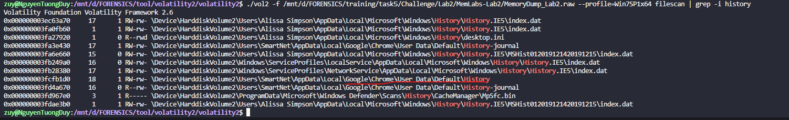
    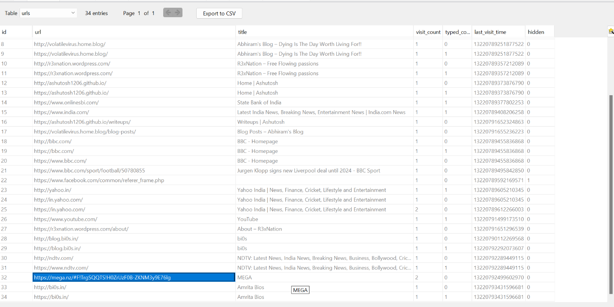

- Vol:
    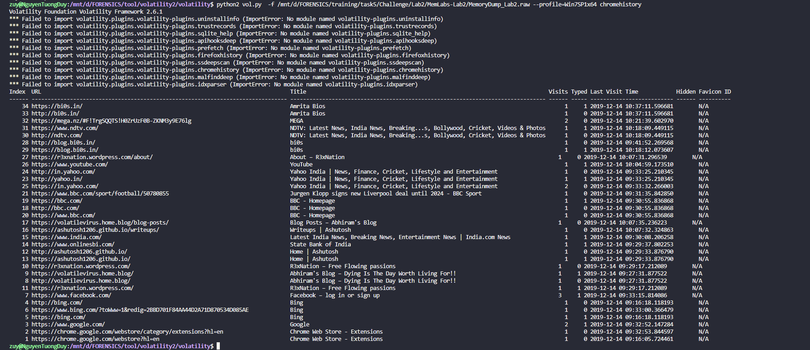
- Bởi vì Vol2 của mình nên mình xài cách 2 nó bị lỗi khúc đầu 1 tí :Đ , mình thấy cái link [MEGA](https://mega.nz/folder/TrgSQQTS#H0ZrUzF0B-ZKNM3y9E76lg) lạ nên mình click thử , nó tải về 1 file là `Important.zip`, mình thử unzip bằng `WinRAR` thì nó yêu cầu password.
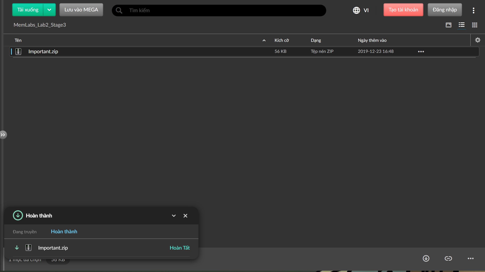
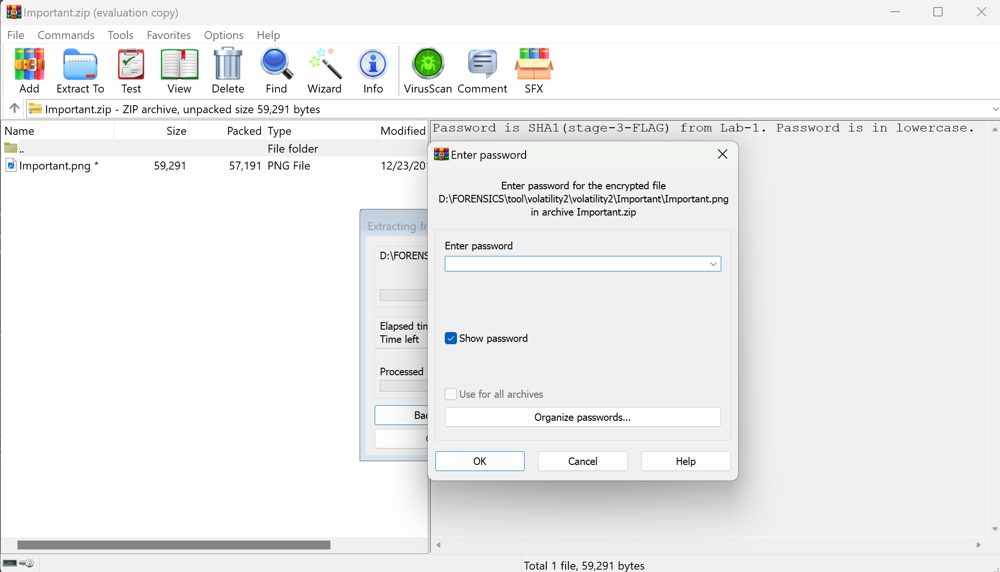
- Ta có hint pass sẽ là mã `SHA1` của flag 3 từ bài `MemLab1`.
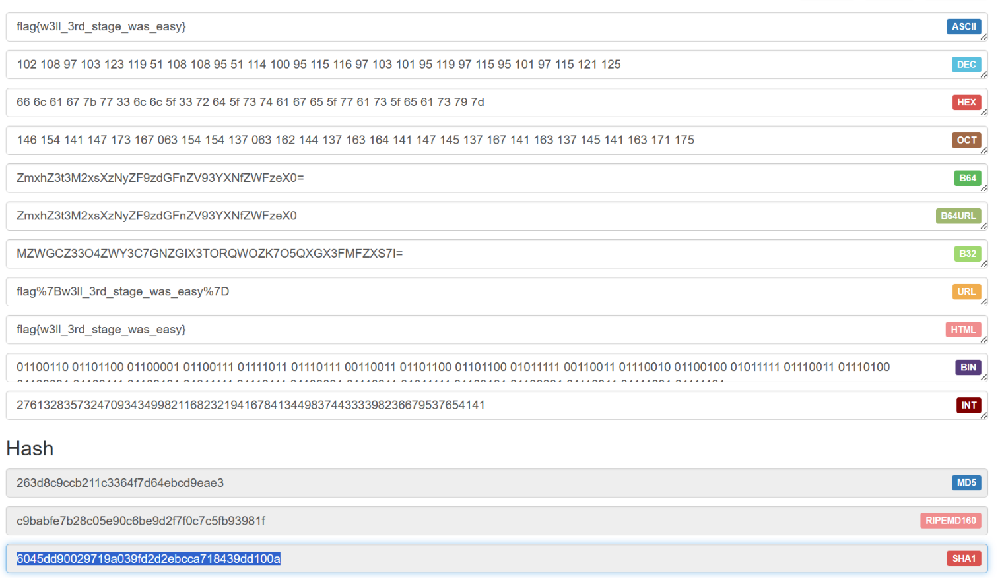
- Pass là `6045dd90029719a039fd2d2ebcca718439dd100a`, mình unzip file ra thì đc 1 ảnh có flag.

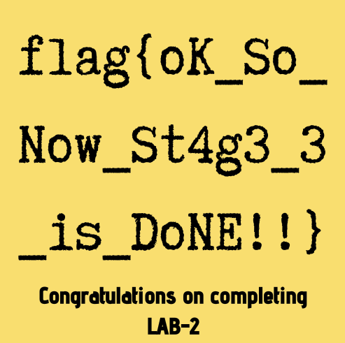
- *`FLAG 3: flag{oK_So_Now_St4g3_3_is_DoNE!!}`*
