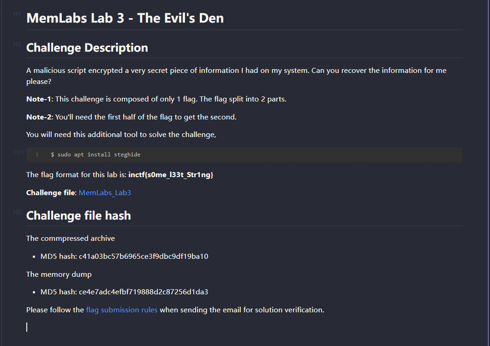
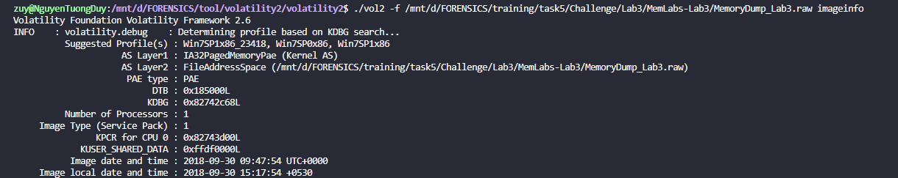
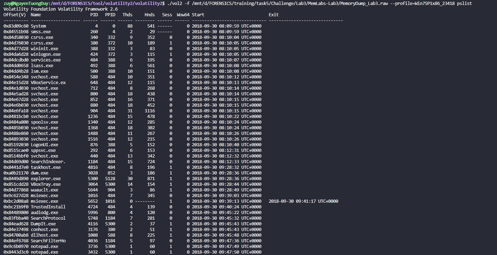
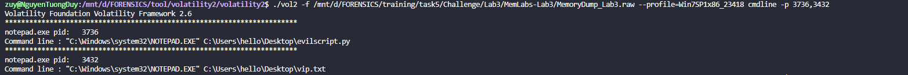
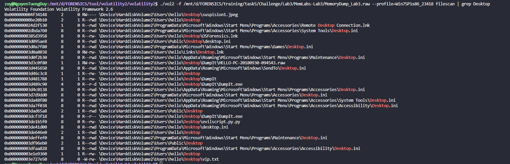
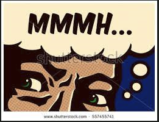
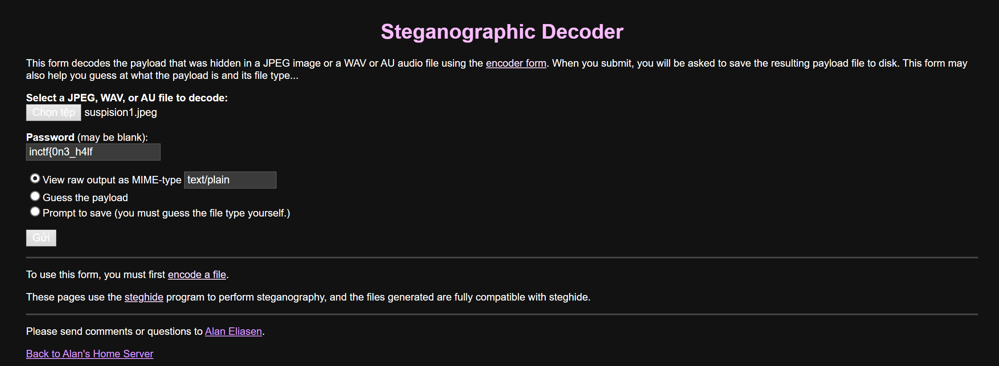
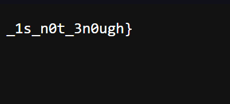

# MemLab 3.

- Đề là như thế này , chỉ có 1 flag duy nhất nhưng mà đc chia làm 2 phần và ta cần có phần đầu tiên trước mới có thể kiếm được phần tiếp theo, Chall này yêu cầu `Steghide` để có thể làm đc vậy thì chắc chắn mình sẽ phải xài lên 1 cái ảnh `JPEG , BMP...` ròi.
- Mình sẽ check profile và pslist nha.


- Ở đây mình thấy có 2 tiến trình `notepad.exe` , mình check `cmdline` để xem nó dẫn đến file gì nhé.

- nó dẫn đến 1 file `evilscript.py` và `vip.txt` mình filescan với cụm từ `Desktop` để cùng lúc tìm offset của 2 file kia nhé.

- Ồ ở dòng đầu ta có thể thấy 1 file ảnh `suspision1.jpeg` cả cái tên và đuôi file điều đã được đề hint cho rồi , mình sẽ dump 3 file này về nhé.
```
import sys
import string

def xor(s):

	a = ''.join(chr(ord(i)^3) for i in s)
	return a


def encoder(x):
	
	return x.encode("base64")


if __name__ == "__main__":

	f = open("C:\\Users\\hello\\Desktop\\vip.txt", "w")

	arr = sys.argv[1]

	arr = encoder(xor(arr))

	f.write(arr)

	f.close()
```
- File python cho mình 1 đoạn `script` sau và file `vip.txt` cho mình đoạn base sau `am1gd2V4M20wXGs3b2U=`. mình đọc source thì hiểu được là , 1 chuỗi văn bản gốc được đoạn source trên `xor` với 3 và `encode` bằng `base64`, vậy thì để lấy đoạn văn bản gốc ta cần làm ngược lại là `decode` đoạn base trong file `vip.txt` xong r `xor` nó với 3 là nữa là được.
```
import base64

encoded_string = "am1gd2V4M20wXGs3b2U="

decoded_bytes = base64.b64decode(encoded_string)

decoded_string = ''.join(chr(byte ^ 3) for byte in decoded_bytes)

print(decoded_string)

```
- mình decode ra được nửa đầu đoạn flag `inctf{0n3_h4lf`, tiếp theo thì mình mở file ảnh lên.


- Mình xài `steghide` thì nó cần pass , đề cũng đã bảo là sẽ cần có nữa đầu flag trước để có đc phần tiếp theo thế nên mình nghĩ pass sẽ là `inctf{0n3_h4lf`.
- Mình xài [web này](https://futureboy.us/stegano/decinput.html) cho lẹ :Đ.


- *`FLAG: inctf{0n3_h4lf_1s_n0t_3n0ugh}`*