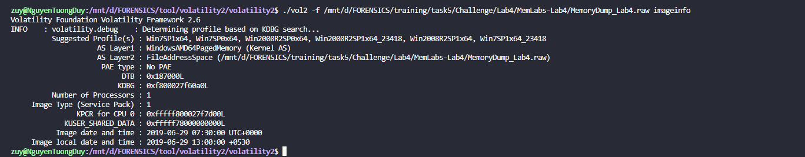
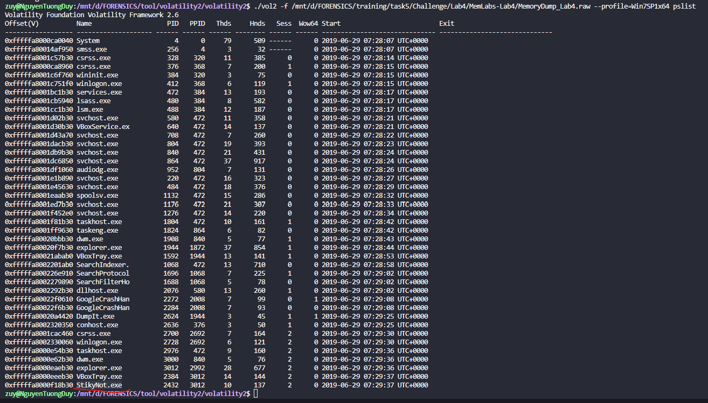
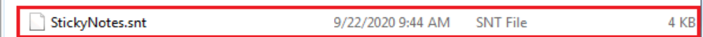
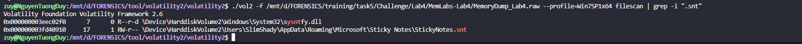
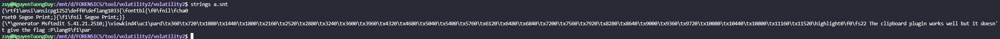
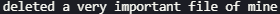
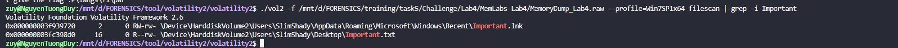
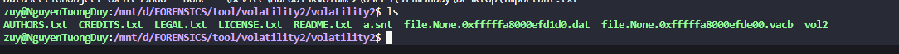
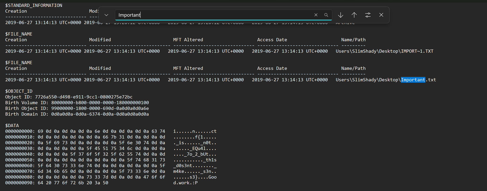
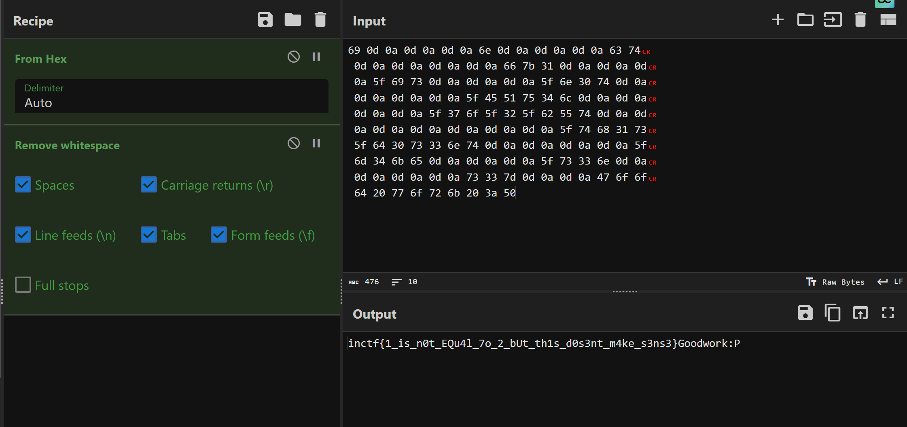

# MemLab 4.
```
# **MemLabs Lab 4 - Obsession**

## **Challenge Description**

My system was recently compromised. The Hacker stole a lot of information but he also deleted a very important file of mine. I have no idea on how to recover it. The only evidence we have, at this point of time is this memory dump. Please help me.

**Note**: This challenge is composed of only 1 flag.

The flag format for this lab is: **inctf{s0me_l33t_Str1ng}**

**Challenge file**: [MemLabs_Lab4](https://mega.nz/#!Tx41jC5K!ifdu9DUair0sHncj5QWImJovfxixcAY-gt72mCXmYrE)

## **Challenge file hash**

The commpressed archive

+ MD5 hash: 85418d442070afd787abcd7fb51ebd61

The memory dump

+ MD5 hash: d2bc2f671bcc9281de5f73993de04df3

Please follow the [flag submission rules](https://github.com/stuxnet999/MemLabs#flag-submission) when sending the email for solution verification.
```
- Mình vẫn sẽ là check profile và pslist thui.


- Hmmm pslist này ko có quá nhiều thứ đáng ngờ ngoài cái `Stikynot.exe` này mình search thử thì nó giống mấy cái `note` bình thường thui à.

- Mình có thể xài filescan search có file nào của nó không với grep có thể là cụm `StikyNotes` hoặc `.snt` nha.

- Mọi người kiếm bằng `.snt` cho lẹ nha mình kiếm bằng `StikyNotes` mún ẻ lun :Đ , mình dump nó về thui ha.

- Mình lười tải cái kia về quá nên mình xài strings và nó bảo là `The clipboard plugin works well but it doesn't give the flag :P`, bịp chưa ạ.
- Và đây ạ  đề nó bảo là `Important file` khá giống bài trước ha mình filescan với cụm `Important`thử xem có file nào như vậy ko nha.

- Có này , mình dump file này về thui.

- Không dump về được , bởi vì do là attacker đã xóa rồi nên là ta ko thể nào dump về được. NHƯNG MÀ Tuy nhiên, nội dung của nó vẫn còn hiện diện trong bộ nhớ, có 1 thứ gọi là ` Master File Table (MFT)` có thể đơn giản đây là nơi lưu trữ các file đã bị xóa ấy , giúp ta có thể leak dữ liệu từ đây lên và xài bth. Ở đây ta sẽ xài plugin `mftparser` này để xem lại tất cả dữ liệu của các file đã bị xóa nha.

- Mình search `important` thì thấy dữ liệu nó kia , nó cũng chính là flag bị tách rời ý , mình vứt lên cyber chef để cook nó nha.
- Dữ Liệu nó nè:
```
 69 0d 0a 0d 0a 0d 0a 6e 0d 0a 0d 0a 0d 0a 63 74
 0d 0a 0d 0a 0d 0a 0d 0a 66 7b 31 0d 0a 0d 0a 0d
 0a 5f 69 73 0d 0a 0d 0a 0d 0a 5f 6e 30 74 0d 0a
 0d 0a 0d 0a 0d 0a 5f 45 51 75 34 6c 0d 0a 0d 0a
 0d 0a 0d 0a 5f 37 6f 5f 32 5f 62 55 74 0d 0a 0d
 0a 0d 0a 0d 0a 0d 0a 0d 0a 0d 0a 5f 74 68 31 73
 5f 64 30 73 33 6e 74 0d 0a 0d 0a 0d 0a 0d 0a 5f
 6d 34 6b 65 0d 0a 0d 0a 0d 0a 5f 73 33 6e 0d 0a
 0d 0a 0d 0a 0d 0a 73 33 7d 0d 0a 0d 0a 47 6f 6f
 64 20 77 6f 72 6b 20 3a 50
```


- *`FLAG: inctf{1_is_n0t_EQu4l_7o_2_bUt_th1s_d0s3nt_m4ke_s3ns3}`*