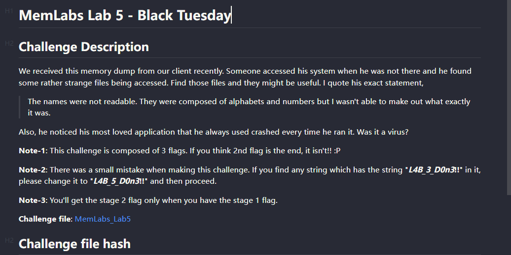
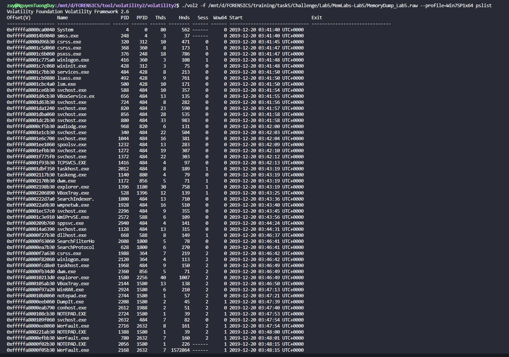
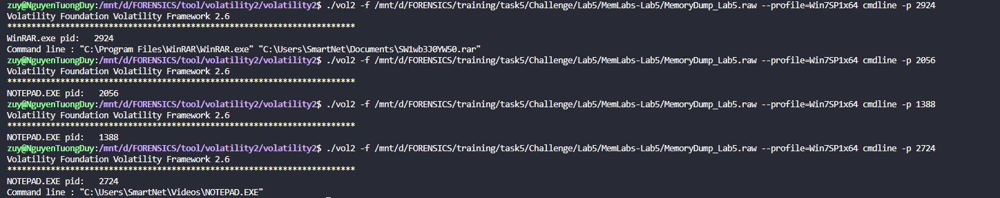
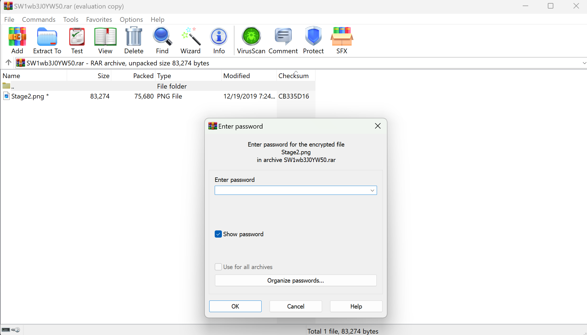
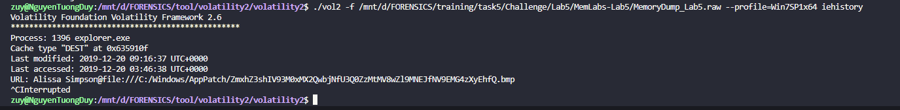
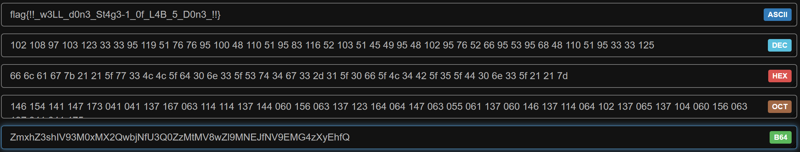
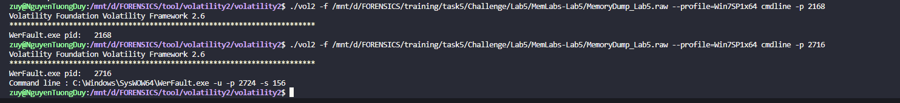
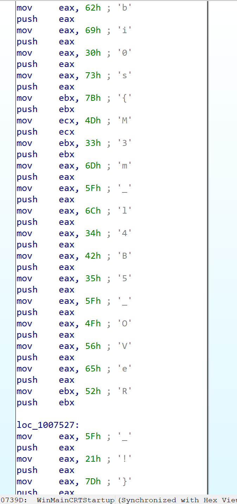

# MemLab 5.

- Bài này có 3 flag , và cần có flag 1 trước mới có thể có đc flag 2. Cơ bản bước đầu như các bài khác thui mình check profile và pslist nha.
.
- Mình check thì thấy có 3 cái `NOTEPAD.exe` nó còn viết hoa nữa khá lạ nha , có `Winrar.exe` và cả `explorer.exe`. Oke mình sẽ check `WinRAR` trước vậy.

- Mình check thì có 1 file `SW1wb3J0YW50.rar` oke mình xài filescan và dump nó về thui , còn `NOTEPAD.EXE` mình check nó chả ra gì cả , cái cuối thì có.

### FLAG 1.
- Mình dump file rar về thì nó đã là stage2 rồi mình đoán pass sẽ là flag 1 bởi vì đề có đề cập mình sẽ check thử cái `explorer` nha , ở đây nó là 1 cái trình duyệt mình có thể sử dụng plugin `iehistory` để để truy xuất các liên kết hoặc các quy trình tải, không chỉ riêng Internet Explorer, Thông thường sẽ bao gồm cả File Explorer và các phầm mềm độc hại.

- Nó ra mỗi cái này à , mình thấy tên của nó là 1 đoạn base mình đem đi decode thì ra được flag đầu tiên.

- *`FLAG 1: flag{!!_w3LL_d0n3_St4g3-1_0f_L4B_5_D0n3_!!} `*
### FLAG 2.
- Có flag 1 rùi mình mở file rar ra thui.

- *`FLAG 2: flag{W1th_th1s_$taGe_2_1s_c0mPL3T3_!!}`*
### FLAG 3.
- Bài bảo có 3 flag nên mình nghĩ cái cuối cùng sẽ liên quan đến cái `NOTEPAD.EXE` này và mình cũng mới nhận ra là có 1 tiến trình khá lạ nữa nó là
`WerFault.exe`, mình thử check `cmdline` thử xem nó có dẫn đến cái gì ko.

- Có 2 cái `WerFault.exe` mình check cả 2 thì cái thứ 2 nó sử dụng `-p 2724`, thì ồ `2724` chính là `PID` cuar thằng `NOTEPAD.EXE` á và cùng với `PID` đó mình check cmdline với thằng `NOTEPAD.EXE` nó là cái duy nhất trả ra kết quả, vậy là cái `NOTEPAD.EXE` với `PID là 2724` nó có vấn đề, có thể ở đây `WerFault.exe` nó đang fake thành thằng `NOTEPAD.EXE` để tấn công chúng ta vậy.
- Mình sẽ dùng plugin `procdump` để kết xuất tệp thực thi tiến trình của file .exe độc này. Khác với plugin `memdump`, plugin trích xuất tất cả các trang lưu trữ trong bộ nhớ của một quy trình, thì `procdump` sẽ giúp ta kết xuất chỉ file .exe này. Vì có thể đây không phải là NOTEPAD.exe chính gốc mà là một phần mêm khác mạo danh hoặc là ở đây ta có tận 3 thằng NOTEPAD.EXE và chỉ có thằng với `PID là 2724` có vấn đề và ta chỉ cần kết xuất file này thui chứ ko phải là tất cả.
- Vì nó là dạng file thực thi (executetable) nên mình ném nó vào IDA để check , mình vào phần `_WinMainCRTStartup` kéo xún thì thấy flag lun ọ.

- *`FLAG 3: bi0s{M3m_l4B5_OVeR_!}`*