# MemLab 6.
```
# **MemLabs Lab 6 - The Reckoning**

## **Challenge Description**

We received this memory dump from the Intelligence Bureau Department. They say this evidence might hold some secrets of the underworld gangster David Benjamin. This memory dump was taken from one of his workers whom the FBI busted earlier this week. Your job is to go through the memory dump and see if you can figure something out. FBI also says that David communicated with his workers via the internet so that might be a good place to start.

**Note**: This challenge is composed of 1 flag split into 2 parts.

The flag format for this lab is: **inctf{s0me_l33t_Str1ng}**

**Challenge file**: [MemLabs_Lab6](https://mega.nz/#!C0pjUKxI!LnedePAfsJvFgD-Uaa4-f1Tu0kl5bFDzW6Mn2Ng6pnM)
```
- Bài này flag chỉ có 1 nhưng được chỉa làm 2 phần. Về cơ bản thì mình check profile và pslist hoiii.
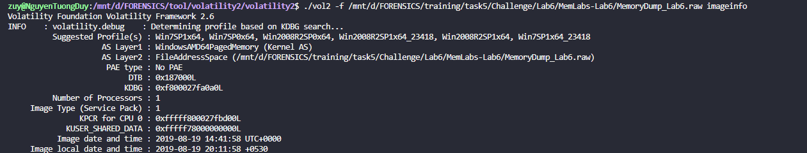
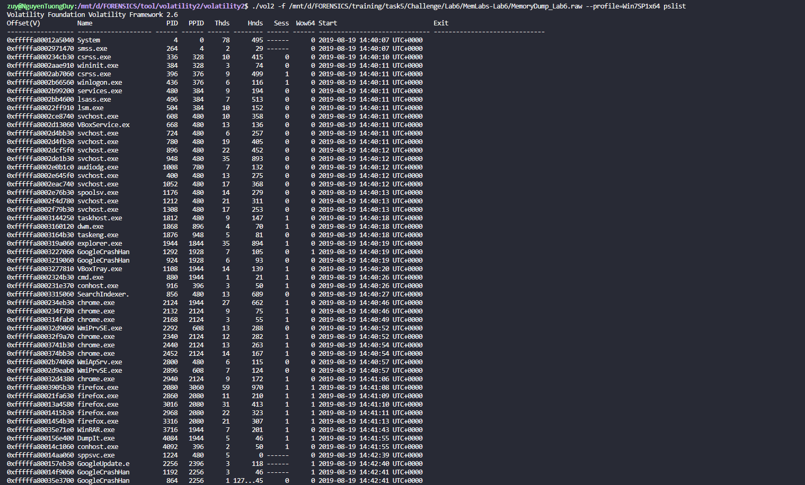
- Mình thấy có `cmd.exe`, `chrome.exe`, `firefox.exe` và `WinRAR.exe` , mình check cmd bằng consoles trước nha. 
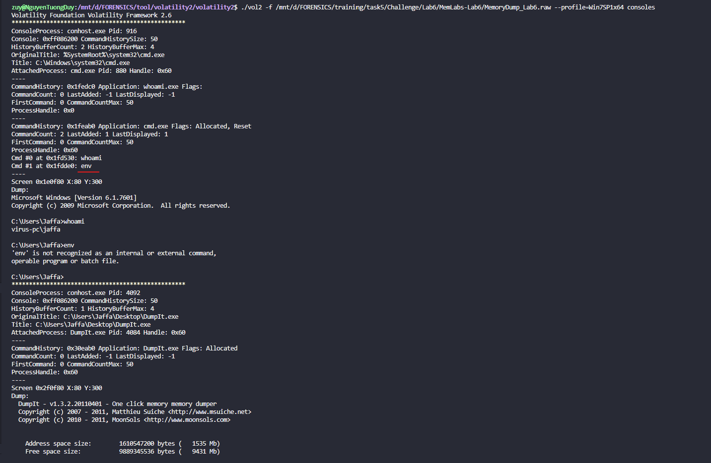
- Ở đây `User` có ghi 2 lệnh là `whoami` và `env` , `env` ở đây có thể là `envars` kiểm tra biến môi trường nên mình check thử xem.
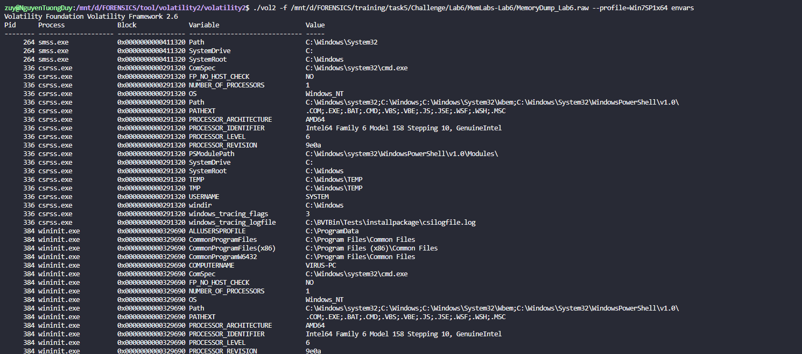
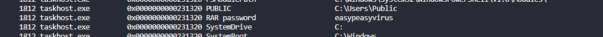
- Ui vã òn , ngồi check lòi con mắt , thì mình thấy 1 cái là `RAR password là easypeasyvirus` nha , vậy là ta sẽ có 1 file rar có pass và hiện tại mình chưa xài đc nên mình sẽ lưu ý cái pass náy.
### FLAG PART 1.
- Tiếp theo mình sẽ check `chromehistory và firefoxhistory` nha.
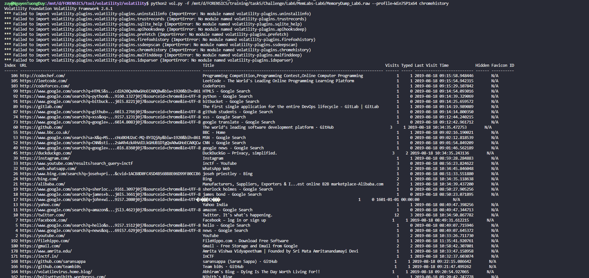
- Ở Index = 169 thì mình thấy có 1 cái `pastebin` nha , mình lên web mở ra thử xem có gì ko.

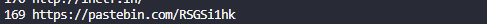

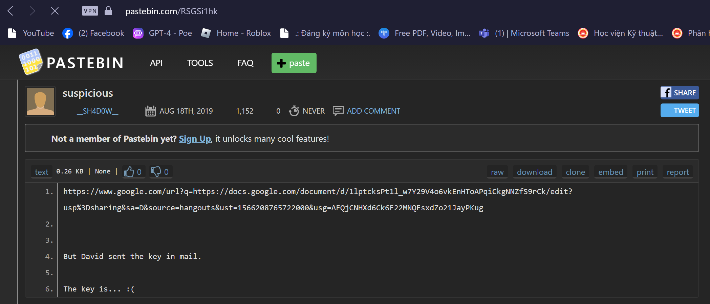
- Nó cho ta 1 đường link nữa nha và nó bảo key được David gửi qua mail.
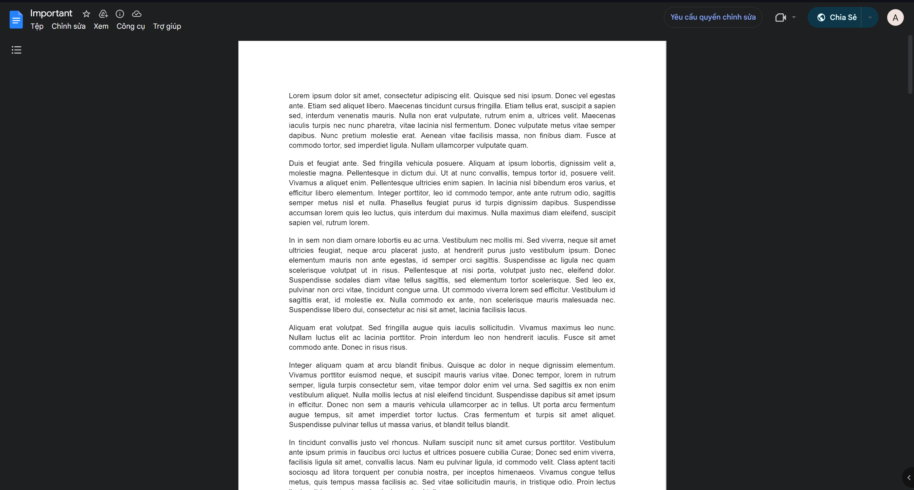
- Nó cho mình 1 cái file `Important.docx` nha  , mình kéo kéo xem thì có 1 link mega nữa.
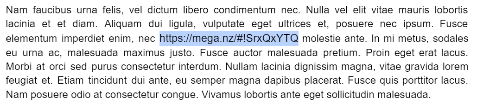
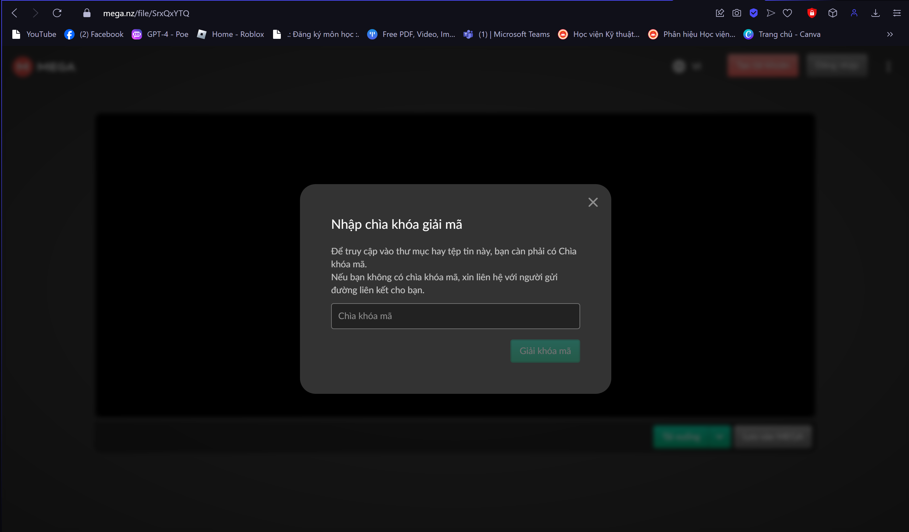
- Vãi link mega yêu cầu cả pass nữa và có 1 thứ khá bất ngờ là ta check plugin `screenshot` xem có hint hay cái gì đáng ngờ ko ạ :)))) .
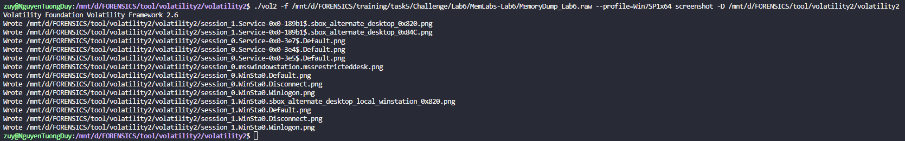
- Mình check tới ảnh này `session_1.WinSta0.Default.png` thì có đc cái ảnh phía dưới.
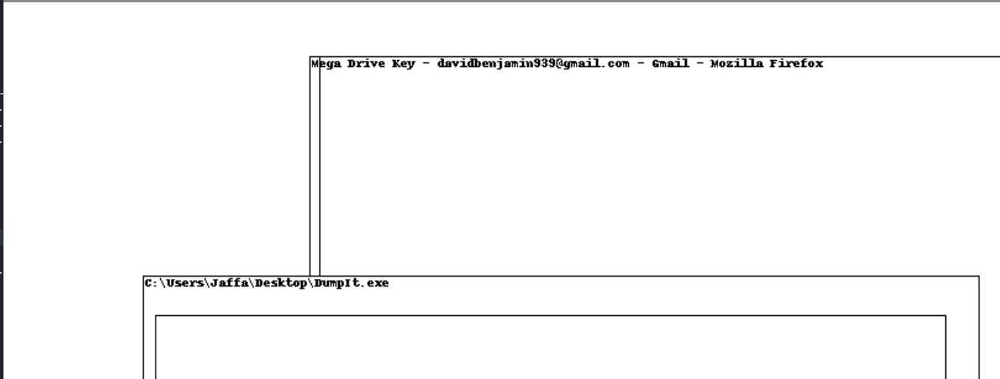
- Từ cái hint trên ta có thể sử dụng lệnh `strings` với cụm `Mega Drive Key`bởi vì chúng ta có thể lấy dữ liệu được lưu trữ trong tệp `JSON` từ bộ nhớ.
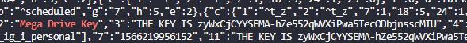
- `Key là zyWxCjCYYSEMA-hZe552qWVXiPwa5TecODbjnsscMIU` mình nhét vào link Mega thui nha, nó cho mình tải về 1 ảnh `flag_.png` nhưng mà mình mở lên không được.
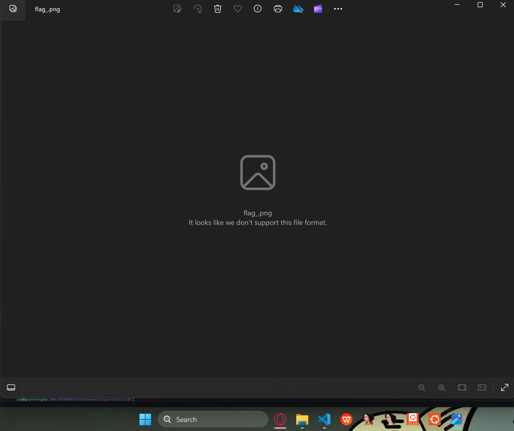
- Mình vào `HxD` check xem có bị lỗi gì ko nha.
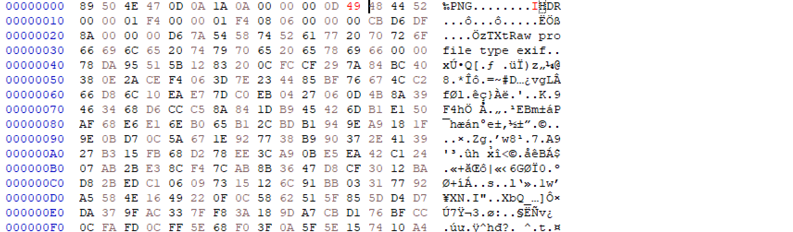
- Ở chổ này nó là `i` thay vì `I` nên mình sửa lại thì được 1 ảnh có nữa flag nha.
- *`FLAG PART 1: inctf{thi5_cH4LL3Ng3_!s_g0nn4_b3_?_`*.
### FLAG PART 2.
- Tiếp theo là check `WinRAR.exe` cmdline, kiếm offset và dump nó về thui.
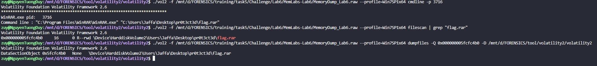
- oke file này là file rar và chắc chắn là nó có pass rồi bởi vì ta đã kiếm được pass ở lúc đầu rồi , nhập pass vào thì nó cho mình cái ảnh có flag lun.
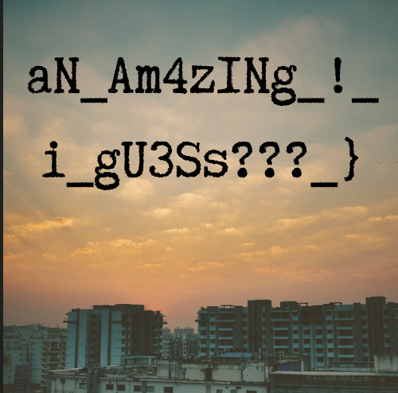
- *`FLAG PART 2: aN_Am4zINg!igU3Ss???_}`*.
### END.
- *`FLAG :  inctf{thi5_cH4LL3Ng3_!s_g0nn4_b3_?_aN_Am4zINg!igU3Ss???_}`*