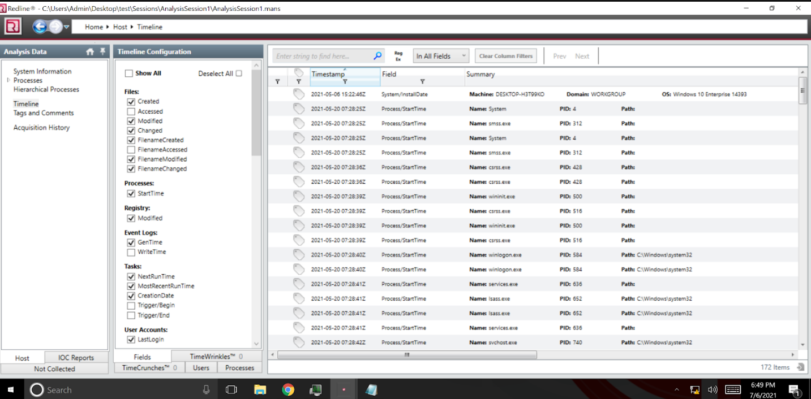

# Ram là gì.
- RAM được viết tắt từ Random Access Memory - một trong những yếu tố hết sức quan trọng bên cạnh vi xử lý. RAM là bộ nhớ tạm của máy giúp lưu trữ thông tin hiện hành để CPU có thể truy xuất và xử lý.

- RAM không thể lưu trữ được dữ liệu khi mất nguồn điện cung cấp. Nếu như thiết bị bị mất nguồn, tắt máy thì dữ liệu trên RAM sẽ bị xóa.
# Dump Ram.
- Như bạn có thể biết Ram là nơi lưu trữ dữ liệu , vậy có nghĩa là trong 1 số trường hợp tấn công ta có thể bị leak đc dữ liệu.

- Bằng cách nắm bắt bộ nhớ của thiết bị bị xâm nhập, bạn có thể nhanh chóng thực hiện một số phân tích để xác định phần mềm độc hại tiềm ẩn và thu thập IOC, sau đó có thể được sử dụng để xác định các thiết bị bị xâm nhập khác.

- Vậy Dump Ram là cách Kết xuất bộ nhớ hoặc kết xuất RAM là ảnh chụp nhanh bộ nhớ đã được chụp để phân tích bộ nhớ. Khi kết xuất RAM được chụp, nó sẽ chứa dữ liệu liên quan đến bất kỳ quy trình đang chạy nào tại thời điểm chụp.
# Lợi ích của việc sử dụng pháp y bộ nhớ để ứng phó sự cố.
- Ứng phó với một sự cố an ninh mạng không phải lúc nào cũng đơn giản. Có lẽ máy chủ đã bị xâm phạm có thể không cung cấp nhật ký vào SIEM, thậm chí có thể không có ghi nhật ký nào cả! Vì vậy, là một phần của kế hoạch ứng phó sự cố, làm thế nào bạn có thể bắt đầu điều tra thiết bị và bắt đầu thu thập bằng chứng kịp thời?

- Trước tiên, bạn cần xác nhận rằng có phần mềm độc hại trên thiết bị trước khi có thể chụp mẫu và bắt đầu đảo ngược phần mềm độc hại bằng các công cụ chuyên dụng.
- Chụp ảnh thiết bị có thể tốn thời gian và sau đó bạn gặp sự cố chuyển hình ảnh có thể có kích thước 100GB đến vị trí có thể phân tích. Sau đó, bạn phải xem xét việc phân tích sẽ mất bao lâu bởi nhóm IR.

- Đây là nơi phân tích bộ nhớ có thể là một chiến thắng lớn cho nhóm IR. Trong khi ổ cứng máy chủ có thể có kích thước trên 100GB, RAM của thiết bị sẽ nhỏ hơn rất nhiều, thường là 16GB – 32GB. Điều này có nghĩa là việc chụp kết xuất RAM từ thiết bị sẽ nhanh hơn và kích thước nhỏ hơn rất nhiều khi truyền đầu ra.

- Bằng cách ưu tiên RAM hơn hình ảnh đĩa cứng khi xử lý sự cố, bạn có thể bắt đầu phân tích kết xuất RAM cho IOC (Chỉ số thỏa hiệp) trong khi bạn bắt đầu làm việc để lấy hình ảnh của ổ cứng.
# Cách Dump Ram.
#### 1. Dump Ram từ thiết bị vật lý
- Chụp RAM từ một thiết bị vật lý có thể được thực hiện bằng một số công cụ, tuy nhiên, một công cụ tôi thường sử dụng trong quá khứ mà tôi thấy rất đáng tin cậy và dễ sử dụng là [WinPmem](https://github.com/Velocidex/WinPmem/releases).
- Mình xài lệnh sau để dump:
    ```
    winpmem_mini_x64_rc2.exe physmem.raw
    ```

- Máy mình 16gb ram nên là dung lượng rất lớn, chỉ có thể xem dữ liệu bằng `volatility`.

#### 2. Dump Ram từ máy ảo.
- Chụp bộ nhớ từ một máy ảo rất dễ dàng, đó là một tin tuyệt vời khi bạn đang ứng phó với một sự cố mà thời gian là một yếu tố.

- Chụp ảnh nhanh của một máy ảo sẽ tạo ra một tệp vmem, sau đó chúng có thể được phân tích bằng một công cụ như Biến động.
# Memory Forensics tool.
#### 1. Volatility 2 and 3.
- `Volatility` là công cụ tôi lựa chọn để phân tích bộ nhớ và có sẵn cho Windows và Linux.
- Biến động là một công cụ dòng lệnh cho phép bạn nhanh chóng lấy ra thông tin hữu ích như quy trình nào đang chạy trên thiết bị, kết nối mạng và quy trình chứa mã được tiêm. Bạn thậm chí có thể kết xuất DLL và các quy trình để phân tích thêm.

- Biến động cũng hỗ trợ phân tích các kết xuất bộ nhớ từ các thiết bị Unix và một loạt các plugin đã được thiết kế bởi cộng đồng pháp y.

- Một vấn đề với Biến động là nó yêu cầu thiết lập một 'hồ sơ' phù hợp với hệ điều hành của thiết bị mà nó được chụp từ đó để công cụ hoạt động. Tuy nhiên, điều này hiện đã được giải quyết trong `Volaitlity3` và việc cài đặt cấu hình không còn bắt buộc khiến việc sử dụng công cụ này trở nên dễ dàng hơn.

#### 2. Rekall
- Rekall tương tự như Biến động vì nó là một công cụ dòng lệnh khác, công cụ bạn sử dụng tùy thuộc vào sở thích cá nhân.

#### 3. Redline.
- Redline là một công cụ phân tích bộ nhớ không giống như Biến động và Rekall hoàn toàn là một công cụ điều khiển GUI, nhược điểm của việc sử dụng Redline là nó chỉ hỗ trợ phân tích các thiết bị Windows.
- Hình ảnh dưới đây cho thấy việc lọc các quy trình cụ thể dễ dàng như thế nào để giúp phân tích bộ nhớ dễ dàng và dễ tiếp cận hơn rất nhiều.
