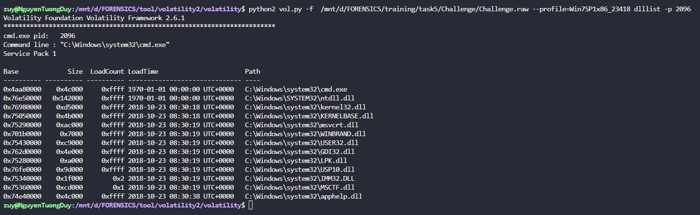

# Cách sử dụng Volatility
### 1. OS INFORMATION (Thông tin về Hệ điều hành).
#### 1.1 IMAGEINFO.
- Thông thường lệnh này được sử dụng để xác định hệ điều hành, gói dịch vụ và kiến trúc phần cứng (32-64bits), nhưng nó cũng chứa các thông tin hữu ích khác như là địa chỉ hay là thời gian.

|Volatility2|Volatility3|
|----------|-----------|
|vol.py -f “/path/to/file” imageinfo |vol.py -f “/path/to/file” windows.info|
|vol.py -f “/path/to/file” kdbgscan  |                                      |

- Output differences:
    + Vol2 : Ta có thể tìm profile hệ điều hành bằng kdbgscan thay cho imageinfo nếu ko thể tìm được , với cách này ta có thể tìm chính xác hơn.
    + Vol3 : Đã Bao gồm xác định x32/x64, các phiên bản hệ điều hành chính và phụ cũng như thông tin kdbg , Vol3 tiện và nhanh hơn so với Vol2.

EXAMPLE:
- Vol2:

- kdbgscan:

- Vol3:

### 2. PROCESS INFORMATION (Thông tin về Các tiến trình).
#### 2.1 Pslist.
- Để liệt kê các tiến trình của một hệ thống, hãy sử dụng `pslist`. Phần này dẫn danh sách liên kết đôi được chỉ ra bởi `PsActiveProcessHead` và hiển thị phần bù, tên quy trình, ID tiến trình, ID tiến trình gốc, số luồng,... Kể từ phiên bản 2.1, nó hiển thị cả ID phiên.
- Plugin này ko hiển thị các tiến trình bị ẩn hay malware.
- Plugin `list` tuy khá nhanh nhưng mà cũng dễ bị các phần mềm đọc hại thao túng như là APT Windows.
#### 2.2 Psscan.
- Plugin này phát hiện ra các tiến trình ẩn hoặc không có liên kết. NGoài ra còn cho thấy các tiến trình đã bị chấm dứt trước đó và các tiến trình đã bị rootkit ẩn hoặc hủy liên kết.
- Plugin `scan` tuy quét chậm hơn so với `list`, và đôi khi nó sẽ đưa ra các kết quả giả (một quá trình tồn tại quá lâu và có một phần cấu trúc bị ghi đè), thế nhưng ưu điểm là nó có thể khai thác các quy trình độc hại giả mạo danh sách liên kết.
#### 2.3 Pstree.
- Để xem danh sách dưới dạng cây, hãy sử dụng lệnh pstree. Điều này liệt kê các quy trình sử dụng kỹ thuật tương tự như là pslist, do đó không hiển thị quy trình ẩn hoặc không được liên kết. Quá trình con được thể hiện bằng các thụt lề và dấu chấm.
#### 2.4 Psxview.
- Để tìm kiếm đối tượng ETHREAD trong bộ nhớ, thì có thể dùng thrdscan. Một số trường hợp thì sẽ dùng lệnh psxview.


|Volatility2|Volatility3|
|----------|-----------|
|vol.py -f “/path/to/file” ‑‑profile=`<profile>` pslist |vol.py -f “/path/to/file” windows.pslist|
|vol.py -f “/path/to/file” ‑‑profile=`<profile>` psscan |vol.py -f “/path/to/file” windows.psscan|
|vol.py -f “/path/to/file” ‑‑profile=`<profile>` pstree |vol.py -f “/path/to/file” windows.pstree|
|vol.py -f “/path/to/file” ‑‑profile=`<profile>` psxview |                                       |

EXAMPLE:
- Vol2:
    + Pslist:
    
    + Psscan:
    - File này mình ko scan đc nhưng mà nó sẽ như thế lày :
    ```
    $ python vol.py --profile=Win7SP0x86 -f win7.dmp psscan
    Volatility Foundation Volatility Framework 2.0
    Offset     Name             PID    PPID   PDB        Time created             Time exited   
    ---------- ---------------- ------ ------ ---------- ------------------------ ------------------------ 
    0x3e025ba8 svchost.exe        1116    508 0x3ecf1220 2010-06-16 15:25:25                    
    0x3e04f070 svchost.exe        1152    508 0x3ecf1340 2010-06-16 15:27:40                    
    0x3e144c08 dwm.exe            1540    832 0x3ecf12e0 2010-06-16 15:26:58                    
    0x3e145c18 TPAutoConnSvc.     1900    508 0x3ecf1360 2010-06-16 15:25:41                    
    0x3e3393f8 lsass.exe           516    392 0x3ecf10e0 2010-06-16 15:25:18                    
    0x3e35b8f8 svchost.exe         628    508 0x3ecf1120 2010-06-16 15:25:19                    
    0x3e383770 svchost.exe         832    508 0x3ecf11a0 2010-06-16 15:25:20                    
    0x3e3949d0 svchost.exe         740    508 0x3ecf1160 2010-06-16 15:25:20                    
    0x3e3a5100 svchost.exe         872    508 0x3ecf11c0 2010-06-16 15:25:20                    
    0x3e3f64e8 svchost.exe         992    508 0x3ecf1200 2010-06-16 15:25:24                    
    0x3e45a530 wininit.exe         392    316 0x3ecf10a0 2010-06-16 15:25:15                    
    0x3e45d928 svchost.exe        1304    508 0x3ecf1260 2010-06-16 15:25:28                    
    0x3e45f530 csrss.exe           400    384 0x3ecf1040 2010-06-16 15:25:15                    
    0x3e4d89c8 vmtoolsd.exe       1436    508 0x3ecf1280 2010-06-16 15:25:30                    
    0x3e4db030 spoolsv.exe        1268    508 0x3ecf1240 2010-06-16 15:25:28                    
    0x3e50b318 services.exe        508    392 0x3ecf1080 2010-06-16 15:25:18                    
    0x3e7f3d40 csrss.exe           352    316 0x3ecf1060 2010-06-16 15:25:12                    
    0x3e7f5bc0 winlogon.exe        464    384 0x3ecf10c0 2010-06-16 15:25:18                    
    0x3eac6030 SearchProtocol     2448   1168 0x3ecf15c0 2010-06-16 23:30:52      2010-06-16 23:33:14   
    0x3eb10030 SearchFilterHo     1812   1168 0x3ecf1480 2010-06-16 23:31:02      2010-06-16 23:33:14 
    [snip]
    ```
    + Pstree:
    - file này mình cũng ko pstree đc nhưng mà nó sẽ thế lày :
    ```
    $ python vol.py -f ~/Desktop/win7_trial_64bit.raw --profile=Win7SP0x64 pstree
    Volatility Foundation Volatility Framework 2.4
    Name                                                  Pid   PPid   Thds   Hnds Time      
    -------------------------------------------------- ------ ------ ------ ------ --------------------
    0xfffffa80004b09e0:System                              4      0     78    489 2012-02-22 19:58:20 
    . 0xfffffa8000ce97f0:smss.exe                         208      4      2     29 2012-02-22 19:58:20 
    0xfffffa8000c006c0:csrss.exe                         296    288      9    385 2012-02-22 19:58:24 
    0xfffffa8000c92300:wininit.exe                       332    288      3     74 2012-02-22 19:58:30 
    . 0xfffffa8000c5eb30:services.exe                     428    332      6    193 2012-02-22 19:58:32 
    .. 0xfffffa8000aa0b30:SearchIndexer.                 1800    428     12    757 2012-02-22 20:02:26 
    .. 0xfffffa80007d09e0:svchost.exe                     916    428     19    443 2012-02-22 19:58:43 
    .. 0xfffffa8000a4f630:svchost.exe                    1432    428     12    350 2012-02-22 20:04:14 
    .. 0xfffffa800094d960:wlms.exe                       1264    428      4     43 2012-02-22 20:02:11 
    .. 0xfffffa8001325950:sppsvc.exe                      816    428      5    154 2012-02-22 19:58:41 
    .. 0xfffffa8000e86690:spoolsv.exe                    1076    428     12    271 2012-02-22 20:02:10 
    .. 0xfffffa8001296b30:svchost.exe                     568    428     10    352 2012-02-22 19:58:34 
    ... 0xfffffa8000a03b30:rundll32.exe                  2016    568      3     67 2012-02-22 20:03:16
    ...
    
    ```
    + Psxview:
    - file này mình ko xài Psxview đc nhưng mà nó sẽ thế lày:
    ```
    $ python vol.py -f ~/Desktop/win7_trial_64bit.raw --profile=Win7SP0x64 thrdscan
    Volatility Foundation Volatility Framework 2.4
    Offset(P)             PID    TID      Start Address Create Time               Exit Time          
    ------------------ ------ ------ ------------------ ------------------------- -------------------------
    0x0000000008df68d0    280    392         0x77943260 2012-02-22 19:08:18                          
    0x000000000eac3850   2040    144         0x76d73260 2012-02-22 11:28:59       2012-02-22 11:29:04  
    0x000000000fd82590    880   1944         0x76d73260 2012-02-22 20:02:29       2012-02-22 20:02:29  
    0x00000000103d15f0    880    884         0x76d73260 2012-02-22 19:58:43                          
    0x00000000103e5480   1652   1788 0xfffff8a0010ed490 2012-02-22 20:03:44                          
    0x00000000105a3940    916    324         0x76d73260 2012-02-22 20:02:07       2012-02-22 20:02:09  
    0x00000000105b3560    816    824         0x76d73260 2012-02-22 19:58:42                          
    0x00000000106d1710    916   1228         0x76d73260 2012-02-22 20:02:11                          
    0x0000000010a349a0    816    820         0x76d73260 2012-02-22 19:58:41                          
    0x0000000010bd1060   1892   2280         0x76d73260 2012-02-22 11:26:13                          
    0x0000000010f24230    628    660         0x76d73260 2012-02-22 19:58:34                          
    0x0000000010f27060    568    648 0xfffff8a0017c6650 2012-02-22 19:58:34
    [snip]
    ```
- Vol3:
    + Windows.pslist :
    
    + Windows.psscan :
    
    + Windows.pstree :
    
### 3. PROCDUMP
- Dùng để trích xuất hay kết xuất tệp thực thi của một tiến trình, hãy sử dụng lệnh procdump. Một số phần mềm độc hại sẽ cố tình giả mạo các trường kích thước trong tiêu đề PE để điều khiển các công cụ phá hủy bộ nhớ. Nó sẽ kết xuất 1 tiến trình.

|Volatility2|Volatility3|
|----------|-----------|
|vol.py -f “/path/to/file” ‑‑profile `<profile>` procdump -p `<PID>` ‑‑dump-dir=“/path/to/dir” | vol.py -f “/path/to/file” -o “/path/to/dir” windows.dumpfiles ‑‑pid=`<PID>` |

Output differences:
    + Vol2: Chỉ xuất ra PID được chỉ định (hoặc tất cả nếu không được chỉ định).
    + Vol3: Kết xuất exe và các DLL liên quan.

EXAMPLE:
 + Vol2:
    
+ Vol3:
    
    

### 4. MEMDUMP. 
- Để trích xuất tất cả các trang lưu trữ trong bộ nhớ trong một quy trình vào một tệp riêng lẻ, hãy sử dụng plugin này. Ví dụ bạn có 1 tiến trình mspaint.exe, thì nó sẽ trích xuất tất cả lưu trữ trong bộ nhớ của tiến trình này và sẽ cho bạn 1 file trích xuất.


|Volatility2|Volatility3|
|----------|-----------|
|vol.py -f “/path/to/file” ‑‑profile `<profile>` memdump -p `<PID>` ‑‑dump-dir=“/path/to/dir” | vol.py -f “/path/to/file” -o “/path/to/dir” windows.memmap ‑‑dump ‑‑pid=`<PID>`|

EXAMPLE:
- Vol2:
    
- Vol3:
    
    - Tải về nó quá là dài đi ó, tất cả dữ liệu của 1 tiến trình nó sẽ đc lưu vào 1 file `.dmp` như này.

### 5. Memmap.
Hiển thị cho bạn chính xác những trang nào nằm trong bộ nhớ, được cung cấp một DTB quy trình cụ thể. Nó hiển thị cho bạn địa chỉ ảo của trang, độ lệch vật lý tương ứng của trang và kích thước của trang. 

|Volatility2|Volatility3|
|----------|-----------|
|vol.py -f “/path/to/file” ‑‑profile <profile> memmap | vol.py -f “/path/to/file” windows.memmap |

### 6. Handles.
- Dùng để xác định các đối tượng mà một tiến trình đang truy cập và theo dõi các hoạt động của một tiến trình.

|Volatility2|Volatility3|
|----------|-----------|
|vol.py -f “/path/to/file” ‑‑profile `<profile>` handles -p `<PID>`|vol.py -f “/path/to/file” windows.handles ‑‑pid=`<PID>`|

- Output differences:
    + Vol2: được hiển thị theo Offset(V), PID, handle, access, type, details.
    + Vol3: được hiển thị theo PID, process, offset, handlevalue, type, grantedaccess, name.

EXAMPLE:
- Vol2:
    
- Vol3: 
    

### 7. DLLS.
- Để hiển thị các DLL được tải của một tiến trình, hãy sử dụng `dlllist`. Nó duyệt danh sách liên kết đôi của các cấu trúc  `_LDR_DATA_TABLE_ENTRY` được trỏ. Các tệp DLL được tự động thêm vào danh sách này khi một quy trình gọi LoadLibrary.


|Volatility2|Volatility3|
|----------|-----------|
|vol.py -f “/path/to/file” ‑‑profile `<profile>` dlllist -p `<PID>`| vol.py -f “/path/to/file” windows.dlllist ‑‑pid=`<PID>`|


- Output differences:
    + Vol2: hiển thị theo PID, command line, base, size, loadcount, loadtime, path.
    + Vol3: hiển thị theo PID, process, base, size, name, path, loadtime, file output.


EXAMPLE:
- Vol2 :
    
- Vol3:
    

### 8. CMDLINE.
- Để hiển thị tên của quá trình lưu trữ bằng bảng điểu khiển(csrss.exe hoặc conhost.exe). Ngoài ra còn có tên ứng dụng, vị trí của bộ đệm, lịch sử lệnh, bao gồm số bộ đệm hiện tại, lệnh được thêm lần cuối và lệnh được hiển thị lần cuối. Do kỹ thuật quét mà plugin này sử dụng, nó có khả năng tìm lệnh từ consoles.

|Volatility2|Volatility3|
|----------|-----------|
|vol.py -f “/path/to/file” ‑‑profile `<profile>` cmdline|vol.py -f “/path/to/file” windows.cmdline|
|vol.py -f “/path/to/file” ‑‑profile `<profile>` cmdscan|                                         |
|vol.py -f “/path/to/file” ‑‑profile `<profile>` consoles|                                        |

EXAMPLE:
- Vol2:
    + cmdline:
        
    + cmdscan:
        
    + cmdconsoles:
        

- Vol3:
    


### 9. NETWORK INFORMATION.
- Cho biết các thông tin như kiểu trên wireshark. Cho ta thấy TCP endpoints, trình nghe TCP, điểm cuối UDP, trình nghe UDP. Nó phân biệt giữa IPv4 và IPv6, thời gian kết nối được thiết lập,...

|Volatility2|Volatility3|
|----------|-----------|
|vol.py -f “/path/to/file” ‑‑profile `<profile>` netscan|vol.py -f “/path/to/file” windows.netscan|
|                                                       |vol.py -f “/path/to/file” windows.netstat|


```
Vol2:  XP/2003 SPECIFIC.
vol.py -f “/path/to/file” ‑‑profile <profile> connscan

vol.py -f “/path/to/file” ‑‑profile <profile> connections

vol.py -f “/path/to/file” ‑‑profile <profile> sockscan

vol.py -f “/path/to/file” ‑‑profile <profile> sockets
```

NOTE: Các plugin cụ thể của XP/2003 không được dùng nữa và do đó không có sẵn trong Vol3.

EXAMPLE:
- Vol2:
    
- Vol3:
    + windows.netscan:
        
    + windows.netstat:
        

### 10. REGISTRY.
#### 10.1. HIVELIST.
- Để xác định địa chỉ ảo của các registry trong bộ nhớ và đường dẫn đầy đủ, ta hãy dùng hivelist.

| Vol2                                                           | Vol3                                                  |
| -------------------------------------------------------------- | ----------------------------------------------------- |
| vol.py -f “/path/to/file” ‑‑profile `<profile>` hivescan | vol.py -f “/path/to/file” windows.registry.hivescan |
| vol.py -f “/path/to/file” ‑‑profile `<profile>` hivelist | vol.py -f “/path/to/file” windows.registry.hivelist |

EXAMPLE:
- Vol2:
    
- Vol3:

    


#### 10.2. PRINTKEY.
- Để hiển thị các khóa con, giá trị, dữ liệu và kiểu dữ liệu có trong khóa đăng ký được chỉ định, hãy dùng printkey. Theo mặc định, printkey sẽ tìm các hives và in thông tin khóa nếu tìm thấy.
- Ví dụ ở hivelist, ta có  `\REGISTRY\MACHINE\SYSTEM` có địa chỉ offset `0x87818218`, thì để hiển thị, ta có 2 cách sử dụng như sau.

| Vol2                                                                                        | Vol3                                                                                              |
| ------------------------------------------------------------------------------------------- | ------------------------------------------------------------------------------------------------- |
| vol.py -f “/path/to/file” ‑‑profile `<profile>` printkey                              | vol.py -f “/path/to/file” windows.registry.printkey                                             |
| vol.py -f “/path/to/file” ‑‑profile `<profile>` printkey -K "REGISTRY\MACHINE\SYSTEM" | vol.py -f “/path/to/file” windows.registry.printkey.PrintKey --key "\REGISTRY\MACHINE\HARDWARE" |
| vol.py -f “/path/to/file” ‑‑profile `<profile>` printkey -o 0x87818218                | vol.py -f “/path/to/file” windows.registry.printkey.PrintKey --offset 0xf8a0022dc010            |


EXAMPLE:
- Vol2:
    
- Vol3:
    

#### 10.3. HIVEDUMP.
- Liệt kê đệ quy các khóa con trong hives, sử dụng hivedump và chuyển địa chỉ ảo thành hives mong muốn.
```
Vol2: vol.py -f “/path/to/file” ‑‑profile hivedump -o <offset>
```

EXAMPLE:
    


### 11. FILES
#### 11.1. FILESCAN.
- Sử dụng lệnh `filescan` để tìm các tệp đang mở ngay cả khi rootkit đang ẩn các tệp trên đĩa và nếu rootkit mọc một số chức năng API để ẩn các thẻ điểu khiển. Đầu ra hiển thị tên tệp, số lượng con trỏ hướng tới đối tượng, số lượng điều khiển đối tượng và các quyền hiệu lực được cấp.

| Vol2                                                           | Vol3                                         |
| -------------------------------------------------------------- | -------------------------------------------- |
| vol.py -f “/path/to/file” ‑‑profile `<profile>` filescan | vol.py -f “/path/to/file” windows.filescan |

EXAMPLE:
- Vol2:
    
- Vol3:
    

#### 11.2. DUMPFILES.
- Các tệp được lưu vào bộ nhớ để đảm bảo hiệu năng hệ thống khi chúng được truy cập và sử dụng. Điều này làm cho bộ đệm trở thành một nguồn có giá trị từ góc độ pháp lý vì có thể truy xuất các tệp được sử dụng chính xác.

- Các mode của `DUMPFILES :`
    ```
    -r REGEX, --regex=REGEX
        Dump files matching REGEX
    -i, --ignore-case     Ignore case in pattern match
    -o OFFSET, --offset=OFFSET
                            Dump files for Process with physical address OFFSET
    -Q PHYSOFFSET, --physoffset=PHYSOFFSET
                            Dump File Object at physical address PHYSOFFSET
    -D DUMP_DIR, --dump-dir=DUMP_DIR
                            Directory in which to dump extracted files
    -S SUMMARY_FILE, --summary-file=SUMMARY_FILE
                            File where to store summary information
    -p PID, --pid=PID     Operate on these Process IDs (comma-separated)
    -n, --name            Include extracted filename in output file path
    -u, --unsafe          Relax safety constraints for more data
    -F FILTER, --filter=FILTER
                        Filters to apply (comma-separated)
    
    ```

| Vol2                                                                                                          | Vol3                                                                                        |
| ------------------------------------------------------------------------------------------------------------- | ------------------------------------------------------------------------------------------- |
| vol.py -f “/path/to/file” ‑‑profile `<profile>` dumpfiles ‑‑dump-dir=“/path/to/dir”                 | vol.py -f “/path/to/file” -o “/path/to/dir” windows.dumpfiles                           |
| vol.py -f “/path/to/file” ‑‑profile `<profile>` dumpfiles ‑‑dump-dir=“/path/to/dir” -Q `<offset>` | vol.py -f “/path/to/file” -o “/path/to/dir” windows.dumpfiles ‑‑virtaddr `<offset>` |
| vol.py -f “/path/to/file” ‑‑profile `<profile>` dumpfiles ‑‑dump-dir=“/path/to/dir” -p `<PID>`    | vol.py -f “/path/to/file” -o “/path/to/dir” windows.dumpfiles ‑‑physaddr `<offset>` |


EXAMPLE:
- Vol2:
    
- Vol3:
    

### 12. MISCELLANEOUS.

| Vol2                                                         | Vol3                                        |
| ------------------------------------------------------------ | ------------------------------------------- |
| vol.py -f “/path/to/file” ‑‑profile`<profile>` malfind | vol.py -f “/path/to/file” windows.malfind |


EXAMPLE:
- Vol2:
    
- Vol3:
    