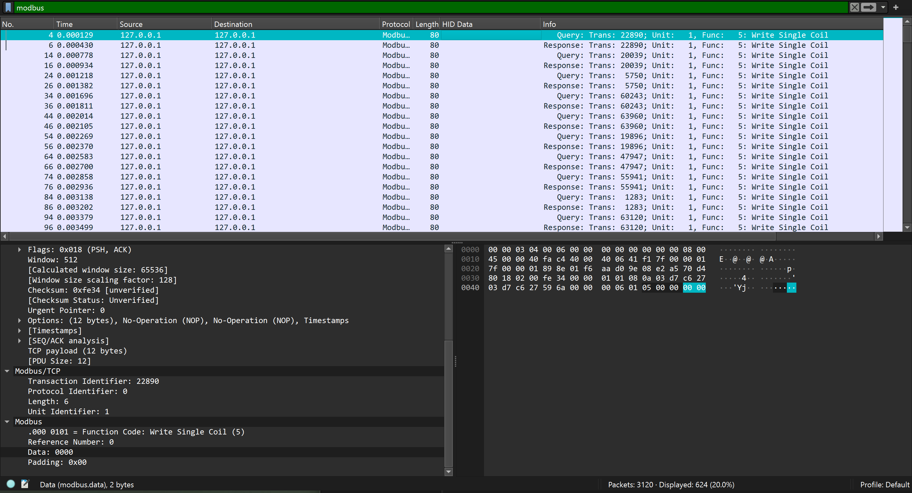
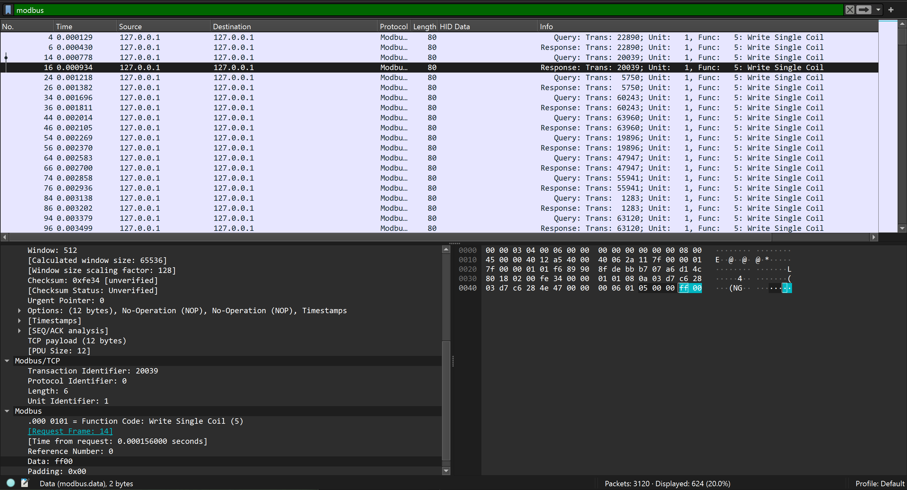
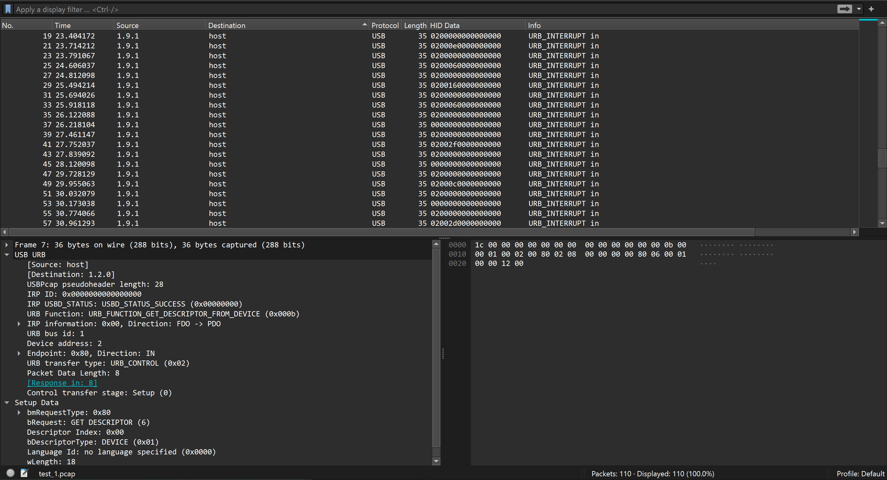
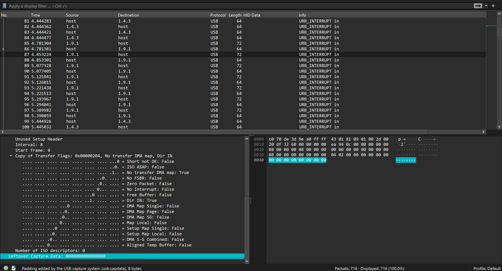
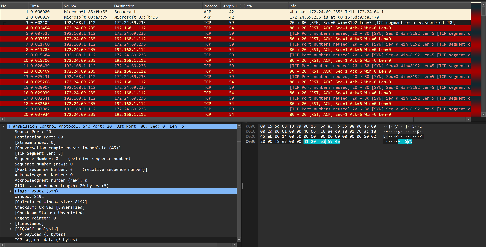
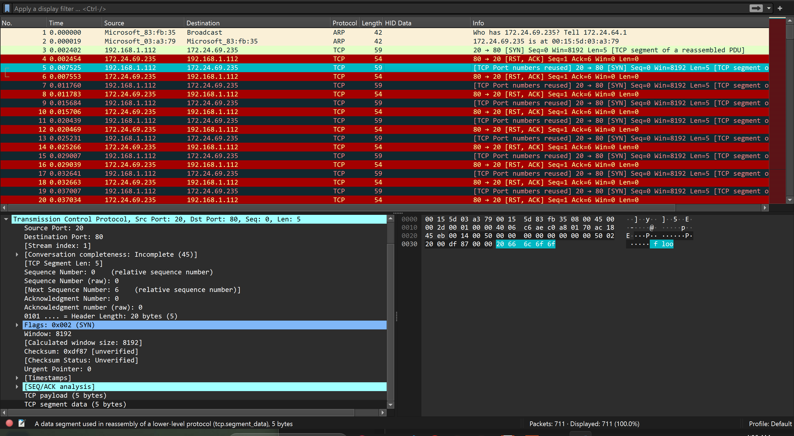
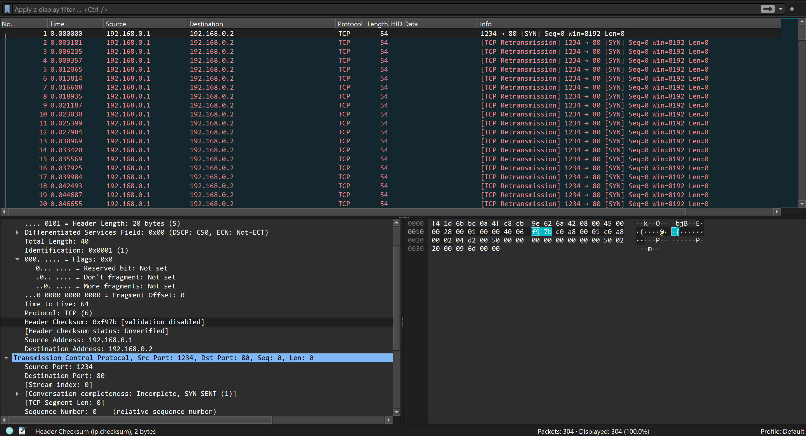
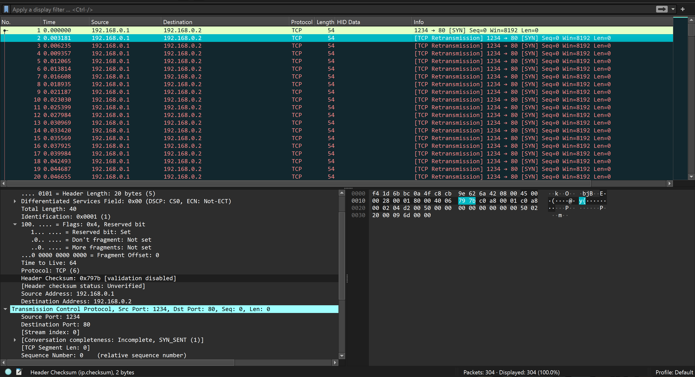
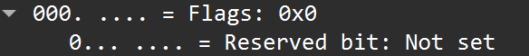

# WireShark trick.
### I. Modbus.
- Chall này cho mình 1 file `.pcap` , tất nhiên rồi chủ đề này là về modbus cho nên mình sẽ follow protocol này.
- Và bạn có thể thấy ở 2 byte cuối này nó lặp lại liên tục giữa 2 byte `ff00` và `0000`, nó khá là giống binary nên mình sẽ extract nó ra thử.


- Có 1 lưu ý là cứ mỗi 2 packets thì nó sẽ là 1 giá trị bởi vì 1 cái là request còn 1 cái là response thế nên ở đây ta có thể filter là `modbus && tcp.srcport == 502` hoặc là `modbus && tcp.dstport == 502` đều được nó là như nhau, mình sẽ xài tshark để lấy data ra cho lẹ.
```
$ tshark -r bus.pcap -Y "modbus && tcp.srcport == 502" -T fields -e modbus.data | awk '{printf "%s", $1}' > data.txt
```
- Sau đó mình sẽ replace `0000 = 0` và `ff00 = 1` và ném nó lên kt.gy decode nó ra thui.
- *`your FLAG is: Modbus_is_easy_after_all!`*.

### II. USB KEYBOARD.
##### 1. Bài 1.
- Chall này cũng thế cho ta 1 file `.pcap` , chủ đề nó sẽ nói về dữ liệu của 1 keyboard trả về trên wireshark như thế nào, khi vào wireshark hãy bật hiển thị `HID data` ta sẽ thấy cái này.

- Giải thích đơn giản thì 1 packet có data như sau `02000e0000000000` thì byte `02 hoặc 00` sẽ biểu thị cho viết hoa hoặc viết thường và byte `0e` sẽ biểu thị cho từng phím trên keyboard, việc ta cần là extract dữ liệu này ra, Mình sử dụng [tool này](https://github.com/syminical/PUK?tab=readme-ov-file) để decode vì mình code dở lắm :((, mình sẽ xài tshark để extract dữ liệu ra nhaa.
```
tshark -r test_1.pcap -T fields -e usbhid.data | grep -E "." | grep -v '0000000000000000' > capdata.txt
```
```
$ python3 PUK.py /mnt/d/FORENSICS/training/wireshark_type/capdata.txt

KCSC{I_love_you}
```
##### 2. Bài 2.
- Bài này cũng y hệt bài trên nhưng khác 1 chỗ là nó ko có `HID data` mà dữ liệu nó trả về bị dấu đi 1 tí nhưng vấn rất dễ để nhận ra, đó là chỉ có những packets có length bằng 72 mới có `usb.capdata` thui nó cùng format với bài trên nhưng khó thấy hơn thui.

- Ta cứ extract nó ra xong r xài tool thui.
```
$ tshark -r henpeck.pcap -T fields -e usb.capdata | grep -E "." | grep -v '0000000000000000' > capdata.txt
```
```
$ python3 PUK.py capdata.txt 

so the answer is flag{f7733e0093b7d281dd0a30fcf34a9634} hahahah lol
```
### III. TCP.
##### 1. Bài 1.
- Chall này cũng thế nó xoay quanh về tcp , nhưng nó khá dễ thôi chỉ cần quan sát 1 tí là nhận ra được vấn đề ngày.


- Dễ mà đúng không nó chỉ đơn giản là có 1 đoạn văn ở tcp protocol đặc điểm chung là đều có length là 59, mình xài tshark để lấy nó ra thui.
```
$ tshark -r test_2.pcap -Y "tcp && frame.len == 59" -T fields -e tcp.segment_data | awk '{printf "%s" , $1}'
412053594e20666c6f6f6420697320612074797065206f66206e6574776f726b206f722063796265722061747461636b20746861742074617267657473207468652074687265652d7761792068616e647368616b652070726f63657373207573656420696e2065737461626c697368696e67206120636f6e6e656374696f6e206265747765656e206120636c69656e7420616e6420612073657276657220696e20746865205472616e736d697373696f6e20436f6e74726f6c2050726f746f636f6c2028544350292e2054435020697320612066756e64616d656e74616c2070726f746f636f6c20696e20636f6d7075746572206e6574776f726b696e67207468617420656e73757265732072656c6961626c6520616e64206f7264657265642064656c6976657279206f662064617461206265747765656e20646576696365657265277320686f7720746865205443502074687265652d7761792068616e647368616b65206e6f726d616c6c7920776f72594e202853796e6368726f6e697a65293a2054686520636c69656e742073656e647320612053594e207061636b657420746f207468652073657276657220746f20696e697469617465206120636f6e6e656374696f6e20726571756573742e41434b202853796e6368726f6e697a652d41636b6e6f776c65646765293a205468652073657276657220726573706f6e6473207769746820612053594e2d41434b207061636b65742c20696e6469636174696e6720746861742069742068617320726563656976656420746865207265717565737420616e642069732077696c6c696e6720746f2065737461626c697368206120636f6e6e65637441434b202841636b6e6f776c65646765293a2054686520636c69656e742073656e647320616e2041434b207061636b657420746f20636f6e6669726d2074686520636f6e6e656374696f6e2c20616e642074686520636f6e6e656374696f6e2069732065737461626c6973686564612053594e20666c6f6f642061747461636b2c207468652061747461636b65722073656e64732061206c61726765206e756d626572206f662053594e207061636b65747320746f2074686520746172676574207365727665722c206275742065697468657220646f6573206e6f7420726573706f6e6420746f207468652073657276657227732053594e2d41434b206f722073656e64732053304e545133745457553566526d7777623252664d564e666444425058325268626d646c636d39316333303d206d616c666f726d6564206f722066616c736520696e666f726d6174696f6e2e2054686973206f7665727768656c6d7320746865207365727665722773206162696c69747920746f2070726f6365737320616e6420726573706f6e6420746f206c65676974696d61746520636f6e6e656374696f6e2072657175657374732c2061732074686520736572766572206d757374206b65657020747261636b206f66206561636820696e636f6d696e6720636f6e6e656374696f6e20617474656d707420756e74696c20697420697320636f6d706c65746564206f722074696d6573206f75742e20676f616c206f6620612053594e20666c6f6f642061747461636b20697320746f20636f6e73756d6520746865207365727665722773207265736f75726365732c2073756368206173206d656d6f727920616e642070726f63657373696e6720706f7765722c20616e6420756c74696d6174656c7920746f206d616b65207468652073657276657220756e61626c6520746f2068616e646c65206c65676974696d61746520636f6e6e656374696f6e2072657175657374732e20546869732063616e206c65616420746f20612064656e69616c2d6f662d736572766963652028446f5329206f722064697374726962757465642064656e69616c2d6f662d73657276696365202844446f532920736974756174696f6e2c207768657265207468652074617267657465642073797374656d206265636f6d657320696e61636365737369626c65206f7220736c6f7720746f20726573706f6e6420746f206c65676974696d61746520757365727320646566656e6420616761696e73742053594e20666c6f6f642061747461636b732c20766172696f7573206d697469676174696f6e20746563686e697175657320616e6420746563686e6f6c6f676965732c2073756368206173206669726577616c6c732c20696e74727573696f6e2070726576656e74696f6e2073797374656d732028495053292c20616e642072617465206c696d6974696e672c2063616e20626520656d706c6f79656420746f2066696c74657220616e6420636f6e74726f6c20696e636f6d696e6720747261666669
```
- dữ liệu trả ra nó là dạng hex mình vứt lên kt.gy thì được đoạn văn bản sau.
```
A SYN flood is a type of network or cyber attack that targets the three-way handshake process used in establishing a connection between a client and a server in the Transmission Control Protocol (TCP). TCP is a fundamental protocol in computer networking that ensures reliable and ordered delivery of data between deviceere's how the TCP three-way handshake normally worYN (Synchronize): The client sends a SYN packet to the server to initiate a connection request.ACK (Synchronize-Acknowledge): The server responds with a SYN-ACK packet, indicating that it has received the request and is willing to establish a connectACK (Acknowledge): The client sends an ACK packet to confirm the connection, and the connection is establisheda SYN flood attack, the attacker sends a large number of SYN packets to the target server, but either does not respond to the server's SYN-ACK or sends S0NTQ3tTWU5fRmwwb2RfMVNfdDBPX2Rhbmdlcm91c30= malformed or false information. This overwhelms the server's ability to process and respond to legitimate connection requests, as the server must keep track of each incoming connection attempt until it is completed or times out. goal of a SYN flood attack is to consume the server's resources, such as memory and processing power, and ultimately to make the server unable to handle legitimate connection requests. This can lead to a denial-of-service (DoS) or distributed denial-of-service (DDoS) situation, where the targeted system becomes inaccessible or slow to respond to legitimate users defend against SYN flood attacks, various mitigation techniques and technologies, such as firewalls, intrusion prevention systems (IPS), and rate limiting, can be employed to filter and control incoming traffi
```
- Bên trong nó có 1 đoạn base64 mình decode nó ra thì được flag.
```
$ echo S0NTQ3tTWU5fRmwwb2RfMVNfdDBPX2Rhbmdlcm91c30= | base64 -d
KCSC{SYN_Fl0od_1S_t0O_dangerous}
```
##### 2. Bài 2.
- Chall này là 1 bài của giải `W1_CTF` của bên UIT, nó vẫn là xoay quanh tcp, nhưng mà hãy chú ý 1 tí về data của từng packets là có thể nhận ra ngay nó là gì.



- Từ 3 ảnh trên ta có thể thấy ở đây nó có 1 ký tự `y` nó thay đổi liên tục và khi check thêm 1 vài cái nữa mình khá chắc nó cũng sẽ là binary nên mình extract nó ra thử.


- Khi tìm kiếm cách lấy data thì mình thấy cai resereved bit này nó thay đổi theo cái ký tự `y` bên trên với `0x0 = 0` và `0x4 = 1`, mình xài tshark để lấy ra cho dễ nhé.

```
$ tshark -r evil_beast.pcapng -Y tcp -T fields -e ip.flags | awk '{printf "%s", $1}'
0x000x040x000x040x000x040x040x040x000x000x040x040x000x000x000x040x000x040x040x040x040x000x040x040x000x000x040x040x000x000x040x040x000x040x040x040x000x040x040x000x000x000x040x040x000x000x000x040x000x040x040x000x040x040x000x000x000x040x000x040x040x040x040x040x000x040x040x000x000x000x040x000x000x040x000x000x040x000x000x040x000x040x040x040x000x040x000x000x000x000x040x040x000x040x000x040x000x040x000x040x040x040x040x040x000x000x040x040x000x000x000x040x000x040x040x000x040x040x040x000x000x040x000x040x040x040x040x040x000x000x040x040x000x040x000x000x000x040x040x040x000x000x000x000x000x040x000x040x000x000x040x000x000x040x040x000x040x000x000x040x000x040x000x000x040x040x000x000x000x040x040x040x000x000x040x040x000x040x000x040x040x040x040x040x000x040x040x000x000x040x040x000x000x000x040x040x000x000x000x000x000x040x040x000x040x040x040x040x000x040x000x000x040x040x000x000x000x000x040x040x000x040x000x040x000x040x000x040x040x040x040x040x000x040x040x000x000x040x000x000x000x000x040x040x000x040x000x000x000x040x040x040x040x000x000x040x000x000x040x000x000x040x000x000x000x040x000x040x040x040x040x040x000x040x000x040x000x000x040x000x000x040x000x000x000x040x040x000x000x040x000x000x000x000x040x040x000x040x040x040x040x040x000x04
```
- Mình sẽ replace `0x00 = 0` và `0x04 = 1` nhé và khi decode nó thì ra flag thui.
- *`FLAG: W1{3v1l_bIt5_1n_4pRiLs_f0oL5_d4y$_RFC}`*